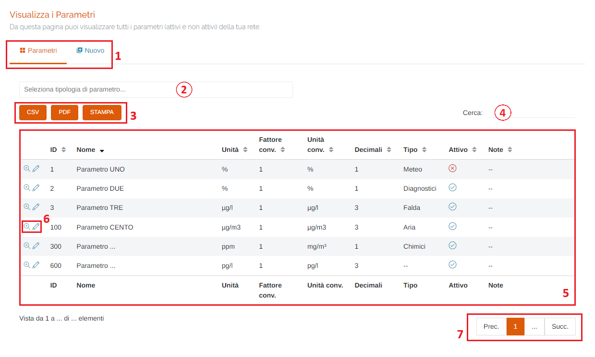
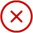
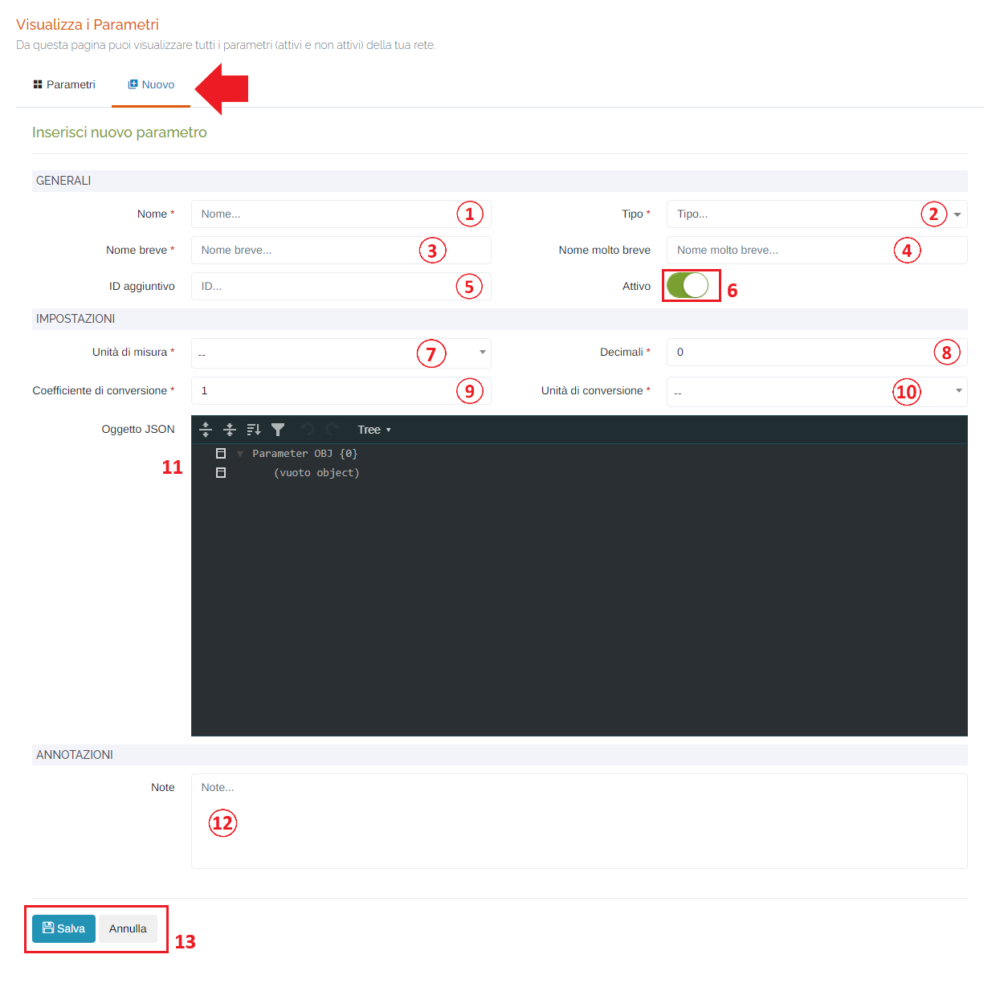
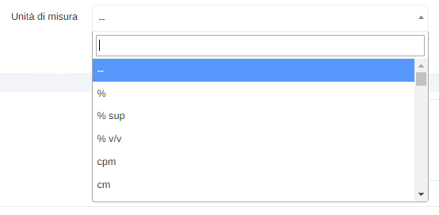
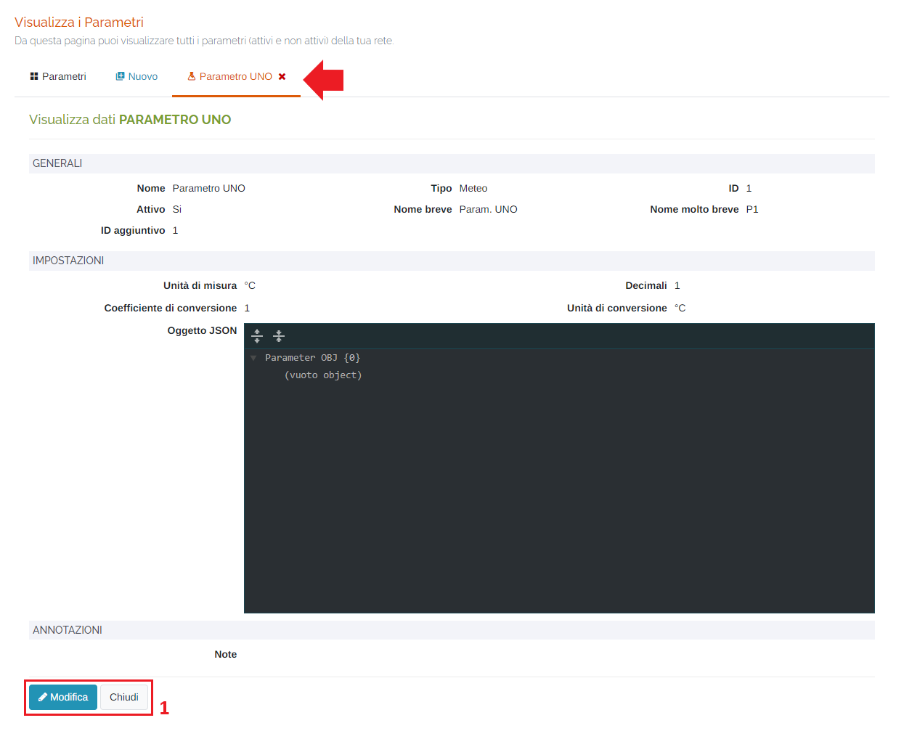

# ANAGRAFICA - PARAMETRI

Per poter accedere a questa sezione occorre cliccare sulla voce "Anagrafica" posta nel menu principale di sinistra ed in seguito cliccare sull'elemento "Parametri".

<h3>
    > Anagrafica 
    &nbsp;&nbsp;&nbsp;&nbsp;&nbsp;&nbsp;&nbsp;&nbsp; <i>o</i> Parametri
</h3>

Questa pagina permette di visualizzare tutti i parametri (attivi e non attivi) della propria rete di appartenenza.

1. <u>Schede della pagina</u>: è possibile visualizzare tutti i parametri (scheda 'Parametri' - scheda corrente), oppure aggiungere un nuovo parametro (scheda 'Nuovo' - vedi "Inserisci nuovo parametro");
2. Filtro della tabella per tipologia si parametro;
3. Pulsanti <u>CSV</u> - <u>PDF</u> - <u>STAMPA</u> : è possibile scaricare l'elenco dei dissesti sottostanti in due formati, CSV e PDF, oppure stamparlo direttamente;
4. <u>Filtro di ricerca nella tabella</u>: la ricerca viene effettuata su tutte le colonne;
5. Tabella dei parametri: verranno visualizzate le seguenti informazioni:

    * ID;
    * Nome;
    * Unità di misura;
    * Numero di decimali;
    * Tipo di parametro;
    * Se il parametro è attivo o disattivo: Attivo -> </img> | Disattivo -> </img>;
    * Eventuali note;

6. Pulsanti <u>Visualizza</u> ( </img> ) e <u>Modifica</u> ( </img> ) Parametro: vedi "Visualizza parametro" e "Modifica parametro";
7. <u>Esplorazione delle pagine</u>;

## Inserisci nuovo parametro

Cliccando sulla scheda "Nuovo", sarà possibile inserire un nuovo parametro compilando i vari campi:

1. <u>Nome</u> (*obbligatorio);
2. <u>Tipo</u> di parametro (*obbligatorio);
3. <u>Nome breve</u> (*obbligatorio);
4. <u>Nome molto breve</u>;
5. <u>ID aggiuntivo</u>;
6. Parametro <u>Attivo</u>;

    Attivo -> </img>

    Disattivo -> </img>

7. <u>Unità di misura</u> (*obbligatorio): è possibile anche digitare l'unità desiderata per cercarla nell'elenco;

    

8. <u>Decimali</u>: numero di decimali visualizzati (*obbligatorio);
9. <u>Coefficiente di conversione</u> (*obbligatorio);
10. <u>Unità di conversione</u> (medesimo elenco del campo 'Unità di misura') (*obbligatorio);
11. <u>Oggetto JSON</u>: oggetto json contenente le informazioni aggiuntive riguardanti il parametro;
12. <u>Note</u>;
13. Pulsanti <u>Salva</u> e <u>Annulla</u>: cliccare il pulsante Salva per effettuare l'inserimento del nuovo parametro, oppure il pulsante Annulla per ritornare alla scheda 'Parametri';

## Visualizza parametro

Cliccando il pulsante "Visualizza" relativo ad uno dei parametri della tabella, verrà aperta una nuova scheda dove si potrà visualizzare il parametro selezionato nel dettaglio. Inoltre, è possibile accedere alla sezione di modifica del parametro cliccando sul pulsante 'Modifica' posto in basso a sinistra (punto 1. - vedi "Modifica parametro")

## Modifica parametro

Cliccando il pulsante "Modifica" relativo ad uno dei parametri della tabella, verrà aperta una nuova scheda dove si potrà modificare il parametro selezionato (vedi 'Inserisci nuovo parametro').

