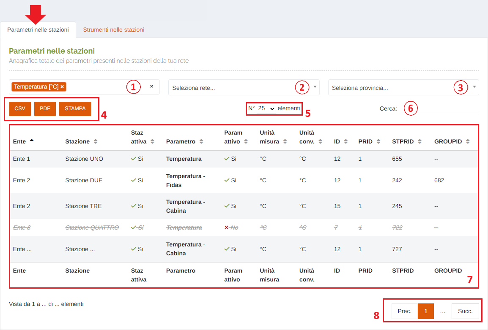
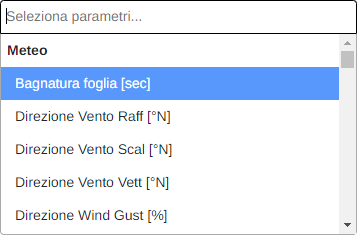
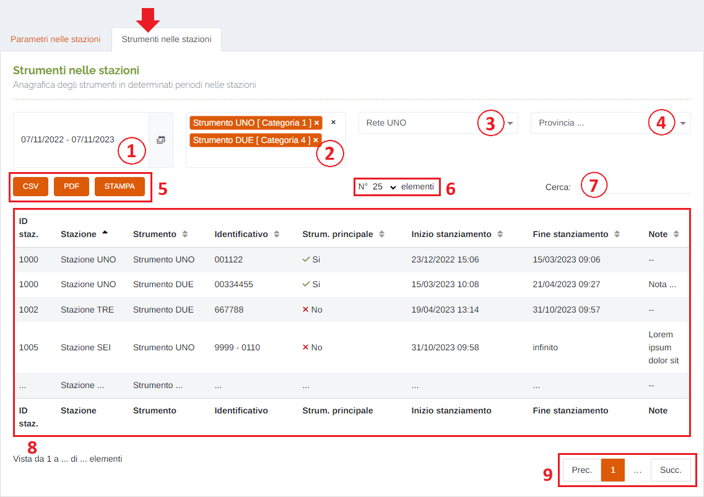
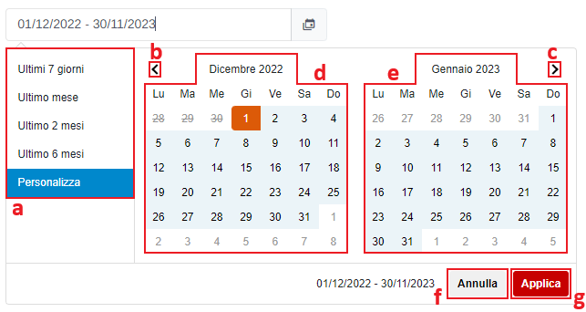

# ANAGRAFICA - STAZIONI

Per poter accedere a questa sezione occorre cliccare sulla voce "Anagrafica" posta nel menu principale di sinistra ed in seguito cliccare sull'elemento "Stazioni".

<h3>
    > Anagrafica 
    &nbsp;&nbsp;&nbsp;&nbsp;&nbsp;&nbsp;&nbsp;&nbsp; <i>o</i> Stazioni
</h3>

Questa pagina permette di visualizzare le informazioni di tutti i parametri e di tutti gli strumenti associati alle varie stazioni della propria/e rete/i di appartenenza.

La pagina è strutturata in 2 schede:

* <u>Parametri nelle stazioni</u>: anagrafica totale dei vari parametri associati alle varie stazioni presenti all'interno del sistema;
* <u>Strumenti nelle stazioni</u>: anagrafica degli strumenti, stanziati in determinati periodi temporali, nelle stazioni della propria rete di appartenenza;

1. Selezione del/dei parametro/i da ricercare (filtro per la tabella sottostante);

    

2. Selezione della rete (filtro per la tabella sottostante);
3. Selezione della provincia (filtro per la tabella sottostante);
4. Pulsanti <u>CSV</u> - <u>PDF</u> - <u>STAMPA</u> : è possibile scaricare l'elenco dei parametri sottostanti in due formati, CSV e PDF, oppure stamparlo direttamente;
5. Numero di elementi della tabella per pagina: cliccando sulla freccia è possibile modificare la quantità;
6. <u>Filtro di ricerca nella tabella</u>: la ricerca viene effettuata su tutte le colonne;
7. Tabella con le informazioni relative ai parametri;
8. Esplorazione delle pagine;

1. Periodo temporale:

    Attraverso questo strumento è possibile impostare il periodo temporale per la visualizzazione degli stanziamenti.

    È importante ricordare che, per impostare il periodo, è SEMPRE NECESSARIO CLICCARE DUE VOLTE, una per il giorno d'inizio e una per il giorno di fine.

    Una volta selezionato il periodo, premere il pulsante Applica per completare l'operazione.

    

    &nbsp;&nbsp;&nbsp;&nbsp;&nbsp;&nbsp;&nbsp;a. Valori preimpostati OPPURE personalizzati dall'utente; 
    &nbsp;&nbsp;&nbsp;&nbsp;&nbsp;&nbsp;&nbsp;b. Pulsante per visualizzare il mese precedente; 
    &nbsp;&nbsp;&nbsp;&nbsp;&nbsp;&nbsp;&nbsp;c. Pulsante per visualizzare il mese successivo. 
    &nbsp;&nbsp;&nbsp;&nbsp;&nbsp;&nbsp;&nbsp;d. Calendario mese precedente; 
    &nbsp;&nbsp;&nbsp;&nbsp;&nbsp;&nbsp;&nbsp;e. Calendario mese successivo. 
    &nbsp;&nbsp;&nbsp;&nbsp;&nbsp;&nbsp;&nbsp;f. Pulsante <u>Annulla</u>: chiude la finestra del periodo temporale; 
    &nbsp;&nbsp;&nbsp;&nbsp;&nbsp;&nbsp;&nbsp;g. Pulsante <u>Applica</u>; 

2. Selezione multipla degli strumenti: filtro per la tabella sottostante; è possibile selezionare più di un elemento dall'elenco e la tabella verrà filtrata in base agli elementi scelti;
3. Filtro per rete;
4. Filtro per provincia;
5. Pulsanti <u>CSV</u> - <u>PDF</u> - <u>STAMPA</u> : è possibile scaricare l'elenco degli strumenti sottostanti in due formati, CSV e PDF, oppure stamparlo direttamente;
6. Numero di elementi della tabella per pagina: cliccando sulla freccia è possibile modificare la quantità;
7. <u>Filtro di ricerca nella tabella</u>: la ricerca viene effettuata su tutte le colonne;
8. Tabella con le informazioni relative ai vari stanziamenti di strumenti presenti sul sistema;
9. Esplorazione delle pagine;

