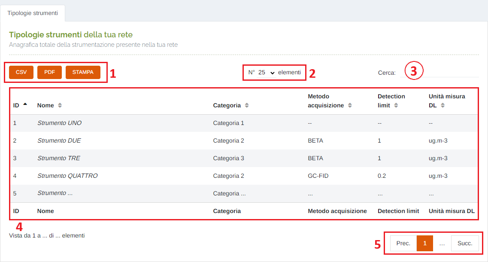

# ANAGRAFICA - STRUMENTI

Per poter accedere a questa sezione occorre cliccare sulla voce "Anagrafica" posta nel menu principale di sinistra ed in seguito cliccare sull'elemento "Strumenti".

<h3>
    > Anagrafica 
    &nbsp;&nbsp;&nbsp;&nbsp;&nbsp;&nbsp;&nbsp;&nbsp; <i>o</i> Strumenti
</h3>

Questa pagina permette di visualizzare le informazioni di tutti gli strumenti presenti sul sistema.

1. Pulsanti <u>CSV</u> - <u>PDF</u> - <u>STAMPA</u> : è possibile scaricare l'elenco delle tipologie di strumenti sottostanti in due formati, CSV e PDF, oppure stamparlo direttamente;
2. Numero di elementi della tabella per pagina: cliccando sulla freccia è possibile modificare la quantità;
3. <u>Filtro di ricerca nella tabella</u>: la ricerca viene effettuata su tutte le colonne;
4. Tabella con le informazioni relative alle varie tipologie di strumento presenti sul sistema;
5. Esplorazione delle pagine;

