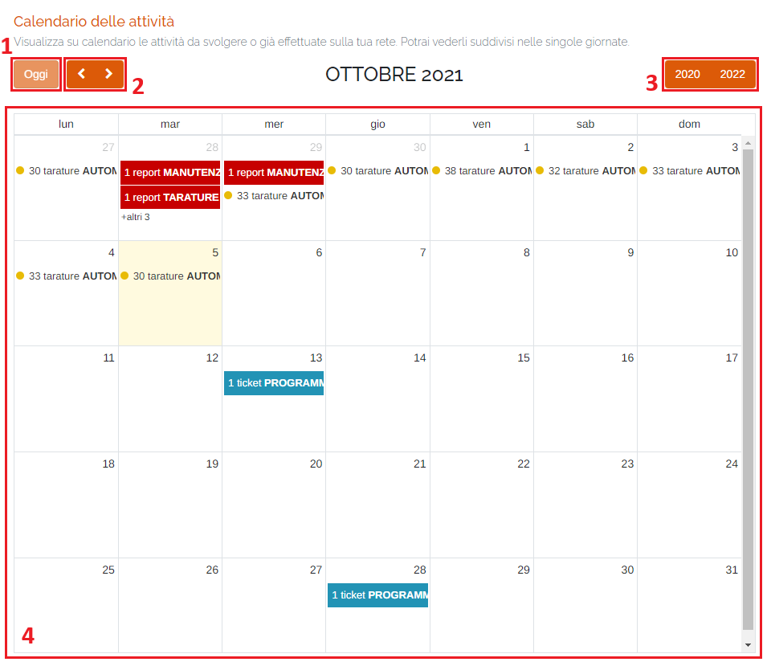
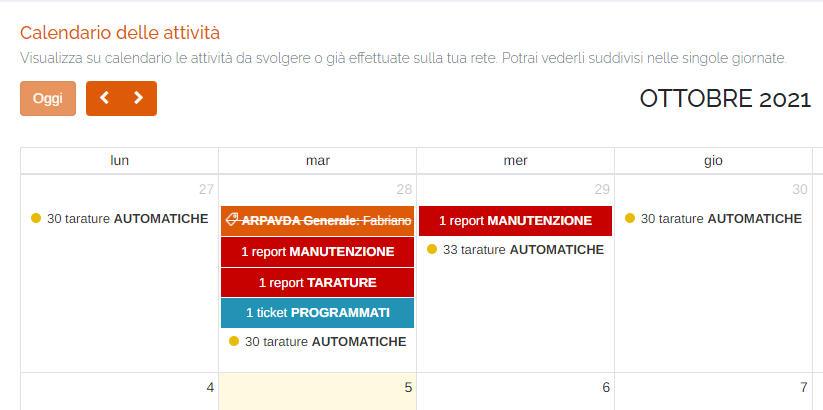
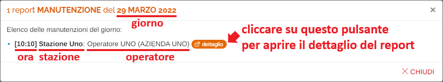
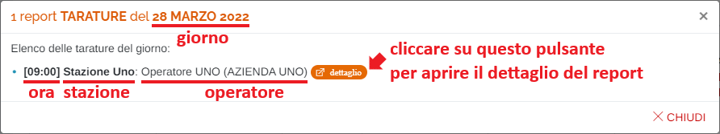
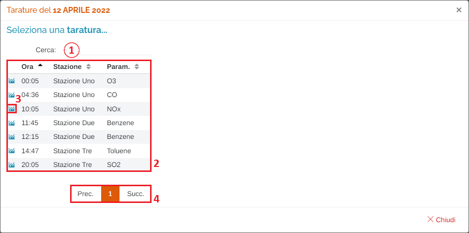
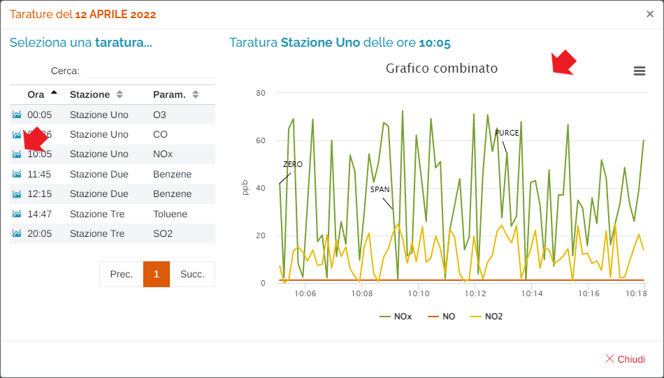
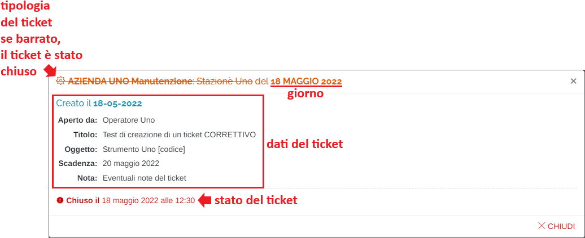
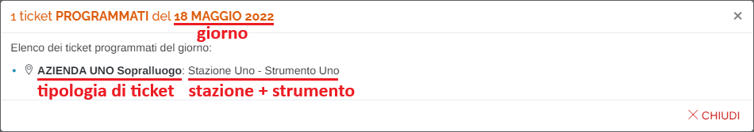

# CALENDARIO

Per poter accedere a questa sezione occorre cliccare sulla voce "Calendario" posta nel menu principale di sinistra.

<h3>
    > Calendario
</h3>

Verrà visualizzata la seguente schermata:

1. Pulsante "<u>Oggi</u>": ritorna alla pagina del calendario del giorno corrente;
2. Pulsante "<u>Avanti/Indietro</u>": scorrere avanti o indietro tra i mesi dell'anno selezionato;
3. Pulsante "<u>Anni</u>": scorrere avanti o indietro tra gli anni visualizzati;
4. Calendario delle attività (il giorno corrente è colorato di giallo);

In questa pagina è possibile visualizzare su calendario le attività da svolgere o già effettuate sulla propria rete di appartenenza. Se nello stesso giorno sono presenti molteplici attività dello stesso tipo, verrà riportato il numero totale di esse a fianco della tipologia (ad esempio: 30 tarature automatiche).

Cliccando su una attività, verrà visualizzato un popup contenente le informazioni relative a quella selezionata.

Le possibili attività sono:

### Report MANUTENZIONE

### Report TARATURE

### Tarature AUTOMATICHE

1. <u>Filtro di ricerca nella tabella</u>: la ricerca viene effettuata su tutte le colonne;
2. Tabella dei dati;
3. Cliccando sul pulsante "Visualizza grafico" </img> verrà visualizzato il grafico del parametro selezionato:

    

    Inoltre, è possibile scaricare il grafico in formato JPEG, oppure i dati della taratura in formato CSV, cliccando sul pulsante </img> e selezionando il formato desiderato.

4. Esplorazione delle pagine della tabella;

### Ticket GENERALE / EVOLUTIVO / CORRETTIVO

### Ticket PROGRAMMATO

