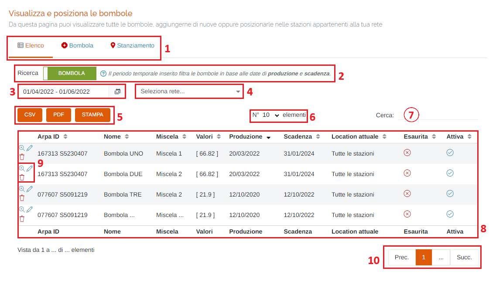
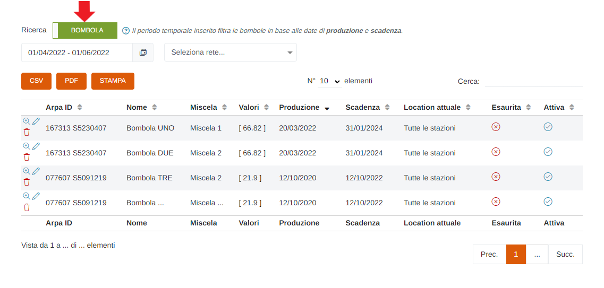
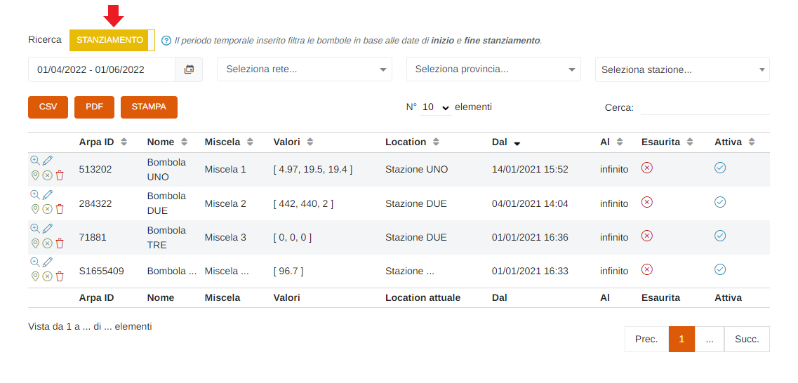
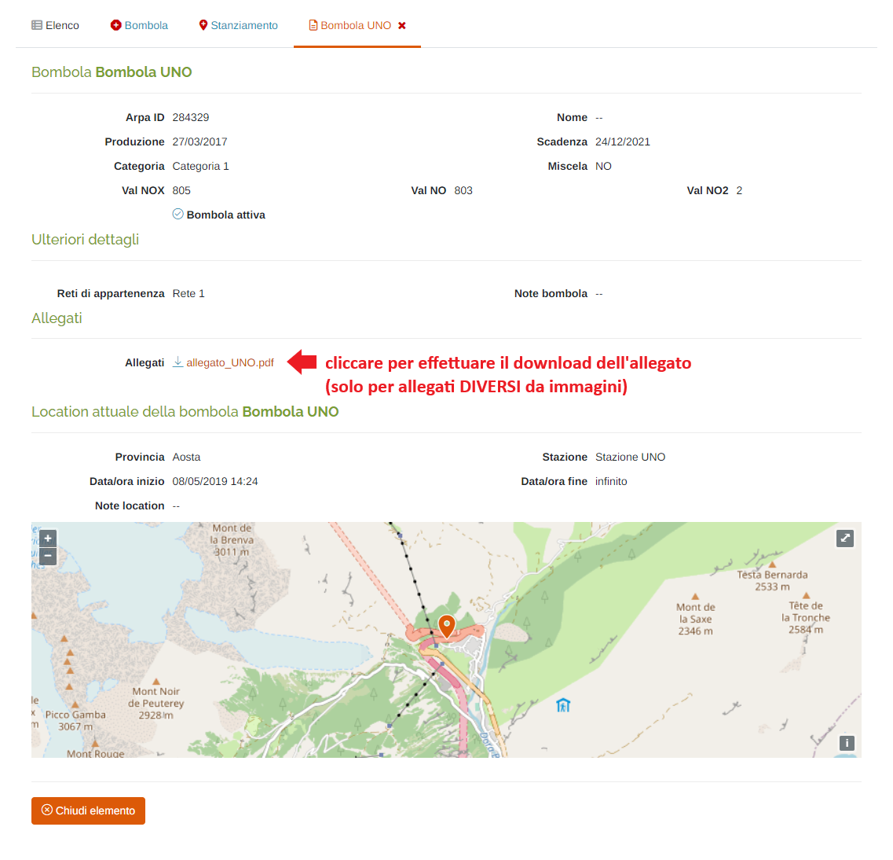
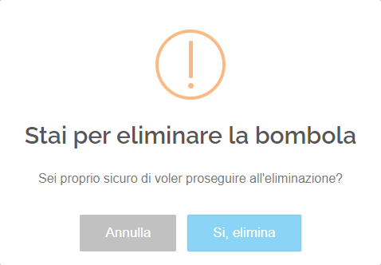
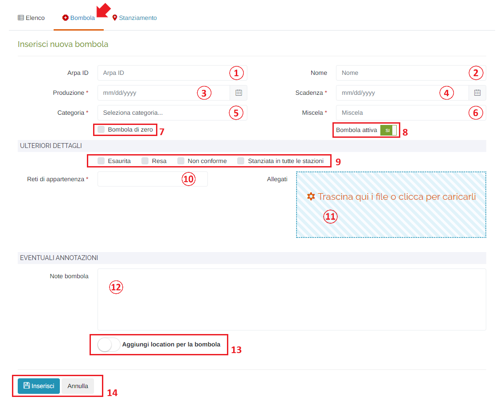
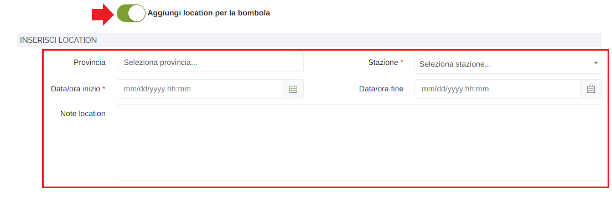
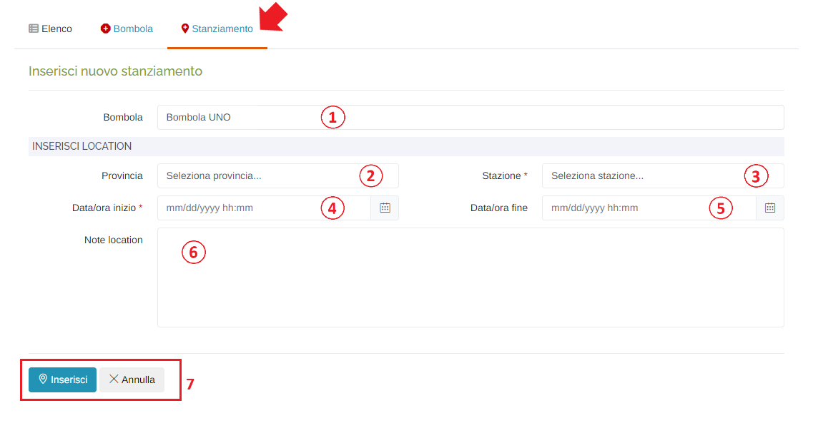

# IMPOSTAZIONI RETE - BOMBOLE

Per poter accedere a questa sezione è necessario cliccare sulla voce "Impostazioni rete", posta nel menu principale di sinistra, ed in seguito cliccare sull'elemento "Bombole".

<h3>
    > Impostazioni rete 
    &nbsp;&nbsp;&nbsp;&nbsp;&nbsp;&nbsp;&nbsp;&nbsp; <i>o</i> Bombole
</h3>

Da questa pagina è possibile visualizzare tutte le bombole, aggiungerne di nuove oppure posizionarle nelle stazioni appartenenti alla propria rete.

1. Schede della pagina:

    * <u>Elenco</u>: elenco delle/degli bombole/stanziamenti già presenti;
    * <u>Bombola</u>: scheda d'inserimento di una nuova bombola;
    * <u>Stanziamento</u>: scheda d'inserimento di un nuovo stanziamento;

2. Interruttore per passare dalla visualizzazione delle bombole a quella degli stanziamenti:

    * </img>

        

    * </img>

        

3. Periodo temporale;

    Attraverso questo strumento è possibile impostare il periodo temporale per la visualizzazione dei report.

    È importante ricordare che, per impostare il periodo, è SEMPRE NECESSARIO CLICCARE DUE VOLTE, una per il giorno d'inizio e una per il giorno di fine.

    Una volta selezionato il periodo, premere il pulsante Applica per completare l'operazione.

    

    &nbsp;&nbsp;&nbsp;&nbsp;&nbsp;&nbsp;a. Data d'inizio; 
    &nbsp;&nbsp;&nbsp;&nbsp;&nbsp;&nbsp;b. Data di fine; 
    &nbsp;&nbsp;&nbsp;&nbsp;&nbsp;&nbsp;c. Pulsante <u>Applica</u>; 
    &nbsp;&nbsp;&nbsp;&nbsp;&nbsp;&nbsp;d. Pulsante <u>Annulla</u>: chiude la finestra del periodo temporale; 
    &nbsp;&nbsp;&nbsp;&nbsp;&nbsp;&nbsp;e. Calendario mese precedente; 
    &nbsp;&nbsp;&nbsp;&nbsp;&nbsp;&nbsp;f. Calendario mese corrente. 

4. Pulsanti <u>CSV</u> - <u>PDF</u> - <u>STAMPA</u> : è possibile scaricare l'elenco delle/degli bombole/stanziamenti sottostanti in due formati, CSV e PDF, oppure stamparlo direttamente;
5. <u>Filtro di ricerca nella tabella</u>: la ricerca viene effettuata su tutte le colonne della tabella;
6. Tabella delle bombole:

    * </img> => bombola esaurita/attiva
    * </img> => bombola NON esaurita/attiva

7. Pulsanti:

    * <u>Visualizza bombola</u> </img>:

        

    * <u>Modifica bombola</u> </img>: verrà aperta la scheda per modificare i dati della bombola selezionata (stessi campi presenti in "Inserisci nuova bombola");
    * <u>Modifica location</u> </img>: verrà aperta la scheda per modificare i dati della location selezionata (stessi campi presenti in "Inserisci nuova location");
    * <u>Chiudi location corrente</u> </img>: cliccare questo pulsante per chiudere la location della bombola selezionata; verrà visualizzato il seguente messaggio di conferma:

        

    * <u>Elimina tutto</u> </img>: cliccare questo pulsante per eliminare la bombola; verrà visualizzato il seguente messaggio di conferma:

        

        Cliccare "Si, elimina" per effettuare l'eliminazione.

8. Esplorazione delle pagine;

## Inserisci nuova bombola

1. Arpa ID;
2. Nome;
3. Data/ora di <u>Produzione</u> (*obbligatorio): verrà visualizzato il seguente form per la selezione della data e dell'ora:

    Data:

    

    1. Mese precedente;
    2. Mese successivo;
    3. Anno precedente;
    4. Anno successivo;
    5. Scelta del giorno;
    6. Pulsanti 'Annulla' (ritorna alla schermata precedente) e 'OK' (imposta la data selezionata);  

    Ora:

    
    

    Per impostare l'ora e i minuti, cliccare sui numeri presenti nell'orologio visualizzato e premere 'OK'; si imposterà prima l'ora e dopo i minuti;

4. Data/ora di <u>Scadenza</u> (*obbligatorio): verrà visualizzato lo stesso form visto al punto 3;
5. <u>Categoria</u> (*obbligatorio): al cambio della categoria verranno visualizzati uno o più campi da compilare con i valori della bombola che si sta inserendo;
6. <u>Miscela</u> (*obbligatorio);
7. Casella <u>Bombola di zero</u>;
8. Interruttore <u>Bombola attiva/non attiva</u>;

    * </img> --> Bombola attiva;
    * </img> --> Bombola NON attiva;

9. Caselle da spuntare per aggiungere ulteriori dettagli alla bombola: in particolare l'opzione "Stanziata in tutte le stazioni", se selezionata, renderà impossibile aggiungere una location tramite l'interruttore del punto 13 poiché, essendo la bombola "stanziata in tutte le stazioni" della rete non ci sarebbero ulteriori location da aggiungere;
10. Selezionare una o più <u>Reti di appartenenza</u> (*obbligatorio);
11. Inserire allegati alla bombola: al click verrà visualizzata la finestra di sistema per scegliere i file;
12. Eventuali note;
13. Interruttore <u>Aggiungi location per la bombola</u>:

    * </img> --> No Location;
    * </img> --> Aggiungi location;

        Se selezionato "Aggiungi location per la bombola", si dovranno inserire i seguenti campi aggiuntivi (per il dettaglio dei campi, vedere "Inserisci nuovo stanziamento"):

        

14. Pulsanti <u>Inserisci</u> e <u>Annulla</u> : cliccare il pulsante "Inserisci" per effettuare l'inserimento della nuova bombola, oppure il pulsante Annulla per ritornare alla scheda "Elenco";

## Inserisci nuovo stanziamento di una bombola

1. Selezionare la bombola di cui si vuole effettuare lo stanziamento: nell'elenco saranno presenti le bombole create che non sono state ancora stanziate e quelle che non sono più stanziate (di cui si è effettuata la chiusura della location);
2. Selezionare la provincia (serve solo da filtro per il campo "Stazione");
3. Selezionare la stazione in base alla provincia scelta in precedenza (se non si è selezionata la provincia verranno elencate tutte le stazione presenti sul portale) (*obbligatorio);
4. Inserire la data/ora di inizio dello stanziamento (*obbligatorio): verrà visualizzato lo stesso form visto in fase di inserimento della bombola;
5. Inserire la data/ora di fine dello stanziamento: questa data/ora NON è obbligatoria e, se il campo viene lasciato vuoto, verrà inserito il valore "infinito" e, di conseguenza, lo stanziamento sarà attivo a tempo indeterminato fino alla chiusura dello stesso da parte dell'utente;
6. Eventuali note;
7. Pulsanti <u>Inserisci</u> e <u>Annulla</u> : cliccare il pulsante "Inserisci" per effettuare l'inserimento del nuovo stanziamento, oppure il pulsante Annulla per ritornare alla scheda "Elenco";

