# IMPOSTAZIONI RETE - CAMPAGNE

Per poter accedere a questa sezione è necessario cliccare sulla voce "Impostazioni rete", posta nel menu principale di sinistra, ed in seguito cliccare sull'elemento "Campagne".

<h3>
    > Impostazioni rete 
    &nbsp;&nbsp;&nbsp;&nbsp;&nbsp;&nbsp;&nbsp;&nbsp; <i>o</i> Campagne
</h3>

Da questa pagina è possibile visualizzare tutte le campagne, aggiungerne di nuove oppure posizionarle in vari punti appartenenti alla propria rete.

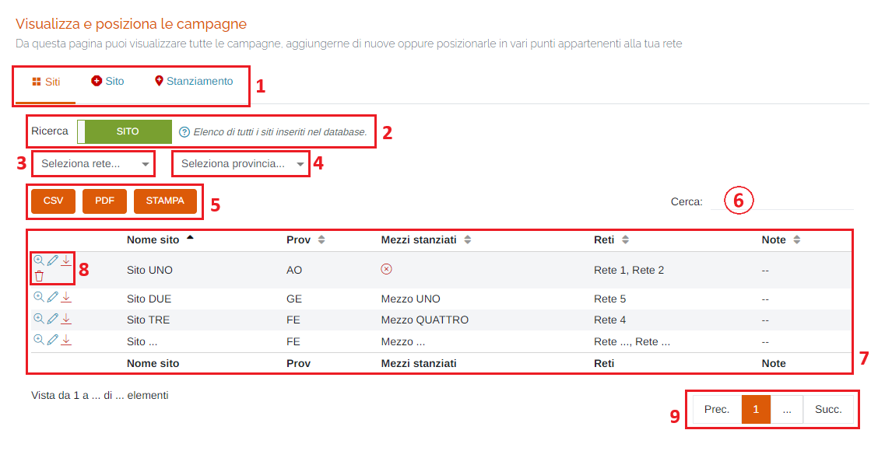

1. Schede della pagina:

    * <u>Siti</u>: elenco dei/degli siti/stanziamenti inseriti nel database;
    * <u>Sito</u>: scheda d'inserimento di un nuovo sito;
    * <u>Stanziamento</u>: scheda d'inserimento di un nuovo stanziamento;

2. Interruttore per passare dalla visualizzazione dei siti a quella degli stanziamenti:

    * </img>

        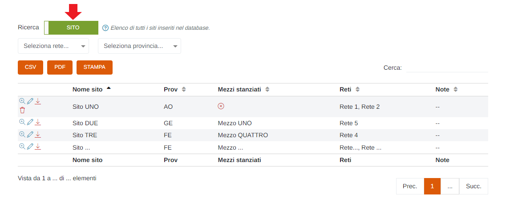

    * </img>

        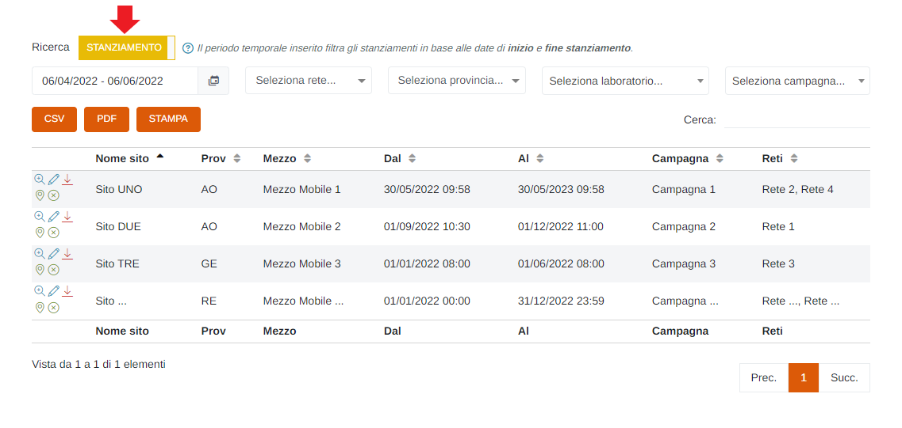

* Periodo temporale: (SOLO nella visualizzazione degli Stanziamenti)

    Attraverso questo strumento è possibile impostare il periodo temporale per la visualizzazione dei report.

    È importante ricordare che, per impostare il periodo, è SEMPRE NECESSARIO CLICCARE DUE VOLTE, una per il giorno d'inizio e una per il giorno di fine.

    Una volta selezionato il periodo, premere il pulsante Applica per completare l'operazione.

    

    &nbsp;&nbsp;&nbsp;&nbsp;&nbsp;&nbsp;a. Data d'inizio; 
    &nbsp;&nbsp;&nbsp;&nbsp;&nbsp;&nbsp;b. Data di fine; 
    &nbsp;&nbsp;&nbsp;&nbsp;&nbsp;&nbsp;c. Pulsante <u>Applica</u>; 
    &nbsp;&nbsp;&nbsp;&nbsp;&nbsp;&nbsp;d. Pulsante <u>Annulla</u>: chiude la finestra del periodo temporale; 
    &nbsp;&nbsp;&nbsp;&nbsp;&nbsp;&nbsp;e. Calendario mese precedente; 
    &nbsp;&nbsp;&nbsp;&nbsp;&nbsp;&nbsp;f. Calendario mese corrente. 

3. Selezionare la <u>rete</u> (filtro tabella);
4. Selezionare la <u>provincia</u> (filtro tabella);
* Selezionare il <u>laboratorio</u> (filtro tabella - SOLO nella visualizzazione degli Stanziamenti);
* Selezionare la <u>campagna</u> (filtro tabella - SOLO nella visualizzazione degli Stanziamenti);
5. Pulsanti <u>CSV</u> - <u>PDF</u> - <u>STAMPA</u> : è possibile scaricare l'elenco degli strumenti/stanziamenti sottostanti in due formati, CSV e PDF, oppure stamparlo direttamente;
6. <u>Filtro di ricerca nella tabella</u>: la ricerca viene effettuata su tutte le colonne della tabella;
7. Tabella degli strumenti;
8. Pulsanti:

    * <u>Visualizza sito</u> </img>:

        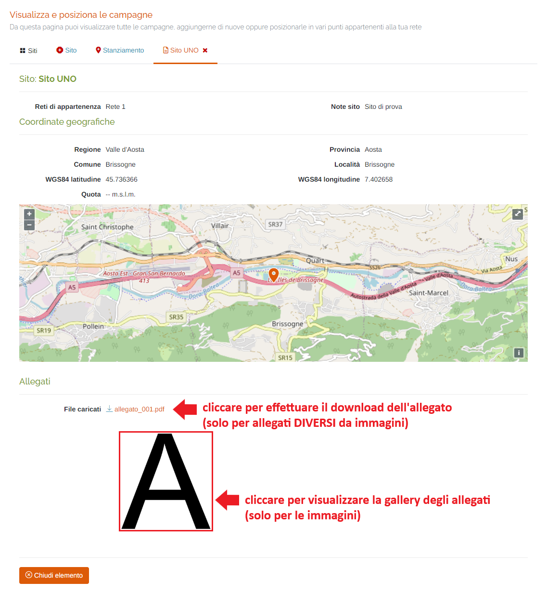

        Qualora siano stanziati dei mezzi nel sito selezionato, verrà visualizzata la sezione "Mezzi attualmente stanziati in questa location" con le informazioni relative ai mezzi stanziati.

        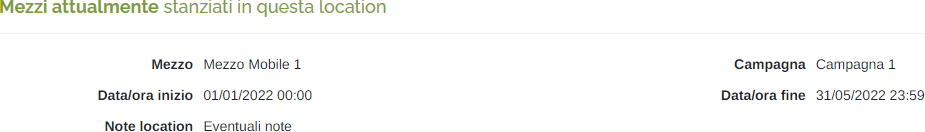

        Inoltre, se in passato sono già stati stanziati uno o più mezzi, verrà visualizzata la sezione "Storico dei mezzi stanziati in questa location" con un elenco cronologico dei mezzi; se invece lo non è stato ancora stanziato alcun mezzo nel sito visualizzato, questa sezione non verrà visualizzata.

        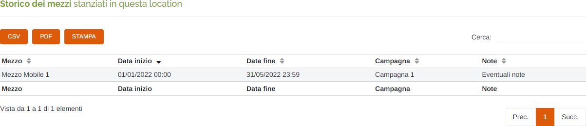

    * <u>Modifica sito</u> </img>: verrà aperta la scheda per modificare i dati del sito selezionato (stessi campi presenti in "Inserisci nuovo sito");
    * <u>Scarica PDF</u> </img> : verrà scaricato il PDF del dettaglio del sito selezionato;

    * <u>Elimina tutto</u> </img>: cliccare questo pulsante per eliminare il sito (il pulsante verrà visualizzato SOLO se, in quel momento, non è associato alcun mezzo al sito); verrà visualizzato il seguente messaggio di conferma:

        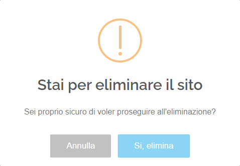

        Cliccare "Si, elimina" per effettuare l'eliminazione.

    * <u>Modifica stanziamento</u> </img> : verrà aperta la scheda per modificare i dati dello stanziamento selezionato (stessi campi presenti in "Inserisci nuovo stanziamento di uno o più mezzi");

    * <u>Chiudi stanziamento</u> </img> : cliccare questo pulsante per chiudere lo stanziamento del sito selezionato; verrà visualizzato il seguente messaggio di conferma:

        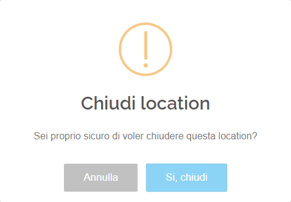

        Cliccare "Si, elimina" per effettuare l'eliminazione.

9. Esplorazione delle pagine;

## Inserisci nuovo sito

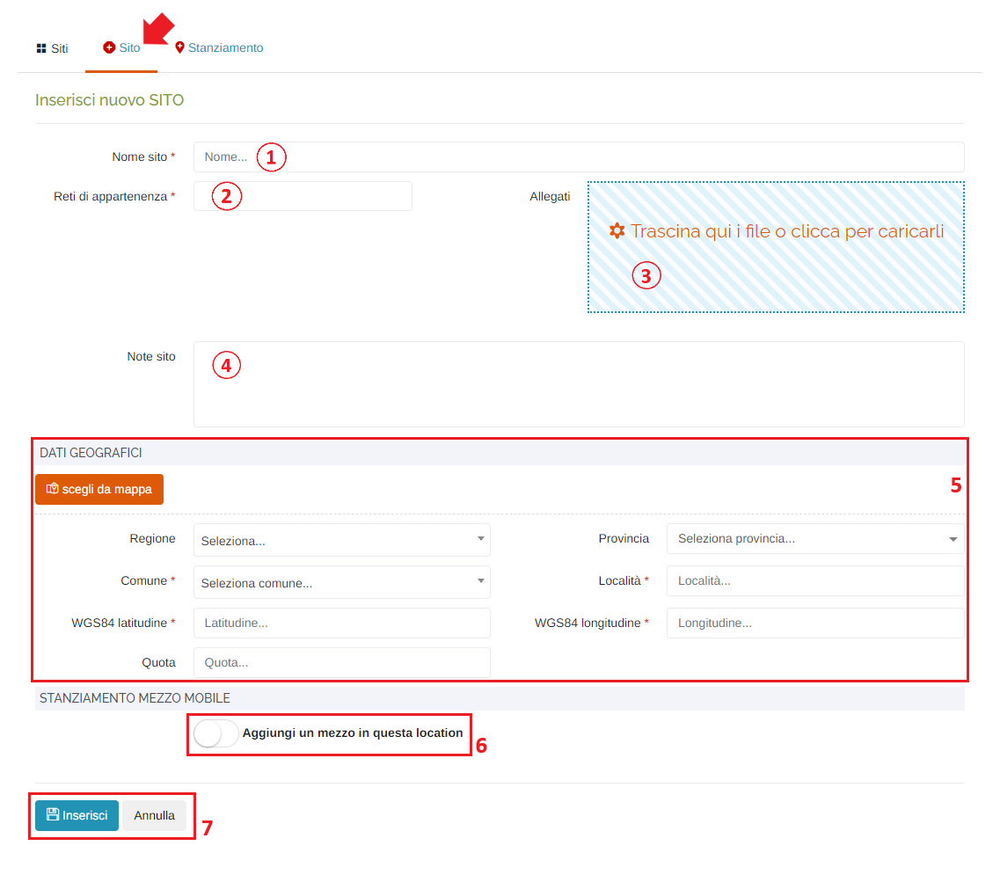

1. <u>Nome</u> del sito (*obbligatorio);
2. Selezionare una o più <u>Reti di appartenenza</u> (*obbligatorio):

    

3. Inserire allegati al sito: al click verrà visualizzata la finestra di sistema per scegliere i file;
4. Eventuali note;
5. <u>Dati geografici</u>: in questa sezione è possibile inserire i dati geografici del sito; è possibile effettuare l'inserimento in due modi: compilare manualmente i campi presenti (quelli contrassegnati da * sono OBBLIGATORI), oppure cliccare il pulsante </img>;

    Una volta cliccato il pulsante, verrà visualizzata la mappa: per inserire i dati, cliccare sulla mappa nel punto in cui si vuole definire il "sito" e spostare il cursore per migliorarne la precisione. Tutti i campi della geolocalizzazione si compileranno automaticamente.

6. Interruttore <u>Aggiungi un mezzo in questa location</u>:

    * </img> --> No Location;
    * </img> --> Aggiungi location;

        Se selezionato "Aggiungi un mezzo in questa location", si dovranno inserire i seguenti campi aggiuntivi (per il dettaglio dei campi, vedere "Inserisci nuovo stanziamento di uno o più mezzi"):

        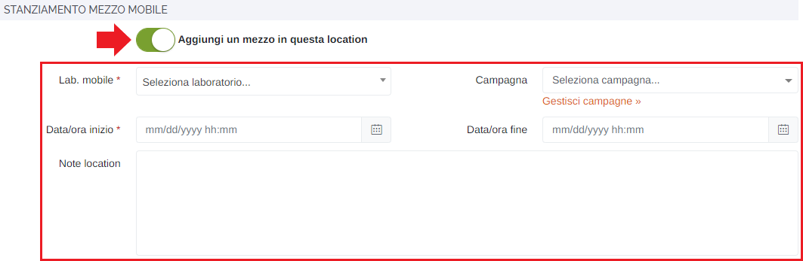

7. Pulsanti <u>Inserisci</u> e <u>Annulla</u> : cliccare il pulsante "Inserisci" per effettuare l'inserimento del nuovo sito, oppure il pulsante "Annulla" per ritornare alla scheda "Siti";

## Inserisci nuovo stanziamento di uno o più mezzi

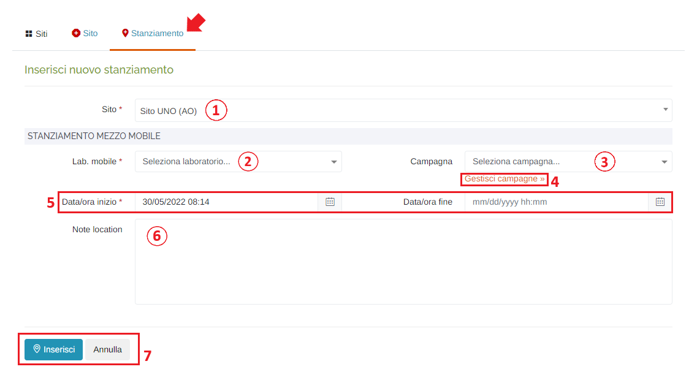

1. Selezionare il <u>Sito</u> a cui si vuole associare lo stanziamento del mezzo mobile: nell'elenco saranno presenti i siti creati che non hanno alcun mezzo mobile stanziato e quelli di cui si è effettuata la chiusura di uno stanziamento precedente;
2. Selezionare il <u>Laboratorio mobile</u> che si vuole stanziare: verranno visualizzati i laboratori di cui si ha il premesso di visualizzazione all'interno del portale;
3. Selezionare la <u>Campagna</u>;
4. Link </img> : verrà visualizzato un form in cui è possibile gestire le campagne:

    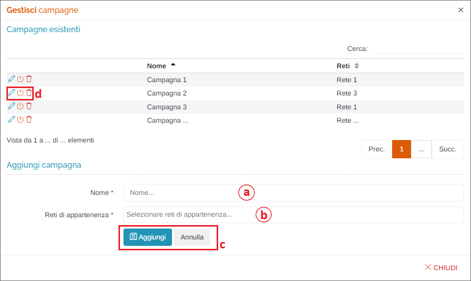

    &nbsp;&nbsp;&nbsp;&nbsp;&nbsp;&nbsp;a. Pulsanti:

    &nbsp;&nbsp;&nbsp;&nbsp;&nbsp;&nbsp;&nbsp;&nbsp;&nbsp;&nbsp;&nbsp;&nbsp;* <u>Modifica campagna</u> </img> : verranno recuperati nome e reti di appartenenza della campagna e sarà possibile modificarli nei due campi sottostanti; Cliccare il pulsante "Modifica" per rendere effettiva la modifica, oppure "Annulla" per ripulire i campi;

    &nbsp;&nbsp;&nbsp;&nbsp;&nbsp;&nbsp;&nbsp;&nbsp;&nbsp;&nbsp;&nbsp;&nbsp;* <u>Abilita/Disabilita campagna</u> :

    &nbsp;&nbsp;&nbsp;&nbsp;&nbsp;&nbsp;&nbsp;&nbsp;&nbsp;&nbsp;&nbsp;&nbsp;&nbsp;&nbsp;&nbsp;&nbsp;&nbsp;&nbsp;&nbsp;&nbsp;&nbsp;&nbsp;&nbsp;&nbsp;* </img> --> disabilita campagna (non verrà visualizzata nell'elenco dell'inserimento/modifica dello stanziamento)

    &nbsp;&nbsp;&nbsp;&nbsp;&nbsp;&nbsp;&nbsp;&nbsp;&nbsp;&nbsp;&nbsp;&nbsp;&nbsp;&nbsp;&nbsp;&nbsp;&nbsp;&nbsp;&nbsp;&nbsp;&nbsp;&nbsp;&nbsp;&nbsp;&nbsp;&nbsp;&nbsp;Verrà visualizzato il seguente messaggio:

    &nbsp;&nbsp;&nbsp;&nbsp;&nbsp;&nbsp;&nbsp;&nbsp;&nbsp;&nbsp;&nbsp;&nbsp;&nbsp;&nbsp;&nbsp;&nbsp;&nbsp;&nbsp;&nbsp;&nbsp;&nbsp;&nbsp;&nbsp;&nbsp;&nbsp;&nbsp;&nbsp;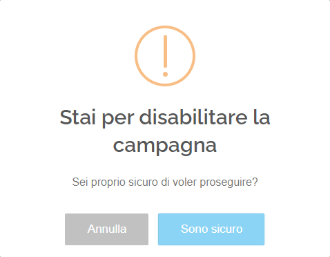

    &nbsp;&nbsp;&nbsp;&nbsp;&nbsp;&nbsp;&nbsp;&nbsp;&nbsp;&nbsp;&nbsp;&nbsp;&nbsp;&nbsp;&nbsp;&nbsp;&nbsp;&nbsp;&nbsp;&nbsp;&nbsp;&nbsp;&nbsp;&nbsp;&nbsp;&nbsp;&nbsp;Cliccare "Sono sicuro" per confermare.

    &nbsp;&nbsp;&nbsp;&nbsp;&nbsp;&nbsp;&nbsp;&nbsp;&nbsp;&nbsp;&nbsp;&nbsp;&nbsp;&nbsp;&nbsp;&nbsp;&nbsp;&nbsp;&nbsp;&nbsp;&nbsp;&nbsp;&nbsp;&nbsp;&nbsp;&nbsp;&nbsp;Se una campagna è disabilitata, verrà visualizzata così sull'elenco:

    &nbsp;&nbsp;&nbsp;&nbsp;&nbsp;&nbsp;&nbsp;&nbsp;&nbsp;&nbsp;&nbsp;&nbsp;&nbsp;&nbsp;&nbsp;&nbsp;&nbsp;&nbsp;&nbsp;&nbsp;&nbsp;&nbsp;&nbsp;&nbsp;&nbsp;&nbsp;&nbsp;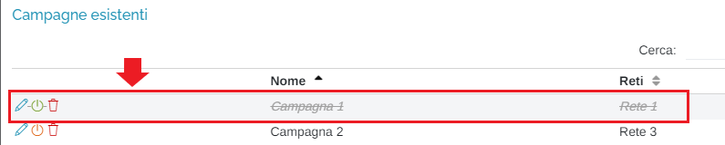

    &nbsp;&nbsp;&nbsp;&nbsp;&nbsp;&nbsp;&nbsp;&nbsp;&nbsp;&nbsp;&nbsp;&nbsp;&nbsp;&nbsp;&nbsp;&nbsp;&nbsp;&nbsp;&nbsp;&nbsp;&nbsp;&nbsp;&nbsp;&nbsp;* </img> --> riabilita campagna

    &nbsp;&nbsp;&nbsp;&nbsp;&nbsp;&nbsp;&nbsp;&nbsp;&nbsp;&nbsp;&nbsp;&nbsp;* <u>Elimina campagna</u> </img>

    &nbsp;&nbsp;&nbsp;&nbsp;&nbsp;&nbsp;&nbsp;&nbsp;&nbsp;&nbsp;&nbsp;&nbsp;&nbsp;&nbsp;&nbsp;&nbsp;&nbsp;&nbsp;&nbsp;&nbsp;&nbsp;&nbsp;&nbsp;&nbsp;&nbsp;&nbsp;&nbsp;Verrà visualizzato il seguente messaggio:

    &nbsp;&nbsp;&nbsp;&nbsp;&nbsp;&nbsp;&nbsp;&nbsp;&nbsp;&nbsp;&nbsp;&nbsp;&nbsp;&nbsp;&nbsp;&nbsp;&nbsp;&nbsp;&nbsp;&nbsp;&nbsp;&nbsp;&nbsp;&nbsp;&nbsp;&nbsp;&nbsp;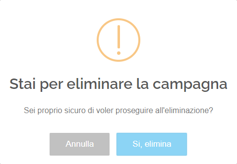

    &nbsp;&nbsp;&nbsp;&nbsp;&nbsp;&nbsp;&nbsp;&nbsp;&nbsp;&nbsp;&nbsp;&nbsp;&nbsp;&nbsp;&nbsp;&nbsp;&nbsp;&nbsp;&nbsp;&nbsp;&nbsp;&nbsp;&nbsp;&nbsp;&nbsp;&nbsp;&nbsp;Cliccare "Si, elimina" per confermare.

5. <u>Data/ora</u> inizio (*obbligatorio) e fine (non obbligatorio - se non impostata verrà inserito il valore "Infinito"): verrà visualizzato il seguente form per la selezione della data e dell'ora:

    Data:

    

    &nbsp;&nbsp;&nbsp;&nbsp;&nbsp;&nbsp;a. Mese precedente; 
    &nbsp;&nbsp;&nbsp;&nbsp;&nbsp;&nbsp;b. Mese successivo; 
    &nbsp;&nbsp;&nbsp;&nbsp;&nbsp;&nbsp;c. Anno precedente; 
    &nbsp;&nbsp;&nbsp;&nbsp;&nbsp;&nbsp;d. Anno successivo; 
    &nbsp;&nbsp;&nbsp;&nbsp;&nbsp;&nbsp;e. Scelta del giorno; 
    &nbsp;&nbsp;&nbsp;&nbsp;&nbsp;&nbsp;f. Pulsanti 'Annulla' (ritorna alla schermata precedente) e 'OK' (imposta la data selezionata); 

    Ora:

    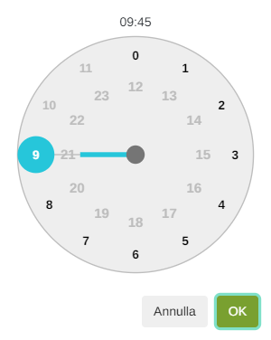
    

    Per impostare l'ora e i minuti, cliccare sui numeri presenti nell'orologio visualizzato e premere 'OK'; si imposterà prima l'ora e dopo i minuti;

6. Eventuali note;
7. Pulsanti <u>Inserisci</u> e <u>Annulla</u> : cliccare il pulsante "Inserisci" per effettuare l'inserimento del nuovo stanziamento, oppure il pulsante Annulla per ritornare alla scheda "Siti";

