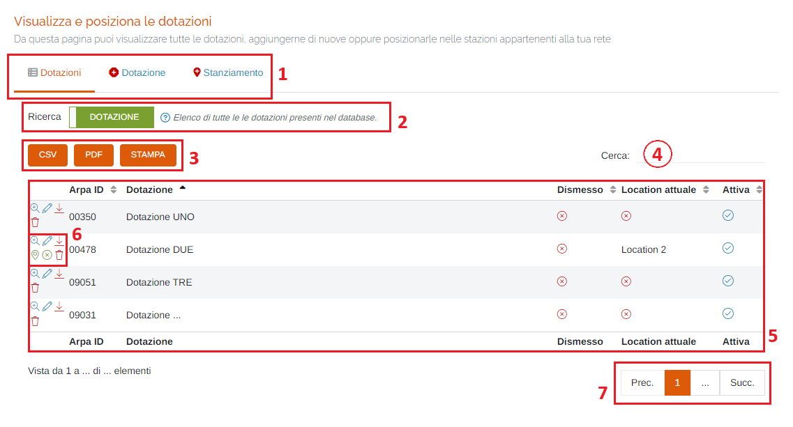
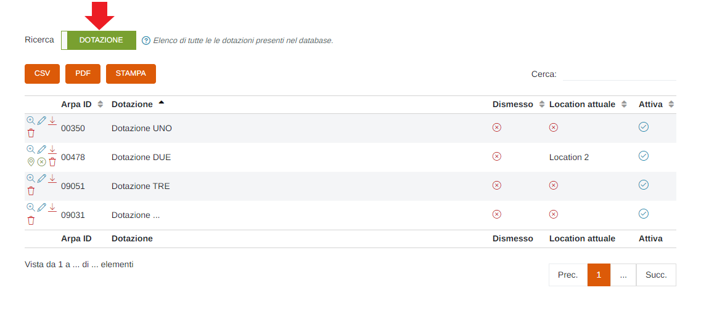
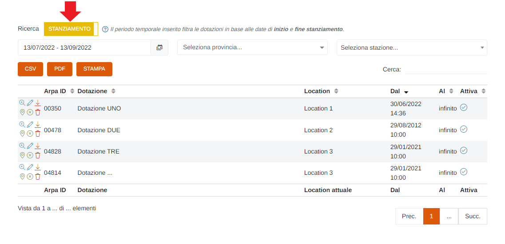
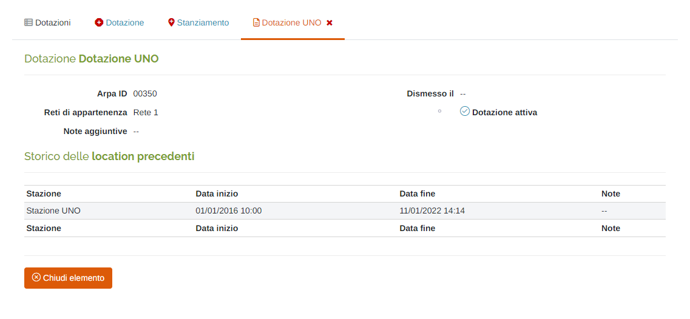
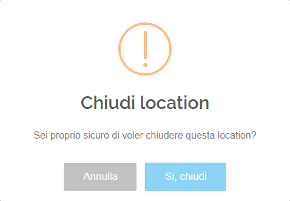
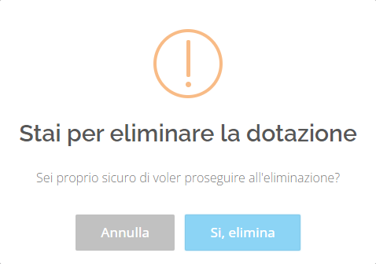
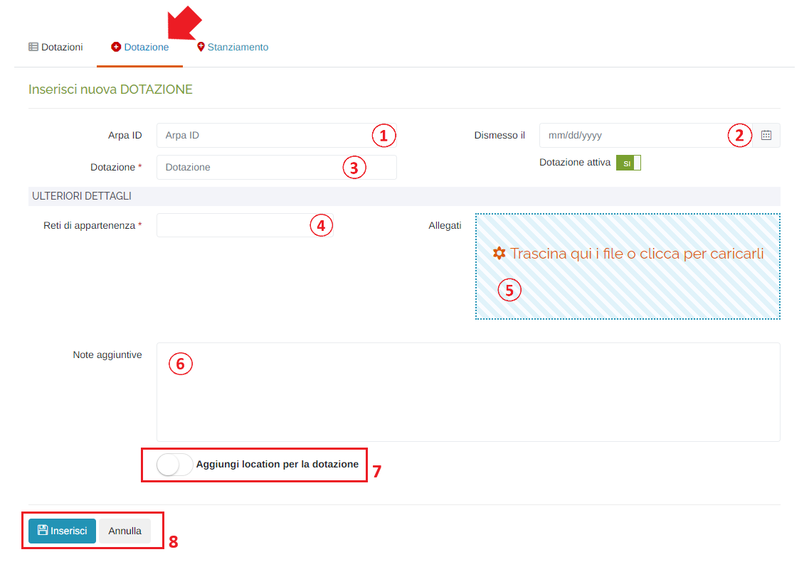
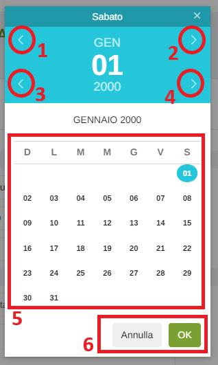
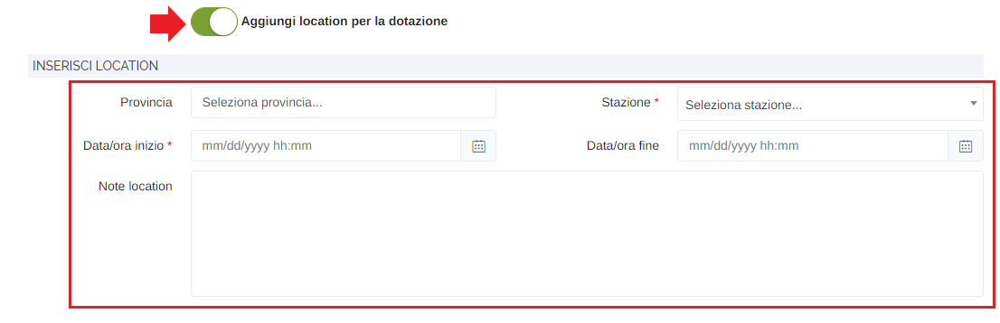
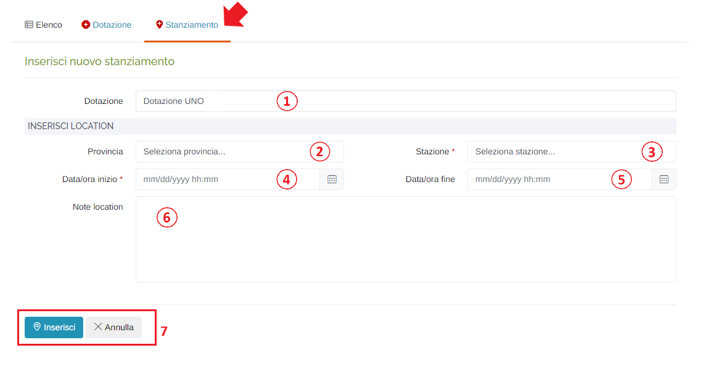

# IMPOSTAZIONI RETE - DOTAZIONI

Per poter accedere a questa sezione è necessario cliccare sulla voce "Impostazioni rete", posta nel menu principale di sinistra, ed in seguito cliccare sull'elemento "Dotazioni".

<h3>
    > Impostazioni rete 
    &nbsp;&nbsp;&nbsp;&nbsp;&nbsp;&nbsp;&nbsp;&nbsp; <i>o</i> Dotazioni
</h3>

Da questa pagina è possibile visualizzare tutte le dotazioni, aggiungerne di nuove oppure posizionarle nelle stazioni appartenenti alla propria rete.

1. Schede della pagina:

    * <u>Dotazioni</u>: elenco delle/degli dotazioni/stanziamenti già presenti;
    * <u>Dotazione</u>: scheda d'inserimento di una nuova dotazione;
    * <u>Stanziamento</u>: scheda d'inserimento di un nuovo stanziamento;

2. Interruttore per passare dalla visualizzazione delle dotazioni a quella degli stanziamenti:

    * </img>

        

    * </img>

        

3. Pulsanti <u>CSV</u> - <u>PDF</u> - <u>STAMPA</u> : è possibile scaricare l'elenco delle/degli dotazioni/stanziamenti sottostanti in due formati, CSV e PDF, oppure stamparlo direttamente;
4. <u>Filtro di ricerca nella tabella</u>: la ricerca viene effettuata su tutte le colonne della tabella;
5. Tabella delle dotazioni:

    * </img> => dotazione dismessa/attiva
    * </img> => dotazione NON dismessa/attiva

6. Pulsanti:

    * <u>Visualizza dotazione</u> </img>:

        

    * <u>Modifica dotazione</u> </img>: verrà aperta la scheda per modificare i dati della dotazione selezionata (stessi campi presenti in "Inserisci nuova dotazione");
    * <u>Scarica PDF</u> </img>: verrà effettuato il download del pdf relativo alla dotazione selezionata;
    * <u>Modifica location</u> </img>: verrà aperta la scheda per modificare i dati della location selezionata (stessi campi presenti in "Inserisci nuova location");
    * <u>Chiudi location corrente</u> </img>: cliccare questo pulsante per chiudere la location della dotazione selezionata; verrà visualizzato il seguente messaggio di conferma:

        

    * <u>Elimina tutto</u> </img>: cliccare questo pulsante per eliminare la dotazione; verrà visualizzato il seguente messaggio di conferma:

        

        Cliccare "Si, elimina" per effettuare l'eliminazione.

7. Esplorazione delle pagine;

## Inserisci nuova dotazione

1. Arpa ID;
2. Data di <u>Dimissione</u>: verrà visualizzato il seguente form per la selezione della data:

    

    1. Mese precedente;
    2. Mese successivo;
    3. Anno precedente;
    4. Anno successivo;
    5. Scelta del giorno;

3. <u>Dotazione</u> (*obbligatorio): inserire il nome identificativo della dotazione;
4. Interruttore <u>Dotazione attiva/non attiva</u>;

    * </img> --> Dotazione attiva;
    * </img> --> Dotazione NON attiva;

5. Selezionare una o più <u>Reti di appartenenza</u> (*obbligatorio);
6. Inserire allegati alla dotazione: al click verrà visualizzata la finestra di sistema per scegliere i file;
7. Eventuali note;
8. Interruttore <u>Aggiungi location per la dotazione</u>:

    * </img> --> No Location;
    * </img> --> Aggiungi location;

        Se selezionato "Aggiungi location per la dotazione", si dovranno inserire i seguenti campi aggiuntivi (per il dettaglio dei campi, vedere "Inserisci nuovo stanziamento"):

        

9. Pulsanti <u>Inserisci</u> e <u>Annulla</u> : cliccare il pulsante "Inserisci" per effettuare l'inserimento della nuova dotazione, oppure il pulsante Annulla per ritornare alla scheda "Dotazioni";

## Inserisci nuovo stanziamento di una dotazione

1. Selezionare la dotazione di cui si vuole effettuare lo stanziamento: nell'elenco saranno presenti le dotazioni create che non sono state ancora stanziate e quelle che non sono più stanziate (di cui si è effettuata la chiusura della location);
2. Selezionare la provincia (serve solo da filtro per il campo "Stazione");
3. Selezionare la stazione in base alla provincia scelta in precedenza (se non si è selezionata la provincia verranno elencate tutte le stazione presenti sul portale) (*obbligatorio);
4. Inserire la data/ora di inizio dello stanziamento (*obbligatorio): verrà visualizzato lo stesso form visto in fase di inserimento della dotazione;
5. Inserire la data/ora di fine dello stanziamento: questa data/ora NON è obbligatoria e, se il campo viene lasciato vuoto, verrà inserito il valore "infinito" e, di conseguenza, lo stanziamento sarà attivo a tempo indeterminato fino alla chiusura dello stesso da parte dell'utente;
6. Eventuali note;
7. Pulsanti <u>Inserisci</u> e <u>Annulla</u> : cliccare il pulsante "Inserisci" per effettuare l'inserimento del nuovo stanziamento, oppure il pulsante Annulla per ritornare alla scheda "Elenco";

