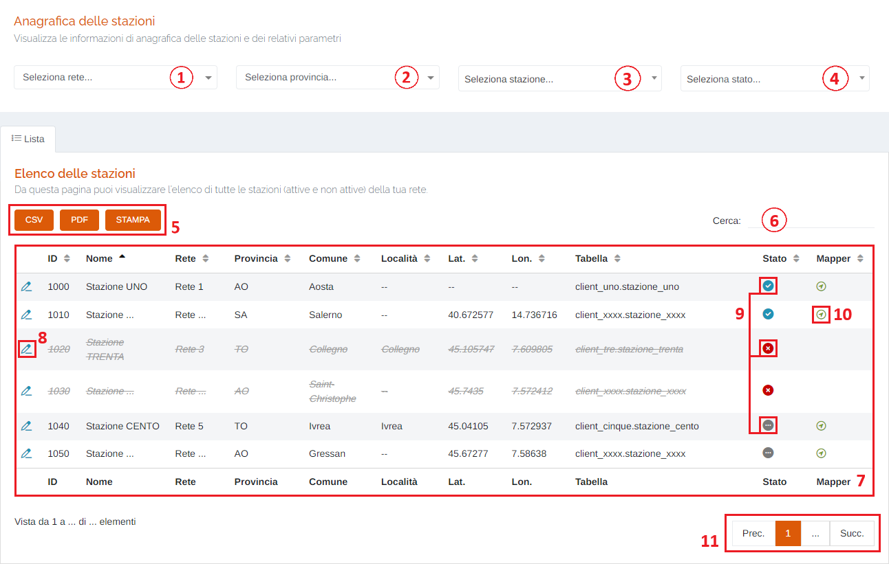
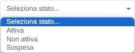
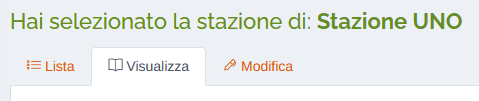
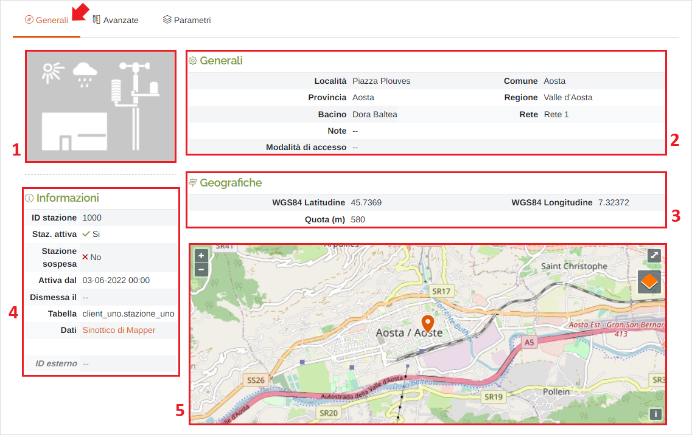
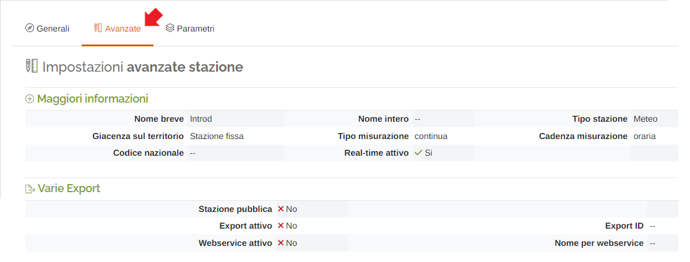
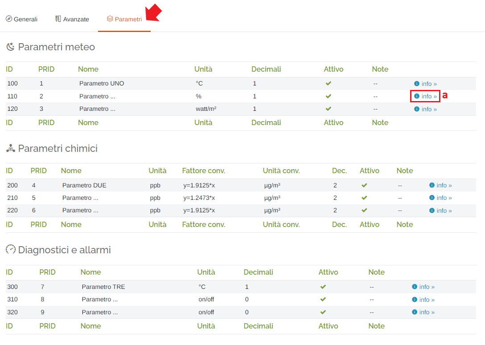
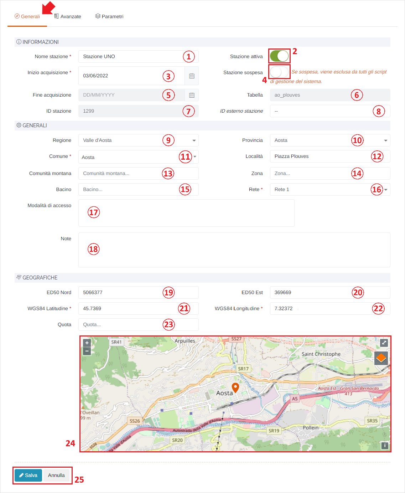
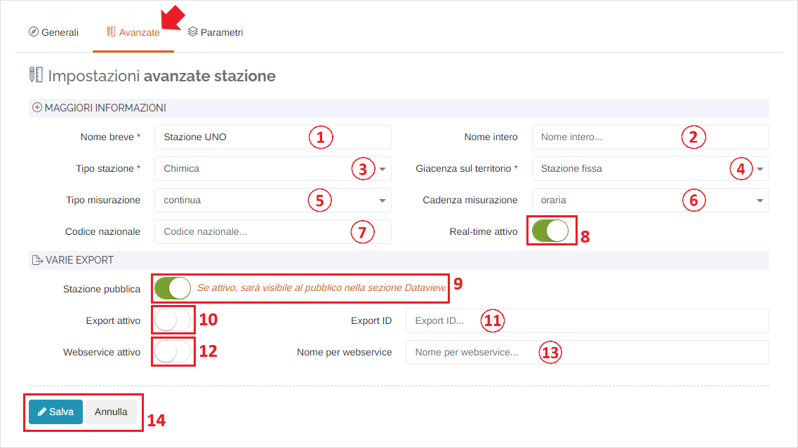
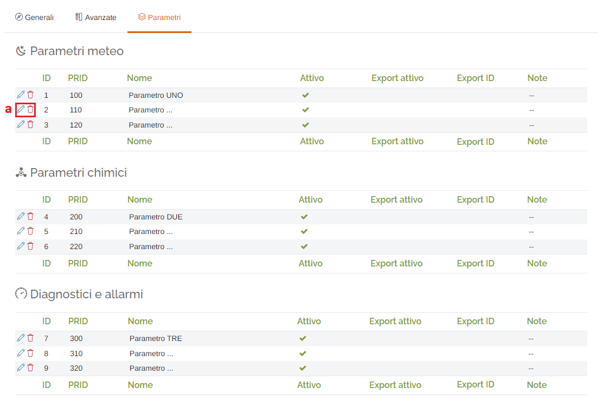
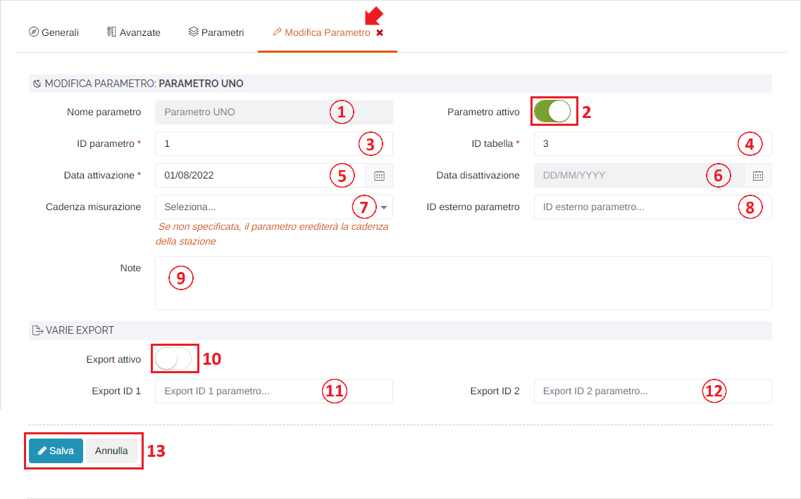

# IMPOSTAZIONI RETE - STAZIONI

Per poter accedere a questa sezione occorre cliccare sulla voce "Impostazioni rete" posta nel menu principale di sinistra ed in seguito cliccare sull'elemento "Stazioni".

<h3>
    > Impostazioni rete 
    &nbsp;&nbsp;&nbsp;&nbsp;&nbsp;&nbsp;&nbsp;&nbsp; <i>o</i> Stazioni
</h3>

Questa pagina permette di visualizzare le informazioni di anagrafica delle stazioni e dei relativi parametri.

1. Elenco reti disponibili sul portale;

    

2. Elenco province disponibili sul portale;

3. Elenco stazioni disponibili sul portale;

    

4. Filtro relativo allo stato delle stazioni;

    

5. Pulsanti <u>CSV</u> - <u>PDF</u> - <u>STAMPA</u> : è possibile scaricare l'elenco delle stazioni sottostanti in due formati, CSV e PDF, oppure stamparlo direttamente;
6. Filtro di ricerca nella tabella: la ricerca viene effettuata su tutte le colonne;
7. Tabella delle stazioni;
8. Pulsante <u>Visualizza e/o modifica</u>: cliccando il pulsante </img> è possibile accedere alla sezione di visualizzazione e/o modifica della stazione selezionata;
9. Icone di stato della stazione:

    * </img> --> Stazione <u>ATTIVA</u>
    * </img> --> Stazione <u>NON ATTIVA</u>
    * </img> --> Stazione <u>SOSPESA</u> (attiva, ma esclusa dagli script di sistema)

10. Icona <u>Sinottico di Mapper</u>: cliccare questo pulsante per aprire un tab che rimanda allo strumento "Mapper" e ai dati della stazione selezionata;
11. Esplorazione delle pagine;

## Sezione Visualizza e/o modifica

Questa sezione è organizzata in tre schede principali:

* <u>Lista</u> (vedi sopra);
* <u>Visualizza</u> (vedi "Stazioni - Visualizza");
* <u>Modifica</u> (vedi "Stazioni - Modifica");

### Stazioni - Visualizza

Nella scheda "Visualizza", è possibile visualizzare le informazioni, generali e avanzate, della stazione selezionata e i relativi parametri.

#### Visualizza - Generali

1. Foto della stazione;
2. Informazioni generali;
3. Informazioni geografiche;
4. Ulteriori informazioni;
5. Mappa geografica con pin relativo alla locazione della stazione;

#### Visualizza - Avanzate

In questa sezione verranno visualizzate maggiori informazioni riguardanti la stazione;

#### Visualizza - Parametri

In questa sezione verranno visualizzate le informazioni relative ai parametri presenti nella stazione;

&nbsp;&nbsp;&nbsp;&nbsp;&nbsp;&nbsp;a. </img> -> cliccando su questo collegamento verrà aperto un popup contenente informazioni aggiuntive riguardo il singolo parametro scelto;

### Stazioni - Modifica

Nella scheda "Modifica", è possibile modificare le informazioni generali della stazione selezionata e i relativi parametri.

#### Modifica - Generali

1. Nome della stazione (*obbligatorio);
2. Stazione <u>Attiva</u>;

    Attiva -> </img>

    Disattiva -> </img>

3. Data di inizio acquisizione dei dati (*obbligatorio): verrà visualizzato il seguente form per la selezione della data:

    

    1. Mese precedente;
    2. Mese successivo;
    3. Anno precedente;
    4. Anno successivo;
    5. Scelta del giorno;
    6. Pulsanti 'Annulla' (ritorna alla schermata precedente) e 'OK' (imposta la data selezionata);

4. Stazione <u>Sospesa</u>;

    Sospesa -> </img>

    Non sospesa -> </img>

5. Data di fine acquisizione dei dati: generalmente non impostata e non modificabile (campo di colore grigio) fino a quando il pulsante 'Stazione Attiva' è impostato su 'Attiva'; verrà visualizzato il form per la selezione della data visto in precedenza;
6. Tabella: nome della tabella nel database (non modificabile);
7. ID della stazione (non modificabile);
8. ID esterno stazione;
9. Regione di appartenenza;
10. Provincia di appartenenza;
11. Comune di appartenenza (*obbligatorio);
12. Località;
13. Eventuale comunità montana di appartenenza;
14. Zona di appartenenza;
15. Bacino di appartenenza;
16. Rete di appartenenza (*obbligatorio) ;
17. Modalità di accesso;
18. Eventuali note;
19. Coordinata Nord in formato ED50;
20. Coordinata Est in formato ED50;
21. Coordinata Latitudine in formato WGS84 (*obbligatorio);
22. Coordinata Longitudine in formato WGS84 (*obbligatorio);
23. Quota;
24. Mappa geografica con pin relativo alla locazione della stazione: cliccando un punto della mappa il pin verrà spostato nella zona del click e verranno aggiornate automaticamente i campi delle coordinate geografiche;
25. Pulsanti <u>Salva</u> e <u>Annulla</u>: cliccare il pulsante Salva per effettuare la modifica dei dati della stazione, oppure il pulsante Annulla per ritornare alla scheda 'Generali';

#### Modifica - Avanzate

1. Nome breve (*obbligatorio);
2. Nome intero;
3. Tipo di stazione (*obbligatorio);
4. Giacenza sul territorio (*obbligatorio);
5. Tipo misurazione;
6. Cadenza misurazione;
7. Codice nazionale;
8. Real-time attivo: visualizzazione dei dati istantanei nello strumento "Mapper" e nella pagina "Dati > Istantanei":

    Attivo -> </img>

    Disattivo -> </img>

9. Stazione pubblica:

    Pubblica -> </img>

    Non pubblica -> </img>

10. Export attivo:

    Attivo -> </img>

    Disattivo -> </img>

11. Export ID;
12. Webservice attivo:

    Attivo -> </img>

    Disattivo -> </img>

13. Nome per webservice;
14. Pulsanti <u>Salva</u> e <u>Annulla</u>: cliccare il pulsante Salva per effettuare la modifica del parametro, oppure il pulsante Annulla per ritornare alla scheda 'Parametri';

#### Modifica - Parametri

In questa sezione è possibile modificare e eliminare i vari parametri presenti sulla stazione:

&nbsp;&nbsp;&nbsp;&nbsp;&nbsp;&nbsp;a. Pulsanti <u>Modifica</u> ( </img> )  e <u>Elimina</u> ( </img> ) parametro;

##### Modifica parametro

Cliccando il pulsante 'Modifica' verrà visualizzato una finestra dove sarà possibile apportare le modifiche al parametro selezionato:

1. Nome del parametro (non modificabile);
2. Parametro <u>Attivo</u>:

    Attivo -> </img>

    Disattivo -> </img>

3. ID del parametro (database) (*obbligatorio);
4. ID tabella: ID coincidente con quello in periferia (*obbligatorio);
5. Data di attivazione del parametro nella stazione (*obbligatorio);
6. Data di disattivazione del parametro: generalmente non modificabile (campo di colore grigio) fino a quando il pulsante 'Parametro attivo' è impostato su 'Attivo';
7. Cadenza misurazione;
8. ID esterno parametro: id del parametro sul server su cui viene esportato il dato;
9. Eventuali note;
10. Export <u>Attivo</u>:

    Attivo -> </img>

    Disattivo -> </img>

11. Export ID 1;
12. Export ID 2;
13. Pulsanti <u>Salva</u> e <u>Annulla</u>: cliccare il pulsante Salva per effettuare la modifica del parametro, oppure il pulsante Annulla per ritornare alla scheda 'Parametri';

