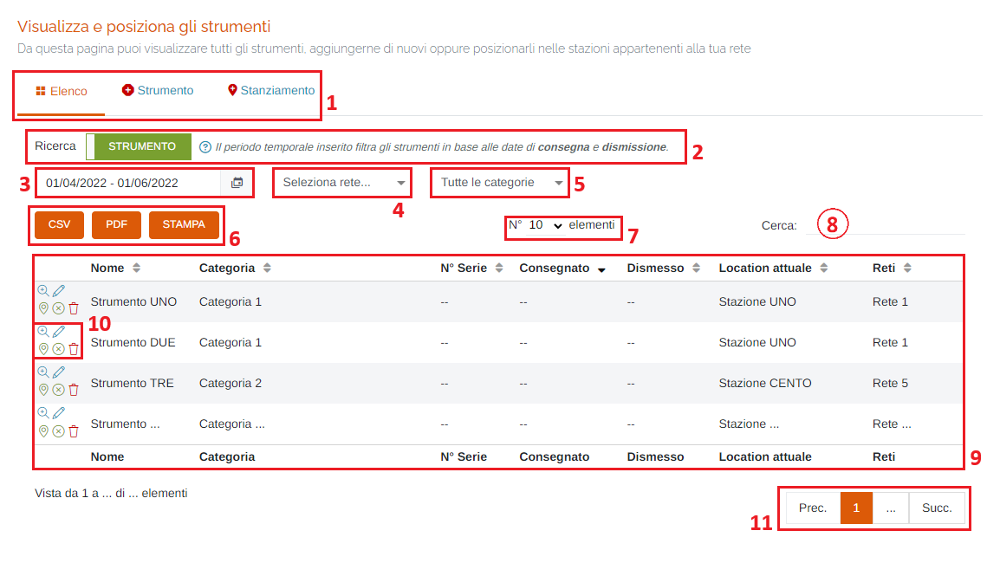
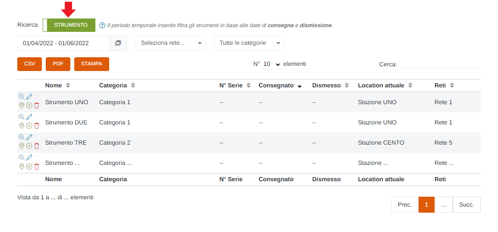
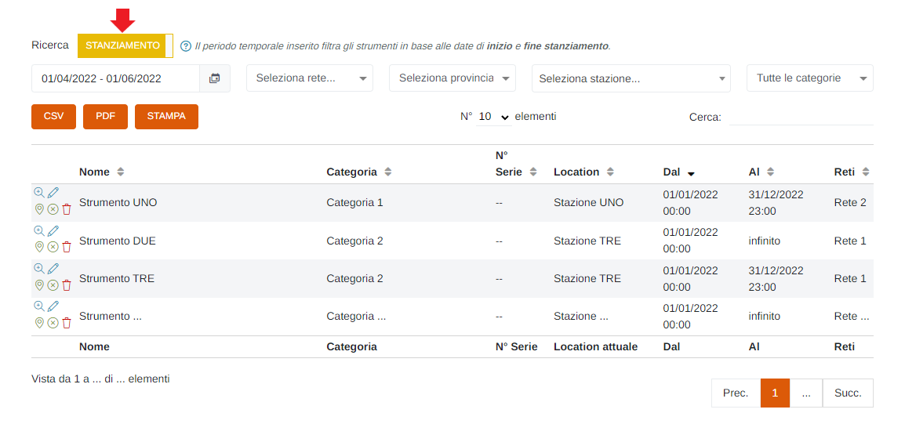
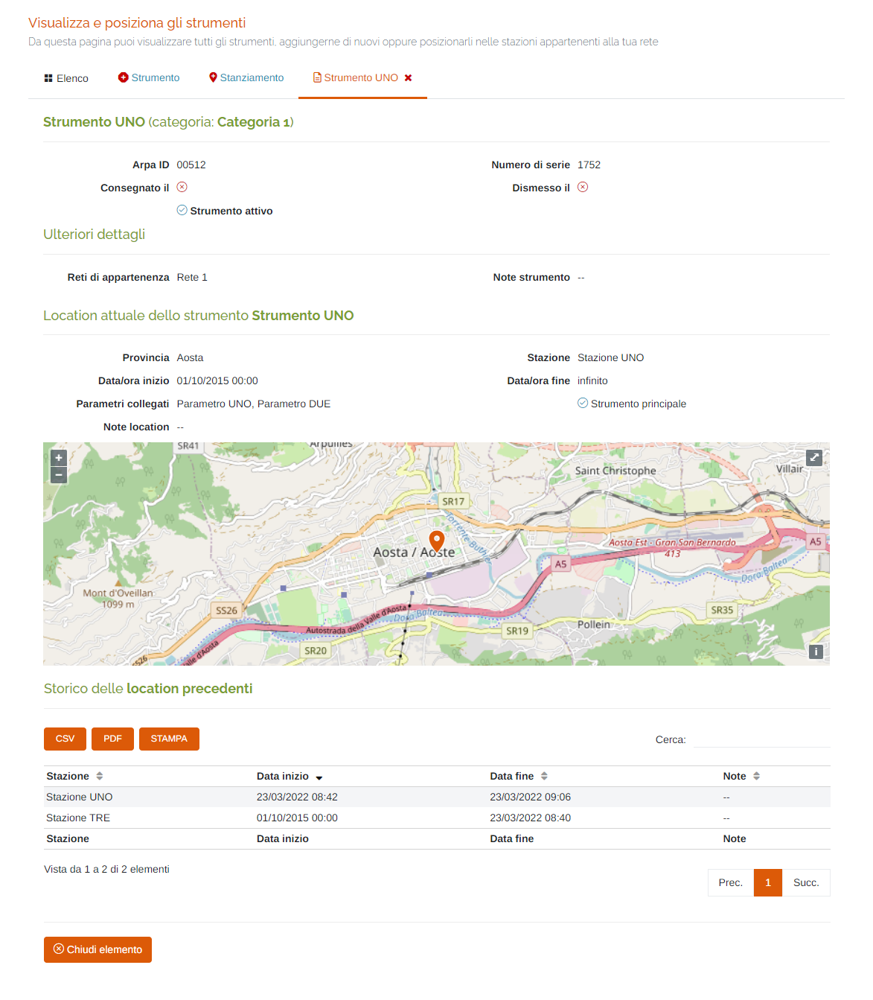
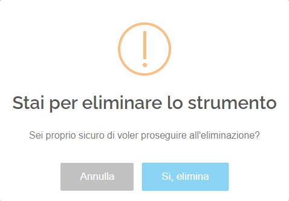
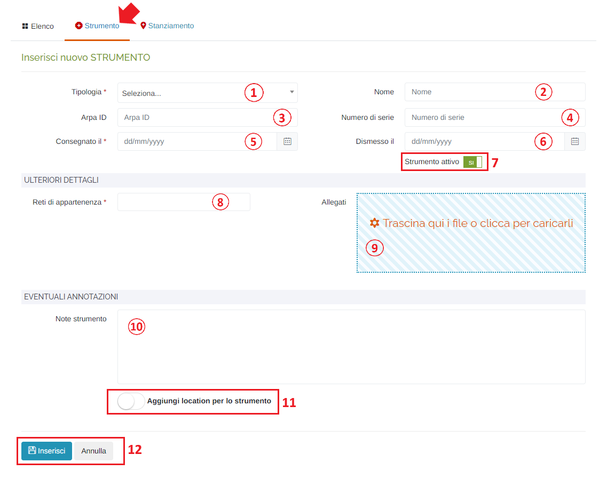
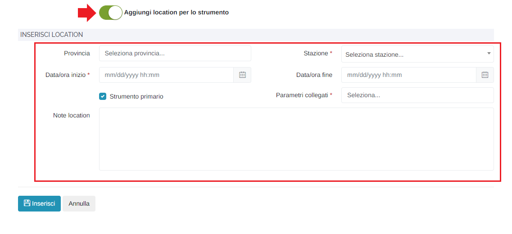
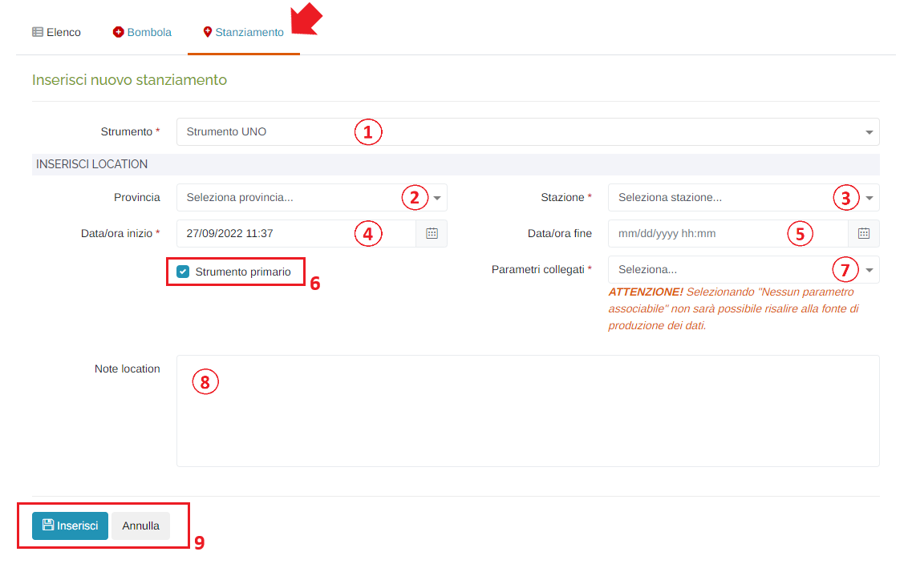

# IMPOSTAZIONI RETE - STRUMENTI

Per poter accedere a questa sezione è necessario cliccare sulla voce "Impostazioni rete", posta nel menu principale di sinistra, ed in seguito cliccare sull'elemento "Strumenti".

<h3>
    > Impostazioni rete 
    &nbsp;&nbsp;&nbsp;&nbsp;&nbsp;&nbsp;&nbsp;&nbsp; <i>o</i> Strumenti
</h3>

Da questa pagina è possibile visualizzare tutti gli strumenti, aggiungerne di nuovi oppure posizionarli nelle stazioni appartenenti alla propria rete.

1. Schede della pagina:

    * <u>Elenco</u>: elenco degli strumenti/stanziamenti già presenti;
    * <u>Strumento</u>: scheda d'inserimento di un nuovo strumento;
    * <u>Stanziamento</u>: scheda d'inserimento di un nuovo stanziamento;

2. Interruttore per passare dalla visualizzazione degli strumenti a quella degli stanziamenti:

    * </img>

        

    * </img>

        

    Inoltre bisogna ricordare che attivando la visualizzazione degli strumenti il periodo temporale inserito li filtra  in base alle date di consegna e dismissione, mentre, attivando quella degli stanziamenti, il periodo temporale inserito li filtra in base alle date di inizio e fine stanziamento.

3. Periodo temporale;

    Attraverso questo strumento è possibile impostare il periodo temporale per la visualizzazione dei dati.

    È importante ricordare che, per impostare il periodo, è SEMPRE NECESSARIO CLICCARE DUE VOLTE, una per il giorno d'inizio e una per il giorno di fine.

    Una volta selezionato il periodo, premere il pulsante Applica per completare l'operazione.

    

    &nbsp;&nbsp;&nbsp;&nbsp;&nbsp;&nbsp;a. Data d'inizio; 
    &nbsp;&nbsp;&nbsp;&nbsp;&nbsp;&nbsp;b. Data di fine; 
    &nbsp;&nbsp;&nbsp;&nbsp;&nbsp;&nbsp;c. Pulsante <u>Applica</u>; 
    &nbsp;&nbsp;&nbsp;&nbsp;&nbsp;&nbsp;d. Pulsante <u>Annulla</u>: chiude la finestra del periodo temporale; 
    &nbsp;&nbsp;&nbsp;&nbsp;&nbsp;&nbsp;e. Calendario mese precedente; 
    &nbsp;&nbsp;&nbsp;&nbsp;&nbsp;&nbsp;f. Calendario mese corrente. 

4. Selezionare la <u>rete</u> (filtro tabella);
5. Selezionare la <u>categoria di strumento</u> (filtro tabella);
6. Pulsanti <u>CSV</u> - <u>PDF</u> - <u>STAMPA</u> : è possibile scaricare l'elenco degli strumenti/stanziamenti sottostanti in due formati, CSV e PDF, oppure stamparlo direttamente;
7. Numero di elementi della tabella per pagina;
8. <u>Filtro di ricerca nella tabella</u>: la ricerca viene effettuata su tutte le colonne della tabella;
9. Tabella degli strumenti;
10. Pulsanti:

    * <u>Visualizza strumento</u> </img>:

        

        Qualora lo strumento è già stato stanziato in precedenza, verrà visualizzata la sezione "Storico delle location precedenti" con un elenco cronologico degli stanziamenti; se invece lo strumento non è stato stanziato neanche una volta, questa sezione non verrà visualizzata.

    * <u>Modifica strumento</u> </img>: verrà aperta la scheda per modificare i dati dello strumento selezionato (stessi campi presenti in "Inserisci nuovo strumento");
    * <u>Modifica location</u> </img>: verrà aperta la scheda per modificare i dati della location selezionata (stessi campi presenti in "Inserisci nuova location");
    * <u>Chiudi location corrente</u> </img>: cliccare questo pulsante per chiudere la location dello strumento selezionato; verrà visualizzato il seguente messaggio di conferma:

        

    * <u>Elimina tutto</u> </img>: cliccare questo pulsante per eliminare lo strumento; verrà visualizzato il seguente messaggio di conferma:

        

        Cliccare "Si, elimina" per effettuare l'eliminazione.

11. Esplorazione delle pagine;

## Inserisci nuovo strumento

1. Tipologia dello strumento (*obbligatorio);
2. Nome;
3. Arpa ID;
4. Numero di serie;
5. Data/ora di <u>Consegna</u> (*obbligatorio): verrà visualizzato il seguente form per la selezione della data e dell'ora:

    Data:

    

    1. Mese precedente;
    2. Mese successivo;
    3. Anno precedente;
    4. Anno successivo;
    5. Scelta del giorno;
    6. Pulsanti 'Annulla' (ritorna alla schermata precedente) e 'OK' (imposta la data selezionata);  

    Ora:

    
    

    Per impostare l'ora e i minuti, cliccare sui numeri presenti nell'orologio visualizzato e premere 'OK'; si imposterà prima l'ora e dopo i minuti;

6. Data/ora di <u>Dismissione</u>: verrà visualizzato lo stesso form visto al punto 3;
7. Interruttore <u>Strumento attivo/non attivo</u>;

    * </img> --> Strumento attivo;
    * </img> --> Strumento NON attivo;

8. Selezionare una o più <u>Reti di appartenenza</u> (*obbligatorio);
9. Inserire allegati allo strumento: al click verrà visualizzata la finestra di sistema per scegliere i file;
10. Eventuali note;
11. Interruttore <u>Aggiungi location per lo strumento</u>:

    * </img> --> No Location;
    * </img> --> Aggiungi location;

        Se selezionato "Aggiungi location per lo strumento", si dovranno inserire i seguenti campi aggiuntivi (per il dettaglio dei campi, vedere "Inserisci nuovo stanziamento"):

        

14. Pulsanti <u>Inserisci</u> e <u>Annulla</u> : cliccare il pulsante "Inserisci" per effettuare l'inserimento del nuovo strumento, oppure il pulsante Annulla per ritornare alla scheda "Elenco";

## Inserisci nuovo stanziamento di uno strumento

1. Selezionare lo strumento di cui si vuole effettuare lo stanziamento (*obbligatorio): nell'elenco saranno presenti gli strumenti creati che non sono stati ancora stanziati e quelli che non sono più stanziati (di cui si è effettuata la chiusura della location);
2. Selezionare la provincia (serve solo da filtro per il campo "Stazione");
3. Selezionare la stazione in base alla provincia scelta in precedenza (se non si è selezionata la provincia verranno elencate tutte le stazione presenti sul portale) (*obbligatorio);
4. Inserire la data/ora di inizio dello stanziamento (*obbligatorio): verrà visualizzato lo stesso form visto in fase di inserimento dello strumento;
5. Inserire la data/ora di fine dello stanziamento: questa data/ora NON è obbligatoria e, se il campo viene lasciato vuoto, verrà inserito il valore "infinito" e, di conseguenza, lo stanziamento sarà attivo a tempo indeterminato fino alla chiusura dello stesso da parte dell'utente;
6. Eventuali note;
7. Pulsanti <u>Inserisci</u> e <u>Annulla</u> : cliccare il pulsante "Inserisci" per effettuare l'inserimento del nuovo stanziamento, oppure il pulsante Annulla per ritornare alla scheda "Elenco";

