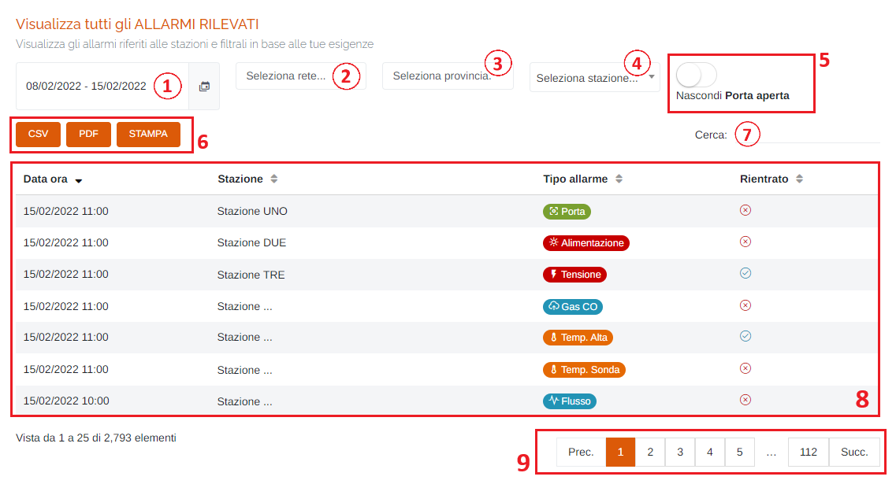

# DATI - ALLARMI

Per poter accedere a questa sezione occorre cliccare sulla voce "Dati" posta nel menu principale di sinistra ed in seguito cliccare sull'elemento "Allarmi".

<h3>
    > Dati 
    &nbsp;&nbsp;&nbsp;&nbsp;&nbsp;&nbsp;&nbsp;&nbsp; <i>o</i> Allarmi
</h3>

Questa pagina permette di visualizzare gli allarmi riferiti alle stazioni e filtrali in base alle proprie esigenze.

1. Periodo temporale:

    Attraverso questo strumento è possibile impostare il periodo temporale per la visualizzazione dei dati.

    È importante ricordare che, per impostare il periodo, è SEMPRE NECESSARIO CLICCARE DUE VOLTE, una per il giorno d'inizio e una per il giorno di fine.

    Una volta selezionato il periodo, premere il pulsante Applica per completare l'operazione.

    

    &nbsp;&nbsp;&nbsp;&nbsp;&nbsp;&nbsp;a. Data d'inizio; 
    &nbsp;&nbsp;&nbsp;&nbsp;&nbsp;&nbsp;b. Data di fine; 
    &nbsp;&nbsp;&nbsp;&nbsp;&nbsp;&nbsp;c. Pulsante <u>Applica</u>; 
    &nbsp;&nbsp;&nbsp;&nbsp;&nbsp;&nbsp;d. Pulsante <u>Annulla</u>: chiude la finestra del periodo temporale; 
    &nbsp;&nbsp;&nbsp;&nbsp;&nbsp;&nbsp;e. Calendario mese precedente; 
    &nbsp;&nbsp;&nbsp;&nbsp;&nbsp;&nbsp;f. Calendario mese corrente. 

2. Elenco reti disponibili sul portale;
3. Elenco province disponibili sul portale;
4. Elenco stazioni disponibili sul portale;

    

5. Pulsante <u>Nascondi Porta Aperta</u>: se attivato, gli allarmi di tipo "Porta Aperta" non verranno visualizzati nella tabella sottostante:

    Attivo -> </img>

    Disattivo -> </img>

6. Pulsanti <u>CSV</u> - <u>PDF</u> - <u>STAMPA</u> : è possibile scaricare l'elenco dei dissesti sottostanti in due formati, CSV e PDF, oppure stamparlo direttamente;
7. <u>Filtro di ricerca nella tabella</u>: la ricerca viene effettuata su tutte le colonne;
8. Tabella degli allarmi: verranno visualizzate le seguenti informazioni:

    * Data/ora;
    * Stazione;
    * Tipo di allarme:

        * </img>
        * </img>
        * </img>
        * </img>
        * </img>
        * </img>
        * </img>

    * Se l'allarme è rientrato oppure no: Rientrato -> </img> | Non rientrato -> </img>;

9. Esplorazione delle pagine;

