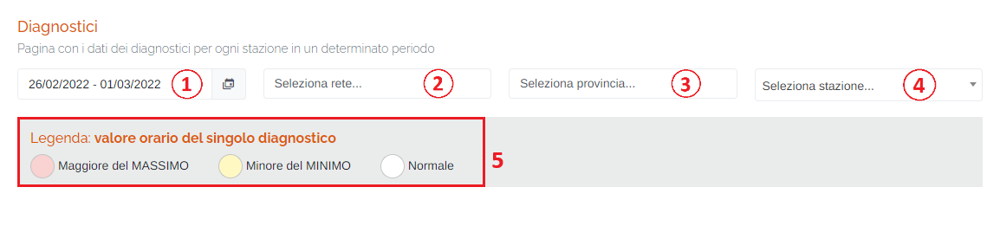
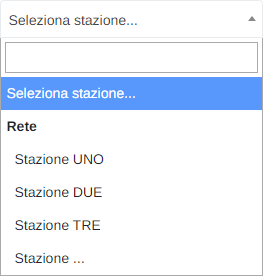
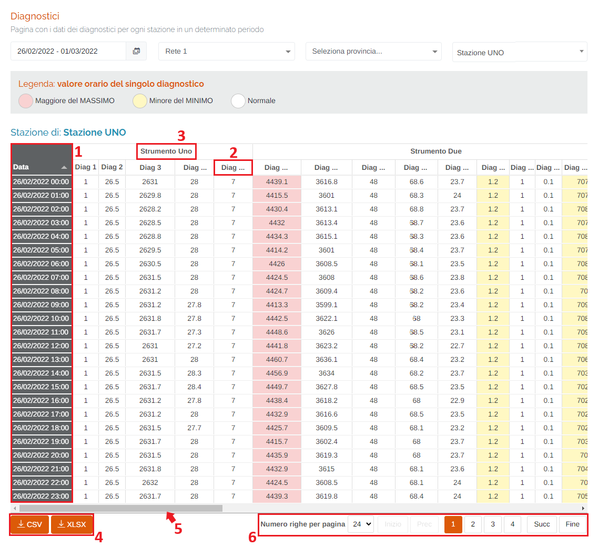

# DATI - DIAGNOSTICI

Per poter accedere a questa sezione occorre cliccare sulla voce "Dati" posta nel menu principale di sinistra ed in seguito cliccare sull'elemento "Diagnostici".

<h3>
    > Dati 
    &nbsp;&nbsp;&nbsp;&nbsp;&nbsp;&nbsp;&nbsp;&nbsp; <i>o</i> Diagnostici
</h3>

Questa pagina permette di visualizzare, in un determinato periodo temporale impostato dall'utente, i valori orari dei diagnostici di una determinata stazione, disponibile tra quelle associate al portale.

1. Periodo temporale;

    Attraverso questo strumento è possibile impostare il periodo temporale per la visualizzazione dei report.

    È importante ricordare che, per impostare il periodo, è SEMPRE NECESSARIO CLICCARE DUE VOLTE, una per il giorno d'inizio e una per il giorno di fine.

    Una volta selezionato il periodo, premere il pulsante Applica per completare l'operazione.

    

    &nbsp;&nbsp;&nbsp;&nbsp;&nbsp;&nbsp;a. Data d'inizio; 
    &nbsp;&nbsp;&nbsp;&nbsp;&nbsp;&nbsp;b. Data di fine; 
    &nbsp;&nbsp;&nbsp;&nbsp;&nbsp;&nbsp;c. Pulsante <u>Applica</u>; 
    &nbsp;&nbsp;&nbsp;&nbsp;&nbsp;&nbsp;d. Pulsante <u>Annulla</u>: chiude la finestra del periodo temporale; 
    &nbsp;&nbsp;&nbsp;&nbsp;&nbsp;&nbsp;e. Calendario mese precedente; 
    &nbsp;&nbsp;&nbsp;&nbsp;&nbsp;&nbsp;f. Calendario mese corrente. 

2. Elenco reti disponibili sul portale;

3. Elenco province disponibili sul portale;

4. Elenco/ricerca stazioni disponibili sul portale;

    

5. Legenda dei colori della tabella delle percentuali dei dati;

    

Una volta selezionati la stazione e il periodo temporale verrà visualizzata la tabella dei dati.

## Tabella dei dati diagnostici

La tabella sarà formata da 24 righe (una per ogni ora) e tante colonne quanti sono i diagnostici degli strumenti presenti nella stazione. Le colonne sono raggruppate per ogni strumento. Se il periodo temporale selezionato è maggiore di una giornata, sarà possibile visualizzare le giornate successive attraverso la paginazione posta in basso a destra.

Nel caso in cui la cella del singolo dato sia colorata in rosso, il valore dello stesso è maggiore del massimo preimpostato nel database per quel diagnostico. Allo stesso modo, se la cella del singolo dato è colorata in giallo, il valore dello stesso è minore del minimo. Infine, se la cella non presenta colorazioni, il valore è da considerarsi nella norma.

1. Colonna <u>Data</u>;
2. Diagnostici dello strumento;
3. Strumenti presenti nella stazione;
4. Pulsanti <u>CSV</u> e <u>XLSX</u>: è possibile scaricare la tabella e i relativi dati in formato .csv lo .xlsx;
5. Barra di scorrimento: occorre spostarla verso destra per visualizzare tutti gli strumenti presenti nella pagina della tabella;
6. È possibile impostare il numero di righe visualizzate tramite il menu a tendina ed esplorare le pagine;

