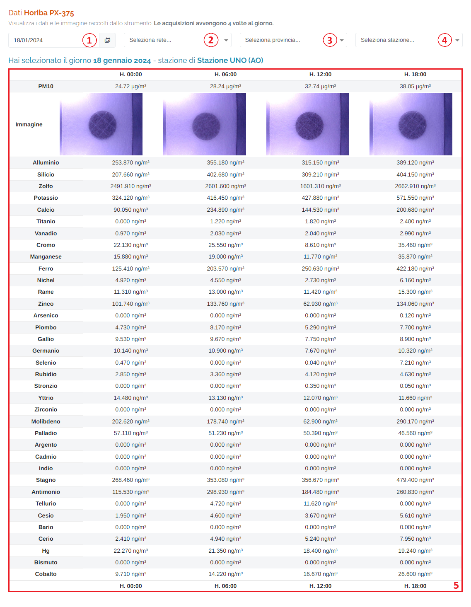

# DATI - IMMAGINI HORIBA

Per poter accedere a questa sezione occorre cliccare sulla voce "Dati" posta nel menu principale di sinistra ed in seguito cliccare sull'elemento "Immagini Horiba".

<h3>
    > Dati 
    &nbsp;&nbsp;&nbsp;&nbsp;&nbsp;&nbsp;&nbsp;&nbsp; <i>o</i> Immagini Horiba
</h3>

Questa pagina permette di visualizzare i dati e le immagini raccolti dallo strumento **Horiba PX-375** in corrispondenza delle acquisizioni effettuate (4 volte al giorno).

1. Data: verrà visualizzato il seguente form per la selezione della data:

    

    1. Mese precedente;
    2. Mese successivo;
    3. Anno precedente;
    4. Anno successivo;
    5. Scelta del giorno;
    6. Pulsanti 'Annulla' (ritorna alla schermata precedente) e 'OK' (imposta la data selezionata);

2. Selezione della rete (filtro per la tabella sottostante);
3. Selezione della provincia (filtro per la tabella sottostante);
4. Selezione della stazione (filtro per la tabella sottostante);
5. Tabella dei dati: vengono visualizzati i valori del PM10, dei metalli e l'immagine acquisita nella relativa ora.

