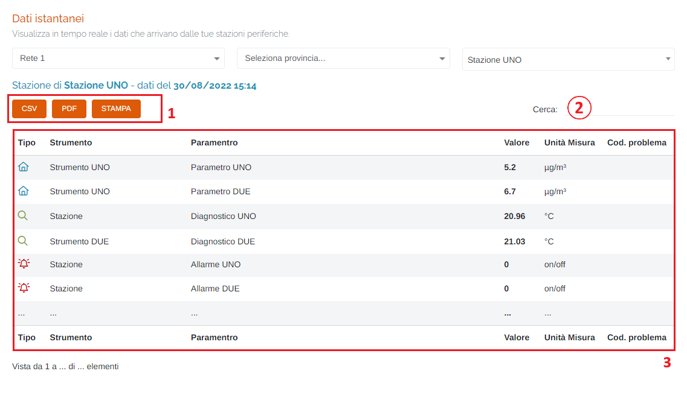

# DATI - DATI ISTANTANEI

Per poter accedere a questa sezione occorre cliccare sulla voce "Dati" posta nel menu principale di sinistra ed in seguito cliccare sull'elemento "Dati istantanei".

<h3>
    > Dati 
    &nbsp;&nbsp;&nbsp;&nbsp;&nbsp;&nbsp;&nbsp;&nbsp; <i>o</i> Dati istantanei
</h3>

Tramite questa pagina sarà possibile visualizzare, in tempo reale, i dati che arrivano dalle stazioni periferiche della propria rete di appartenenza;

1. Selezionare la rete;
2. Selezionare la provincia;
3. Selezionare la stazione

    

    Una volta impostati i filtri e scelta la stazione, verrà visualizzata la tabella dei dati istantanei:

    

4. Pulsanti <u>CSV</u> - <u>PDF</u> - <u>STAMPA</u> : è possibile scaricare l'elenco delle stazioni sottostanti in due formati, CSV e PDF, oppure stamparlo direttamente;
5. Filtro di ricerca nella tabella: la ricerca viene effettuata su tutte le colonne;
6. Tabella dei dati;

    * <u>Parametri</u> --> </img>
    * <u>Diagnostici</u> --> </img>
    * <u>Allarmi</u> --> </img>

