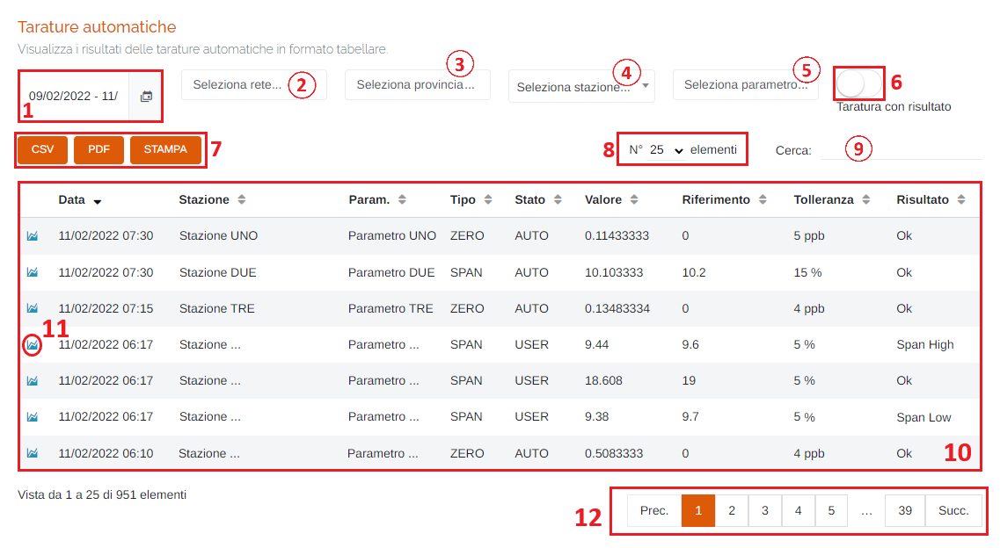
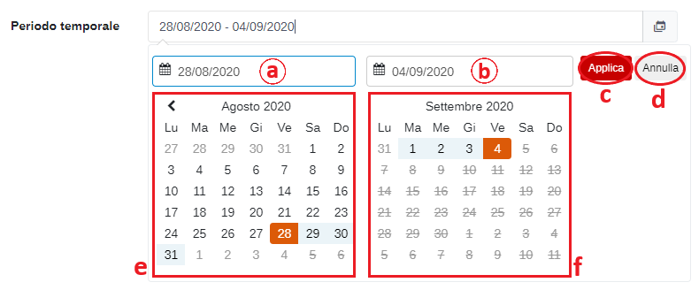
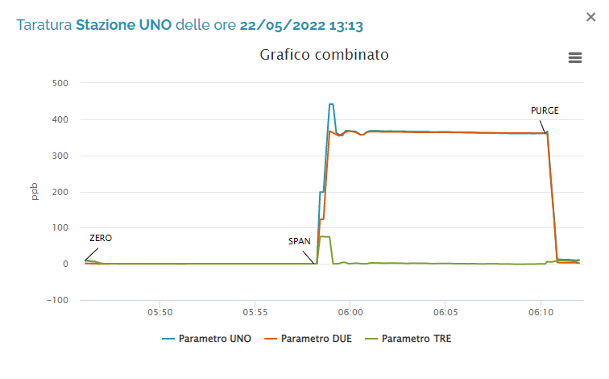

# DATI - TARATURE AUTOMATICHE

Per poter accedere a questa sezione occorre cliccare sulla voce "Dati" posta nel menu principale di sinistra ed in seguito cliccare sull'elemento "Tarature automatiche".

<h3>
    > Dati 
    &nbsp;&nbsp;&nbsp;&nbsp;&nbsp;&nbsp;&nbsp;&nbsp; <i>o</i> Tarature automatiche
</h3>

Questa pagina permette di visualizzare i risultati delle tarature automatiche in formato tabellare, oppure guardare tutte le tarature che sono state effettuate in una singola giornata. Inoltre, è possibile visualizzare il grafico con il risultato delle singole tarature automatiche.

1. Periodo temporale:

    Attraverso questo strumento è possibile impostare il periodo temporale per la visualizzazione dei dati.

    È importante ricordare che, per impostare il periodo, è SEMPRE NECESSARIO CLICCARE DUE VOLTE, una per il giorno d'inizio e una per il giorno di fine.

    Una volta selezionato il periodo, premere il pulsante Applica per completare l'operazione.

    

    &nbsp;&nbsp;&nbsp;&nbsp;&nbsp;&nbsp;a. Data d'inizio; 
    &nbsp;&nbsp;&nbsp;&nbsp;&nbsp;&nbsp;b. Data di fine; 
    &nbsp;&nbsp;&nbsp;&nbsp;&nbsp;&nbsp;c. Pulsante <u>Applica</u>; 
    &nbsp;&nbsp;&nbsp;&nbsp;&nbsp;&nbsp;d. Pulsante <u>Annulla</u>: chiude la finestra del periodo temporale; 
    &nbsp;&nbsp;&nbsp;&nbsp;&nbsp;&nbsp;e. Calendario mese precedente; 
    &nbsp;&nbsp;&nbsp;&nbsp;&nbsp;&nbsp;f. Calendario mese corrente. 

2. Elenco delle reti disponibili sul portale;
3. Elenco province disponibili sul portale;
4. Elenco stazioni disponibili sul portale;

    

5. Seleziona parametro;
6. Pulsante <u>Taratura con risultato</u>: se attivato, verranno visualizzate solo le tarature che presentano un risultato nella colonna 'Risultato':

    Attivo -> </img>

    Disattivo -> </img>

7. Pulsanti <u>CSV</u> - <u>PDF</u> - <u>STAMPA</u> : è possibile scaricare l'elenco dei dissesti sottostanti in due formati, CSV e PDF, oppure stamparlo direttamente;
8. Numero di elementi della tabella per pagina: cliccando sulla freccia è possibile modificare la quantità ;
9. <u>Filtro di ricerca nella tabella</u>: la ricerca viene effettuata su tutte le colonne;
10. Tabella delle tarature automatiche: verranno visualizzate le seguenti informazioni:

    * Data;
    * Stazione;
    * Parametro;
    * Tipo di taratura;
    * Stato della taratura;
    * Valore;
    * Riferimento;
    * Tolleranza;
    * Risultato;

11. </u>Visualizza grafico</u>: cliccando il pulsante </img> è possibile visualizzare il grafico della taratura automatica selezionata:

    

    Inoltre, cliccando il pulsante </img> è possibile effettuare il download del grafico in formato JPEG, oppure i dati in formato CSV.

    Infine, è possibile attivare/disattivare le linee del grafico di un determinato dato cliccando sul parametro nella legenda posta in basso sotto al grafico.

12. Esplorazione delle pagine;

