# DATI - VALIDAZIONE MULTILIVELLO

Per poter accedere a questa sezione occorre cliccare sulla voce "Dati" posta nel menu principale di sinistra ed in seguito cliccare sull'elemento "Validazione multilivello".

<h3>
    > Dati 
    &nbsp;&nbsp;&nbsp;&nbsp;&nbsp;&nbsp;&nbsp;&nbsp; <i>o</i> Validazione multilivello
</h3>

La pagina è suddivisa in tre macro sezioni:

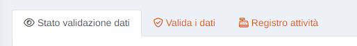

## Stato validazione dati

In questa sezione è possibile visualizzare le percentuali per livello e parametro dello stato di validazione multilivello, in modo grafico oppure tabellare.

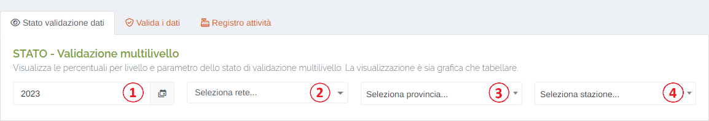

1. Selezione dell'anno che si intende visualizzare;
2. Filtro per rete;
3. Filtro per provincia;
4. Selezione della stazione di cui si intende visualizzare le percentuali;

Una volta selezionata la stazione, per la scheda "Tabelle", verranno visualizzate 4 tabelle contenenti le percentuali mensili dei dati, una per ogni livello di validazione:

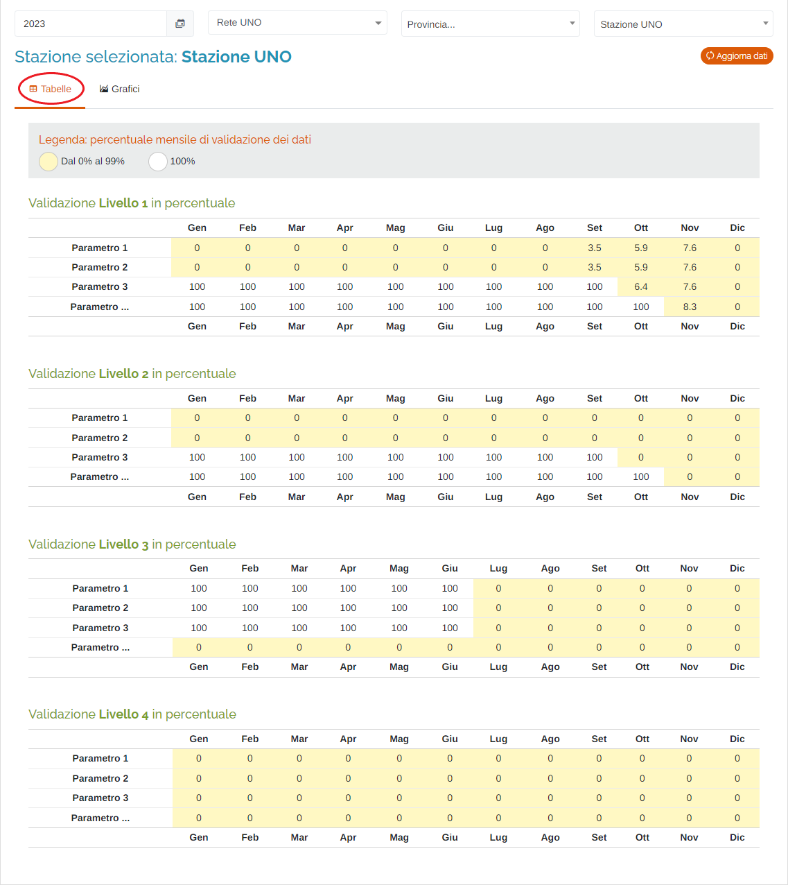

Oppure, se selezionata la scheda "Grafici", verranno visualizzati i grafici per ogni parametro della stazione visualizzata. Ogni grafico può essere visualizzato a schermo intero, stampato, oppure scaricato in diversi formati. Inoltre, sempre per ogni grafico, è possibile attivare/disattivare la visualizzazione di ogni singolo livello e, passando sopra al grafico con il cursore del mouse, visualizzare il dettaglio delle percentuali.

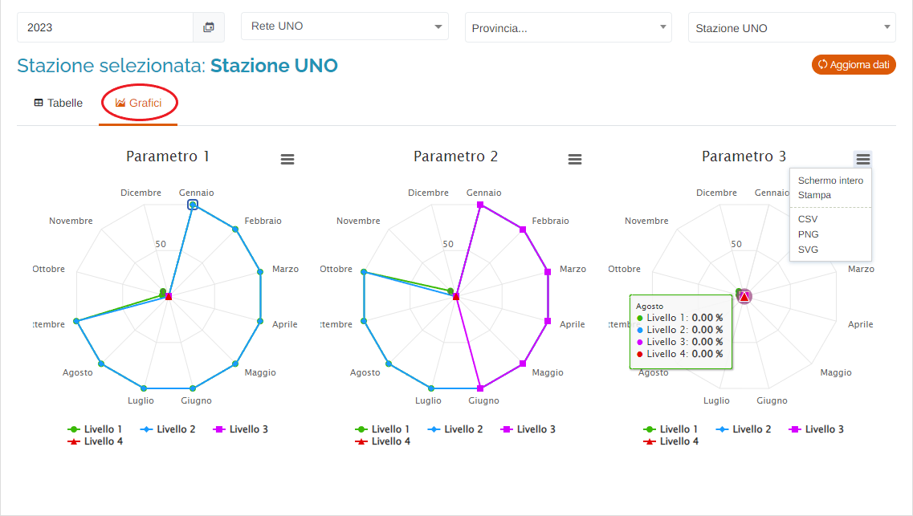

Infine, cliccando il pulsante </img>, è possibile aggiornare i dati visualizzati nelle tabelle/nei grafici recuperando gli ultimi disponibili dal database, consentendo di visualizzare le ultime validazioni effettuate, anche in tempo reale.

## Valida i dati

Questa sezione permette all'utente di visualizzare, effettuare e verificare le validazioni dei dati per i 4 livelli di validazione, impostati nella sezione "Admin" del portale, per un determinato periodo temporale, per determinate stazioni e i relativi parametri.

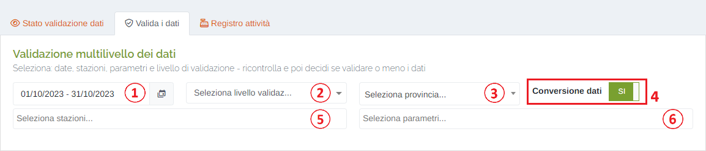

1. Periodo temporale:

    Attraverso questo strumento è possibile impostare il periodo temporale per la visualizzazione dei dati.

    È importante ricordare che, per impostare il periodo, è SEMPRE NECESSARIO CLICCARE DUE VOLTE, una per il giorno d'inizio e una per il giorno di fine.

    Una volta selezionato il periodo, premere il pulsante Applica per completare l'operazione.

    

    &nbsp;&nbsp;&nbsp;&nbsp;&nbsp;&nbsp;&nbsp;a. Valori preimpostati OPPURE personalizzati dall'utente; 
    &nbsp;&nbsp;&nbsp;&nbsp;&nbsp;&nbsp;&nbsp;b. Pulsante per visualizzare il mese precedente; 
    &nbsp;&nbsp;&nbsp;&nbsp;&nbsp;&nbsp;&nbsp;c. Pulsante per visualizzare il mese successivo. 
    &nbsp;&nbsp;&nbsp;&nbsp;&nbsp;&nbsp;&nbsp;d. Calendario mese precedente; 
    &nbsp;&nbsp;&nbsp;&nbsp;&nbsp;&nbsp;&nbsp;e. Calendario mese successivo. 
    &nbsp;&nbsp;&nbsp;&nbsp;&nbsp;&nbsp;&nbsp;f. Pulsante <u>Annulla</u>: chiude la finestra del periodo temporale; 
    &nbsp;&nbsp;&nbsp;&nbsp;&nbsp;&nbsp;&nbsp;g. Pulsante <u>Applica</u>; 

2. Selezionare il livello di validazione da verificare/utilizzare;
3. Filtro per provincia;
4. Pulsante <u>Conversione dati</u>: attivando la conversione dei dati, il sistema applicherà il fattore di conversione impostato per il/i parametro/i presente/i sulla/e stazione/i selezionata/e:

    * </img> --> Parametro/i convertiti

    * </img> --> Parametro/i non convertiti

5. Selezionare la/e stazione/i da verificare/utilizzare (possibile scelta multipla);
6. Selezionare il/i parametro/i da verificare/utilizzare (possibile scelta multipla);

Una volta impostati tutti i filtri, il sistema produrrà la seguente tabella:

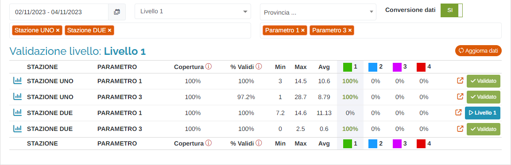

Nel dettaglio:

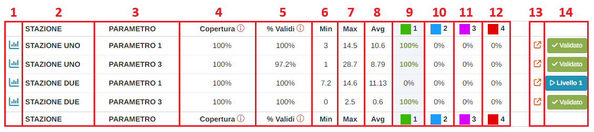

1. Pulsante </img> : tramite questo pulsante è possibile visualizzare il grafico del parametro selezionato, per il periodo temporale selezionato in precedenza:

    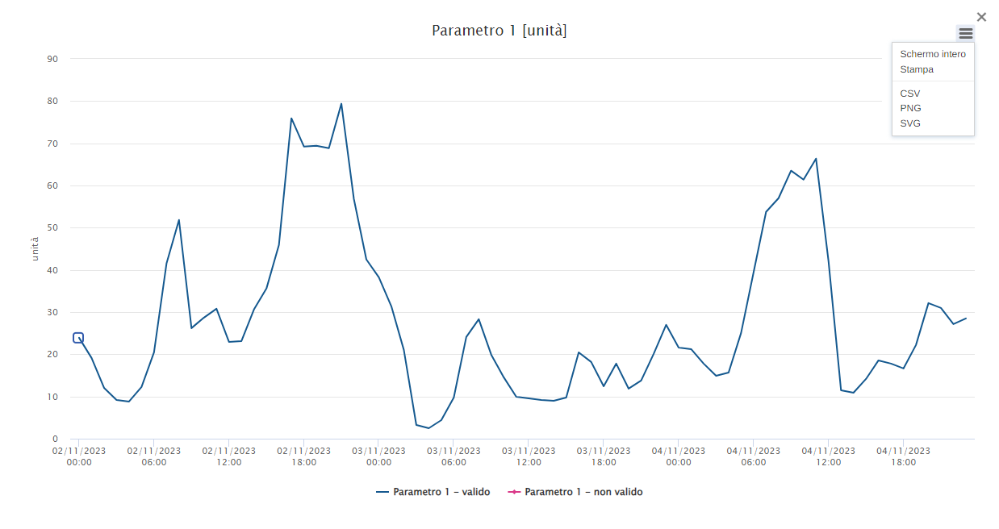

    Il grafico può essere visualizzato a schermo intero, stampato, oppure scaricato in diversi formati. Inoltre, è possibile attivare/disattivare la visualizzazione delle serie di dati e, passando sopra al grafico con il cursore del mouse, visualizzarne il dettaglio.

    Infine, facendo click con il mouse tenendo premuto il tasto "CTRL" della tastiera su un dato della serie, è possibile visualizzarne il dettaglio all'interno dello strumento "Validazione" (verrà aperta una nuova scheda del browser alla pagina "Dati > Validazione" del portale) nella fascia temporale da 24 ore prima a 24 ore dopo.

    

2. Nome della stazione;
3. Nome del parametro;
4. <u>Copertura</u>: questa colonna indica la percentuale di dati presenti sul totale dei dati attesi;
5. <u>% Validi</u>: questa colonna indica la percentuale di dati validi sul totale dei dati attesi;
6. Valore minimo dei dati presenti;
7. Valore massimo dei dati presenti;
8. Valore medio dei dati presenti;
9. Colonna 1° livello di validazione: quando selezionato nei filtri visti in precedenza lo sfondo della colonna sarà di colore grigio;
10. Colonna 2° livello di validazione: quando selezionato nei filtri visti in precedenza lo sfondo della colonna sarà di colore grigio;
11. Colonna 3° livello di validazione: quando selezionato nei filtri visti in precedenza lo sfondo della colonna sarà di colore grigio;
12. Colonna 4° livello di validazione: quando selezionato nei filtri visti in precedenza lo sfondo della colonna sarà di colore grigio;
13. Pulsante </img> : tramite questo pulsante è possibile visualizzare il parametro selezionato all'interno dello strumento "Validazione" (verrà aperta una nuova scheda del browser alla pagina "Dati > Validazione" del portale) con il periodo temporale già impostato in base a quello selezionato in precedenza nei filtri;
14. Pulsanti di validazione:

    * </img> : questo pulsante indica che i dati visualizzati sono già stati validati per il livello selezionato in precedenza nei filtri. Passando sopra con il cursore del mouse si noterà che non è possibile effettuare il click poiché i dati sono già validati.

    * </img> : tramite questo pulsante è possibile effettuare la validazione dei dati visualizzati per il livello selezionato in precedenza nei filtri.

        Una volta cliccato il pulsante, verrà visualizzato il seguente messaggio di conferma con le informazioni relative a quale parametro, livello e periodo si sta effettuando la validazione:

        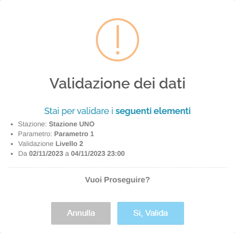

        Cliccare "Si, Valida" per confermare l'operazione.

        Qualora si stia cercando di effettuare l'operazione per un certo livello, ma la validazione dei livelli inferiori al corrente non è ancora stata completata, il sistema renderà nota questa informazione all'utente in fase di conferma:

        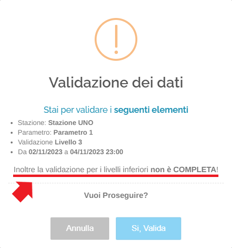

        Se l'operazione è andata a buon fine verrà visualizzato il seguente messaggio:

        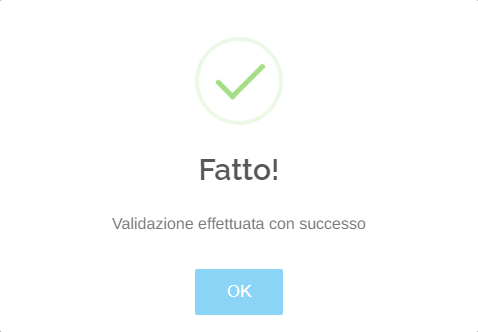

        Infine, qualora si stia cercando di effettuare l'operazione per un certo livello, ma la validazione è già stata effettuata per un livello superiore al corrente, non verrà effettuata alcuna modifica e verrà visualizzato il seguente messaggio:

        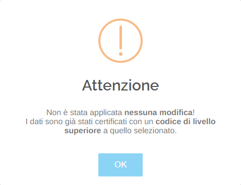

## Registro attività

In questa sezione è possibile visualizzare il registro delle attività eseguite dagli utenti relative alla validazione multilivello.

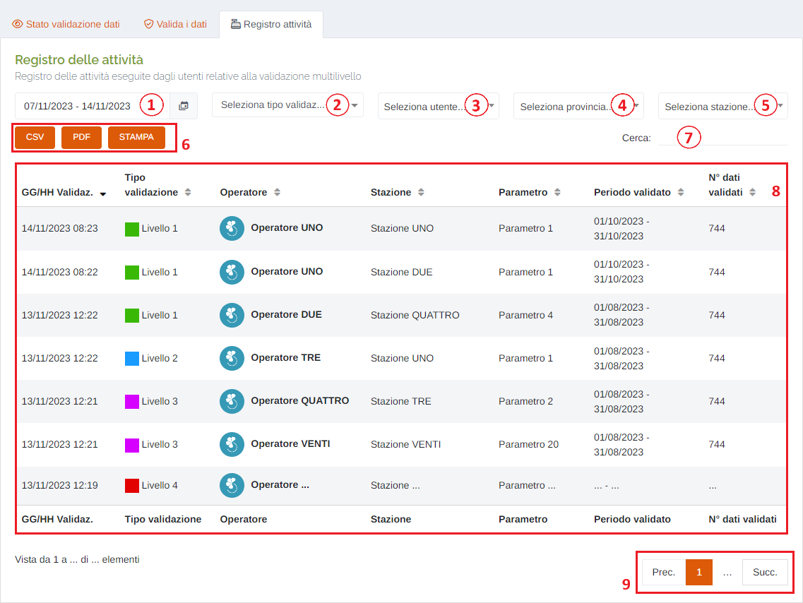

1. Periodo temporale (come sopra);
2. Filtro per tipo di validazione;
3. Filtro per operatore;
4. Filtro per provincia;
5. Filtro per stazione;
6. Pulsanti <u>CSV</u> - <u>PDF</u> - <u>STAMPA</u> : è possibile scaricare l'elenco delle attività sottostanti in due formati, CSV e PDF, oppure stamparlo direttamente;
7. <u>Filtro di ricerca nella tabella</u>: la ricerca viene effettuata su tutte le colonne;
8. Tabella delle attività;
9. Esplorazione delle pagine;

