# DATI - VALIDAZIONE

Per accedere alla sezione dedicata alla validazione dei dati delle stazioni, cliccare nel menu laterale sulla voce "Dati" e selezionare "Validazione".

<h3>
    > Dati 
    &nbsp;&nbsp;&nbsp;&nbsp;&nbsp;&nbsp;&nbsp;&nbsp; <i>o</i> Validazione
</h3>

Verrà visualizzata la schermata principale dello strumento Validazione.

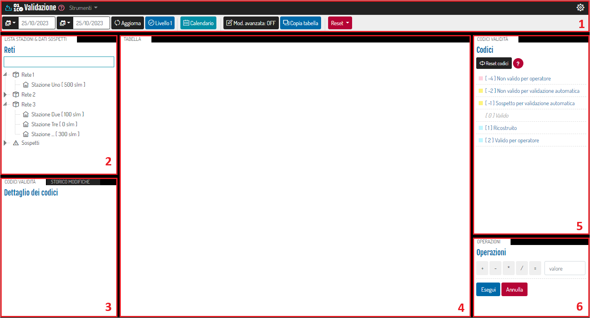

1. <u>Menu di Validazione</u>: vedi "Menu di Validazione";
2. <u>Lista stazioni & dati sospetti</u>: in questa sezione vengono elencate, organizzate ad albero, le stazioni, raggruppate per rete di appartenenza, e i dati identificati automaticamente come sospetti.

    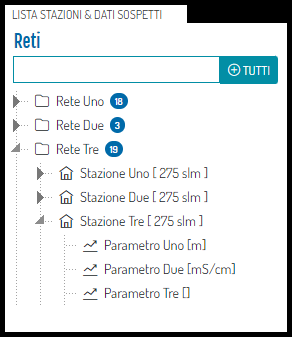

    È possibile modificare questa sezione rendendo possibile la selezione per parametro:

    - Dal menu a tendina "Strumenti", cliccare 'Opzioni'.

        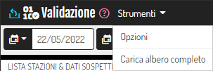

    - Attivare l'opzione 'Visualizza per parametro' e cliccare su 'Applica in locale'.

        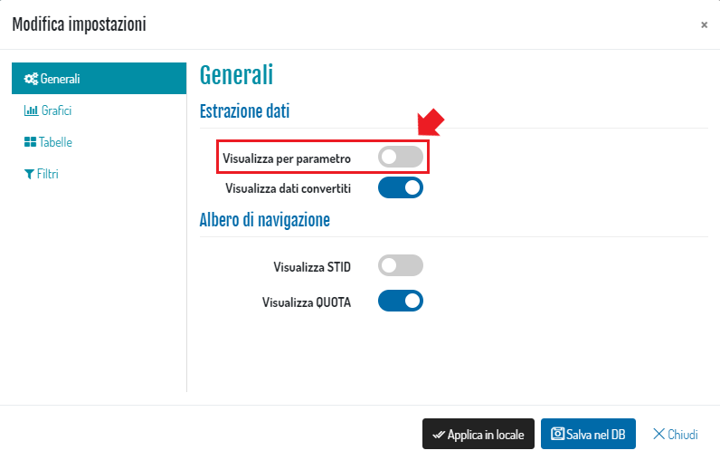

    - E così verranno visualizzati i parametri

        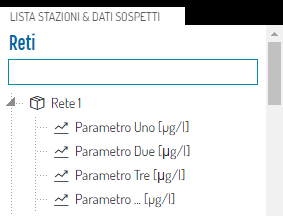

3. <u>Dettaglio codici & storico modifiche</u>: in questa sezione è possibile visualizzare, una volta selezionato il dato dalla tabella posta al centro (punto 4.), il dettaglio dei codici attualmente applicati al valore (tab "Codici validità") e il dettaglio delle modifiche effettuate sul dato scelto, sia come valore sia come codice applicato, sotto forma di "storico" (tab. "Storico modifiche"):

    * Dettaglio dei codici

        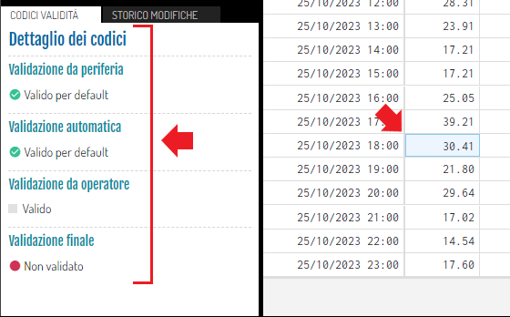
        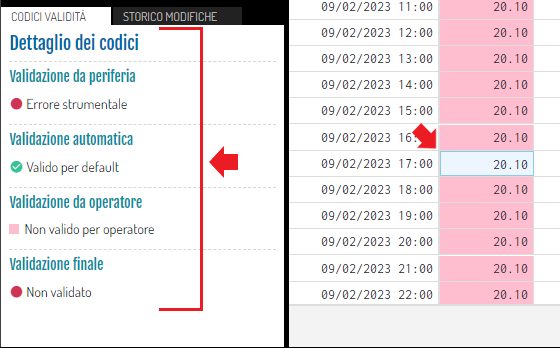

    * Dettaglio delle modifiche

        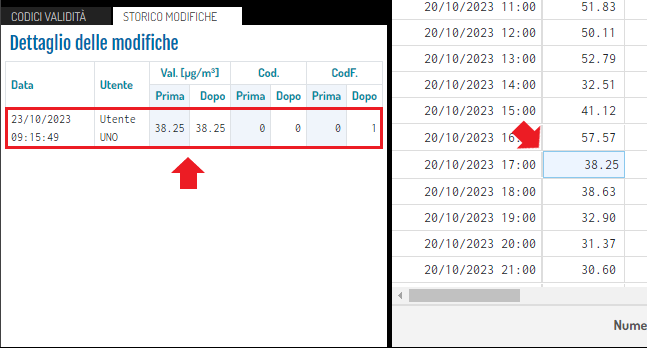

4. <u>Schermata di visualizzazione tabellare dei dati</u>: in questa sezione vengono visualizzati i dati, in formato tabellare, della stazione selezionata;

    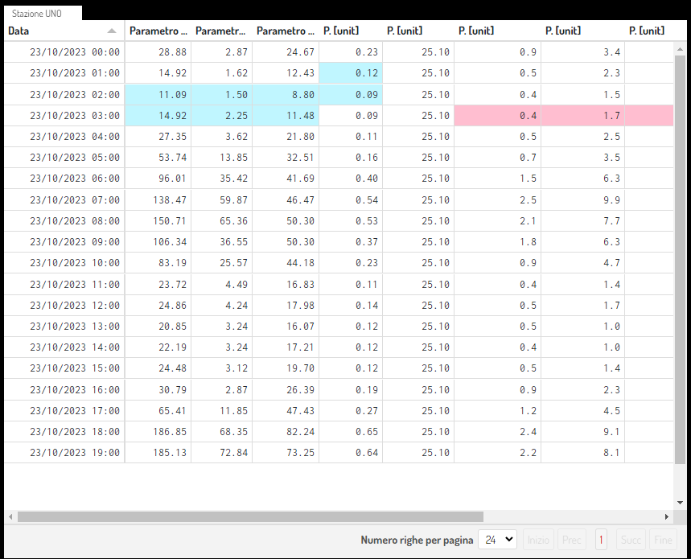

    La schermata di default visualizzerà i dati del giorno precedente a quello odierno dalle ore 00 (mezzanotte) alle ore 23.

    Qualora si selezioni un periodo più esteso di un giorno, sarà possibile selezionare il numero di righe per pagina tra dei multipli di 24, così da poter selezionare 2, 3 o 4 giorni.

    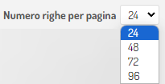

    Per validare un dato, selezionare la cella corrispondente, oppure cliccare e trascinare per selezionare più celle in una volta sola

    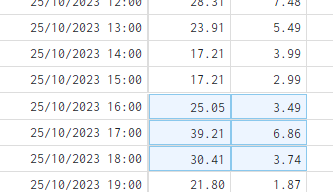

    e successivamente selezionare il codice desiderato dall'elenco di quelli disponibili posto alla destra della tabella (punto 5.).

    Per modificare un dato, effettuare doppio click sulla cella selezionata (il dato sarà disponibile per la modifica)

    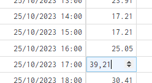

    e successivamente modificare il dato inserendo un nuovo valore, oppure utilizzando gli appositi pulsanti "Su" e "Giù".

    Per effettuare modifiche su più dati contemporaneamente, selezionare le celle desiderate e utilizzare la schemata delle "Operazioni" (punto 6.).

    Infine, per effettuare validazioni o modifiche su grandi moli di dati, è possibile utilizzare lo strumento  (vedi "Calendario") oppure lo strumento  (vedi "Modalità Avanzata").

    Quando uno o più dati della tabella appaiano in grassetto:

    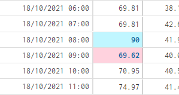

    Significa che sono state apportate modifiche (validazione/operazione) e, una volta aggiornata la tabella tramite il tasto 'Aggiorna' in alto, torneranno normali.

    Inoltre, possono avere colori diversi in base ai codici di validazione apportati ai dati (punto 5.). Se il dato è valido, di default la cella è di colore bianco.

    Facendo click con il tasto destro del mouse sulla cella di un dato è possibile visualizzare il grafico del dettaglio nella fascia temporale da 24 ore prima a 24 ore dopo.

    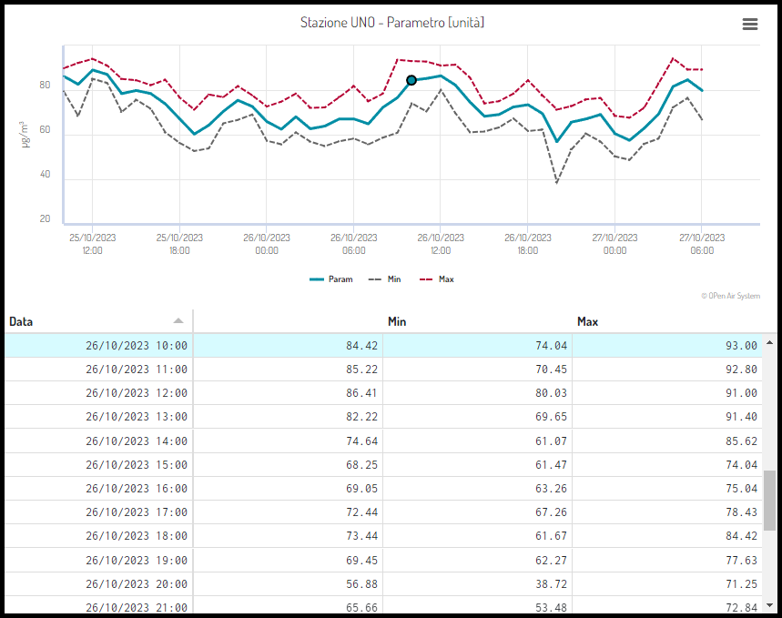

    Infine, mediante il bottone posto in alto a destra del grafico è possibile visualizzare a schermo intero e stampare il grafico.

    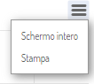

5. <u>Codici validità</u>: elenco dei codici di validità disponibili;

    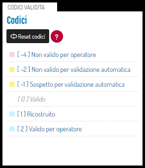

    Dopo aver selezionato dalla tabella il/i dato/dati, cliccare il codice di validazione che si vuole applicare.

    Quando si vogliono assegnare più codici ad un/dei dato/dati, bisognerà selezionare nuovamente il/i dato/dati nella tabella applicando una validazione alla volta.

    Infine, cliccando il pulsante </img> verrà visualizzato l'elenco dei codici di validazione impostati per il portale.

6. <u>Operazioni</u>: da questa sezione è possibile applicare ed effettuare delle operazioni ad uno o più dati selezionati nella tabella principale.

    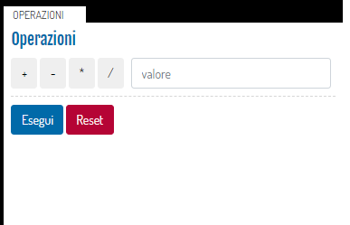

    Dopo aver selezionato dalla tabella il/i dato/dati che serve/servono, scegliere una delle quattro operazioni, inserire il valore e, infine, cliccare il tasto 'Esegui'.

    Esattamente come accade per i codici di validità, anche le operazioni possono essere fatte una alla volta selezionando nuovamente dalla tabella il dato che si intende modificare.

## Menu di Validazione

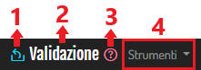

1. Torna al portale;
2. Torna alla pagina iniziale di Validazione;
3. Accedi alla documentazione (questa pagina);

### Menu principale - *Strumenti*

* <u>Opzioni</u>:

    Tutte le impostazioni che si andranno a modificare in questa voce possono essere applicate in maniera temporanea (pulsante "Applica in locale") o salvate nel database (pulsante "Salva nel DB") in modo tale da ritrovarle ad un successivo accesso alla sezione. Le impostazioni sono per utente e quindi le modifiche di uno non andranno ad influenzare gli altri utenti.

    * <u>Generali</u>: in questo menu è possibile visualizzare i dati grezzi, andando a disattivare l'interruttore 'Visualizza dati convertiti', attivare/disattivare la visualizzazione dell'STID (ID della stazione), della QUOTA cliccando sul relativo bottone;

        

    * <u>Grafici</u>: in questa sezione è possibile personalizzare il layout dei grafici visualizzati;

        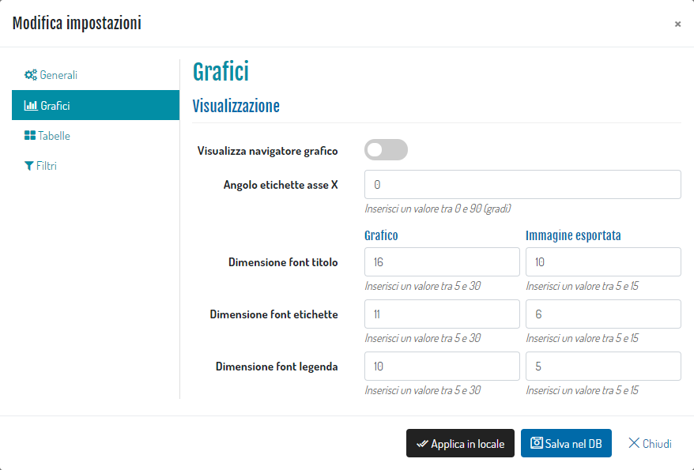

    * <u>Tabelle</u>: in questa sezione è possibile attivare/disattivare i filtri di visualizzazione;

        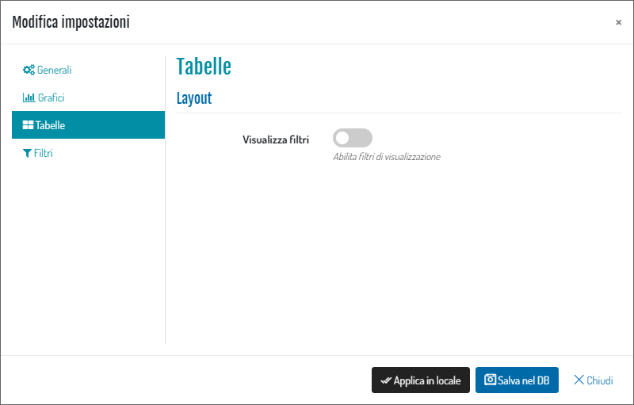

        Attraverso i filtri è possibile effettuare delle ricerche di determinati valori all'interno della tabella visualizzata:

        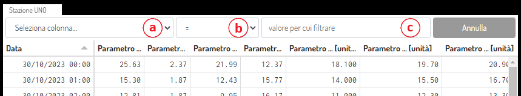

        1. Selezionare la colonna che si intende filtrare;
        2. Selezionare l'operazione di ricerca tra quelle disponibili:

            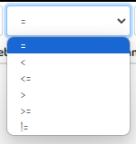

        3. Inserire il valore per cui filtrare;

        Di seguito un esempio:

        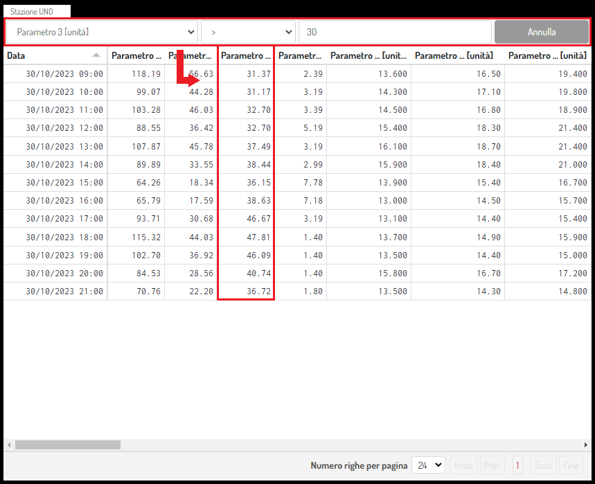

        Cliccando il pulsante "Annulla" verranno resettati tutti i filtri e si visualizzerà nuovamente l'intera tabella.

    * <u>Filtri</u>: ###

* <u>Carica albero completo</u>: cliccando su questa voce è possibile caricare velocemente tutto l'albero delle stazioni/parametri. Per confermare l'azione, cliccare su "Si, carica!".

    

### Menu secondario - Filtri e operazioni

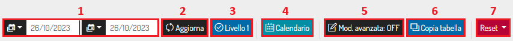

1. <u>Data inizio/fine</u>: selezionare il periodo temporale in cui verranno visualizzati i dati;

    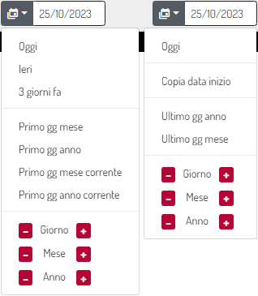

2. Pulsante : aggiorna i tab sulla base delle date e della fascia temporale richiesta;
3. Pulsante : contrassegna come validati tutti i parametri visualizzati;
4. Pulsante : cliccando questo pulsante è possibile effettuare la validazione dei parametri, oppure delle operazioni, tramite calendario:

    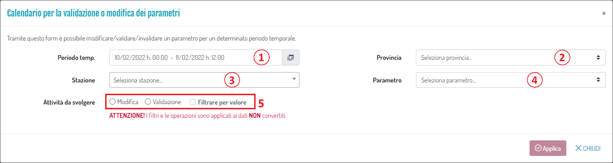

    1. Periodo temporale:

        Attraverso questo strumento è possibile impostare il periodo temporale.

        È importante ricordare che, per impostare il periodo, è SEMPRE NECESSARIO CLICCARE DUE VOLTE, una per il giorno d'inizio e una per il giorno di fine (il calendario di sinistra si riferisce alla data d'inizio, mentre quello di destra alla data di fine).

        Per impostare l'orario, selezionare i minuti e le ore dai menu a tendina (quelli di sinistra si riferiscono all'ora d'inizio, mentre quelli di destra all'ora di fine).

        Per confermare il periodo cliccare il pulsante "Applica".

        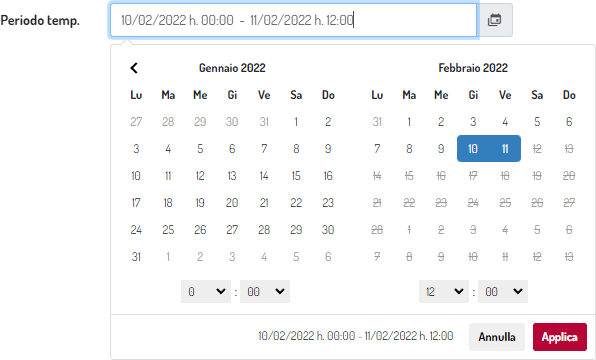

    2. Seleziona la provincia;
    3. Seleziona la stazione;
    4. Seleziona il parametro;
    5. Attività da svolgere: selezionare l'attività da svolgere nel periodo temporale impostato al punto 1:

        * Modifica dei dati

            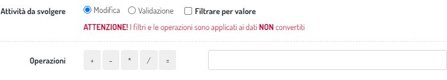

        * Validazione dei dati

            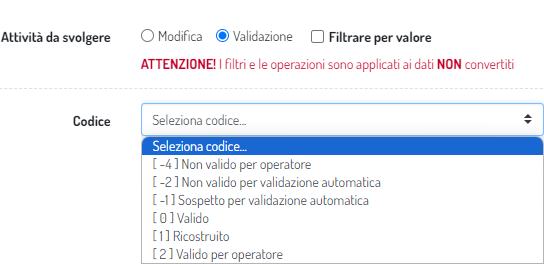

        Attivando "Filtrare per valore" è possibile selezionare i dati da modificare/validare in maniera ancora più precisa:

        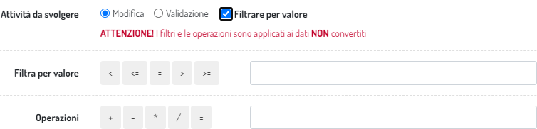

5. Pulsante : attiva la modalità avanzata per inserimento/modifica dei dati (vedi "Modalità avanzata");
6. Pulsante : cliccando questo pulsante è possibile copiare la tabella visualizzata negli appunti (clipboard) del PC, rendendo possibile incollarla su un foglio di calcolo, come ad esempio Excel;
7. Pulsante : resetta i tab (svuota), o quello attivo, o tutti quelli presenti attualmente;

    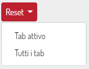

## Modalità avanzata

Cliccando il pulsante  verrà abilitata la modalità avanzata la tabella visualizzata si colorerà di rosso, li linee diventeranno tratteggiate e verranno aggiunti dei pulsanti al menù:

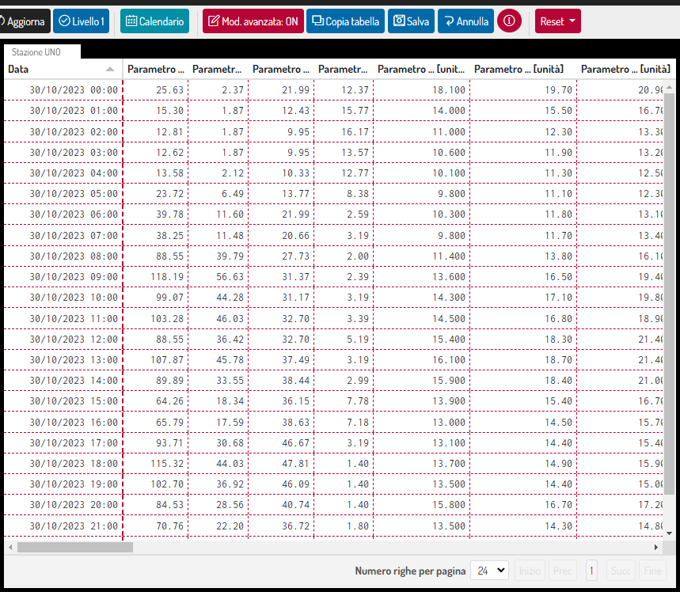

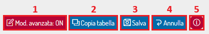

1. Il pulsante principale passerà allo stato "ON" una volta attivata la modalità avanzata;
2. Pulsante : cliccando questo pulsante è possibile copiare la tabella visualizzata negli appunti (clipboard) del PC, rendendo possibile incollarla su un foglio di calcolo, come ad esempio Excel;
3. Pulsante : salva le modifiche effettuate;
4. Pulsante : scarta le modifiche effettuate;
5. Pulsante : cliccando questo pulsante verranno visualizzate le informazioni relative all'utilizzo della modalità avanzata:

    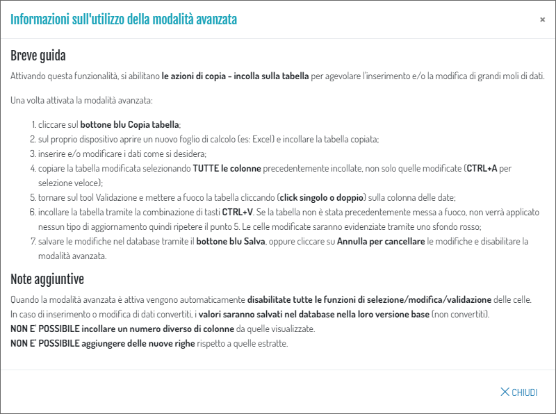

Successivamente:

* Cliccare sul bottone blu : un messaggio di avvenuta copia verrà visualizzato in alto a destra:

    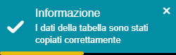

* Sul proprio dispositivo, aprire un nuovo foglio di calcolo, ad esempio "Excel", e incollare la tabella copiata:

    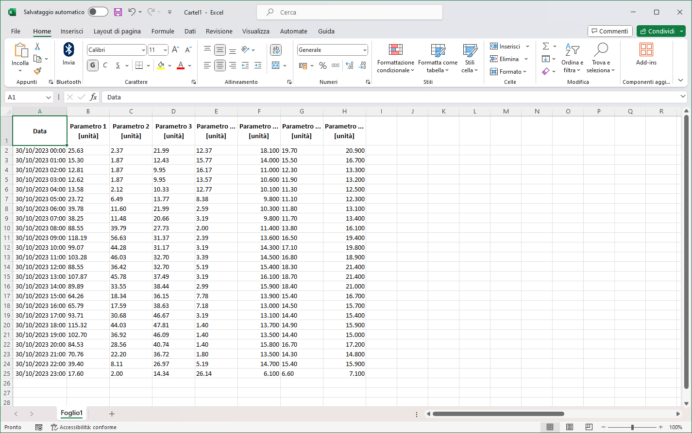

* Inserire e/o modificare i dati come si desidera;
* Copiare la tabella modificata selezionando TUTTE le colonne precedentemente incollate, non solo quelle modificate;
* Tornare su "Validazione" e mettere a fuoco la tabella cliccando (click singolo o doppio) sulla colonna "Data";
* Incollare la tabella tramite la combinazione di tasti CTRL + V: un messaggio di avvenuta copia verrà visualizzato in alto a destra:

    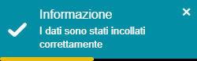

    le celle modificate saranno evidenziate tramite uno sfondo rosso:

    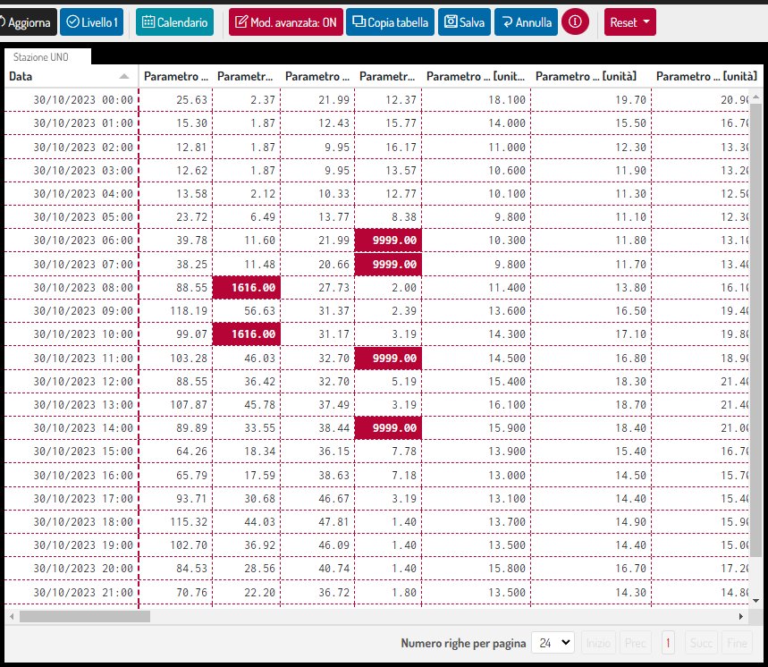

* Salvare le modifiche nel database tramite il bottone blu , oppure cliccare su  per cancellare le modifiche e disabilitare la modalità avanzata.

