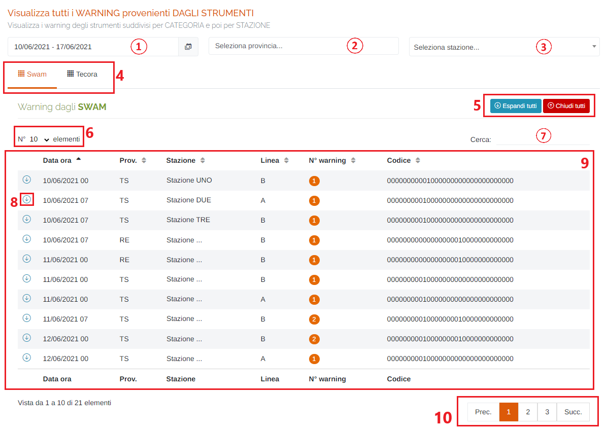
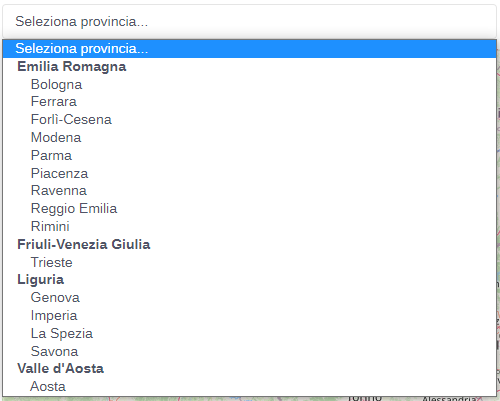
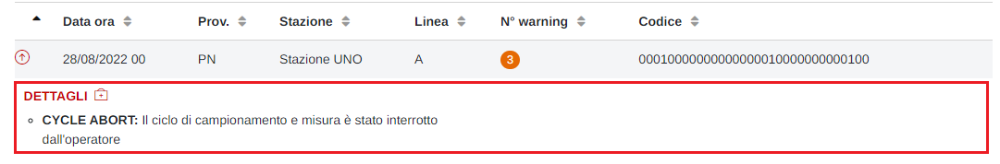

# DATI - WARNING STRUMENTI

Per poter accedere a questa sezione occorre cliccare sulla voce "Dati" posta nel menu principale di sinistra ed in seguito cliccare sull'elemento "Warning strumenti".

<h3>
    > Dati 
    &nbsp;&nbsp;&nbsp;&nbsp;&nbsp;&nbsp;&nbsp;&nbsp; <i>o</i> Warning strumenti
</h3>

Questa pagina permette di visualizzare i warning degli strumenti suddivisi per CATEGORIA e poi per STAZIONE.

1. Periodo temporale:

    Attraverso questo strumento è possibile impostare il periodo temporale per la visualizzazione dei dati.

    È importante ricordare che, per impostare il periodo, è SEMPRE NECESSARIO CLICCARE DUE VOLTE, una per il giorno d'inizio e una per il giorno di fine.

    Una volta selezionato il periodo, premere il pulsante Applica per completare l'operazione.

    

    &nbsp;&nbsp;&nbsp;&nbsp;&nbsp;&nbsp;a. Data d'inizio; 
    &nbsp;&nbsp;&nbsp;&nbsp;&nbsp;&nbsp;b. Data di fine; 
    &nbsp;&nbsp;&nbsp;&nbsp;&nbsp;&nbsp;c. Pulsante <u>Applica</u>; 
    &nbsp;&nbsp;&nbsp;&nbsp;&nbsp;&nbsp;d. Pulsante <u>Annulla</u>: chiude la finestra del periodo temporale; 
    &nbsp;&nbsp;&nbsp;&nbsp;&nbsp;&nbsp;e. Calendario mese precedente; 
    &nbsp;&nbsp;&nbsp;&nbsp;&nbsp;&nbsp;f. Calendario mese corrente. 

2. Elenco province disponibili sul portale;

    

3. Elenco stazioni disponibili sul portale;

    

4. Schede della pagina:

    * Strumenti <u>SWAM</u>;
    * Strumenti <u>TECORA</u>;

5. Pulsanti <u>Espandi tutti</u> e <u>Chiudi tutti</u>:

    * </img> : apre i dettagli di tutti i warning visualizzati nella tabella sottostante;
    * </img> : chiude tutti i dettagli rimasti aperti dei warning visualizzati nella tabella sottostante;

6. Numero di elementi della tabella per pagina;
7. <u>Filtro di ricerca nella tabella</u>: la ricerca viene effettuata su tutte le colonne;
8. Pulsante di espansione del dettaglio dello warning ( </img> ) :

    

    Premere l'icona </img> per richiudere il singolo dettaglio;

9. Tabella dei warning: verranno visualizzate le seguenti informazioni:

    * Data/ora;
    * Provincia;
    * Stazione;
    * Linea (solo per gli SWAM);
    * Numero di warning;
    * Codice del warning;

10. Esplorazione delle pagine;

