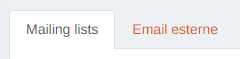
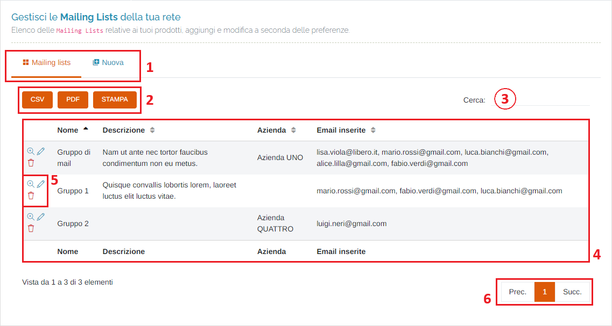
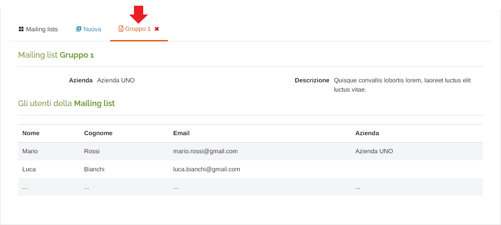
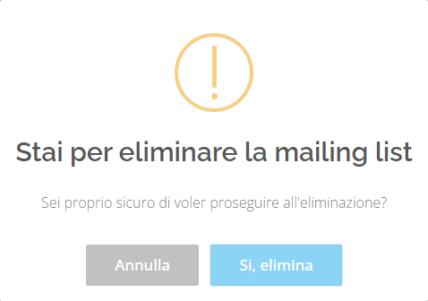
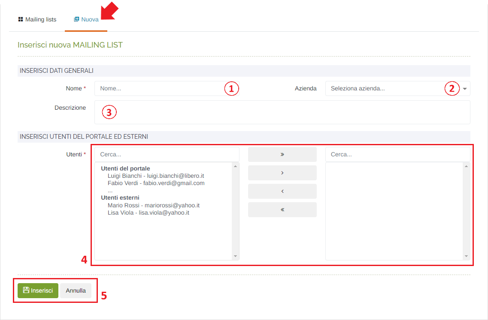
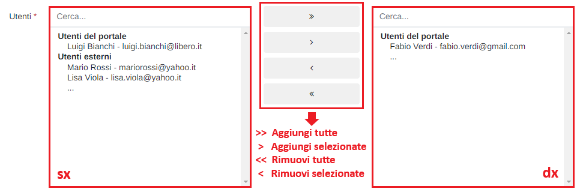
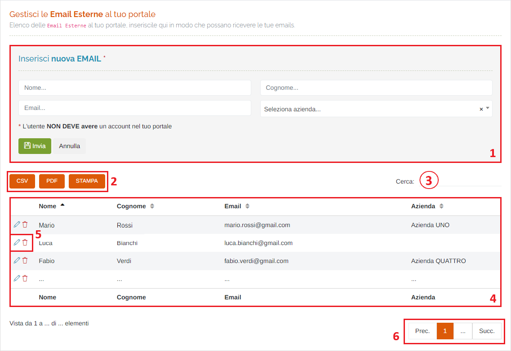
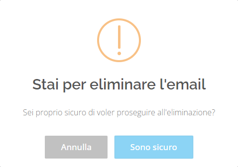

# DIVULGAZIONE - GESTIONE EMAIL

Per poter accedere a questa sezione è necessario cliccare sulla voce "Divulgazione", posta nel menu principale di sinistra, ed in seguito cliccare sull'elemento "Gestione email".

<h3>
    > Divulgazione 
    &nbsp;&nbsp;&nbsp;&nbsp;&nbsp;&nbsp;&nbsp;&nbsp; <i>o</i> Gestione email
</h3>

Sono presenti le seguenti schede:

## Mailing lists

Da questa pagina è possibile visualizzare e gestire le mailing list della propria rete, aggiungendo e modificando gruppi a seconda delle necessità.

1. Schede della pagina:

    * Mailing lists;
    * Email esterne;

2. Pulsanti <u>CSV</u> - <u>PDF</u> - <u>STAMPA</u> : è possibile scaricare l'elenco delle mailing list sottostanti in due formati, CSV e PDF, oppure stamparlo direttamente;
3. <u>Filtro di ricerca nella tabella</u>: la ricerca viene effettuata su tutte le colonne della tabella;
4. Tabella delle mailing lists;
5. Pulsanti:

    * <u>Visualizza</u> </img>: verrà aperta la scheda della mailing list selezionata:

        

    * <u>Modifica</u> </img>: verrà aperta la scheda per modificare i dati della mailing list selezionata (stessi campi presenti in "Inserisci nuova mailing list");
    * <u>Elimina</u> </img>: cliccare questo pulsante per eliminare la mailing list selezionata; verrà visualizzato il seguente messaggio di conferma:

        

        Cliccare "Si, elimina" per effettuare l'eliminazione.

6. Esplorazione delle pagine;

### Inserisci nuova mailing list

1. <u>Nome</u> (*obbligatorio);
2. <u>Azienda</u>;
3. <u>Descrizione</u>;
4. <u>Aggiungi mail degli utenti alla lista</u>: attraverso questo form è possibile associare/rimuovere le mail alla lista che si sta creando/modificando:

    

    È possibile filtrare ulteriormente le mail visualizzate effettuando una ricerca digitando nel campo presente sopra ai due elenchi degli utenti.

    Per aggiungere un utente, fare doppio click su un elemento dall'elenco 'sx' ed esso verrà "spostato" nella tabella 'dx'.

    Per rimuovere un utente, fare doppio click su un elemento dall'elenco 'dx' ed esso verrà "fatto tornare" nella tabella 'sx'.

    Qualora si volessero aggiungere/rimuovere, in un colpo solo, tutti gli utenti nella/dalla lista, cliccare reciprocamente il pulsante ">>" o "<<".

5. Pulsanti <u>Inserisci</u> (per rendere effettiva la creazione/modifica della mailing list) e <u>Annulla</u> (per ripulire il form, scartare tutte le modifiche inserite/effettuate e tornare all'elenco delle mailing lists);

## Email esterne

Da questa pagina è possibile visualizzare e gestire le email esterne al proprio portale, in modo che possano ricevere le email da parte degli utenti oppure essere inserite in una mailing list.

1. Form di inserimento di una nuova mail: l'unico campo obbligatorio è quello della email; inoltre, bisogna fare attenzione che la mail che si sta inserendo non corrisponda a quella di un utente già registrato sul portale.
2. Pulsanti <u>CSV</u> - <u>PDF</u> - <u>STAMPA</u> : è possibile scaricare l'elenco delle email esterne sottostanti in due formati, CSV e PDF, oppure stamparlo direttamente;
3. <u>Filtro di ricerca nella tabella</u>: la ricerca viene effettuata su tutte le colonne della tabella;
4. Tabella delle email esterne;
5. Pulsanti:

    * <u>Modifica</u> </img>: verrà compilato il form soprastante con le informazioni dell'utente selezionato; una volta effettuate le modifiche (eccetto l'indirizzo email) cliccare il pulsante "Invia" pre salvarle, oppure "Annulla" per ripulire il form;
    * <u>Elimina</u> </img>: cliccare questo pulsante per la mail esterna selezionata; verrà visualizzato il seguente messaggio di conferma:

        

        Cliccare "Si, elimina" per effettuare l'eliminazione.

6. Esplorazione delle pagine;

