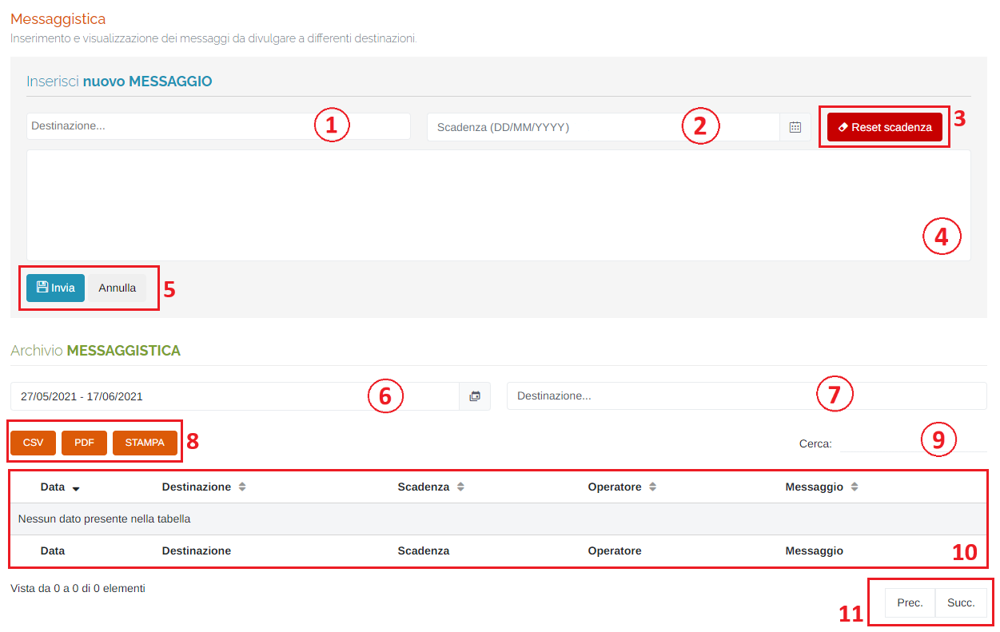

# DIVULGAZIONE - MESSAGGISTICA

Per poter accedere a questa sezione occorre cliccare sulla voce "Divulgazione" posta nel menu principale di sinistra ed in seguito cliccare sull'elemento "Messaggistica".

<h3>
    > Divulgazione 
    &nbsp;&nbsp;&nbsp;&nbsp;&nbsp;&nbsp;&nbsp;&nbsp; <i>o</i> Messaggistica
</h3>

Questa pagina permette di inserire e visualizzare dei messaggi da divulgare a differenti destinazioni.

1. Destinazione del messaggio che si vuole inviare: è possibile anche digitare la destinazione per cercarla tra quelle elencate;
2. Scadenza del messaggio: data dopo la quale non sarà più visualizzato il messaggio: verrà visualizzato il seguente form per la selezione della data:

    

    1. Mese precedente;
    2. Mese successivo;
    3. Anno precedente;
    4. Anno successivo;
    5. Scelta del giorno;
    6. Pulsanti 'Annulla' (ritorna alla schermata precedente) e 'OK' (imposta la data selezionata);

3. Pulsante <u>Reset scadenza</u>: cliccando questo pulsante verrà resettato il campo relativo alla scadenza del messaggio;
4. Testo del messaggio che si vuole inviare;
5. Pulsanti <u>Invia</u> e <u>Annulla</u>: cliccare il pulsante Invia per effettuare l'invio del nuovo messaggio, oppure il pulsante Annulla per resettare tutti i campi precedentemente compilati;
6. Periodo temporale:

    Attraverso questo strumento è possibile impostare il periodo temporale per la visualizzazione dei dati.

    È importante ricordare che, per impostare il periodo, è SEMPRE NECESSARIO CLICCARE DUE VOLTE, una per il giorno d'inizio e una per il giorno di fine.

    Una volta selezionato il periodo, premere il pulsante Applica per completare l'operazione.

    

    &nbsp;&nbsp;&nbsp;&nbsp;&nbsp;&nbsp;a. Data d'inizio; 
    &nbsp;&nbsp;&nbsp;&nbsp;&nbsp;&nbsp;b. Data di fine; 
    &nbsp;&nbsp;&nbsp;&nbsp;&nbsp;&nbsp;c. Pulsante <u>Applica</u>; 
    &nbsp;&nbsp;&nbsp;&nbsp;&nbsp;&nbsp;d. Pulsante <u>Annulla</u>: chiude la finestra del periodo temporale; 
    &nbsp;&nbsp;&nbsp;&nbsp;&nbsp;&nbsp;e. Calendario mese precedente; 
    &nbsp;&nbsp;&nbsp;&nbsp;&nbsp;&nbsp;f. Calendario mese corrente. 

7. Filtro delle possibili destinazioni dei messaggi;
8. Pulsanti <u>CSV</u> - <u>PDF</u> - <u>STAMPA</u> : è possibile scaricare l'elenco dei dissesti sottostanti in due formati, CSV e PDF, oppure stamparlo direttamente;
9. <u>Filtro di ricerca nella tabella</u>: la ricerca viene effettuata su tutte le colonne;
10. Tabella dei messaggi inviati: verranno visualizzate le seguenti informazioni:

    * Data di invio;
    * Destinazione del messaggio;
    * Scadenza;
    * Nome dell'operatore che ha inviato il messaggio;
    * Testo del messaggio;

11. Esplorazione delle pagine;

