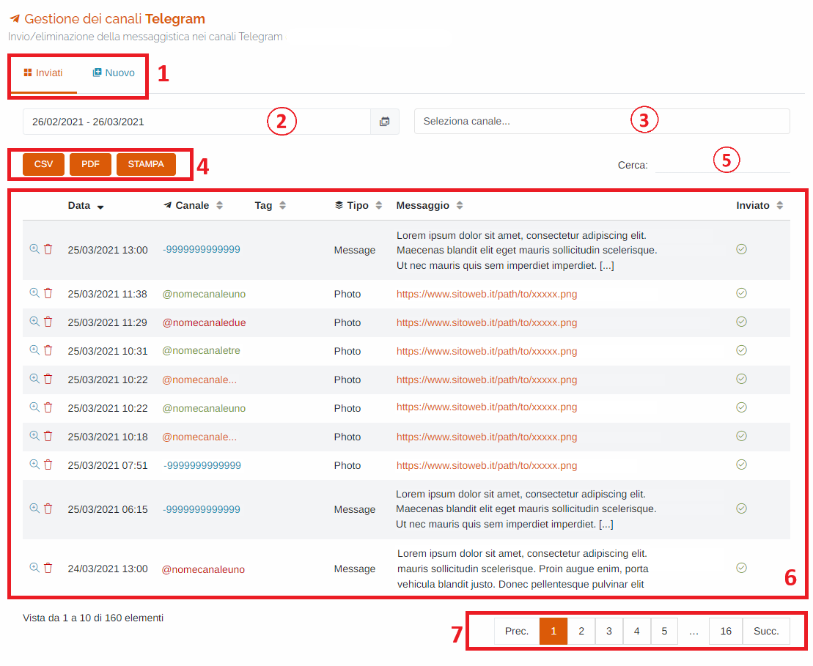
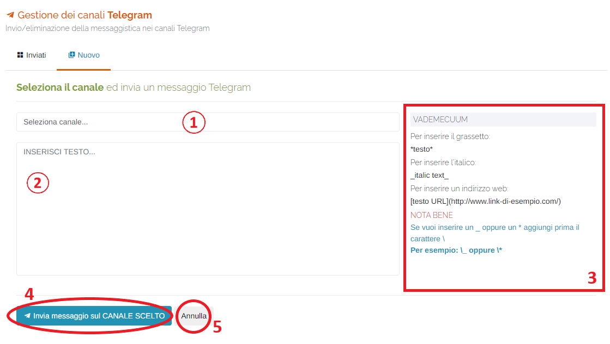
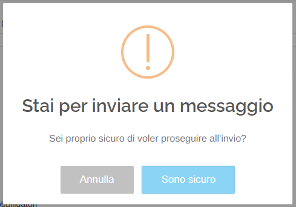
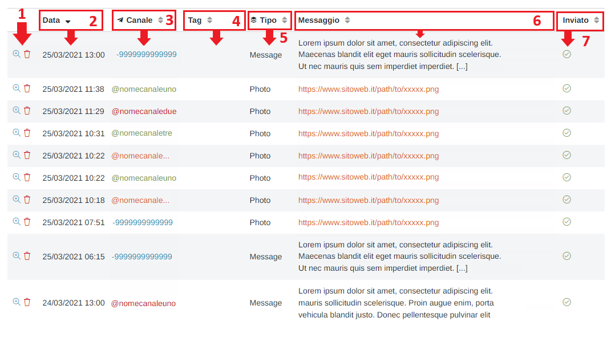
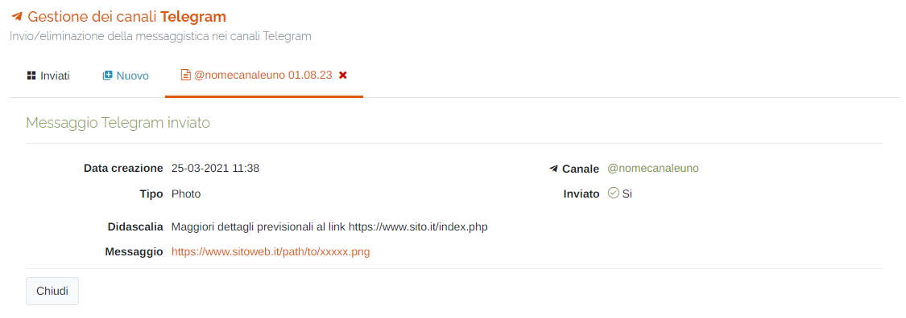

# DIVULGAZIONE - TELEGRAM

Per poter accedere a questa sezione occorre cliccare sulla voce "Divulgazione" posta nel menu principale di sinistra e cliccare sull'elemento "Telegram".

<h3>
    > Divulgazione 
    &nbsp;&nbsp;&nbsp;&nbsp;&nbsp;&nbsp;&nbsp;&nbsp; <i>o</i> Telegram
</h3>

Attraverso questo strumento è possibile gestire l'invio e le eventuali eliminazioni dei messaggi sui canali presenti sull'applicativo 'Telegram'.

1. Schede della pagina:

   * Inviati: visualizza la tabella dei messaggi caricati e inviati sul canale;
   * Nuovo: creazione di un nuovo messaggio;

2. Periodo temporale:

    Attraverso questo strumento è possibile impostare il periodo temporale per la visualizzazione dei dati.

    È importante ricordare che, per impostare il periodo, è SEMPRE NECESSARIO CLICCARE DUE VOLTE, una per il giorno d'inizio e una per il giorno di fine.

    Una volta selezionato il periodo, premere il pulsante Applica per completare l'operazione.

    

    &nbsp;&nbsp;&nbsp;&nbsp;&nbsp;&nbsp;a. Data d'inizio; 
    &nbsp;&nbsp;&nbsp;&nbsp;&nbsp;&nbsp;b. Data di fine; 
    &nbsp;&nbsp;&nbsp;&nbsp;&nbsp;&nbsp;c. Pulsante <u>Applica</u>; 
    &nbsp;&nbsp;&nbsp;&nbsp;&nbsp;&nbsp;d. Pulsante <u>Annulla</u>: chiude la finestra del periodo temporale; 
    &nbsp;&nbsp;&nbsp;&nbsp;&nbsp;&nbsp;e. Calendario mese precedente; 
    &nbsp;&nbsp;&nbsp;&nbsp;&nbsp;&nbsp;f. Calendario mese corrente. 

3. <u>Seleziona canale...</u>: menu a tendina in cui si può filtrare la tabella sottostante visualizzando un certo canale scelto tra quelli a disposizione; verranno mostrati solamente i canali relativi ai gruppi di appartenenza a cui l'utente è associato;
4. Pulsanti <u>CSV</u> - <u>PDF</u> - <u>STAMPA</u> : è possibile scaricare l'elenco dei bollettini sottostanti in due formati, CSV e PDF, oppure stamparlo direttamente;
5. <u>Filtro di ricerca nella tabella</u>: la ricerca viene effettuata su tutte le colonne;
6. Tabella dei messaggi;
7. <u>Esplorazione delle pagine</u>;

## Invio nuovo messaggio Telegram

In questa scheda è possibile creare un nuovo messaggio da caricare su uno dei canali Telegram.

1. <u>Seleziona canale...</u>: menu a tendina in cui si può filtrare la tabella sottostante visualizzando un certo canale scelto tra quelli a disposizione; verranno mostrati solamente i canali relativi ai gruppi di appartenenza a cui l'utente è associato;
2. Campo d'inserimento testo;
3. <u>Vademecum</u>: indicazioni per compilare il campo d'inserimento del testo;
4. Pulsante <u>Invia messaggio sul CANALE SCELTO</u>: cliccare su questo pulsante per generare il messaggio che verrà caricato successivamente sul canale scelto. Al click del pulsante, come ulteriore conferma, verrà richiesta una password, che verrà comunicata, per effettuare l'invio;

   

5. Pulsante <u>Annulla</u>: ritorna alla scheda dei messaggi inviati;

## Tabella dei messaggi

In questa tabella vengono visualizzati i messaggi caricati/inviati dei vari canali che l'utente può vedere.

1. Visualizza/Elimina messaggio;

   Cliccando sul pulsante Visualizza </img> è possibile visualizzarne le informazioni relative al messaggio;

   

   Cliccando sul pulsante Elimina </img> è possibile eliminare il relativo messaggio dal canale Telegram;

   Come per l'invio di un nuovo messaggio, verrà richiesta, come ulteriore conferma, una password per effettuare l'eliminazione.

   Quest'ultima avverrà automaticamente entro qualche minuto. Si consiglia di verificare la corretta eliminazione del messaggio sul canale Telegram;

2. Data d'inserimento del messaggio;
3. Canale Telegram su cui è stato inviato il messaggio;

   Posso esserci due valori:

      * <u>ID</u> : identificativo numerico -> indica un <u>CANALE PRIVATO</u>;
      * @ : identificativo pubblico del canale -> indica un <u>CANALE PUBBLICO</u>;

   Se un canale è PRIVATO, esso non avrà un identificativo pubblico con la @;

   Viceversa, se un canale è PUBBLICO, esso presenterà sia il proprio identificativo pubblico per essere trovato nell app di Telegram, sia un identificativo numerico.

4. Tag: identifica la lingua del bollettino meteo; Il tag serve per verificare se il bollettino meteo è già stato inviato sul canale in quella lingua ('Bollettino_Meteo_It' / 'Bollettino_Meteo_Fr' / 'Bollettino_Meteo_En'). Qualora sia stato già inviato il sistema avviserà l'utente della presenza del messaggio sul relativo canale e chiederà se lo si vuole inviare nuovamente;
5. Tipo: indica la tipologia del messaggio inviato sul canale: tipo 'Message' per i messaggi di testo e 'Photo' per i messaggi che presentano delle immagini;
6. Messaggio: indica il contenuto del messaggio; (i messaggi di tipo 'Photo' presentano il link relativo all'immagine)
7. Inviato: quest'icona </img> identifica i messaggi che sono stati inviati sul canale; se non presente, significa che il messaggio è stato generato, ma non è stato ancora inviato. La procedura di invio è automatica, quindi verificare l'invio del messaggio direttamente dall'app di Telegram.

