# FAQ

Per poter accedere a questa sezione è necessario cliccare sull'elemento "FAQ" presente nel menù a sinistra.

<h3>
    > FAQ
</h3>

Le FAQ (Frequently Asked Questions) sono state create per consentire ai singoli utenti di realizzare un piccolo manuale personale condiviso con tutti gli altri utenti del portale.

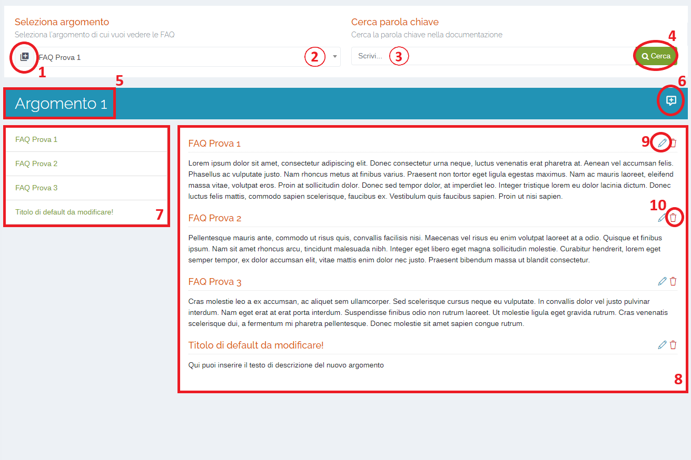

1. Pulsante <u>Aggiungi argomento</u>;
2. Lista degli argomenti e delle relative FAQ;
3. <u>Cerca parola chiave</u> nel testo delle FAQ;
4. Pulsante <u>Cerca</u>;
5. Titolo argomento selezionato dalla lista (punto 2);
6. Pulsante <u>Inserisci nuova FAQ</u>;
7. Elenco dei titoli delle FAQ associate all'argomento selezionato: al click su una delle FAQ la pagina scorrerà fino a visualizzare la domanda scelta;
8. Visualizzazione FAQ relative all'argomento selezionato;
9. Pulsante <u>Modifica</u>;
10. Pulsante <u>Elimina</u>;

## Pulsante Aggiungi argomento

Premendo questo pulsante è possibile inserire un nuovo argomento digitando nel relativo campo il titolo che gli si vuole assegnare e premendo il pulsante "Inserisci" per confermare l'operazione.

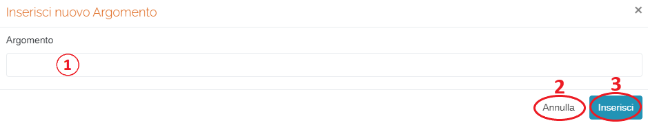

1. Campo inserimento testo;
2. Pulsante <u>Annulla</u>;
3. Pulsante <u>Inserisci</u>;

## Lista degli argomenti e delle relative FAQ

In questa sezione viene visualizzata la lista di tutti gli argomenti inseriti e le relative FAQ.

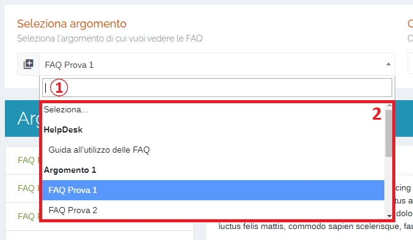

1. Campo inserimento testo;
2. Elenco dei titoli degli argomenti e delle relative FAQ;

Inoltre, è possibile effettuare una ricerca dei titoli degli argomenti e delle FAQ inserendo una parola/lettera chiave nel campo di ricerca.

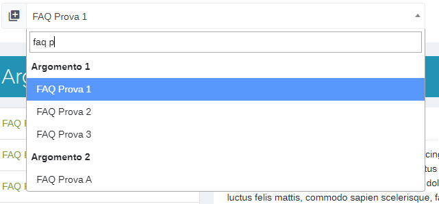

## Cerca parola chiave nel testo delle FAQ

È possibile effettuare ricerche anche direttamente nel testo delle FAQ presenti sul portale. Una volta inserita la parola chiave, cliccare sul pulsante "Cerca"; verranno visualizzati i risultati della ricerca con, in particolare, l'evidenziazione delle parole cercate.

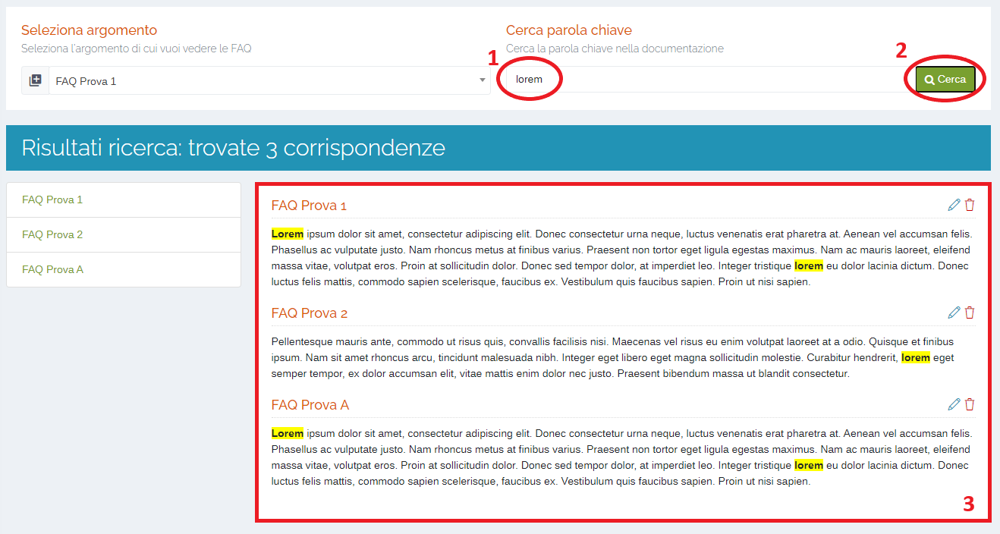

1. Campo inserimento testo;
2. Pulsante <u>Cerca</u>;
3. Risultati ricerca;

## Pulsante Inserisci nuova FAQ

Attraverso questo pulsante è possibile creare una nuova FAQ inserendo l'argomento a cui sarà associata (selezionare dal menù a tendina), il titolo e il testo. Una volta inseriti tutti i campi. Premere il pulsante "Inserisci" per confermare l'operazione.

Prestare attenzione che <u>OGNI CAMPO È OBBLIGATORIO</u> (*).

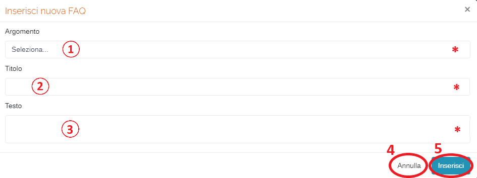

1. Menu a tendina <u>Argomento</u>(*obbligatorio);
2. Campo <u>Titolo</u>(*obbligatorio);
3. Campo <u>Testo</u>(*obbligatorio);
4. Pulsante <u>Annulla</u>;
5. Pulsante <u>Inserisci</u>;

Premere il pulsante "Inserisci" per confermare l'operazione:

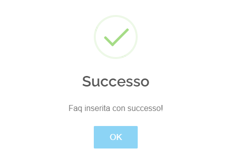

## Pulsante Modifica

Premendo questo pulsante </img>, è possibile modificare titolo e testo della FAQ corrispondente.

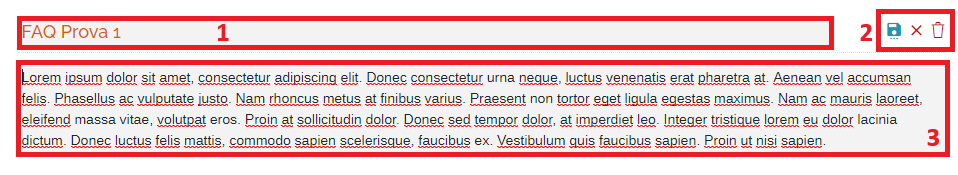

1. Campo modifica titolo;
2. Pulsanti <u>Salva</u>, <u>Annulla</u> e <u>Elimina</u> (vedi "Pulsante Elimina") <u>FAQ</u>;

   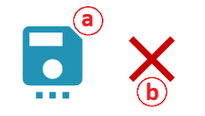

   a. Salva le modifiche apportate alla FAQ;
   b. Annulla le modifiche e torna alla semplice visualizzazione della FAQ;

3. Campo modifica testo;

## Pulsante Elimina

Premendo questo pulsante </img>, è possibile eliminare la FAQ corrispondente.

Verrà richiesta un'ulteriore conferma dell'eliminazione:

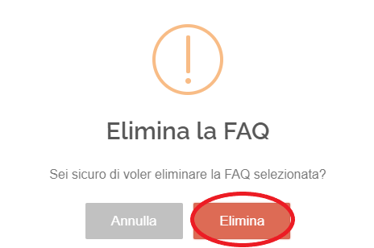

Premete il pulsante Elimina per confermare l'operazione:

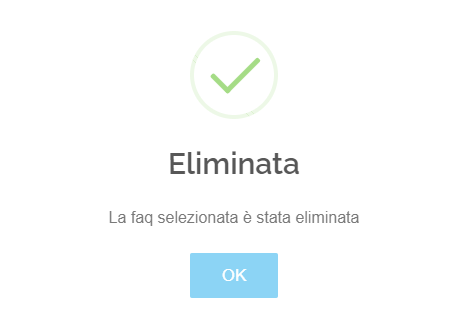

