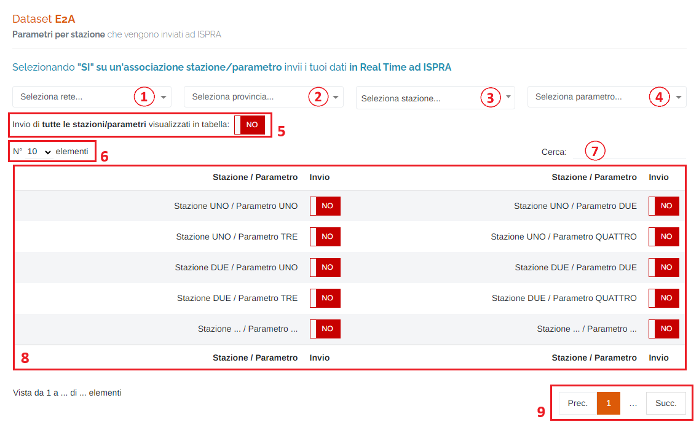

# INFOARIA - DATASET E2a

Per poter accedere a questa sezione è necessario cliccare sulla voce "Infoaria", posta nel menu principale di sinistra, ed in seguito cliccare sull'elemento "Dataset E2a".

<h3>
    > Infoaria 
    &nbsp;&nbsp;&nbsp;&nbsp;&nbsp;&nbsp;&nbsp;&nbsp; <i>o</i> Dataset E2a
</h3>

Da questa pagina è possibile selezionare il dataset e l'invio di ogni associazione stazione/parametro.

1. Selezionare una <u>rete</u> (filtro tabella);

    

2. Selezionare una <u>provincia</u> (filtro tabella);
3. Selezionare una <u>stazione</u> (filtro tabella);

    

4. Selezionare un <u>parametro</u> (filtro tabella);
5. Pulsante </img> / </img> per modificare in una volta sola TUTTI gli invii delle associazioni presenti nella tabella sottostante;
6. Numero di elementi della tabella per pagina;
7. <u>Filtro di ricerca nella tabella</u>: la ricerca viene effettuata su tutte le colonne della tabella;
8. Tabella delle associazioni stazione/parametro;

    È possibile selezionare singolarmente quali dati andranno inviati ad ISPRA mediante i pulsanti </img> / </img>

    Le seguenti configurazioni elencate sono OBBLIGATORIE:

    * impostare il **codice europeo** della stazione dalla pagina "Infoaria > Dataset D";
    * i parametri inviati **devono essere associati ad uno strumento** al fine di generare correttamente il codice identificativo dello SPO necessario ad Infoaria;
    * i parametri inviati e le relative stazioni **devono avere impostate le date di attivazione** nella sezione di anagrafica del portale (pagina "Impostazioni rete > Stazioni") al fine di generare correttamente gli identificativi di Infoaria;
    * in futuro, per garantire il corretto funzionamento del sistema, qualora venga dismesso uno strumento presente in una stazione che effettuava l'invio dei dati, **ricordarsi di disattivare anche il relativo invio presente nella tabella**.

9. Esplorazione delle pagine;

