# PLANNING - ATTIVITÀ

Per poter accedere a questa sezione occorre cliccare sulla voce "Planning" posta nel menu principale di sinistra e selezionare "Attività".

<h3>
    > Planning 
    &nbsp;&nbsp;&nbsp;&nbsp;&nbsp;&nbsp;&nbsp;&nbsp; <i>o</i> Attività
</h3>

Verrà visualizzata la seguente schermata:

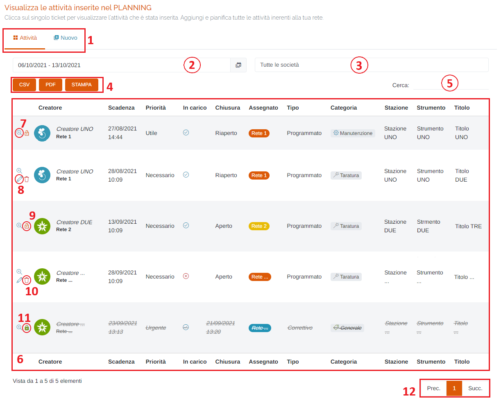

1. Schede della pagina:
2. <u>Calendario – Periodo Temporale</u>

    Attraverso questo strumento è possibile impostare il periodo temporale per la visualizzazione delle attività.
    È importante ricordare che, per impostare il periodo, è SEMPRE NECESSARIO CLICCARE DUE VOLTE, una per il giorno d'inizio e una per il giorno di fine.
    Una volta selezionato il periodo, premere il pulsante Applica per completare l'operazione.

    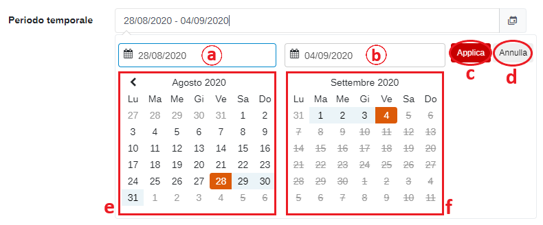

    &nbsp;&nbsp;&nbsp;&nbsp;&nbsp;a. Data d'inizio; 
    &nbsp;&nbsp;&nbsp;&nbsp;&nbsp;b. Data di fine; 
    &nbsp;&nbsp;&nbsp;&nbsp;&nbsp;c. Pulsante <u>Applica</u>; 
    &nbsp;&nbsp;&nbsp;&nbsp;&nbsp;d. Pulsante <u>Annulla</u>: chiude la finestra del periodo temporale; 
    &nbsp;&nbsp;&nbsp;&nbsp;&nbsp;e. Calendario mese precedente; 
    &nbsp;&nbsp;&nbsp;&nbsp;&nbsp;f. Calendario mese corrente. 

3. Filtro <u>Società</u>: selezionare una società per filtrare la tabella sottostante; le società disponibili saranno quelle appartenenti alla propria rete.
4. Pulsanti <u>CSV</u> - <u>PDF</u> - <u>STAMPA</u> : è possibile scaricare l'elenco dei bollettini sottostanti in due formati, CSV e PDF, oppure stamparlo direttamente;
5. <u>Filtro di ricerca nella tabella</u>: la ricerca viene effettuata su tutte le colonne;
6. Tabella delle attività;

    All'accesso, verranno visualizzati tutti i ticket la cui scadenza rientra nel periodo temporale impostato a prescindere dallo stato in cui si trovano(aperti, presi in carico o chiusi). Vengono inoltre riportati anche i ticket ancora aperti, ma che risultano scaduti, ovvero presentano una data di scadenza precedente al periodo temporale impostato.

    Questa impostazione permette di fornire all'utente una panoramica delle attività in programma e, inoltre, di evidenziare eventuali ticket che risultano in ritardo.

7. Pulsante <u>Visualizza</u>

    Cliccando il pulsante </img> è possibile visualizzare il dettaglio del ticket scelto e il suo stato, con tutti i passaggi di apertura/chiusura, in formato simile a quello di una chat di messaggistica:

    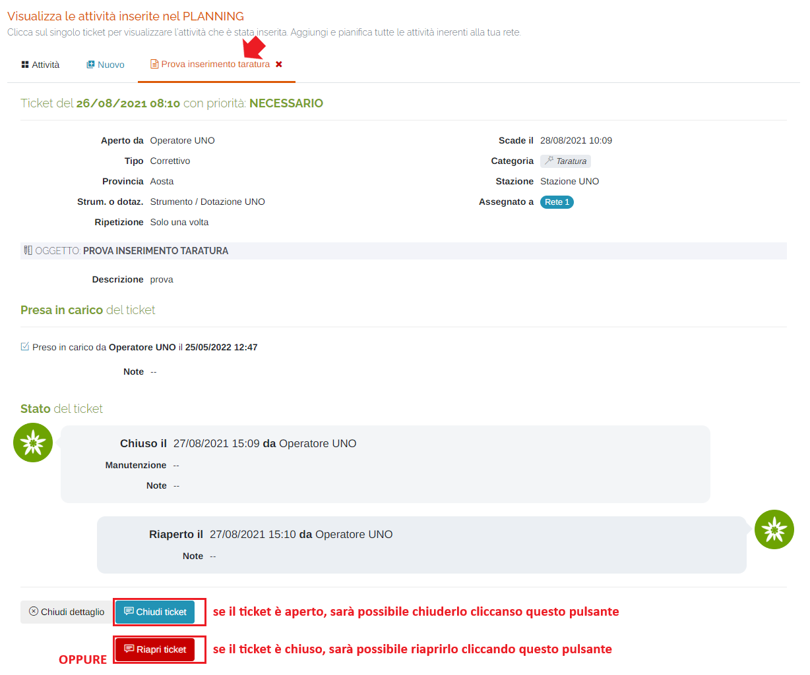

    Inoltre, la sezione "Presa in carico del ticket" verrà visualizzata in maniera diversa se il ticket è già stato preso in carico oppure no:

    * Preso in carico:

        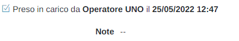

    * Non preso in carico:

        

        Se si è il destinatario del ticket (oppure si ha il permesso perché amministratori) sarà possibile prenderlo in carico:

        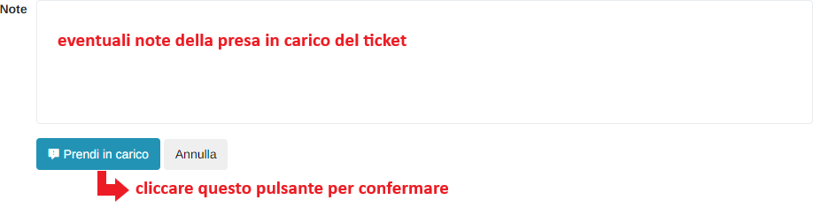

8. Pulsante <u>Modifica</u>

    Cliccando il pulsante </img> è possibile modificare il ticket; il pulsante sarà disponibile solo se il ticket non è stato ancora preso in carico.

9. Pulsante <u>Ticket APERTO</u>:

    Cliccando il pulsante </img> è possibile procedere alla chiusura del ticket (quest'operazione è possibile anche dalla visualizzazione del dettaglio dell'attività):

    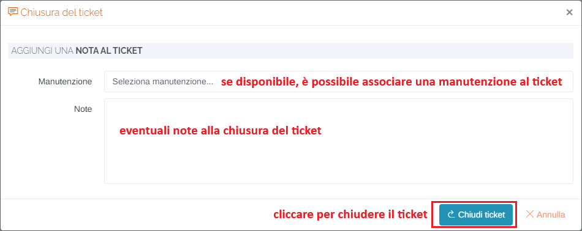

10. Pulsante <u>Elimina</u>:

    Cliccando il pulsante </img> è possibile eliminare il ticket scelto:

    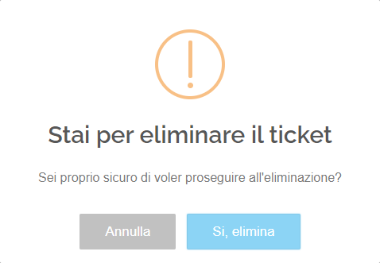

    Premere "Si, elimina" per eseguire l'operazione.

11. Pulsante <u>Ticket CHIUSO</u>:

    Cliccando il pulsante </img> è possibile procedere alla riapertura del ticket (quest'operazione è possibile anche dalla visualizzazione del dettaglio dell'attività):

    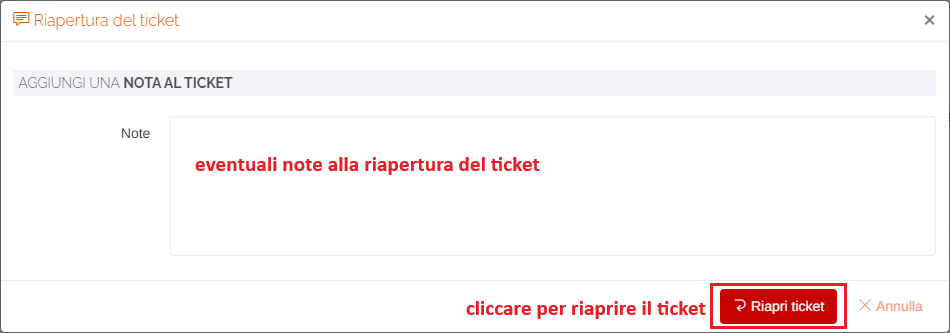

12. <u>Esplorazione delle pagine</u>;

### Scheda "Nuovo"

Cliccando la scheda "Nuovo" sarà possibile inserire una nuova attività (ticket):

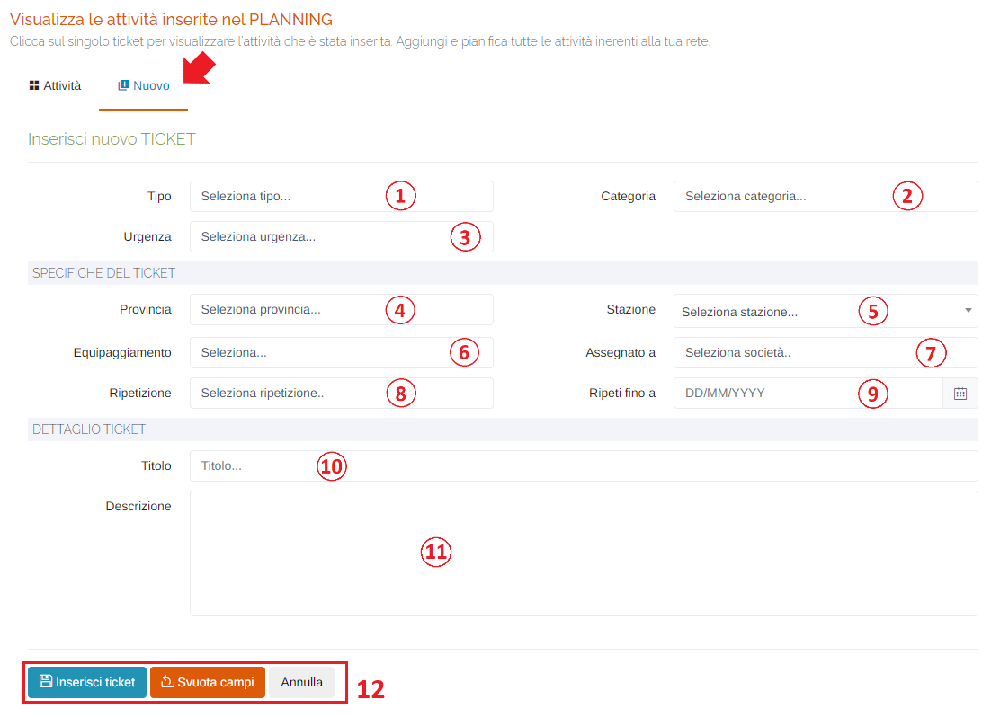

1. Seleziona <u>Tipo</u> (*obbligatorio):

    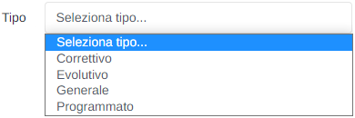

    Quando viene selezionato un tipo di ticket, verranno visualizzati i seguenti campi relativi alle tempistiche di esecuzione dell'attività:

    * 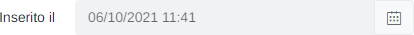 : questo campo non sarà modificabile in quanto la data d'inserimento sarà la data/ora corrente;

    * 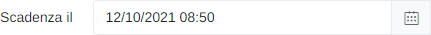 : se selezionato il tipo "Correttivo", verrà impostata di default la data relativa a tre giorni lavorativi successivi alla quella d'inserimento. Tuttavia, è possibile impostare una qualsiasi data successiva a quella d'inserimento del ticket;

    * 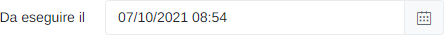 : sostituisce il campo "Inserito il" quando si seleziona il tipo "Evolutivo" (modificabile);

    Le date/ore vengono impostate attraverso il il seguente form di selezione:

    Data:

    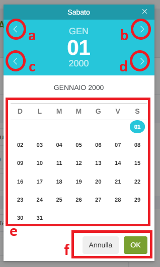

    &nbsp;&nbsp;&nbsp;&nbsp;&nbsp;a. Mese precedente; 
    &nbsp;&nbsp;&nbsp;&nbsp;&nbsp;b. Mese successivo; 
    &nbsp;&nbsp;&nbsp;&nbsp;&nbsp;c. Anno precedente; 
    &nbsp;&nbsp;&nbsp;&nbsp;&nbsp;d. Anno successivo; 
    &nbsp;&nbsp;&nbsp;&nbsp;&nbsp;e. Scelta del giorno; 
    &nbsp;&nbsp;&nbsp;&nbsp;&nbsp;f. Pulsanti 'Annulla' (ritorna alla schermata precedente) e 'OK' (imposta la data selezionata); 

    Ora:

    
    

    Per impostare l'ora e i minuti, cliccare sui numeri presenti nell'orologio visualizzato e premere 'OK'; si imposterà prima l'ora e dopo i minuti;

2. Seleziona <u>Categoria</u> (*obbligatorio):

    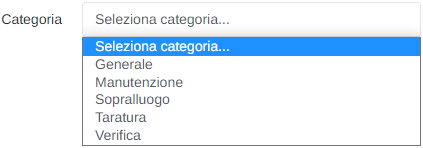

3. Seleziona <u>Urgenza</u> (*obbligatorio):

    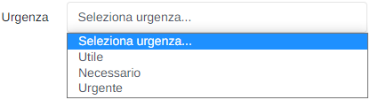

4. Seleziona <u>Provincia</u>: agisce da filtro per l'estrazione delle stazioni;
5. Seleziona <u>Stazione</u> (*obbligatorio);
6. Seleziona <u>Equipaggiamento</u>: verranno visualizzati gli strumenti presenti sulla stazione scelta in precedenza (se non si compila il campo "Stazione", la lista degli equipaggiamenti disponibili sarà vuota);
7. Campo <u>Assegnato a</u> (*obbligatorio): selezionare l'azienda a cui assegnare il ticket (verranno visualizzate le aziende associate alla propria rete);
8. Seleziona <u>Ripetizione</u> (*obbligatorio):

    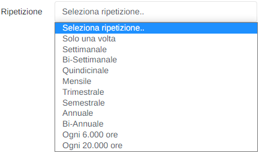

9. Campo <u>Ripeti fino a</u> : impostare la data limite per la ripetizione del ticket (se selezionata la ripetizione "Solo una volta", il campo non sarà modificabile);
10. <u>Titolo</u> (*obbligatorio);
11. <u>Descrizione</u> (*obbligatorio);
12. Pulsanti:

    * <u>Inserisci ticket</u>: effettua l'inserimento del ticket;

        Qualora non si siano compilati tutti i campi correttamente, verrà visualizzato il seguente messaggio:

        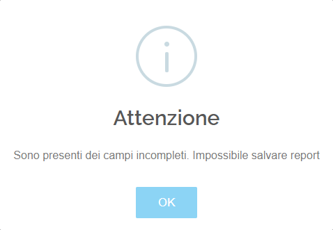

        Invece, se tutto è stato compilato correttamente, il messaggio sarà il seguente

        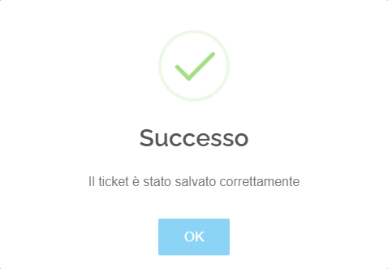

        N.B. Una volta inserito un ticket, l'utente resterà sulla scheda d'inserimento. Questa impostazione risulta utile qualora l'utente debba inserire molteplici ticket per la stessa stazione.

    * <u>Svuota campi</u>: ripulisce tutti i campi del form.
    * <u>Annulla</u>: chiudi la scheda "Nuovo" e torna alla tabella delle attività.

