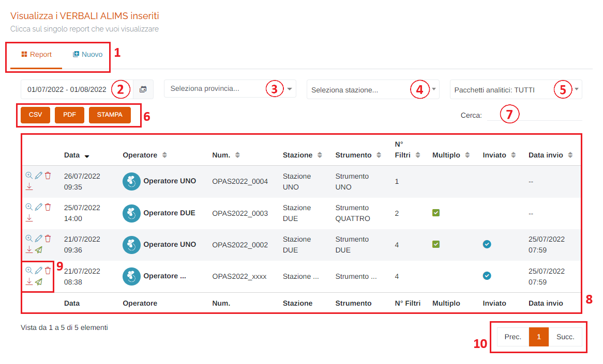
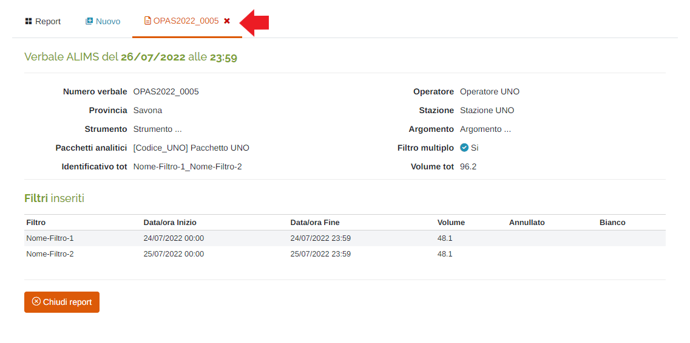
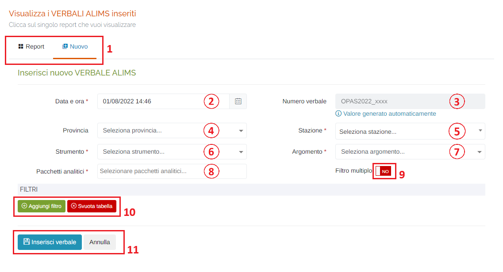
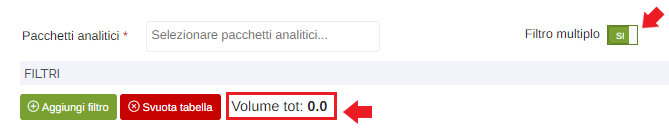
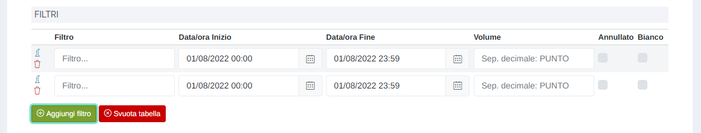
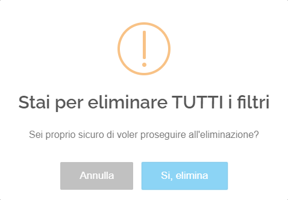

# REPORT - ALIMS

Per poter accedere a questa sezione occorre cliccare sulla voce "Report" posta nel menu principale di sinistra ed in seguito cliccare sull'elemento "ALIMS".

<h3>
    > Report 
    &nbsp;&nbsp;&nbsp;&nbsp;&nbsp;&nbsp;&nbsp;&nbsp; <i>o</i> ALIMS
</h3>

Questa pagina permette di visualizzare i report dei verbali ALIMS presenti sul portale e di inviarne di nuovi.

1. Schede della pagina:

   * Tabella dei verbali;
   * Scheda Nuovo: inserisci un nuovo verbale (vedi "Inserimento nuovo VERBALE ALIMS");

2. Periodo temporale:

    Attraverso questo strumento è possibile impostare il periodo temporale per la visualizzazione dei report.

    È importante ricordare che, per impostare il periodo, è SEMPRE NECESSARIO CLICCARE DUE VOLTE, una per il giorno d'inizio e una per il giorno di fine.

    Una volta selezionato il periodo, premere il pulsante Applica per completare l'operazione.

    

    &nbsp;&nbsp;&nbsp;&nbsp;&nbsp;&nbsp;a. Data d'inizio; 
    &nbsp;&nbsp;&nbsp;&nbsp;&nbsp;&nbsp;b. Data di fine; 
    &nbsp;&nbsp;&nbsp;&nbsp;&nbsp;&nbsp;c. Pulsante <u>Applica</u>; 
    &nbsp;&nbsp;&nbsp;&nbsp;&nbsp;&nbsp;d. Pulsante <u>Annulla</u>: chiude la finestra del periodo temporale; 
    &nbsp;&nbsp;&nbsp;&nbsp;&nbsp;&nbsp;e. Calendario mese precedente; 
    &nbsp;&nbsp;&nbsp;&nbsp;&nbsp;&nbsp;f. Calendario mese corrente. 

3. Seleziona <u>Provincia</u>;
4. Seleziona <u>Stazione</u>;
5. Seleziona un <u>Pacchetto analitico</u> (è possibile selezionarli tutti scegliendo il valore "Pacchetti analitici: TUTTI");
6.  Pulsanti <u>CSV</u> - <u>PDF</u> - <u>STAMPA</u> : è possibile scaricare l'elenco dei verbali sottostanti in due formati, CSV e PDF, oppure stamparlo direttamente;
7. <u>Filtro di ricerca nella tabella</u>: la ricerca viene effettuata su tutte le colonne della tabella;
8. Tabella dei verbali;
9. Pulsanti:

    * Visualizza </img> : viene aperta una nuova scheda della pagina dove verrà visualizzato il dettaglio del report tarature selezionato;

        

    * <u>Modifica</u> </img> : si aprirà la scheda di modifica del report (scheda uguale alla scheda di inserimento di un nuovo report, ma effettuerà la modifica);
    * <u>Elimina</u> </img> : elimina il report selezionato;
    * <u>Scarica PDF</u> </img> : verrà scaricato il PDF del report selezionato;
    * <u>Re-invia report</u> </img> : cliccando questo pulsante verrà inviato nuovamente il report al webservice;

10. Esplorazione delle pagine;

## Inserisci nuovo VERBALE ALIMS

Cliccando sulla scheda "Nuovo", sarà possibile inserire un nuovo verbale compilando i vari campi:

1. Schede della pagina (come sopra);
2. Data e ora del verbale (*obbligatorio): verrà visualizzato il seguente form per la selezione della data e dell'ora:

    Data:

    

    &nbsp;&nbsp;&nbsp;&nbsp;&nbsp;&nbsp;a. Mese precedente; 
    &nbsp;&nbsp;&nbsp;&nbsp;&nbsp;&nbsp;b. Mese successivo; 
    &nbsp;&nbsp;&nbsp;&nbsp;&nbsp;&nbsp;c. Anno precedente; 
    &nbsp;&nbsp;&nbsp;&nbsp;&nbsp;&nbsp;d. Anno successivo; 
    &nbsp;&nbsp;&nbsp;&nbsp;&nbsp;&nbsp;e. Scelta del giorno; 
    &nbsp;&nbsp;&nbsp;&nbsp;&nbsp;&nbsp;f. Pulsanti 'Annulla' (ritorna alla schermata precedente) e 'OK' (imposta la data selezionata); 

    Ora:

    
    

    Per impostare l'ora e i minuti, cliccare sui numeri presenti nell'orologio visualizzato e premere 'OK'; si imposterà prima l'ora e dopo i minuti;

3. Numero del verbale: verrà generato automaticamente e no sarà possibile modificarlo;
4. Seleziona <u>Provincia</u> (*obbligatorio);
5. Seleziona <u>Stazione</u> (*obbligatorio);
6. Seleziona <u>Strumento</u> (*obbligatorio);
7. Seleziona <u>Argomento</u> (*obbligatorio);
8. Seleziona <u>Pacchetti analitici</u> (*obbligatorio): possibile scelta multipla;
9. Pulsante <u>Filtro multiplo</u>: attivando questo pulsante verranno sommati i volumi di tutti i filtri che verranno inseriti nella sezione "Filtri"

    

10. Pulsanti </img> e </img> : cliccando il pulsante "Aggiungi filtro" sarà possibile inserire molteplici filtri nel verbale che verranno elencati in una tabella:

    

    Attraverso il pulsante </img> è possibile acquisire automaticamente il volume del filtro dallo strumento selezionato in precedenza.

    Per eliminare un singolo filtro aggiunto, cliccare il pulsante </img>; mentre per eliminare tutti i filtri in una volta sola, cliccare il pulsante "Svuota tabella": verrà visualizzato il seguente messaggi odi allerta:

    

    Cliccare "Si, elimina" per confermare.

11. Pulsanti <u>Inserisci verbale</u> e <u>Annulla</u> : cliccare il pulsante "Inserisci verbale" per effettuare l'inserimento del nuovo verbale, oppure il pulsante 'Annulla' per ritornare alla scheda 'Report';

