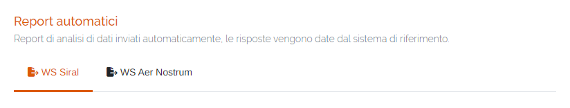
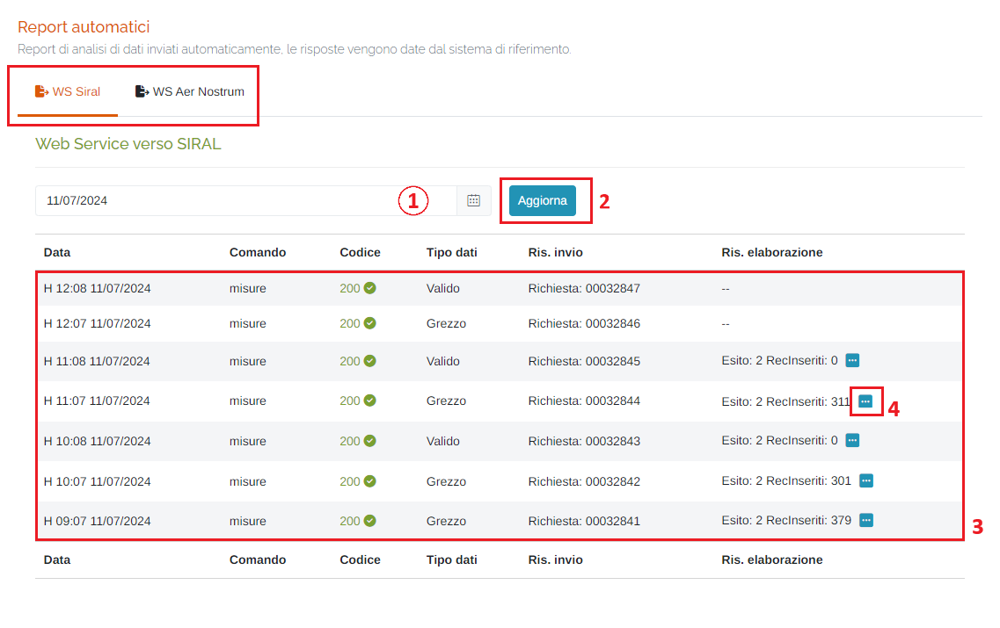
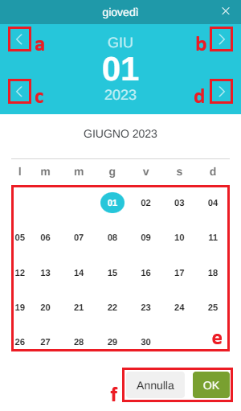
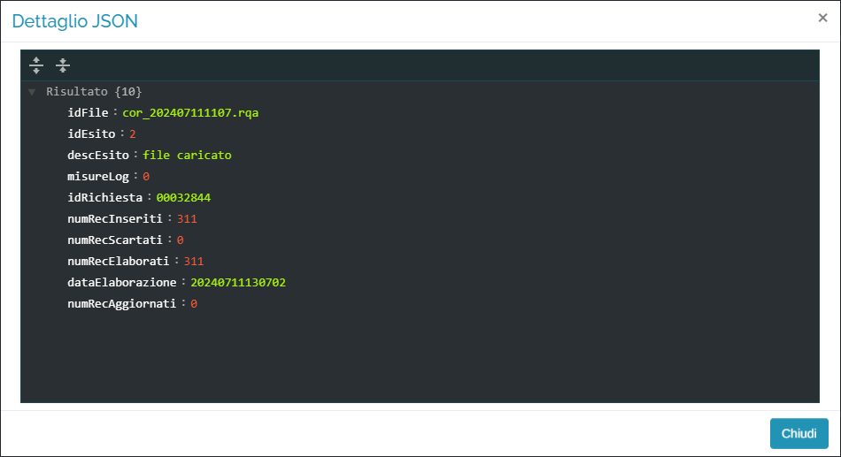
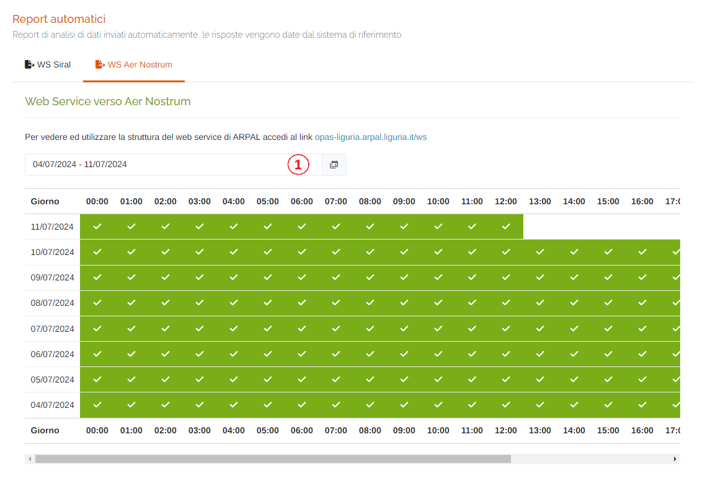
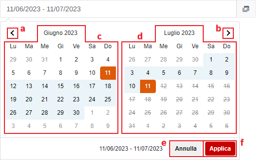

# REPORT - AUTOMATICI

Per poter accedere a questa sezione occorre cliccare sulla voce "Report" posta nel menu principale di sinistra ed in seguito cliccare sull'elemento "Automatici".

<h3>
    > Report 
    &nbsp;&nbsp;&nbsp;&nbsp;&nbsp;&nbsp;&nbsp;&nbsp; <i>o</i> Automatici
</h3>

All'interno di questa pagina, è possibile visualizzare i report di analisi dei dati inviati automaticamente e le relative risposte che vengono restituite dal sistema di riferimento.

Schede della pagina:

* <u>WS Siral</u>: pagina dei report relativi al webservice di Siral;
* <u>WS Aer Nostrum</u>: pagina dei report relativi al webservice di Aer Nostrum;

### WS Siral

1. Data dei report: per l'inserimento di una data è possibile seguire le seguenti indicazioni:

    

    <ol type="a">
      <li>Mese precedente;</li>
      <li>Mese successivo;</li>
      <li>Anno precedente;</li>
      <li>Anno successivo;</li>
      <li>Scelta del giorno;</li>
      <li>Pulsanti <b><i>Annulla</i></b> (ritorna alla schermata precedente) e <b><i>OK</i></b> (imposta la data selezionata);</li>
    </ol>

2. Pulsante  : cliccando questo pulsante è possibile aggiornare la visualizzazione dei dati della tabella agli ultimi disponibili nel database;
3. Tabella dei dati;
4. Pulsante  : cliccando questo pulsante è possibile visualizzare il log completo dell'invio dei dati selezionato; verrà aperta una finestra contenente il log in formato JSON:

    

### WS Aer Nostrum

All'interno della tabella è indicato, ora per ora, lo status dei dati del webservice Aer Nostrum; se positivo viene indicato con l'icona  .

1. Periodo temporale:

    Attraverso questo strumento è possibile impostare il periodo temporale per la visualizzazione dei dati.

    È importante ricordare che, per impostare il periodo, è SEMPRE NECESSARIO CLICCARE DUE VOLTE, una per il giorno d'inizio e una per il giorno di fine.

    Una volta selezionato il periodo, premere il pulsante Applica per completare l'operazione.

    

    &nbsp;&nbsp;&nbsp;&nbsp;&nbsp;&nbsp;&nbsp;a. Pulsante per visualizzare il mese precedente; 
    &nbsp;&nbsp;&nbsp;&nbsp;&nbsp;&nbsp;&nbsp;b. Pulsante per visualizzare il mese successivo. 
    &nbsp;&nbsp;&nbsp;&nbsp;&nbsp;&nbsp;&nbsp;c. Calendario mese precedente; 
    &nbsp;&nbsp;&nbsp;&nbsp;&nbsp;&nbsp;&nbsp;d. Calendario mese successivo. 
    &nbsp;&nbsp;&nbsp;&nbsp;&nbsp;&nbsp;&nbsp;e. Pulsante <u>Annulla</u>: chiude la finestra del periodo temporale; 
    &nbsp;&nbsp;&nbsp;&nbsp;&nbsp;&nbsp;&nbsp;f. Pulsante <u>Applica</u>; 

