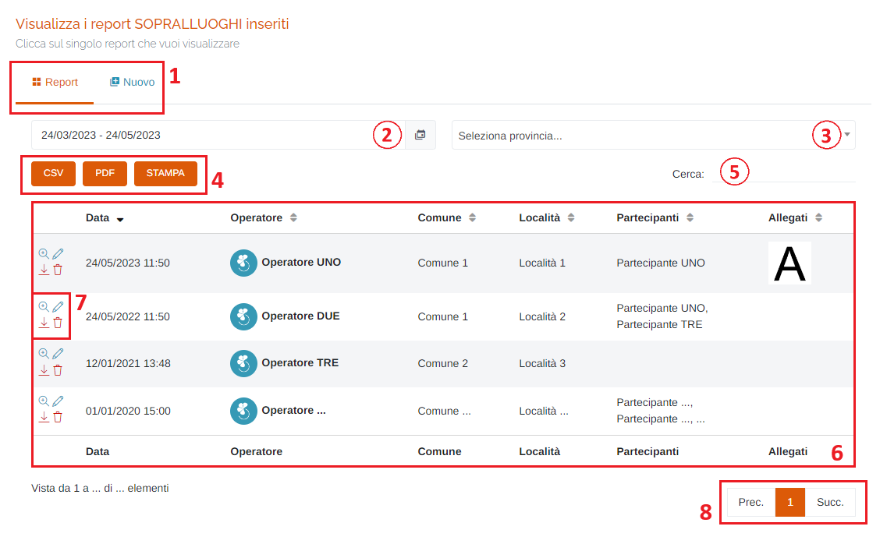
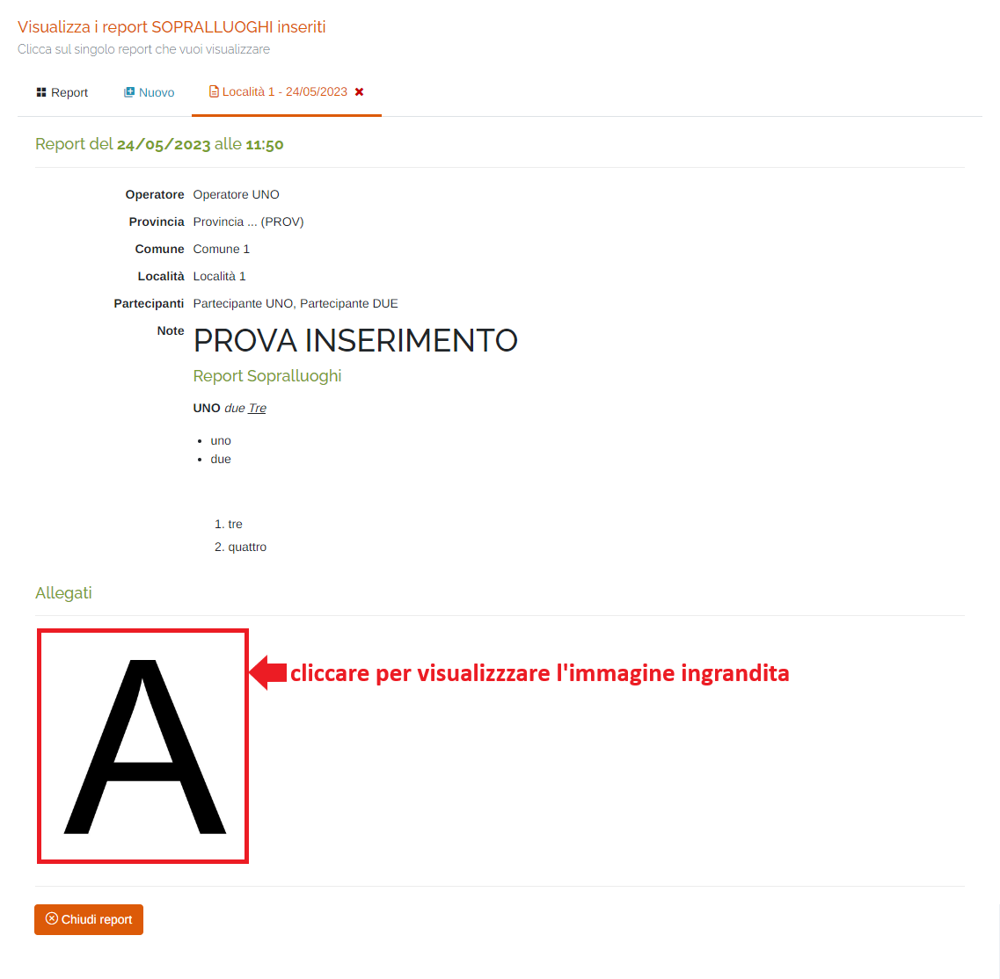
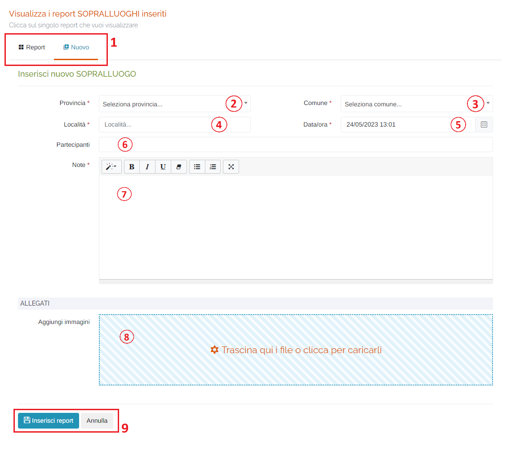

# REPORT - SOPRALLUOGHI

Per poter accedere a questa sezione occorre cliccare sulla voce "Report" posta nel menu principale di sinistra ed in seguito cliccare sull'elemento "Sopralluoghi".

<h3>
    > Report 
    &nbsp;&nbsp;&nbsp;&nbsp;&nbsp;&nbsp;&nbsp;&nbsp; <i>o</i> Sopralluoghi
</h3>

Questa pagina permette di visualizzare, inserire e modificare i report sopralluoghi presenti sul portale.

1. Schede della pagina:

    * <u>Report</u>: visualizza la tabella dei report;
    * <u>Nuovo</u>: pagina per l'inserimento di un nuovo report (vedi "Inserisci nuovo SOPRALLUOGO");

2. Periodo temporale:

    Attraverso questo strumento è possibile impostare il periodo temporale per la visualizzazione dei report.

    È importante ricordare che, per impostare il periodo, è SEMPRE NECESSARIO CLICCARE DUE VOLTE, una per il giorno d'inizio e una per il giorno di fine.

    Una volta selezionato il periodo, premere il pulsante Applica per completare l'operazione.

    

    &nbsp;&nbsp;&nbsp;&nbsp;&nbsp;&nbsp;&nbsp;a. Valori preimpostati OPPURE personalizzati dall'utente; 
    &nbsp;&nbsp;&nbsp;&nbsp;&nbsp;&nbsp;&nbsp;b. Pulsante per visualizzare il mese precedente; 
    &nbsp;&nbsp;&nbsp;&nbsp;&nbsp;&nbsp;&nbsp;c. Pulsante per visualizzare il mese successivo. 
    &nbsp;&nbsp;&nbsp;&nbsp;&nbsp;&nbsp;&nbsp;d. Calendario mese precedente; 
    &nbsp;&nbsp;&nbsp;&nbsp;&nbsp;&nbsp;&nbsp;e. Calendario mese successivo. 
    &nbsp;&nbsp;&nbsp;&nbsp;&nbsp;&nbsp;&nbsp;f. Pulsante <u>Annulla</u>: chiude la finestra del periodo temporale; 
    &nbsp;&nbsp;&nbsp;&nbsp;&nbsp;&nbsp;&nbsp;g. Pulsante <u>Applica</u>; 

3. Elenco province disponibili sul portale;
4. Pulsanti <u>CSV</u> - <u>PDF</u> - <u>STAMPA</u> : è possibile scaricare l'elenco dei report sottostanti in due formati, CSV e PDF, oppure stamparlo direttamente;
5. <u>Filtro di ricerca nella tabella</u>: la ricerca viene effettuata su tutte le colonne;
6. Tabella dei report: verranno visualizzate le seguenti informazioni:

    * Data di emissione del report;
    * Nome dell'operatore che ha fatto il report;
    * Comune;
    * Località;
    * Nominativi dei partecipanti al sopralluogo;
    * Eventuali allegati;

7. Pulsanti d'azione:

    * <u>Visualizza</u> </img> : viene aperta una nuova scheda della pagina dove verrà visualizzato il dettaglio del report sopralluoghi selezionato;

        

    * <u>Modifica</u> </img> : si aprirà la scheda di modifica del report (scheda uguale alla scheda di inserimento di un nuovo report, ma effettuerà la modifica)
    * <u>Scarica PDF</u> </img> : verrà scaricato il PDF del report selezionato;
    * <u>Elimina</u> </img> : elimina il report selezionato;

8. Esplorazione delle pagine;

## Inserisci nuovo SOPRALLUOGO

Cliccando sulla scheda "Nuovo", sarà possibile inserire una nuova taratura compilando i vari campi:

1. Schede della pagina (come sopra);
2. Elenco province disponibili sul portale;
3. Elenco comuni;
4. Inserire la località;
5. Data e ora del sopralluogo: verrà visualizzato il seguente form per la selezione della data e dell'ora:

    Data:

    

    1. Mese precedente;
    2. Mese successivo;
    3. Anno precedente;
    4. Anno successivo;
    5. Scelta del giorno;
    6. Pulsanti 'Annulla' (ritorna alla schermata precedente) e 'OK' (imposta la data selezionata); 

    Ora:

    
    

    Per impostare l'ora e i minuti, cliccare sui numeri presenti nell'orologio visualizzato e premere 'OK'; si imposterà prima l'ora e dopo i minuti;

6. Partecipanti al sopralluogo;
7. Eventuali note;
8. Aggiungi immagini in allegato al report: al click verrà visualizzata la finestra di sistema per scegliere i file;
9. Pulsanti <u>Inserisci report</u> e <u>Annulla</u> : cliccare il pulsante Inserisci report per effettuare l'inserimento del nuovo report', oppure il pulsante Annulla per ritornare alla scheda 'Report';

