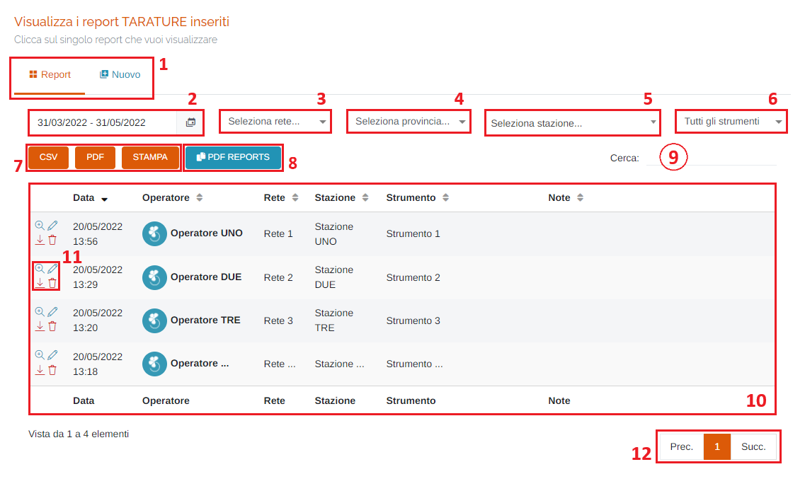
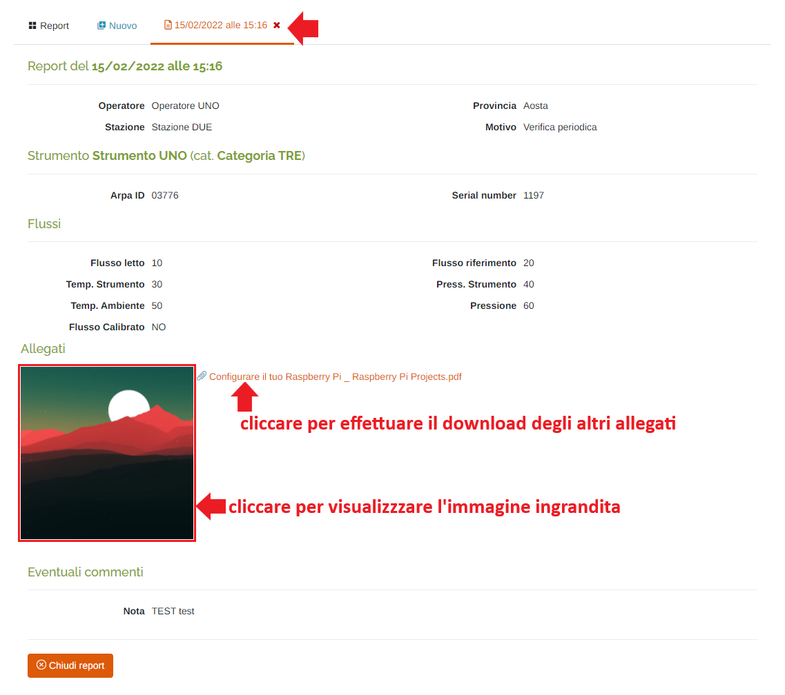
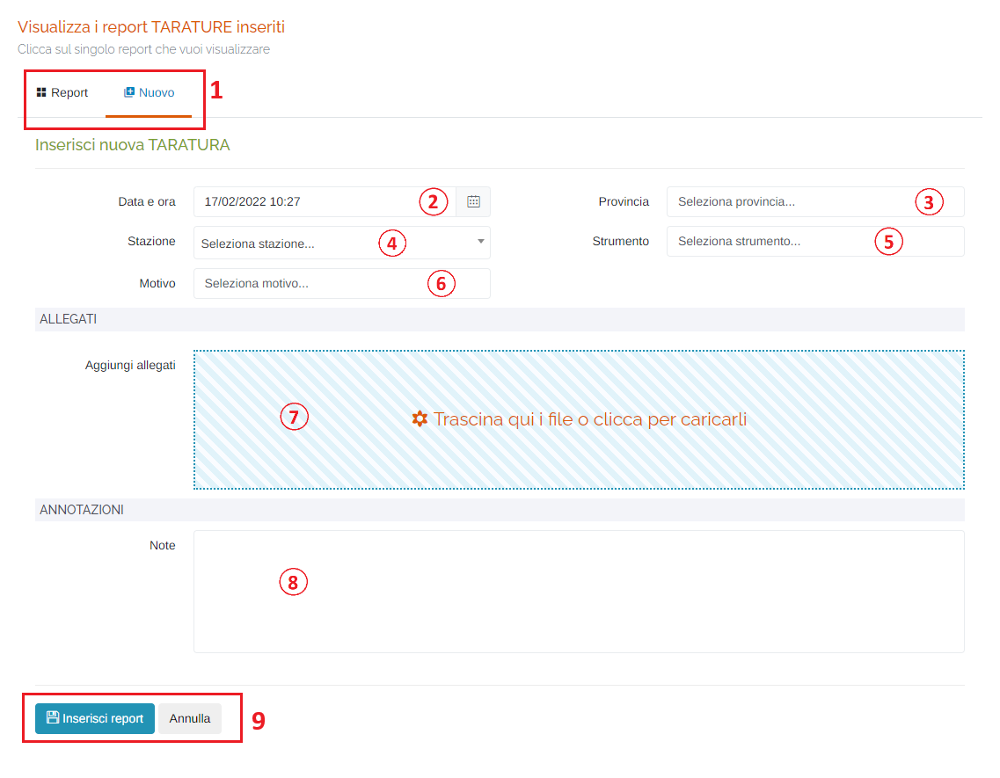
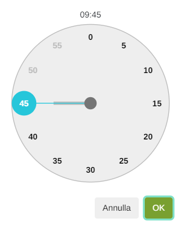

# REPORT - TARATURE

Per poter accedere a questa sezione occorre cliccare sulla voce "Report" posta nel menu principale di sinistra ed in seguito cliccare sull'elemento "Tarature".

<h3>
    > Report 
    &nbsp;&nbsp;&nbsp;&nbsp;&nbsp;&nbsp;&nbsp;&nbsp; <i>o</i> Tarature
</h3>

Questa pagina permette di visualizzare, inserire e modificare i report tarature presenti sul portale.

1. Schede della pagina:

    * <u>Report</u>: visualizza la tabella dei report;
    * <u>Nuovo</u>: pagina per l'inserimento di un nuovo report (vedi "Inserisci nuova TARATURA");

2. Periodo temporale:

    Attraverso questo strumento è possibile impostare il periodo temporale per la visualizzazione dei dati.

    È importante ricordare che, per impostare il periodo, è SEMPRE NECESSARIO CLICCARE DUE VOLTE, una per il giorno d'inizio e una per il giorno di fine.

    Una volta selezionato il periodo, premere il pulsante Applica per completare l'operazione.

    

    &nbsp;&nbsp;&nbsp;&nbsp;&nbsp;&nbsp;a. Data d'inizio; 
    &nbsp;&nbsp;&nbsp;&nbsp;&nbsp;&nbsp;b. Data di fine; 
    &nbsp;&nbsp;&nbsp;&nbsp;&nbsp;&nbsp;c. Pulsante <u>Applica</u>; 
    &nbsp;&nbsp;&nbsp;&nbsp;&nbsp;&nbsp;d. Pulsante <u>Annulla</u>: chiude la finestra del periodo temporale; 
    &nbsp;&nbsp;&nbsp;&nbsp;&nbsp;&nbsp;e. Calendario mese precedente; 
    &nbsp;&nbsp;&nbsp;&nbsp;&nbsp;&nbsp;f. Calendario mese corrente. 

3. Elenco reti disponibili sul portale;

    

4. Elenco province disponibili sul portale;

5. Elenco stazioni disponibili sul portale;

    

6. Elenco degli strumenti;
7. Pulsanti <u>CSV</u> - <u>PDF</u> - <u>STAMPA</u> : è possibile scaricare l'elenco dei dissesti sottostanti in due formati, CSV e PDF, oppure stamparlo direttamente;
8. Pulsante <u>PDF REPORTS</u>: impostando il periodo temporale e rete (più, eventualmente, una stazione) è possibile generare un PDF cumulativo delle tarature filtrate;
9. <u>Filtro di ricerca nella tabella</u>: la ricerca viene effettuata su tutte le colonne;
10. Tabella dei report: verranno visualizzate le seguenti informazioni:

    * Data di emissione del report;
    * Nome dell'operatore che ha fatto il report;
    * Rete di appartenenza;
    * Nome della stazione;
    * Nome dello strumento di cui si è effettuata la taratura;
    * Eventuali note;

11. Pulsanti d'azione:

    * <u>Visualizza</u> </img> : viene aperta una nuova scheda della pagina dove verrà visualizzato il dettaglio del report tarature selezionato;

        

    * <u>Modifica</u> </img> : si aprirà la scheda di modifica del report (scheda uguale alla scheda di inserimento di un nuovo report, ma effettuerà la modifica)
    * <u>Scarica PDF</u> </img> : verrà scaricato il PDF del report selezionato;
    * <u>Elimina</u> </img> : elimina il report selezionato;

12. Esplorazione delle pagine;

## Inserisci nuova TARATURA

Cliccando sulla scheda "Nuovo", sarà possibile inserire una nuova taratura compilando i vari campi:

1. Schede della pagina (come sopra);
2. Data e ora della taratura: verrà visualizzato il seguente form per la selezione della data e dell'ora:

    Data:

    

    1. Mese precedente;
    2. Mese successivo;
    3. Anno precedente;
    4. Anno successivo;
    5. Scelta del giorno;
    6. Pulsanti 'Annulla' (ritorna alla schermata precedente) e 'OK' (imposta la data selezionata);  

    Ora:

    
    

    Per impostare l'ora e i minuti, cliccare sui numeri presenti nell'orologio visualizzato e premere 'OK'; si imposterà prima l'ora e dopo i minuti;

3. Elenco province disponibili sul portale;

4. Elenco stazioni disponibili sul portale;

    

5. Elenco degli strumenti (è possibile anche digitare lo strumento per cercarlo tra quelli elencati): selezionando un determinato strumento verrà visualizzata la relativa maschera per inserire i dati della taratura;
6. Elenco delle motivazioni per cui si è effettuata la taratura (è possibile anche digitare la motivazione per cercarla tra quelle elencate);
7. Aggiungi allegati: è possibile inserire allegati al report; al click verrà visualizzata la finestra di sistema per scegliere i file;
8. Eventuali note;
9. Pulsanti <u>Inserisci report</u> e <u>Annulla</u> : cliccare il pulsante Inserisci report per effettuare l'inserimento del nuovo report', oppure il pulsante Annulla per ritornare alla scheda 'Report';

