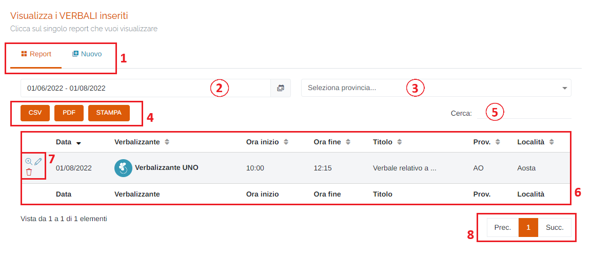
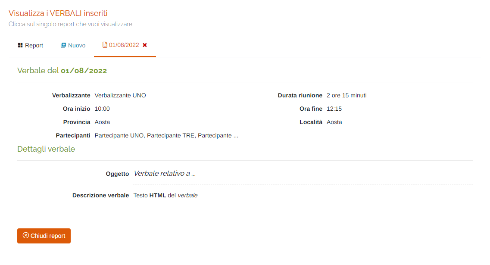
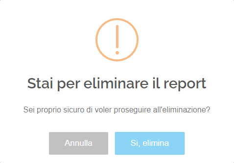
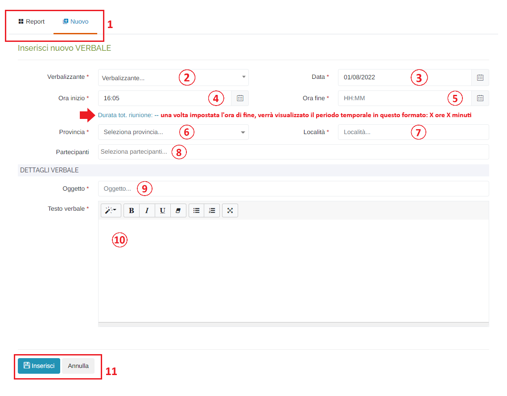
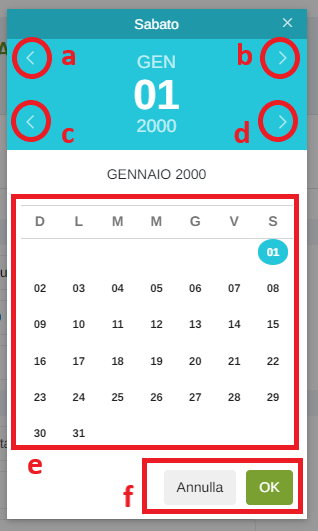
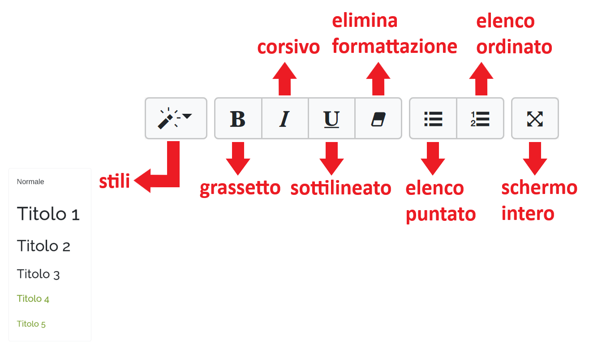

# REPORT - VERBALI

Per poter accedere a questa sezione occorre cliccare sulla voce "Report" posta nel menu principale di sinistra ed in seguito cliccare sull'elemento "Verbali".

<h3>
    > Report 
    &nbsp;&nbsp;&nbsp;&nbsp;&nbsp;&nbsp;&nbsp;&nbsp; <i>o</i> Verbali
</h3>

Questa pagina permette di visualizzare le informazioni di anagrafica delle stazioni e dei relativi parametri.

1. Schede della pagina:

   * Tabella dei verbali;
   * Scheda Nuovo: inserisci un nuovo verbale (vedi "Inserimento nuovo VERBALE");

2. Periodo temporale:

    Attraverso questo strumento è possibile impostare il periodo temporale per la visualizzazione dei report.

    È importante ricordare che, per impostare il periodo, è SEMPRE NECESSARIO CLICCARE DUE VOLTE, una per il giorno d'inizio e una per il giorno di fine.

    Una volta selezionato il periodo, premere il pulsante Applica per completare l'operazione.

    

    &nbsp;&nbsp;&nbsp;&nbsp;&nbsp;&nbsp;a. Data d'inizio; 
    &nbsp;&nbsp;&nbsp;&nbsp;&nbsp;&nbsp;b. Data di fine; 
    &nbsp;&nbsp;&nbsp;&nbsp;&nbsp;&nbsp;c. Pulsante <u>Applica</u>; 
    &nbsp;&nbsp;&nbsp;&nbsp;&nbsp;&nbsp;d. Pulsante <u>Annulla</u>: chiude la finestra del periodo temporale; 
    &nbsp;&nbsp;&nbsp;&nbsp;&nbsp;&nbsp;e. Calendario mese precedente; 
    &nbsp;&nbsp;&nbsp;&nbsp;&nbsp;&nbsp;f. Calendario mese corrente. 

3. Seleziona <u>Provincia</u>;
4. Pulsanti <u>CSV</u> - <u>PDF</u> - <u>STAMPA</u> : è possibile scaricare l'elenco dei verbali sottostanti in due formati, CSV e PDF, oppure stamparlo direttamente;
5. <u>Filtro di ricerca nella tabella</u>: la ricerca viene effettuata su tutte le colonne della tabella;
6. Tabella dei verbali;
7. Pulsanti:

    * Visualizza dettaglio </img> : cliccando questo pulsante è possibile aprire la visualizzazione del dettaglio del report:

        

    * Modifica verbale </img> : cliccando questo pulsante è possibile modificare il verbale scelto; verrà ricaricato il report e sarà possibile modificarlo: cliccare su "Invia report" nell'ultima pagina per rendere effettive le modifiche.

    * Elimina verbale </img> : cliccando questo pulsante è possibile eliminare il verbale scelto: verrà visualizzato il seguente messaggio di attenzione:

        

        Cliccare "Si, elimina" per confermare l'eliminazione.

8. Esplorazione delle pagine;

## Inserimento nuovo VERBALE

1. Schede della pagina (come sopra);
2. Seleziona <u>Verbalizzante</u> (*obbligatorio);
3. Inserire la <u>Data</u> (*obbligatorio): verrà visualizzato il seguente form per la selezione della data:

    

    &nbsp;&nbsp;&nbsp;&nbsp;&nbsp;&nbsp;a. Mese precedente; 
    &nbsp;&nbsp;&nbsp;&nbsp;&nbsp;&nbsp;b. Mese successivo; 
    &nbsp;&nbsp;&nbsp;&nbsp;&nbsp;&nbsp;c. Anno precedente; 
    &nbsp;&nbsp;&nbsp;&nbsp;&nbsp;&nbsp;d. Anno successivo; 
    &nbsp;&nbsp;&nbsp;&nbsp;&nbsp;&nbsp;e. Scelta del giorno; 
    &nbsp;&nbsp;&nbsp;&nbsp;&nbsp;&nbsp;f. Pulsanti 'Annulla' (ritorna alla schermata precedente) e 'OK' (imposta la data selezionata); 

4. Impostare l'<u>Ora d'inizio</u> della riunione (*obbligatorio): di default viene impostata l'ora corrente;
5. Impostare l'<u>Ora di fine</u> della riunione (*obbligatorio);

    Per impostare l'ora e i minuti, cliccare sui numeri presenti nell'orologio visualizzato e premere 'OK'; si imposterà prima l'ora e dopo i minuti;

    
    

6. Seleziona <u>Provincia</u> (*obbligatorio);
7. Seleziona <u>Località</u> (*obbligatorio);
8. Seleziona <u>Partecipanti</u>: possibile scelta multipla;
9. Inserire l'<u>Oggetto del verbale</u> (*obbligatorio);
10. Inserire il <u>Testo del verbale</u> (*obbligatorio);

    Nel campo d'inserimento della descrizione è possibile applicare delle impostazioni per la formattazione del testo, di seguito la spiegazione dei pulsanti disponibili:

    

11. Pulsanti <u>Inserisci</u> e <u>Annulla</u> : cliccare il pulsante "Inserisci" per effettuare l'inserimento del nuovo verbale, oppure il pulsante 'Annulla' per ritornare alla scheda 'Report';

