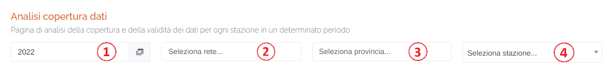
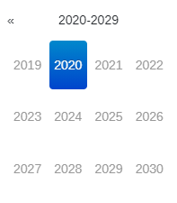
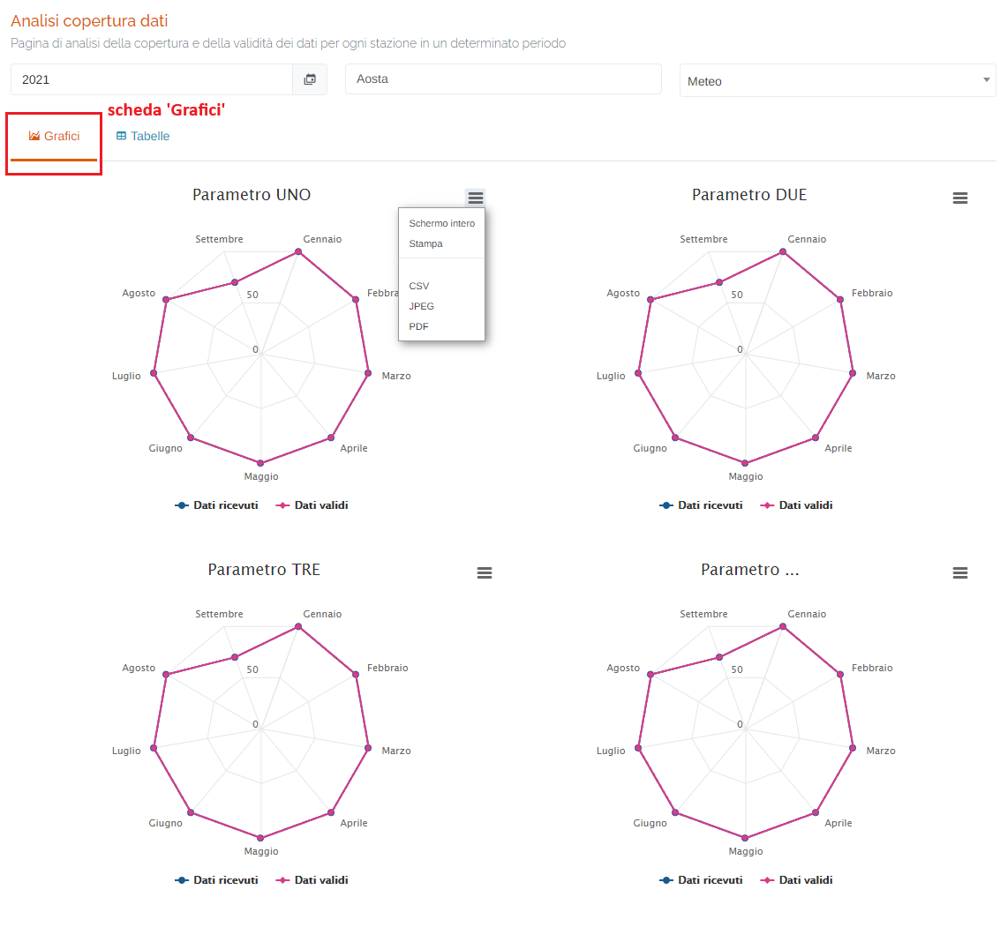
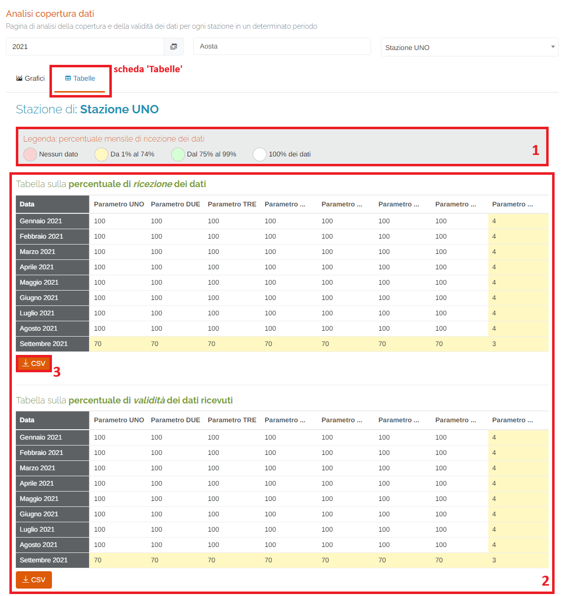
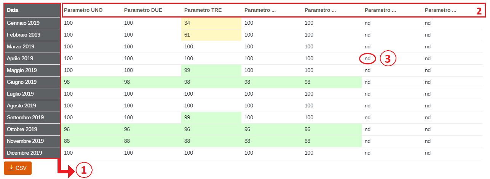

# STATISTICHE - ANALISI COPERTURA

Per poter accedere a questa sezione occorre cliccare sulla voce "Statistiche" posta nel menu principale di sinistra ed in seguito cliccare sull'elemento "Analisi copertura".

<h3>
    > Statistiche 
    &nbsp;&nbsp;&nbsp;&nbsp;&nbsp;&nbsp;&nbsp;&nbsp; <i>o</i> Analisi copertura
</h3>

Questa pagina permettere di visualizzare la percentuale mensile di ricezione dei dati relativi ai parametri di ogni stazione associata al portale in un determinato anno scelto dall'utente.

1. Anno che si vuole visualizzare;

    

2. Elenco reti disponibili sul portale;
3. Elenco province disponibili sul portale;
4. Elenco/ricerca stazioni disponibili sul portale;

    

Una volta selezionata la stazione, verranno visualizzate due schede: 'Grafici' e 'Tabelle'.

## Scheda 'Grafici'

In questa scheda viene visualizzata la percentuale di ricezione e validità dei dati ricevuti in formato grafico.

Attraverso quest'icona  è possibile visualizzare a schermo intero il grafico, stamparlo oppure effettuarne il download in formato CSV (verranno scaricati i dati), JPEG (immagine) o PDF (documento).

## Scheda 'Tabelle'

1. Legenda dei colori della tabella delle percentuali dei dati;

    

2. Tabelle ricezione e validità dei dati;
3. Pulsante <u>CSV</u>: è possibile scaricare la tabella e i relativi dati in formato .csv;

Le tabelle saranno formate da 12 righe (una per ogni mese) e tante colonne quanti sono i parametri presenti nella stazione.

Per ogni singolo parametro verrà visualizzata la percentuale totale di ricezione (tabella 1) e validità (tabella 2) dei dati grezzi ricevuti dalla stazione per ogni mese di un dato anno.

In particolare:

1. Colonna <u>Data</u>;
2. Colonne dei parametri presenti sulla stazione;
3. Singolo Valore;

Il dato può assumere anche i seguenti valori:

* **<u>nd</u>**: il parametro non è acquisito dalla stazione; ciò implica che non sono presenti dati nel mese di riferimento;
* **<u>0 (Zero)</u>**: il parametro è acquisito dalla stazione, ma la percentuale dei dati presenti nel mese di riferimento è inferiore all'1%;

