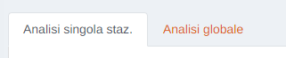
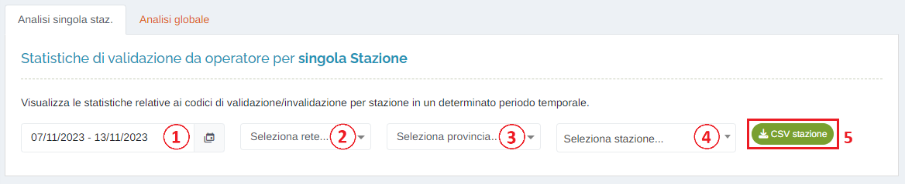
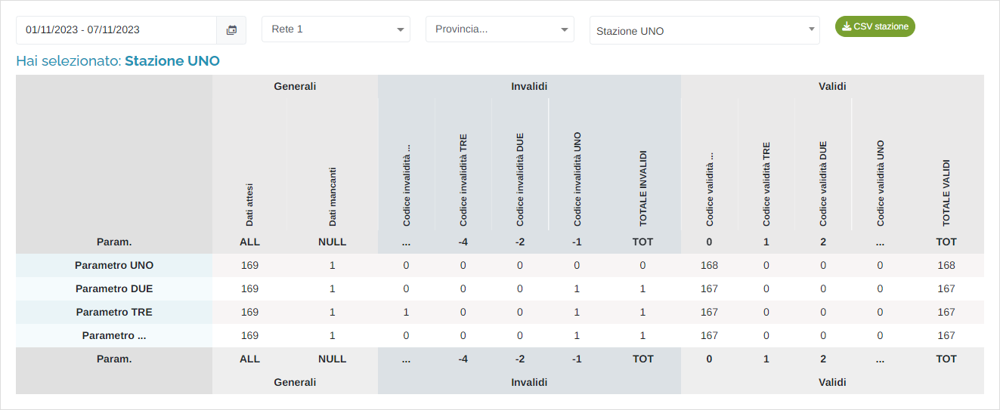
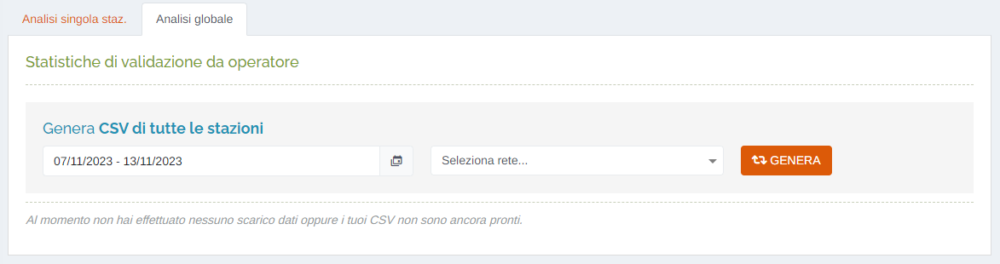
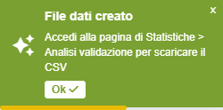
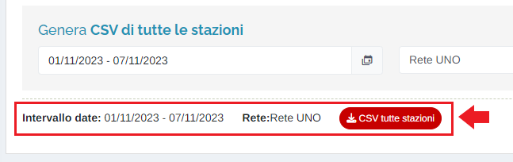

# STATISTICHE - ANALISI VALIDAZIONE

Per poter accedere a questa sezione occorre cliccare sulla voce "Statistiche" posta nel menu principale di sinistra ed in seguito cliccare sull'elemento "Analisi validazione".

<h3>
    > Statistiche 
    &nbsp;&nbsp;&nbsp;&nbsp;&nbsp;&nbsp;&nbsp;&nbsp; <i>o</i> Analisi validazione
</h3>

In questa sezione è possibile visualizzare le statistiche relative ai codici di validazione/invalidazione, suddivise per stazione, in un determinato periodo temporale impostabile dall'utente.

La pagina è suddivisa in due macro sezioni:

## Analisi singola stazione

1. Periodo temporale:

    Attraverso questo strumento è possibile impostare il periodo temporale per la visualizzazione dei dati.

    È importante ricordare che, per impostare il periodo, è SEMPRE NECESSARIO CLICCARE DUE VOLTE, una per il giorno d'inizio e una per il giorno di fine.

    Una volta selezionato il periodo, premere il pulsante Applica per completare l'operazione.

    

    &nbsp;&nbsp;&nbsp;&nbsp;&nbsp;&nbsp;&nbsp;a. Valori preimpostati OPPURE personalizzati dall'utente; 
    &nbsp;&nbsp;&nbsp;&nbsp;&nbsp;&nbsp;&nbsp;b. Pulsante per visualizzare il mese precedente; 
    &nbsp;&nbsp;&nbsp;&nbsp;&nbsp;&nbsp;&nbsp;c. Pulsante per visualizzare il mese successivo. 
    &nbsp;&nbsp;&nbsp;&nbsp;&nbsp;&nbsp;&nbsp;d. Calendario mese precedente; 
    &nbsp;&nbsp;&nbsp;&nbsp;&nbsp;&nbsp;&nbsp;e. Calendario mese successivo. 
    &nbsp;&nbsp;&nbsp;&nbsp;&nbsp;&nbsp;&nbsp;f. Pulsante <u>Annulla</u>: chiude la finestra del periodo temporale; 
    &nbsp;&nbsp;&nbsp;&nbsp;&nbsp;&nbsp;&nbsp;g. Pulsante <u>Applica</u>; 

2. Filtro per rete;
3. Filtro per provincia;
4. Selezione della stazione di cui si intende visualizzare le statistiche;
5. Pulsante </img> : tramite questo pulsante è possibile effettuare il download delle statistiche estratte in formato *.csv*.

Una volta selezionata la stazione, verranno estratte le relative statistiche:

E' importante ricordare che talvolta il totale dei dati invalidi/validi può non combaciare con l'effettivo numero dei dati invalidi/validi presi per singolo codice: ad esempio, nell'immagine, per il parametro "Parametro TRE" il "TOT" è 1, ma la somma dei dati presi singolarmente è 2 (1+1). Questo avviene perché è possibile che un singolo dato possa contenere molteplici codici di invalidità/validità e, di conseguenza, viene conteggiato più di una volta. Il totale dei dati invalidi/validi, invece, non tiene conto del numero di codici assegnati, ma solo dello stato di validità del dato stesso che, quindi, viene conteggiato un'unica volta.

## Analisi globale

1. Periodo temporale (come sopra);
2. Selezione della rete di cui si intende visualizzare le statistiche per stazione;
3. Pulsante </img>

Una volta selezionati il periodo temporale e la rete, cliccando il pulsante "Genera", verrà effettuata la richiesta al sistema di generazione di un file, formato *.csv* contenente le statistiche, relative al periodo temporale scelto, delle stazioni appartenenti alla rete scelta:

Quando il file è stato generato, il sistema avvisa l'utente tramite una notifica posta in alto a destra sul portale:

Inoltre, posta al di sotto dei campi d'inserimento, verranno visualizzate le informazioni relative all'ultimo file *.csv* generato:

Infine, per effettuare il download del file *.csv* richiesto, cliccare il pulsante </img> .

