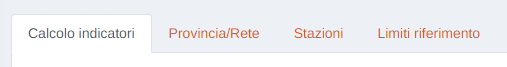
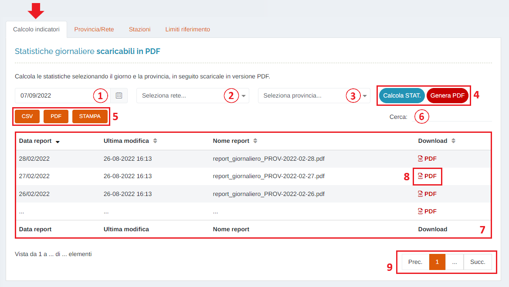
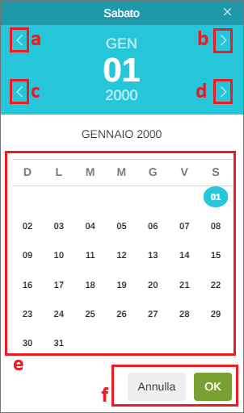
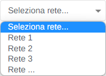
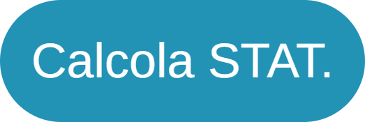
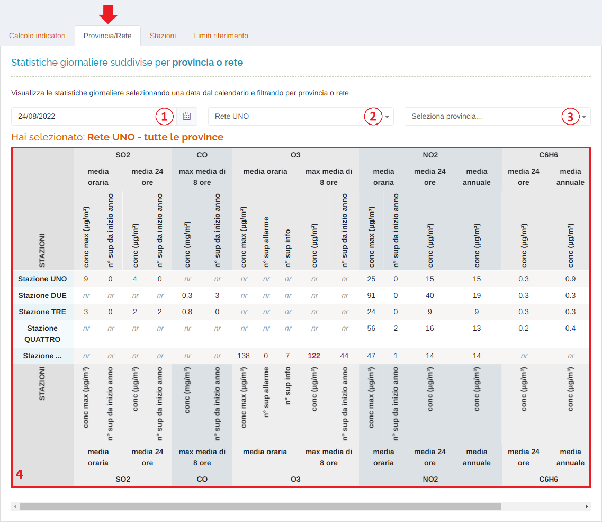
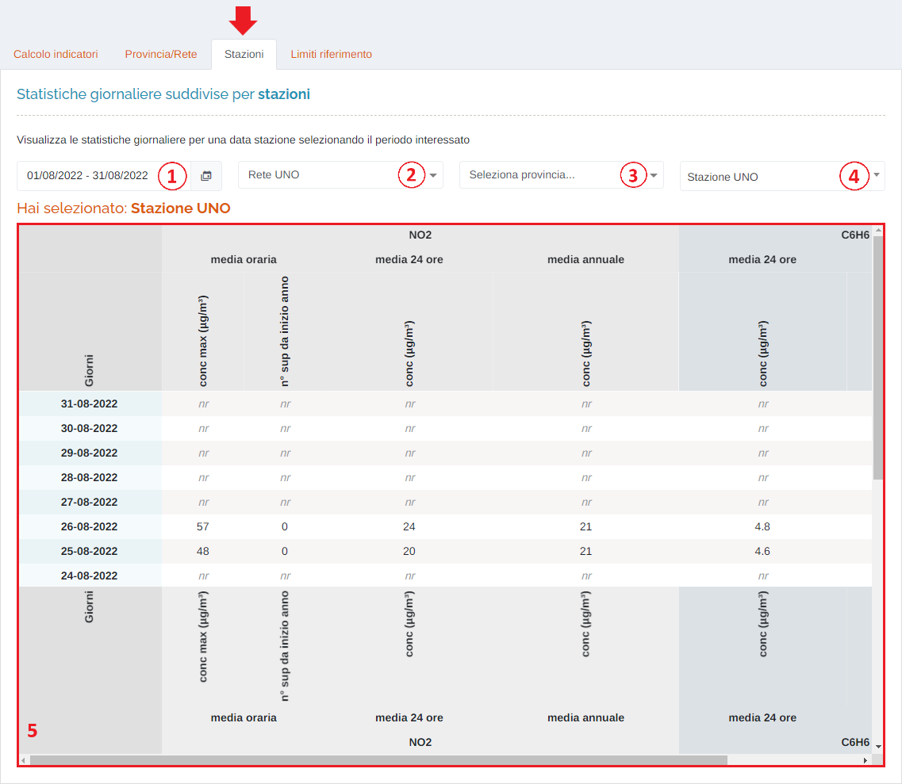
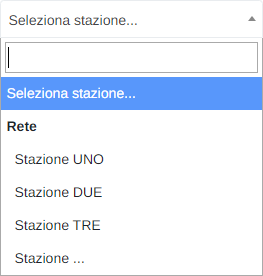
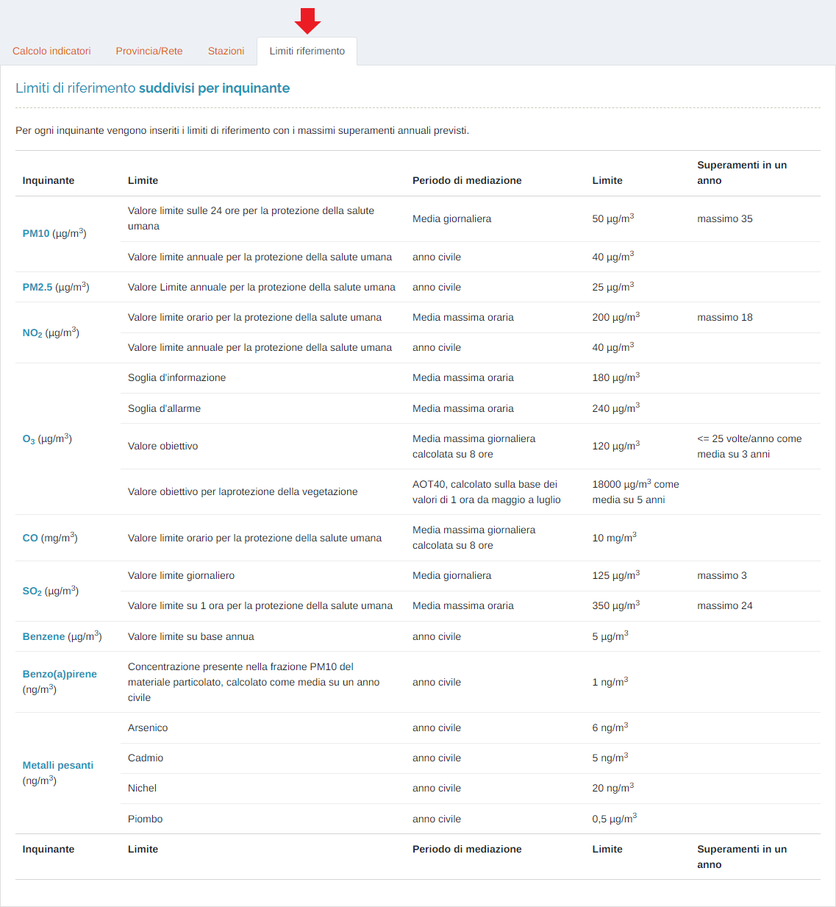

# STATISTICHE - INDICATORI GIORNALIERI

Per poter accedere a questa sezione è necessario cliccare sulla voce "Statistiche", posta nel menu principale di sinistra, ed in seguito cliccare sull'elemento "Indicatori giornalieri".

<h3>
    > Statistiche 
    &nbsp;&nbsp;&nbsp;&nbsp;&nbsp;&nbsp;&nbsp;&nbsp; <i>o</i> Indicatori giornalieri
</h3>

Sono presenti le seguenti schede:

* <u>Calcolo indicatori</u>: è possibile calcolare le statistiche selezionando il giorno e la provincia, in seguito scaricarle in versione PDF;
* <u>Provincia/Rete</u>: è possibile visualizzare le statistiche giornaliere selezionando una data dal calendario e filtrando per provincia o rete;
* <u>Stazioni</u>: è possibile visualizzare le statistiche giornaliere per una data stazione selezionando il periodo interessato;
* <u>Limiti riferimento</u>: vengono visualizzati, per ogni inquinante, i limiti di riferimento con i massimi superamenti annuali previsti.

## Calcolo indicatori

1. <u>Data</u>: verrà visualizzato il seguente form per la selezione della data:

    Data:

    

    &nbsp;&nbsp;&nbsp;&nbsp;&nbsp;&nbsp;a. Mese precedente; 
    &nbsp;&nbsp;&nbsp;&nbsp;&nbsp;&nbsp;b. Mese successivo; 
    &nbsp;&nbsp;&nbsp;&nbsp;&nbsp;&nbsp;c. Anno precedente; 
    &nbsp;&nbsp;&nbsp;&nbsp;&nbsp;&nbsp;d. Anno successivo; 
    &nbsp;&nbsp;&nbsp;&nbsp;&nbsp;&nbsp;e. Scelta del giorno; 
    &nbsp;&nbsp;&nbsp;&nbsp;&nbsp;&nbsp;f. Pulsanti 'Annulla' (ritorna alla schermata precedente) e 'OK' (imposta la data selezionata); 

2. Elenco reti disponibili sul portale;

    

3. Elenco province disponibili sul portale;
4. Pulsanti:

    * <u>Calcola STAT.</u> </img> : cliccando questo pulsante si effettua il calcolo delle statistiche in base al giorno, la rete e la provincia selezionate;
    * <u>Genera PDF</u> </img> : una volta calcolate le statistiche, cliccando questo pulsante, è possibile generare il PDF riassuntivo che sarà successivamente a disposizione per il download nella tabella sottostante.

5. Pulsanti <u>CSV</u> - <u>PDF</u> - <u>STAMPA</u> : è possibile scaricare l'elenco dei PDF sottostanti in due formati, CSV e PDF, oppure stamparlo direttamente;
6. Filtro di ricerca nella tabella: la ricerca viene effettuata su tutte le colonne;
7. Tabella dei report PDF;
8. Pulsante <u>PDF</u> </img>: apre la visualizzazione del PDF;
9. Esplorazione delle pagine;

## Provincia/Rete

1. <u>Data</u> (come sopra);
2. Elenco reti disponibili sul portale;
3. Elenco province disponibili sul portale;
4. Tabella delle statistiche;

## Stazioni

1. Periodo temporale;

    Attraverso questo strumento è possibile impostare il periodo temporale per la visualizzazione dei dei dati.

    L'utente ha due possibilità: selezionare il periodo dall'elenco di default presente sulla sinistra (punto "a."), oppure impostarlo manualmente (nell'elenco di default verrà selezionato automaticamente "Personalizza"). In quest'ultimo caso, è importante ricordare che, per impostare il periodo, è SEMPRE NECESSARIO CLICCARE DUE VOLTE, una per il giorno d'inizio e una per il giorno di fine.

    Una volta selezionato il periodo, premere il pulsante Applica per completare l'operazione.

    

    &nbsp;&nbsp;&nbsp;&nbsp;&nbsp;&nbsp;a. Periodi di default; 
    &nbsp;&nbsp;&nbsp;&nbsp;&nbsp;&nbsp;b. Calendario mese precedente; 
    &nbsp;&nbsp;&nbsp;&nbsp;&nbsp;&nbsp;c. Calendario mese corrente; 
    &nbsp;&nbsp;&nbsp;&nbsp;&nbsp;&nbsp;f. Pulsante <u>Annulla</u>: chiude la finestra del periodo temporale; 
    &nbsp;&nbsp;&nbsp;&nbsp;&nbsp;&nbsp;e. Pulsante <u>Applica</u>; 

2. Elenco reti disponibili sul portale;
3. Elenco province disponibili sul portale;
4. Elenco stazioni disponibili sul portale;

    

5. Tabella delle statistiche;

## Limiti riferimento

