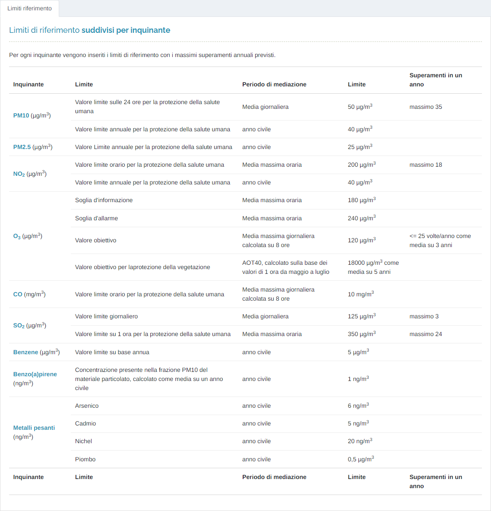

# STATISTICHE - INFO LIMITI

Per poter accedere a questa sezione occorre cliccare sulla voce "Statistiche" posta nel menu principale di sinistra ed in seguito cliccare sull'elemento "Info limiti".

<h3>
    > Statistiche 
    &nbsp;&nbsp;&nbsp;&nbsp;&nbsp;&nbsp;&nbsp;&nbsp; <i>o</i> Info limiti
</h3>

In questa pagina vengono visualizzati, per ogni inquinante, i limiti di riferimento con i massimi superamenti annuali previsti da normativa europea.

