# STATISTICHE - REPORTISTICA

Per poter accedere a questa sezione occorre cliccare sulla voce "Statistiche" posta nel menu principale di sinistra ed in seguito cliccare sull'elemento "Reportistica".

<h3>
    > Statistiche 
    &nbsp;&nbsp;&nbsp;&nbsp;&nbsp;&nbsp;&nbsp;&nbsp; <i>o</i> Reportistica
</h3>

La pagina è suddivisa in due macro sezioni:

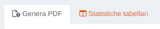

## Genera PDF

In questa sezione è possibile calcolare le statistiche giornaliere, mensili o annuali di una determinata zona della propria rete di appartenenza e generare il relativo PDF con la possibilità di effettuarne il download.

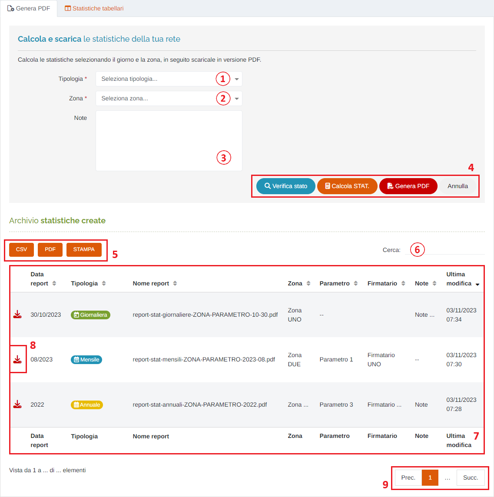

1. Selezione della tipologia di statistiche (*obbligatorio);

    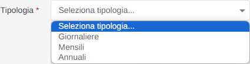

    In base alla tipologia scelta verranno visualizzati ulteriori campi da compilare:

    * Giornaliere

        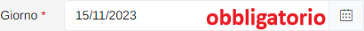

        Verrà visualizzato il seguente form per la selezione della data:

        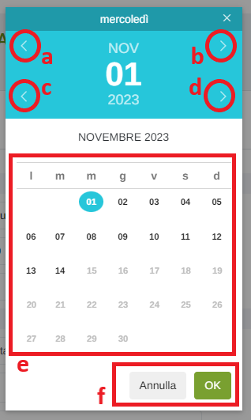

        1. Mese precedente;
        2. Mese successivo;
        3. Anno precedente;
        4. Anno successivo;
        5. Scelta del giorno;
        6. Pulsanti 'Annulla' (ritorna alla schermata precedente) e 'OK' (imposta la data selezionata);  

    * Mensili

        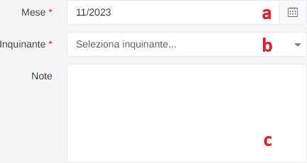

        1. Selezione del mese (*obbligatorio);
        2. Selezione dell'inquinante (*obbligatorio);
        3. Eventuali note;

    * Annuali

        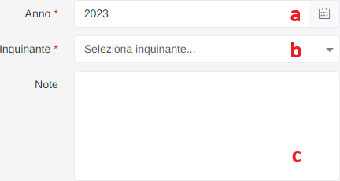

        1. Selezione dell'anno (*obbligatorio);
        2. Selezione dell'inquinante (*obbligatorio);
        3. Eventuali note;

2. Selezione della zona (*obbligatorio);
3. Eventuali note, OPPURE selezionare l'utente <u>Firmatario</u> del report (disponibile se si seleziona la tipologia 'Mensili' o 'Annuali' - campo *obbligatorio);
4. Pulsanti:

    * </img> : tramite questo pulsante vengono verificati i dati delle stazioni relative a periodo, zona e inquinante selezionati. I controlli che vengono effettuati sono:

        * presenza di dati negativi;
        * presenza di dati non "visti" dal validatore;

        Una volta completati i controlli verrà visualizzato uno dei seguenti messaggi in base al risultato delle operazioni di verifica:

        * Tutto OK:

        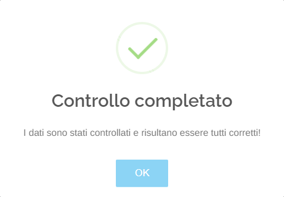

        * Qualora risultino problemi durante il controllo, questi verranno elencati permettendo all'utente di verificare i dati prima di riprovare ad effettuare l'operazione:

        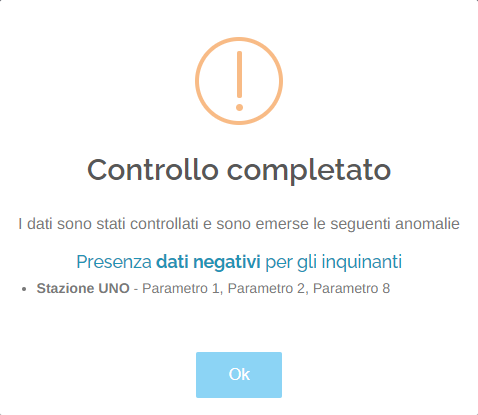

    * </img> : tramite questo pulsante verrà effettuata la richiesta di calcolo delle statistiche relative a tipologia, periodo, e zona e scelti dall'utente, al sistema. Le statistiche verranno calcolate per <u>TUTTI</u> gli inquinanti analizzati dalle stazioni associate alla zona scelta.

        Verrà visualizzato il seguente messaggio:

        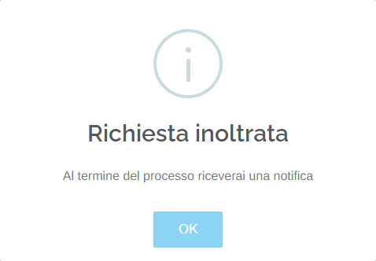

        A questo punto l'utente può continuare ad utilizzare il portale anche cambiando la pagina visualizzata poiché, una volta terminato il calcolo delle statistiche, il sistema invierà una notifica, posta in alto a destra sullo schermo:

        

    * </img> : tramite questo pulsante verrà generato il file PDF del report relativo alle statistiche appena calcolate. A differenza del calcolo delle statistiche, la generazione del PDF riguarda <u>SOLAMENTE</u> l'inquinante scelto dall'utente in fase di compilazione del form di calcolo.

        Se l'operazione è andata buon fine, verrà visualizzato il seguente messaggio e il file richiesto sarà presente nella tabella sottostante:

        

    * </img> : tramite questo pulsante è possibile ripulire l'intero form;

    L'utilizzo dei tre pulsanti principali (quindi 'Annulla' escluso) è sequenziale: bisogna procedere in ordine logico da sinistra a destra e completare ogni passaggio prima di "sbloccare" il successivo.

5. Pulsanti <u>CSV</u> - <u>PDF</u> - <u>STAMPA</u> : è possibile scaricare l'elenco dei report sottostanti in due formati, CSV e PDF, oppure stamparlo direttamente;
6. <u>Filtro di ricerca nella tabella</u>: la ricerca viene effettuata su tutte le colonne;
7. Tabella dei report;

    Nella seconda colonna è presente l'indicazione della tipologia del report:

    * </img>
    * </img>
    * </img>

8. Pulsante  </img> : tramite questo pulsante è possibile effettuare il download del pdf scelto dall'elenco di quelli disponibili;
9. Esplorazione delle pagine;

## Statistiche tabellari

In questa sezione è possibile visualizzare le statistiche precedentemente calcolate, impostando un periodo temporale specifico, una determinata zona e, per quanto riguarda quelle giornaliere, la stazione da visualizzare, mentre, per quanto riguarda quelle mensili ed annuali, l'inquinante da visualizzare.

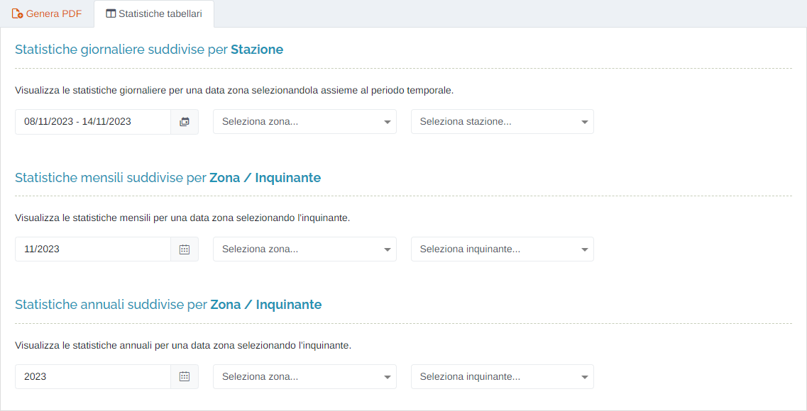

Per impostare il periodo temporale:

Una volta compilati i filtri verrà generata la seguente tabella:

* Statistiche GIORNALIERE

    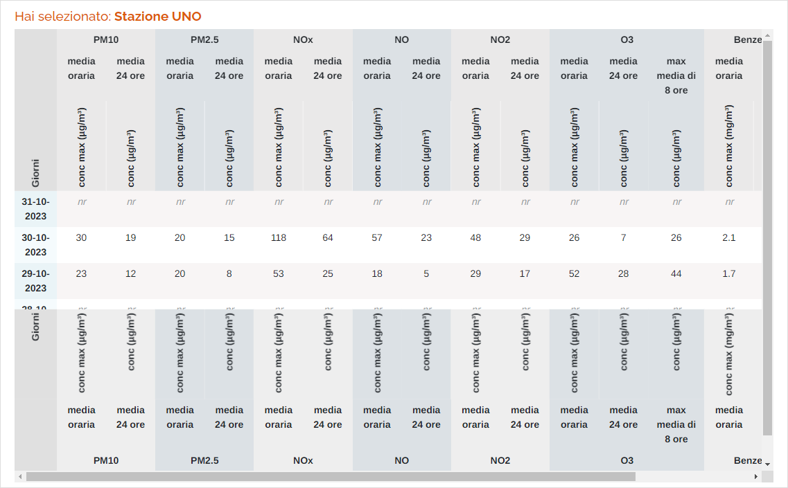

* Statistiche MENSILI/ANNUALI

    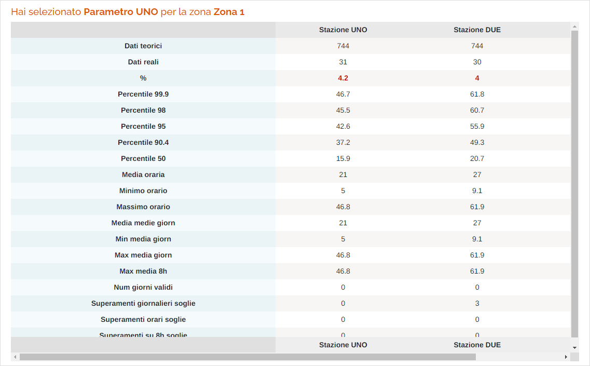

All'interno delle tabelle possono essere presenti, oltre alle semplici statistiche in colore nero:

* *nr* -> dato non rilevato
* *nd* -> dato non disponibile
* dato in rosso -> superamento del relativo limite

