# STRUMENTI - ANALYSER

Per poter accedere a questa sezione occorre cliccare sulla voce "Strumenti" posta nel menu principale di sinistra e cliccare sull'elemento "Analyser".

<h3>
    > Strumenti 
    &nbsp;&nbsp;&nbsp;&nbsp;&nbsp;&nbsp;&nbsp;&nbsp; <i>o</i> Analyser
</h3>

Verrà visualizzata la schermata principale dello strumento Analyser.

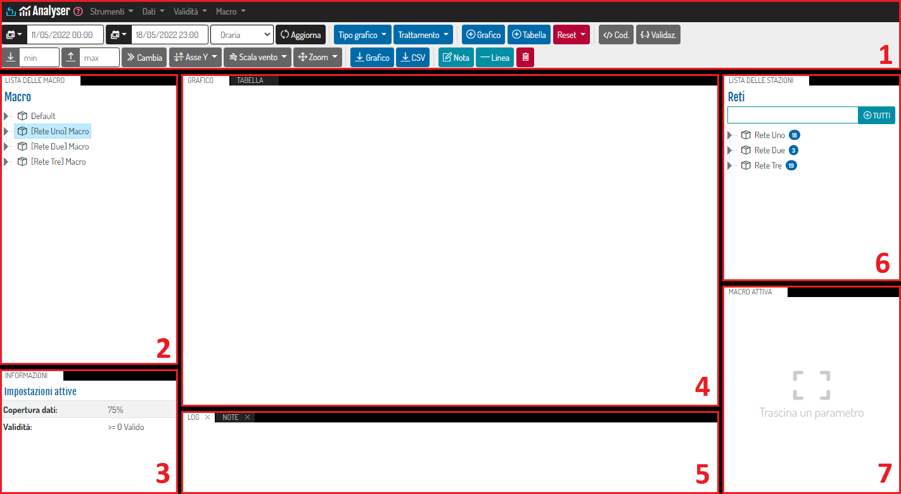

1. <u>Menu di Analyser</u>: vedi "0.1 I Menu di Analyser";
2. <u>Lista delle macro</u>: in questa finestra viene visualizzato l'albero delle macro create e salvate dall'utente rendendo possibile ritrovarle nei futuri accessi alla pagina. Sempre in quest'albero, cliccando col tasto destro del mouse sulla macro, è possibile effettuare alcune azioni, quali apertura di un nuovo tab di tipo grafico/tabella, modifica ed eliminazione della macro stessa.

    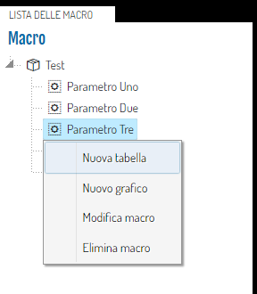

3. <u>Impostazioni attive</u>: in questa finestra vengono visualizzate le impostazioni attive modificabili dalle sezioni "Dati" e "Validità";

    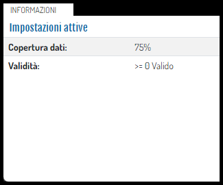

4. <u>Schermata di visualizzazione grafici e tabelle</u>: in questa sezione vengono visualizzati grafici e tabelle delle macro salvate e di quelle che si andranno a creare; trascinando i parametri desiderati dalla finestra della lista delle stazioni (vedi punto 6). la visualizzazione del grafico o della tabella verrà aggiornata automaticamente.

    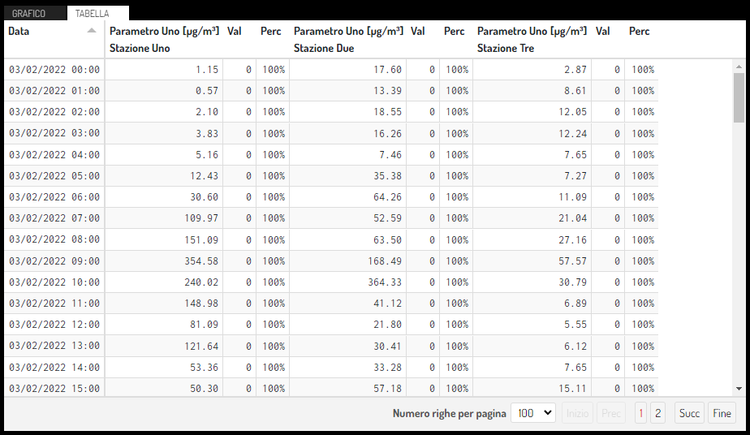

    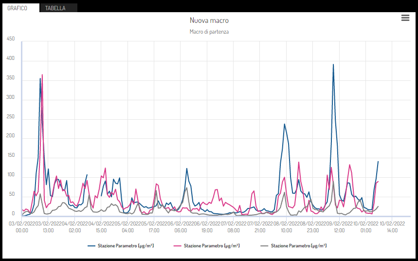

    Il grafico verrà generato in base alle impostazioni di visualizzazione che verranno indicate nei menu soprastanti, quali periodo temporale, aggregazione, tipo di grafico, range minimo e massimo e numero di assi verticali. Se si desidera apportare delle modifiche è necessario cliccare il pulsante "Aggiorna" per renderle effettive. Inoltre, tramite la legenda, è possibile mostrare/nascondere le varie funzioni al fine di evidenziare, oppure confrontare facilmente, i parametri associati alla macro attiva.

5. <u>Finestra dei log</u>: in questa sezione saranno visualizzate, in ordine cronologico e sequenziale, le varie operazioni effettuate, indicando data e ora e un messaggio descrittivo dell'evento.

    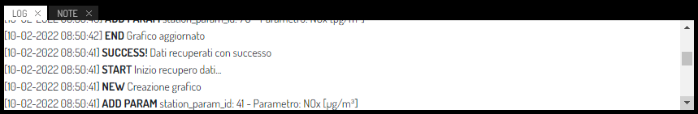

6. <u>Lista delle stazioni</u>: in questa finestra è presente la lista delle reti associate al portale con indicato il numero di stazioni associate ad esse. Cliccando sulla freccetta posta a sinistra del nome della rete, verrà visualizzata la lista delle stazioni con i relativi parametri presenti su di esse. Trascinando i parametri nel riquadro in basso a destra e cliccando su Aggiorna vengono visualizzati i dati sotto forma di grafico o tabella a seconda del tipo di tab attivo nel riquadro centrale. In alternativa, si possono trascinare i parametri direttamente nel centro affinché la visualizzazione venga aggiornata automaticamente. Per aggiungere in maniera più rapida i parametri è possibile utilizzare il campo che consente di effettuare rapide ricerche di stazioni/parametri all'interno dell'albero. Le ricerche vengono effettuate unicamente nei nodi dell'albero precedentemente caricati (aperti). A questo proposito, nel menu principale in alto sotto la voce "Strumenti > Carica albero completo" è possibile caricare velocemente tutto l'albero delle stazioni/parametri. Inoltre, se si filtra un determinato parametro e si clicca sul pulsante "+TUTTI", ogni parametro filtrato verrà aggiunto alla macro e verra visualizzato nel riquadro in basso a destra;

    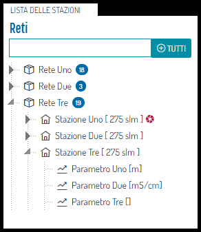

    Inoltre, a fianco del nome della stazioni che hanno come parametri "Velocità Vento Vettoriale" e "Direzione Vento Vettoriale" è presente l'icona relativa alla rosa dei venti indicata dalla freccia nella seguente immagine:

    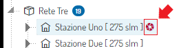

    Cliccando l'icona, verrà visualizzato il grafico della rosa dei venti della stazione selezionata in un nuovo tab della schermata di visualizzazione grafici e tabelle (punto 3):

    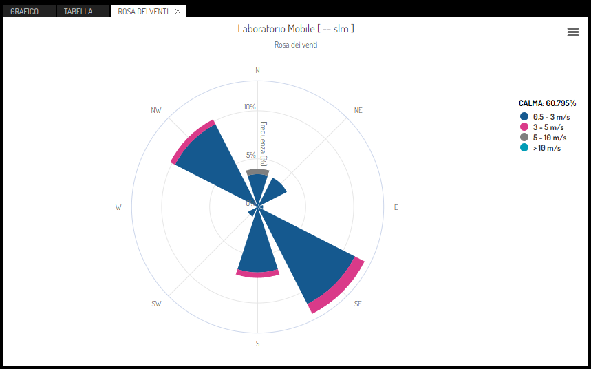

    Infine, facendo click con il tasto destro del mouse su una delle reti disponibili, è possibile caricare tutti i parametri di tutte le stazioni di quella rete ("Espandi nodo"), rendendo possibile effettuare ricerche solo sui nodi necessari e non caricare l'intero albero tramite l'opzione "Carica albero completo":

    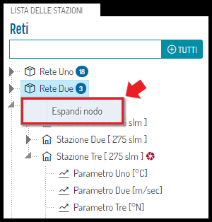

7. <u>Finestra Macro attiva</u>: in questa sezione è possibile verificare qual è la macro attiva e, inoltre, trascinando un parametro dalla lista delle stazioni verranno visualizzati i dati sotto-forma di grafico o tabella.

    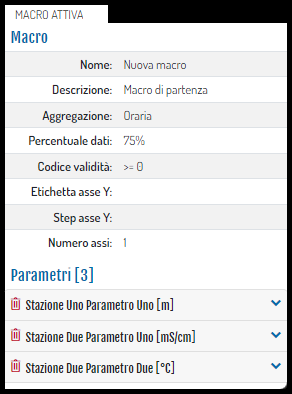

    Inoltre, è possibile visualizzare nome, formula e decimali di ogni singolo parametro aggiunto alla macro oltre che a eliminare da quest'ultima un parametro premendo il pulsante elimina: </img>. Per rendere effettiva l'eliminazione dal grafico o dalla tabella posta al centro della pagina, è necessario premere il pulsante "Aggiorna" posto nel menu in alto.

    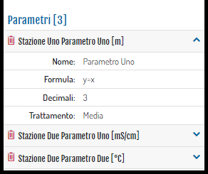

## 1 I Menu di Analyser

### 1.1 Menu Principale - Analyser

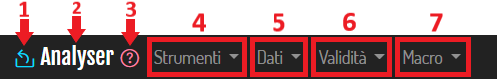

1. Torna al portale;
2. Torna alla pagina iniziale di Analyser;
3. Accedi alla documentazione (questa pagina);
4. **Strumenti**

    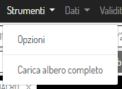

   * <u>Opzioni</u>:

        Tutte le impostazioni che si andranno a modificare in questa voce possono essere applicate in maniera temporanea (pulsante "Applica in locale") o salvate nel database (pulsante "Salva nel DB") in modo tale da ritrovarle ad un successivo accesso alla sezione. Le impostazioni sono per utente e quindi le modifiche di uno non andranno ad influenzare gli altri utenti.

        * <u>Generali</u>: in questo menu è possibile attivare/disattivare, cliccando sul relativo bottone, la visualizzazione dell'STID, della QUOTA e del valore LIMITI per la lista delle stazioni; la visualizzazione dei parametri per la lista delle macro; la visualizzazione dei dati convertiti e del trattamento per l'estrazione dati, compresa la scala del vento;

            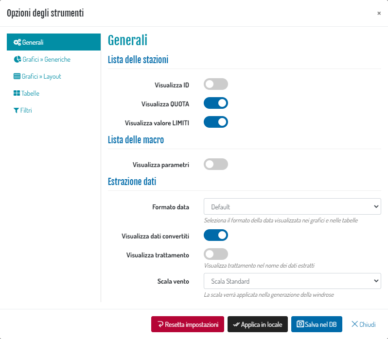

        * <u>Grafici >> Generiche</u>: in questa sezione è possibile personalizzare le impostazioni principali dei grafici che verranno generati su Analyser;

            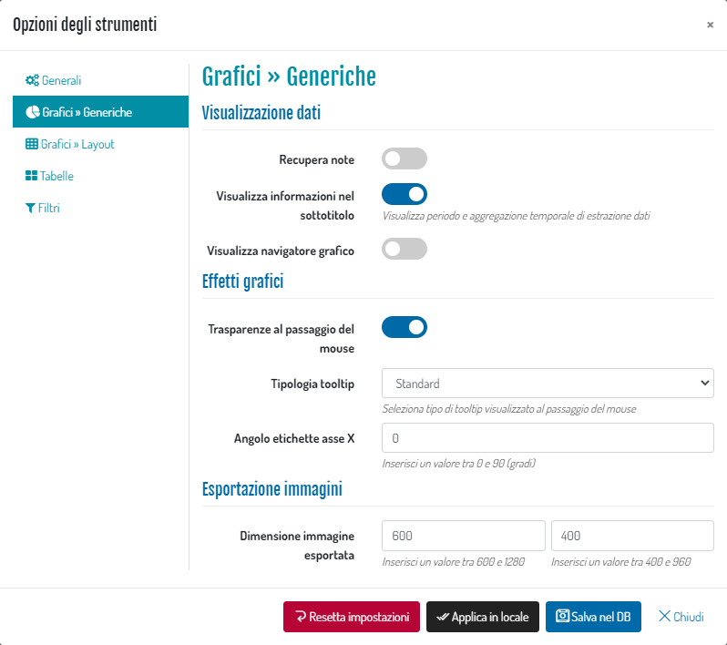

        * <u>Grafici >> Layout</u>: in questa sezione è possibile personalizzare il layout dei grafici che verranno generati su Analyser;

            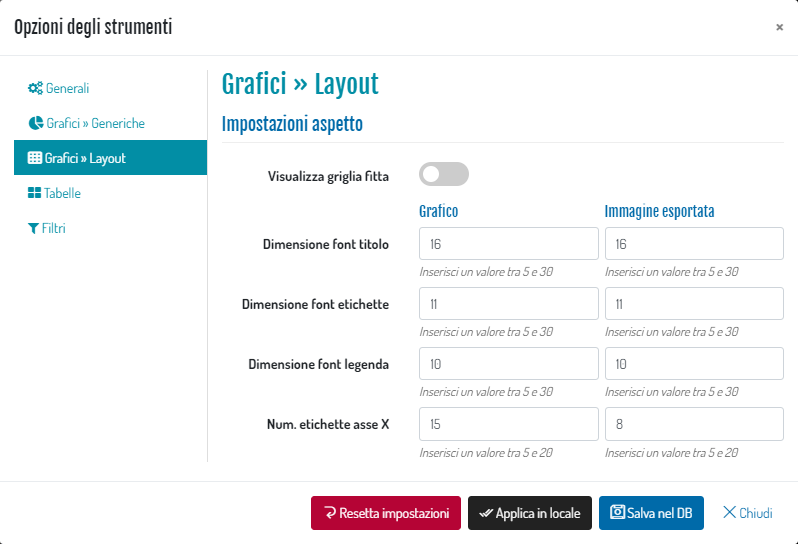

        * <u>Tabelle</u>: tramite il seguente pulsante, attivo di default, è possibile disabilitare i codici se nella macro sono caricati più di 15 parametri;

            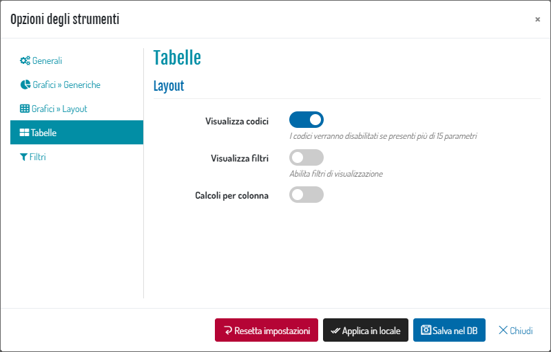

        * <u>Filtri</u>: ###

   * <u>Carica albero completo</u>:
        cliccando su questa voce è possibile caricare velocemente tutto l'albero delle stazioni/parametri. Per confermare l'azione, cliccare su "Si, carica!".

    

5. **Dati**: consente di apportare modifiche sul tipo di dati da visualizzare;

    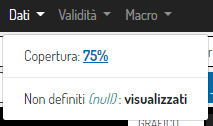

    * <u>Copertura</u>: è possibile filtrare i dati in base alla percentuale di copertura minima nell'unità temporale scelta (oraria, giornaliera, ecc.…). Questo filtro può essere applicato indicando una percentuale specifica e cliccando sul pulsante "Conferma", oppure si può cliccare direttamente uno dei due pulsanti rossi se si desidera applicare la percentuale dello 0% o del 75%. Premere il pulsante "Chiudi" per tornare alla schermata principale.

        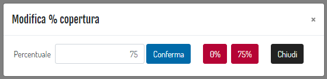

    * <u>Non definiti</u>: È possibile scegliere se visualizzare o meno i dati nulli (visualizzati di default). Per confermare l'azione, cliccare su Si, nascondi".

        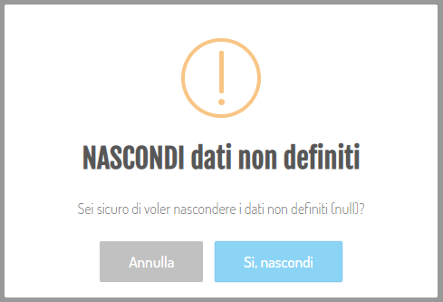

6. **Validità**: questa voce del menu principale permette di filtrare i dati visualizzati per codice di validità. È possibile filtrare i dati tramite la selezione di uno dei 3 pulsanti di minore-uguale (<=), uguale (=) e maggiore-uguale (>=) in combinazione con il codice di validità. Ad esempio, nell'immagine seguente, saranno visualizzati i dati con codice di validità maggiore o uguale a 0. Inoltre, è possibile visualizzare tutti i dati indipendentemente dal codice di validità cliccando su "Tutti i dati". Per rendere effettive le modifiche su grafici e tabelle è necessario cliccare il pulsante "Aggiorna" nel menu in alto.

    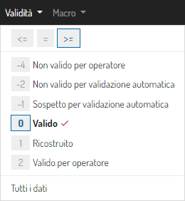

7. **Macro**: in questa voce, è possibile gestire completamente le categorie sotto cui sono organizzate le macro, salvare una macro appena creata, modificare e archiviare queste ultime in una delle categorie elencate nell'albero a sinistra.

    Come per la voce "Opzioni" le modifiche effettuate qui possono essere applicate temporaneamente (pulsante "Applica in locale") o salvate nel database (pulsante "Salva nel DB") per ritrovarle in un successivo accesso:

    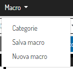

    * <u>Categorie</u>: cliccando su "Categorie" della voce precedente, si aprirà la seguente finestra in cui saranno elencate le categorie di macro esistenti con i relativi gruppi utente associati. Le categorie in elenco posso essere modificate o eliminate tramite i due pulsanti (modifica: </img>, elimina: </img>) presenti sulla sinistra. Inoltre è possibile creare una nuova categoria indicandone il nome, se è pubblica, cioè visibile a tutti gli utenti del portale, o privata attivando o disattivando il relativo bottone e i relativi gruppi associati. Per confermare l'aggiunta cliccare sul pulsante "Aggiungi";

        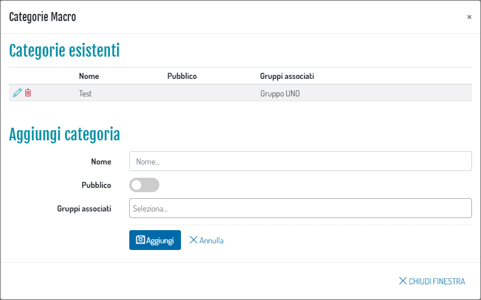

    * <u>Salva macro</u>: una volta associata la nuova macro ad una delle categorie esistenti (tramite la voce "Macro > Nuova macro") è possibile salvare la macro che verrà visualizzata nella lista delle macro a sinistra;

    * <u>Nuova macro</u> / <u>Modifica macro</u>: in questa voce è possibile creare una nuova macro e, se già attiva, modificarne una;

        * <u>Generali</u>: in questa sezione vanno indicate le impostazioni generali della nuova macro: la categoria di appartenenza, scelta tra quelle esistenti, il nome, una descrizione, il tipo di aggregazione dei dati (oraria, giornaliera, mensile o annuale), la percentuale dei dati validi, il codice di validità/invalidità, l'etichetta dell'asse verticale Y (tramite i 3 tasti a fianco del campo di testo è possibile inserire il simbolo di microgrammo "µ" e gli esponenti al quadrato e al cubo) e, infine, il numero di assi verticali che saranno visualizzati sul grafico (da 1 a 3).

           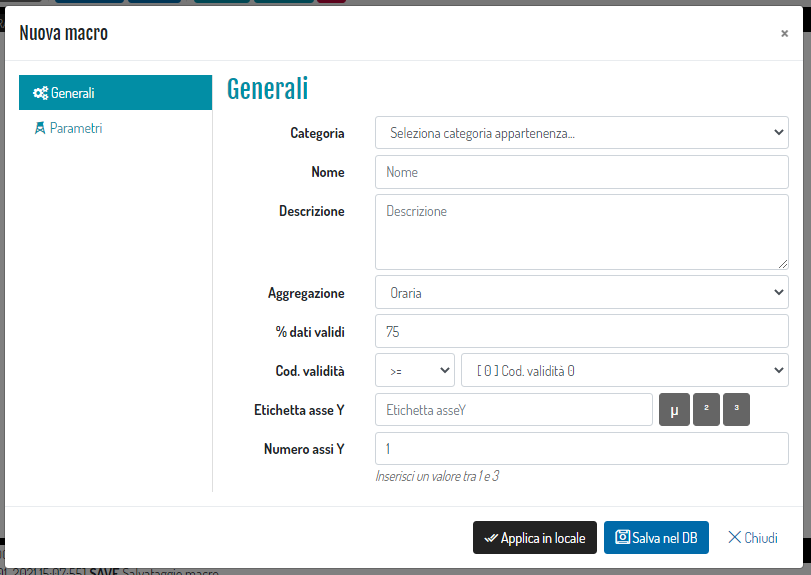

        * <u>Parametri</u>: in questa sezione è possibile selezionare i parametri associati alla macro, uno alla volta, e apportare delle modifiche.

           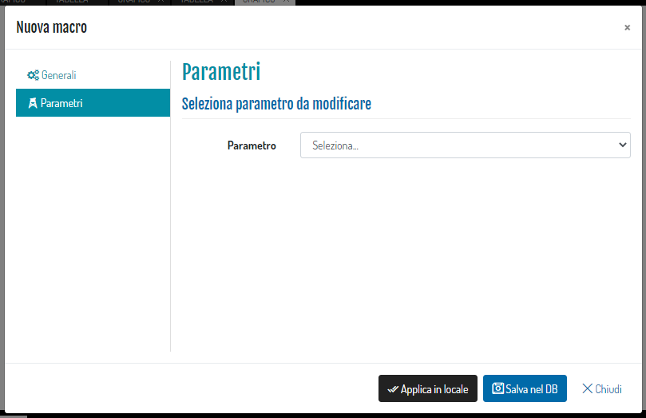

           Si potrà apportare delle modifiche al nome, alla legenda che verrà visualizzata sul grafico, la formula, quanti numeri decimali verranno visualizzati, il trattamento (media, somma, massimo, minimo, cumulata o media mobile), il tipo di grafico (linea, colonne, punti o area), il colore della linea (indicato tramite il cursore o tramite codice esadecimale) il suo spessore e, infine, se sono stati impostati molteplici assi Y, a quale di essi 'agganciare' il grafico del parametro.

           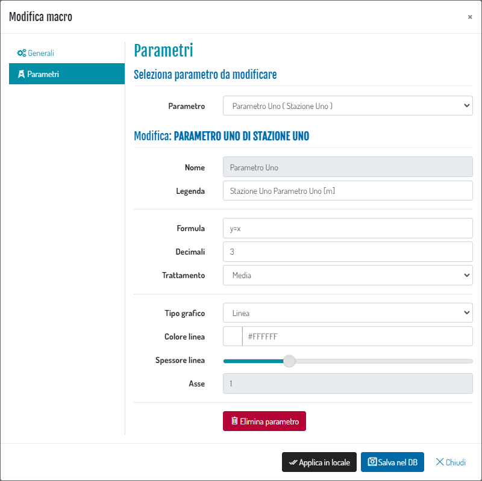

### 1.2 Menu Secondario - Analyser

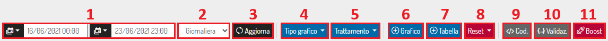

1. <u>Data inizio/fine</u>: selezionare il periodo temporale in cui verranno visualizzati i dati;

    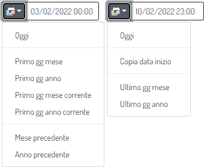

2. Pulsante <u>Aggregazione</u>

    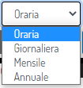

3. Pulsante <u>Aggiorna</u>: aggiorna i tab sulla base delle date e della fascia temporale richiesta.

    Se non si è selezionato nessun parametro o nessuna macro verrà visualizzato il seguente messaggio:

    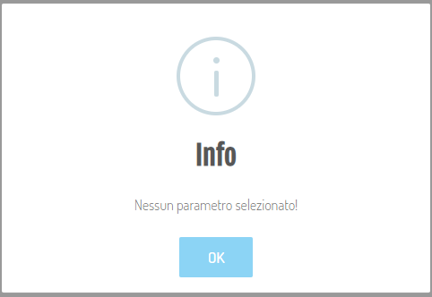

4. Pulsante <u>Tipo grafico</u>: modifica il tipo di grafico da visualizzare nel tab;

    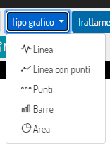

5. Pulsante <u>Trattamento</u>: modifica il tipo di trattamento applicato ai parametri;

    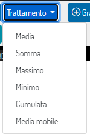

6. Pulsante <u>Grafico</u>: aggiungi tab per grafico;
7. Pulsante <u>Tabella</u>: aggiungi tab per tabella;

8. Pulsante <u>Reset</u>: resetta i tab (svuota);

    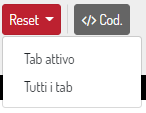

9. Pulsante <u>Cod.</u>: ottieni il codice di macro e query attive;

    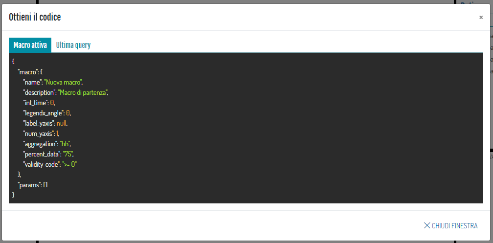

10. Pulsante <u>Validazione</u>: visualizza l'elenco dei codici di validazione impostati per il portale;

    * Codici della periferia:

        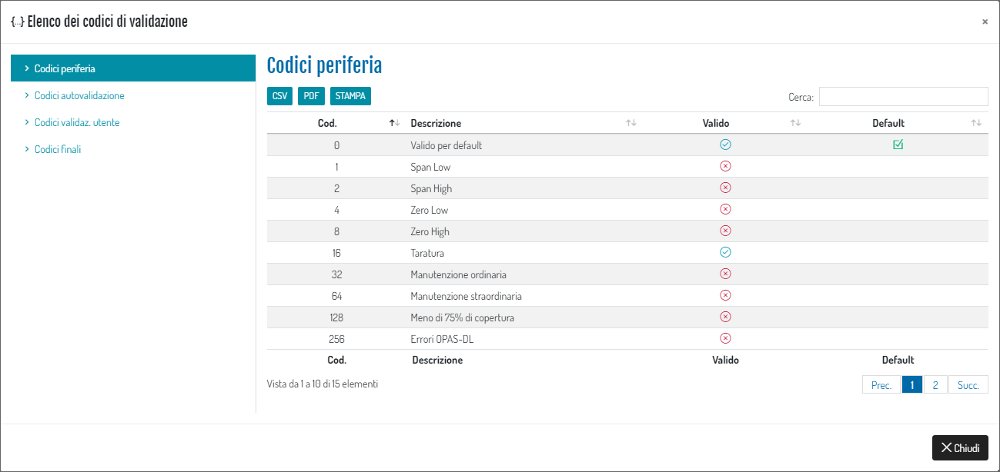

    * Codici di autovalidazione:

        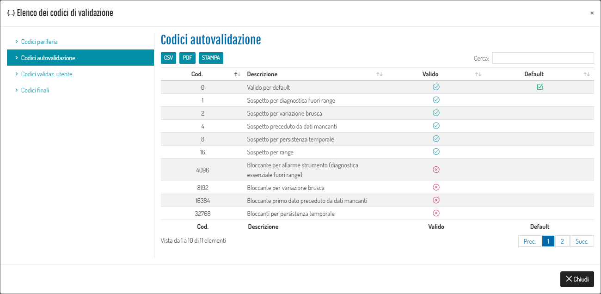

    * Codici di validazione utente:

        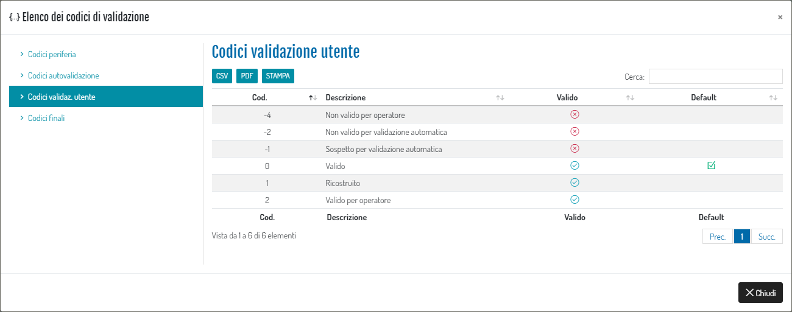

    * Codici finali:

        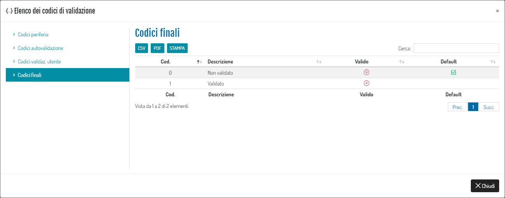

11. Pulsante <u>Boost</u>: (visibile quando si inseriscono 6 o più parametri nella macro) visualizza il dettaglio delle impostazioni della funzione "Boost":

    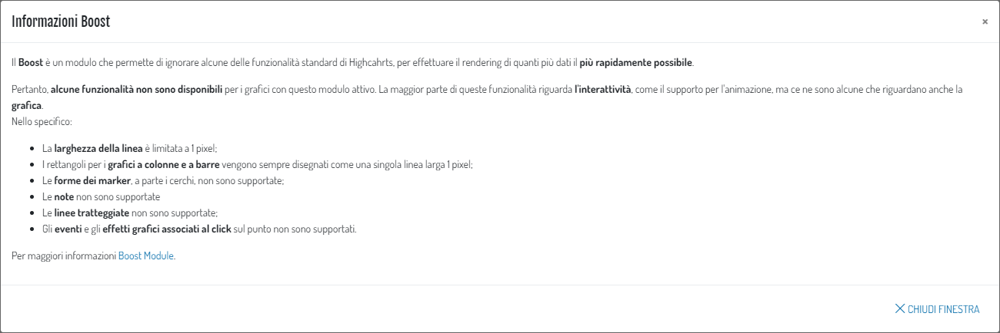

### 1.3 Menu Secondario 2 - attivo solo per i tab contenenti un grafico

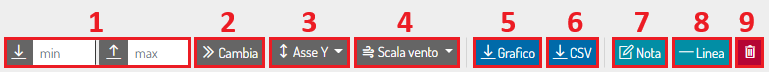

1. <u>Range min/max limite del grafico</u>: permette di impostare i limiti di visualizzazione del grafico;
2. Pulsante <u>Cambia</u>: aggiorna i grafici sulla base dei range minimi e massimi richiesti;
3. Pulsante <u>Asse Y</u>: cambia il numero degli assi verticali visualizzati nel grafico;

    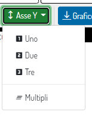

    Se si seleziona l'opzione 'Multipli', verrà aperto un nuovo tab chiamato 'GRAFICO MULTIPLO' dove verrà generato un grafico per ogni parametro:

    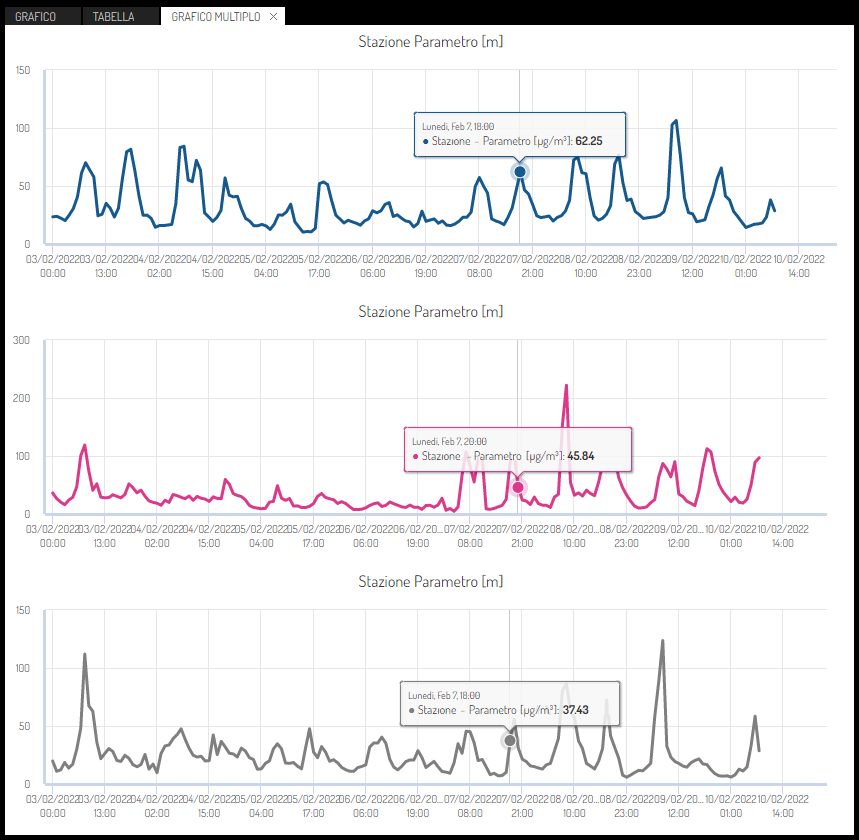

4. Pulsante <u>Scala vento</u>: aggiungi la scala del vento al grafico:

    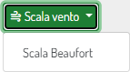

    Nell'immagine seguente viene visualizzata la Scala Beaufort:

    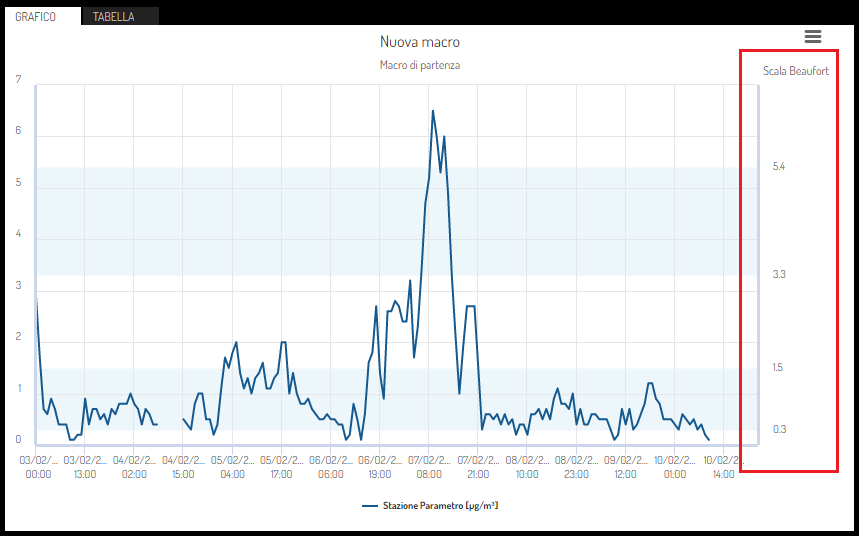

5. Pulsante <u>Grafico</u>: scarica il grafico sotto forma di immagine .png;
6. Pulsante <u>CSV</u>: scarica i dati in formato .csv; è l'unico pulsante che rimane attivo anche per i tab contenenti una tabella;
7. Pulsante <u>Nota</u>: aggiungi una nota al grafico;

    

8. Pulsante <u>Linea</u>: aggiungi un asse orizzontale al grafico;

    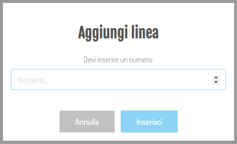

9. Pulsante <u>Elimina</u>: elimina note e linee dal grafico;

    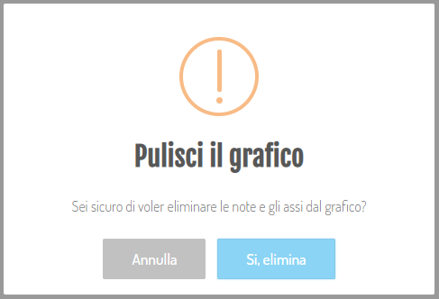

