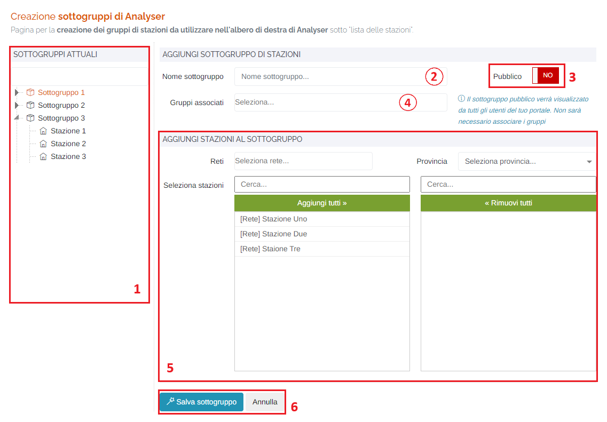
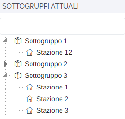
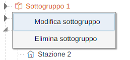
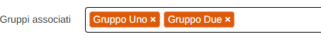
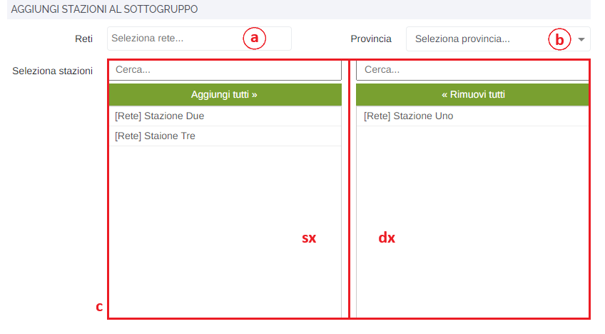

# AVANZATE - ANALYSER

Per poter accedere a questa sezione occorre cliccare sulla voce "Avanzate" posta nel menu principale di sinistra, selezionare l'elemento "Analyser".

<h3>
    > Avanzate 
    &nbsp;&nbsp;&nbsp;&nbsp;&nbsp;&nbsp;&nbsp;&nbsp; <i>o</i> Analyser
</h3>

Questa pagina permette la creazione e gestione dei gruppi di stazioni da utilizzare nell'albero di destra, presente all'interno dell'applicativo "Analyser", sotto "Lista delle stazioni".

1. <u>Sottogruppi attuali</u>: elenco dei sottogruppi già presenti nel portale:

    

    Cliccando con il tasto destro del mouse su uno dei sottogruppi in elenco, è possibile scegliere se modificare o eliminare il sottogruppo (per la modifica, verrà compilato il form di aggiunta a destra con i dati del sottogruppo selezionato);

    

2. <u>Nome sottogruppo</u>: nome del sottogruppo che verrà visualizzato in elenco;
3. Pulsante <u>Pubblico</u>: un sottogruppo pubblico verrà visualizzato da tutti gli utenti del proprio portale e, di conseguenza, non sarà necessario associare i gruppi (il campo "Gruppi associati" diventerà grigio e non sarà possibile modificarlo):

    * </img> --> Sottogruppo associato a gruppi specifici

    * </img> --> Sottogruppo pubblico

4. <u>Gruppi associati</u>: selezionare uno o più gruppi che avrà/avranno la visibilità del sottogruppo in Analyser.

    

5. <u>Aggiungi stazioni al sottogruppo</u>: attraverso il form sottostante, è possibile associare/rimuovere le stazioni al gruppo che si sta creando/modificando:

    

    &nbsp;&nbsp;&nbsp;&nbsp;&nbsp;&nbsp;a. Filtro <u>Reti</u>;

    &nbsp;&nbsp;&nbsp;&nbsp;&nbsp;&nbsp;b. Filtro <u>Provincia</u>;

    &nbsp;&nbsp;&nbsp;&nbsp;&nbsp;&nbsp;c. <u>Seleziona stazioni</u> (è possibile filtrare ulteriormente le stazioni visualizzate effettuando una ricerca digitando nel campo presente sopra ai pulsanti "Aggiungi tutti" e "Rimuovi tutti"):

    &nbsp;&nbsp;&nbsp;&nbsp;&nbsp;&nbsp;&nbsp;&nbsp;&nbsp;&nbsp;&nbsp;&nbsp;Per selezionare una stazione, cliccare un elemento dall'elenco 'sx' ed esso verrà "spostato" nella tabella 'dx';

    &nbsp;&nbsp;&nbsp;&nbsp;&nbsp;&nbsp;&nbsp;&nbsp;&nbsp;&nbsp;&nbsp;&nbsp;Qualora si volessero aggiungere o rimuovere, in un colpo solo, tutte le stazioni visualizzate in elenco dopo i vari filtri, cliccare relativamente il pulsante "Aggiungi tutti" e "Rimuovi tutti".

6. Pulsanti <u>Salva sottogruppo</u> (per rendere effettiva la creazione/modifica del sottogruppo) e <u>Annulla</u> (per ripulire il form e scartare tutte le modifiche effettuate);

