# AVANZATE - VALIDAZIONE

Per poter accedere a questa sezione occorre cliccare sulla voce "Avanzate" posta nel menu principale di sinistra ed in seguito cliccare sull'elemento "Validazione".

<h3>
    > Avanzate 
    &nbsp;&nbsp;&nbsp;&nbsp;&nbsp;&nbsp;&nbsp;&nbsp; <i>o</i> Validazione
</h3>

La seguente pagina si suddivide in tre schede principali:

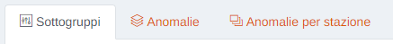

## Scheda Sottogruppi

Creazione e modifica dei sottogruppi per la validazione dei dati.

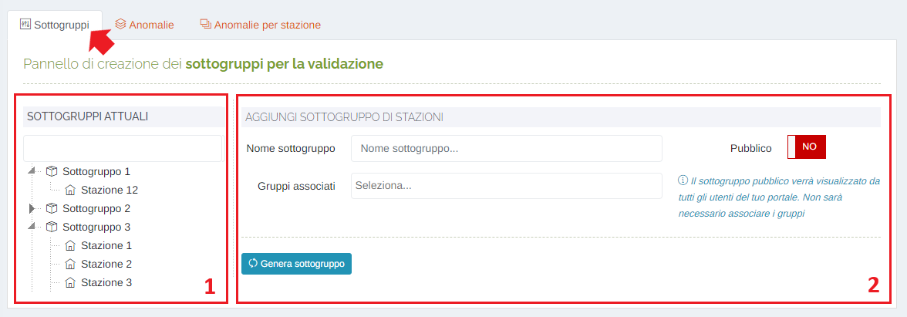

 1. Sottogruppi presenti attualmente sul portale;

    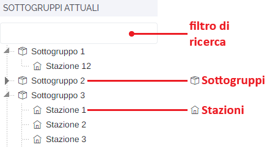

    Cliccando con il tasto destro del mouse su uno dei sottogruppi elencati, sarà possibile modificarlo oppure eliminarlo.

    

    Modifica:

    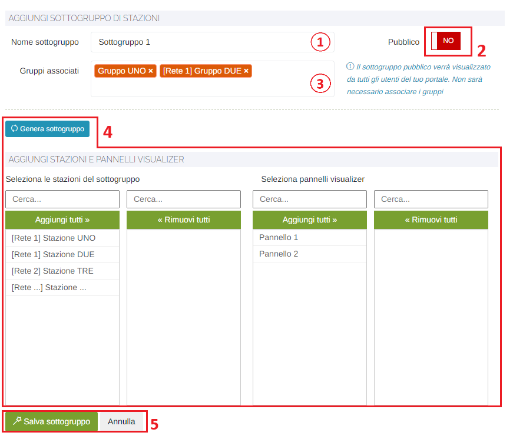

    1. Nome del sottogruppo;
    2. Pulsante <u>Pubblico</u>: pulsante per rendere visibile a tutti gli utenti del proprio portale il sottogruppo di stazioni; se il pannello sarà pubblico non si dovranno associare i singoli gruppi di utenti;

        * </img> --> pubblico

        * </img> --> privato

    3. Gruppi associati: selezionare i gruppi da associare che avranno i permessi sul pannello (solo se il pulsante 'Pubblico' è impostato su 'NO');

        

    4. Pulsante <u>Genera sottogruppo</u>: una volta selezionati nome e gruppi associati, cliccando questo pulsante sarà possibile associare stazioni e pannelli dello strumento 'Visualizer' al sottogruppo appena generato;

        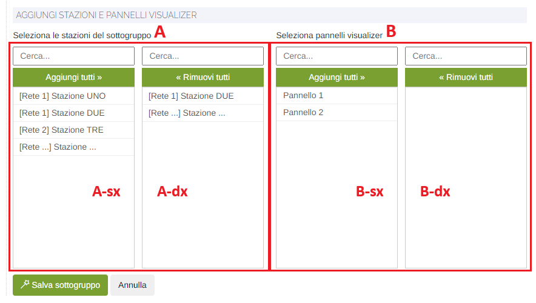

        Per aggiungere una stazione o un pannello, selezionare, facendo doppio click con il mouse, un elemento delle tabelle a sinistra (A-sx e B-sx) e verrà aggiunto nelle tabelle a destra (A-dx e B-dx); qualora si volessero aggiungere o rimuovere tutte le stazioni o tutti i pannelli, cliccare relativamente il pulsante 'Aggiungi tutti' e 'Rimuovi tutti';

    5. Pulsanti <u>Salva sottogruppo</u> e <u>Annulla</u>: per rendere effettive le modifiche fatte cliccare 'Salva sottogruppo', oppure 'Annulla' per ritornare alla schermata precedente.

## Scheda Anomalie

Gestione degli eventuali dati anomali per parametro.

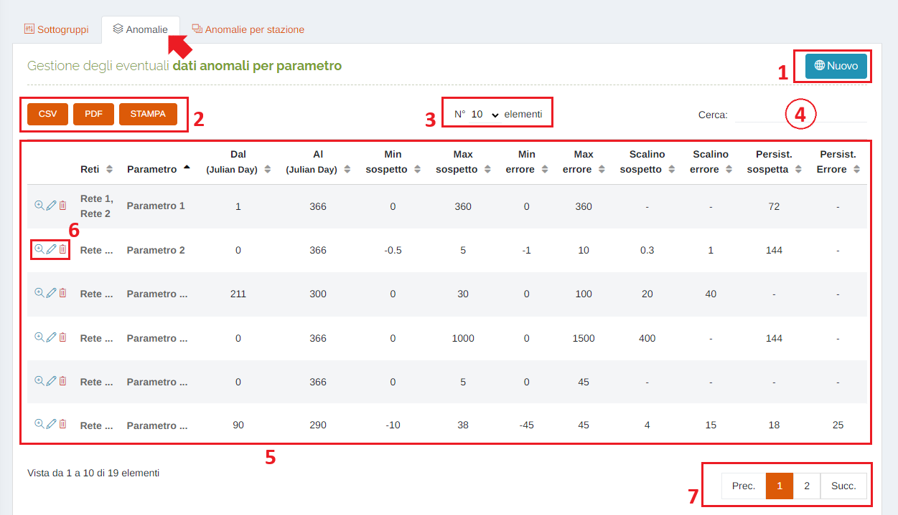

1. Pulsante <u>Nuovo</u>:

    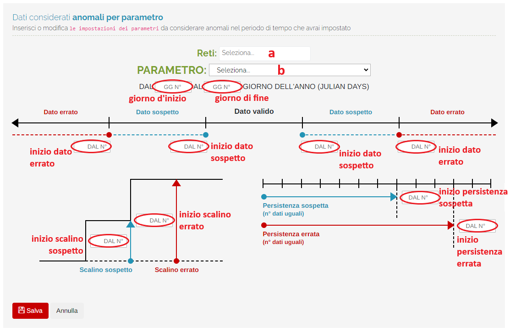

    &nbsp;&nbsp;&nbsp;&nbsp;&nbsp;&nbsp;a. Seleziona <u>Reti</u>: 
    &nbsp;&nbsp;&nbsp;&nbsp;&nbsp;&nbsp;&nbsp;&nbsp;&nbsp;&nbsp;&nbsp;&nbsp;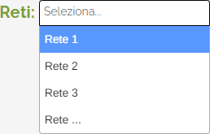 
    &nbsp;&nbsp;&nbsp;&nbsp;&nbsp;&nbsp;b. Seleziona <u>Parametro</u>: 
    &nbsp;&nbsp;&nbsp;&nbsp;&nbsp;&nbsp;&nbsp;&nbsp;&nbsp;&nbsp;&nbsp;&nbsp;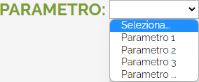  
    &nbsp;&nbsp;&nbsp;&nbsp;&nbsp;&nbsp;&nbsp;&nbsp;&nbsp;&nbsp;&nbsp;&nbsp;Alla selezione del parametro verrà aggiunta, sotto le etichette dei campi da compilare, l'unità di misura relativa al parametro scelto.

2. Pulsanti <u>CSV</u> - <u>PDF</u> - <u>STAMPA</u> : è possibile scaricare l'elenco delle anomalie sottostanti in due formati, CSV e PDF, oppure stamparlo direttamente;
3. Numero di elementi della tabella per pagina;
4. <u>Filtro di ricerca nella tabella</u>: la ricerca viene effettuata su tutte le colonne;
5. Tabella delle anomalie: verranno visualizzate le seguenti informazioni:

    * Nome del parametro;
    * Giorno d'inizio (Julian Day);
    * Giorno di fine (Julian Day);
    * Minimo del dato sospetto;
    * Massimo del dato sospetto;
    * Minimo del dato errato;
    * Massimo del dato errato;
    * Valore scalino sospetto;
    * Valore scalino errato;
    * Valore persistenza sospetta;
    * Valore Persistenza errata;

6. Esplorazione delle pagine;

## Scheda Anomalie per stazione

Gestione degli eventuali dati anomali per parametro di una particolare stazione;

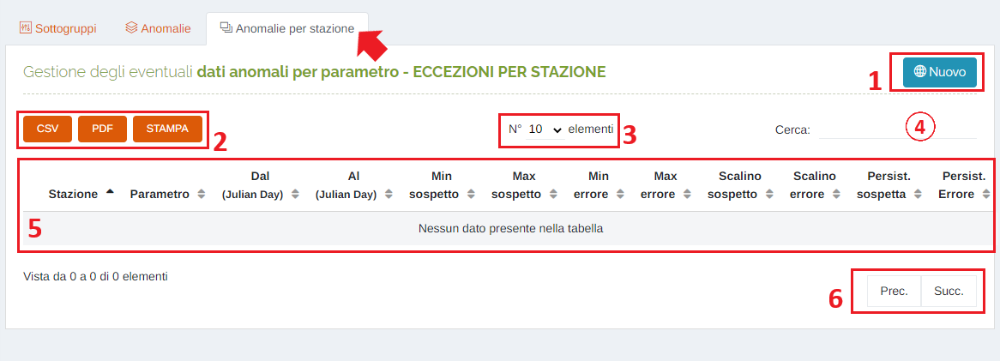

1. Pulsante <u>Nuovo</u>:

    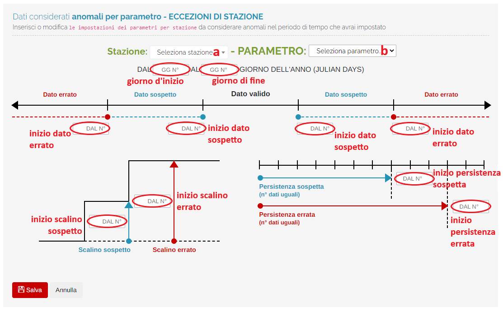

    &nbsp;&nbsp;&nbsp;&nbsp;&nbsp;&nbsp;a. Seleziona <u>Stazione</u>: 
    &nbsp;&nbsp;&nbsp;&nbsp;&nbsp;&nbsp;&nbsp;&nbsp;&nbsp;&nbsp;&nbsp;&nbsp;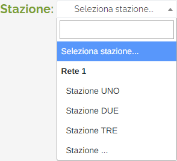 
    &nbsp;&nbsp;&nbsp;&nbsp;&nbsp;&nbsp;b. Seleziona <u>Parametro</u>: 
    &nbsp;&nbsp;&nbsp;&nbsp;&nbsp;&nbsp;&nbsp;&nbsp;&nbsp;&nbsp;&nbsp;&nbsp;  
    &nbsp;&nbsp;&nbsp;&nbsp;&nbsp;&nbsp;&nbsp;&nbsp;&nbsp;&nbsp;&nbsp;&nbsp;Alla selezione del parametro verrà aggiunta, sotto le etichette dei campi da compilare, l'unità di misura relativa al parametro scelto.

2. Pulsanti <u>CSV</u> - <u>PDF</u> - <u>STAMPA</u> : è possibile scaricare l'elenco delle anomalie sottostanti in due formati, CSV e PDF, oppure stamparlo direttamente;
3. Numero di elementi della tabella per pagina;
4. <u>Filtro di ricerca nella tabella</u>: la ricerca viene effettuata su tutte le colonne;
5. Tabella delle anomalie: verranno visualizzate le seguenti informazioni:

    * Nome della stazione;
    * Nome del parametro;
    * Giorno d'inizio (Julian Day);
    * Giorno di fine (Julian Day);
    * Minimo del dato sospetto;
    * Massimo del dato sospetto;
    * Minimo del dato errato;
    * Massimo del dato errato;
    * Valore scalino sospetto;
    * Valore scalino errato;
    * Valore persistenza sospetta;
    * Valore Persistenza errata;

6. Esplorazione delle pagine;

