# AVANZATE - VISUALIZER

Per poter accedere a questa sezione occorre cliccare sulla voce "Avanzate" posta nel menu principale di sinistra, selezionare l'elemento "Visualizer".

<h3>
    > Avanzate 
    &nbsp;&nbsp;&nbsp;&nbsp;&nbsp;&nbsp;&nbsp;&nbsp; <i>o</i> Visualizer
</h3>

Questa pagina permette la creazione e gestione dei pannelli e delle finestre, presenti all'interno dell'applicativo "Visualizer".

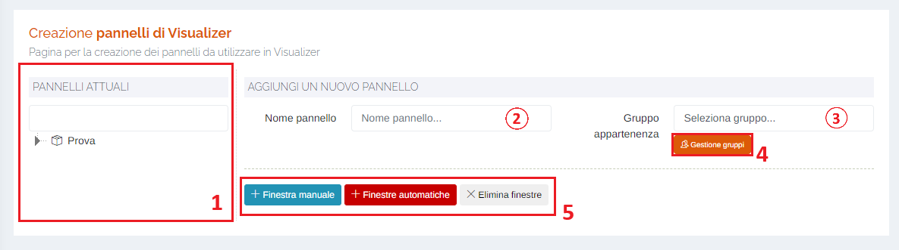

1. Lista dei gruppi e i relativi pannelli associati;

    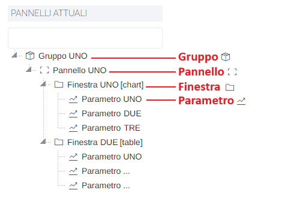

    Cliccando con il tasto destro del mouse su uno dei pannelli della lista si aprirà il seguente specchietto:

    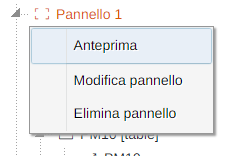

    Sarà possibile visualizzare un'anteprima del pannello direttamente sull'applicativo Visualizer:

    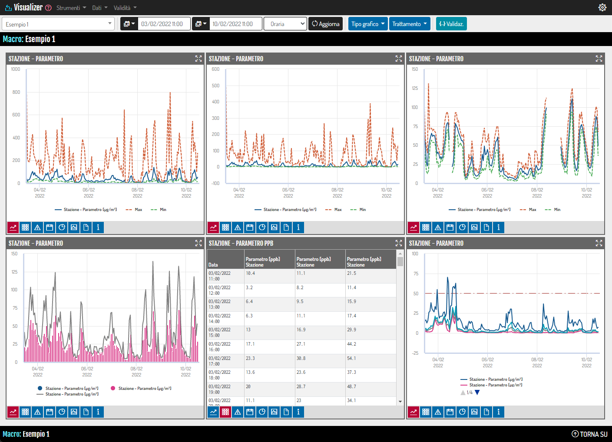

    Inoltre, cliccando su "Modifica pannello" verranno caricate le finestre correlate al pannello e sarà possibile apportare le modifiche desiderate:

    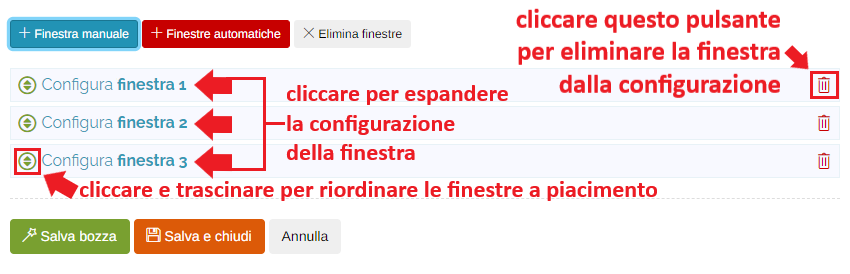

    Infine, è possibile eliminare il pannello selezionato cliccando su "Elimina pannello"; verrà visualizzato il seguente messaggio di conferma:

    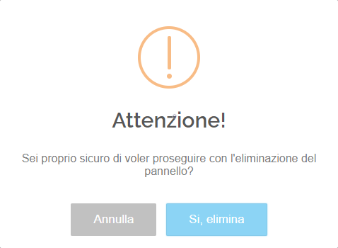

    Cliccare "Si, elimina" per confermare:

    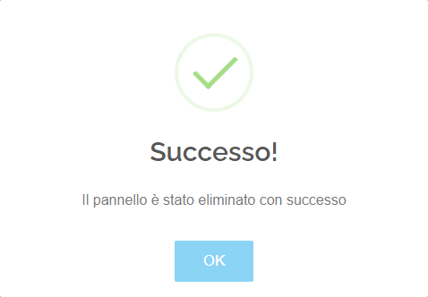

2. Creazione di un nuovo pannello: nome del pannello;
3. Creazione di un nuovo pannello: gruppo di appartenenza;
4. Pulsante "<u>Gestione gruppi</u>";

    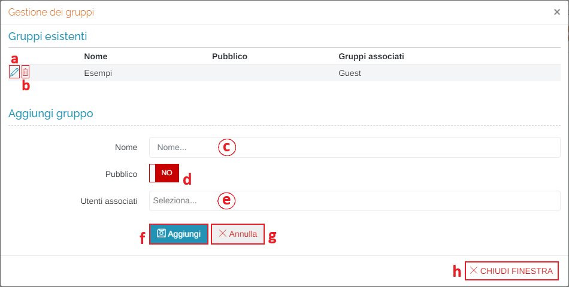

    &nbsp;&nbsp;&nbsp;&nbsp;&nbsp;&nbsp;a. Modifica gruppo: i campi sottostanti della sezione "Aggiungi gruppo" verranno compilati con i dati del gruppo che si vuole modificare.

    &nbsp;&nbsp;&nbsp;&nbsp;&nbsp;&nbsp;b. Elimina gruppo;

    &nbsp;&nbsp;&nbsp;&nbsp;&nbsp;&nbsp;c. Nome del gruppo;

    &nbsp;&nbsp;&nbsp;&nbsp;&nbsp;&nbsp;d. Pulsante <u>Pubblico SI/NO</u>: cliccando il pulsante si cambia il suo stato:

    &nbsp;&nbsp;&nbsp;&nbsp;&nbsp;&nbsp;&nbsp;&nbsp;&nbsp;&nbsp;&nbsp;&nbsp;</img> = gruppo pubblico (visibile anche a tutti gli utenti del proprio portale)

    &nbsp;&nbsp;&nbsp;&nbsp;&nbsp;&nbsp;&nbsp;&nbsp;&nbsp;&nbsp;&nbsp;&nbsp;</img> = gruppo privato (visibile solo agli utenti selezionati al punto e.)

    &nbsp;&nbsp;&nbsp;&nbsp;&nbsp;&nbsp;e. Utenti associati al gruppo: lista degli utenti che potranno visualizzare il gruppo;

    &nbsp;&nbsp;&nbsp;&nbsp;&nbsp;&nbsp;&nbsp;&nbsp;&nbsp;&nbsp;&nbsp;&nbsp;N.B.: Se al punto d. è stato selezionato "SI" non sarà possibile selezionare utenti da associare dal momento che il gruppo sarà visualizzabile da tutti gli utenti del portale.

    &nbsp;&nbsp;&nbsp;&nbsp;&nbsp;&nbsp;f. Pulsante <u>Aggiungi</u>;

    &nbsp;&nbsp;&nbsp;&nbsp;&nbsp;&nbsp;g. Pulsante <u>Annulla</u>;

    &nbsp;&nbsp;&nbsp;&nbsp;&nbsp;&nbsp;h. Pulsante <u>Chiudi finestra</u>: chiude la finestra di gestione dei gruppi;

5. Pulsanti:

    Una volta compilati i campi relativi a nome e gruppi associati, il prossimo passaggio è quello della creazione delle finestre del pannello:

    * <u>Finestra manuale</u>:
    * <u>Finestre automatiche</u>:
    * <u>Elimina finestre</u>:

## Creazione delle finestre

### Pulsante **Finestra manuale**

Cliccando il pulsante "Finestra manuale" è possibile configurare manualmente le impostazioni generali della finestra e i relativi parametri che si vogliono visualizzare:

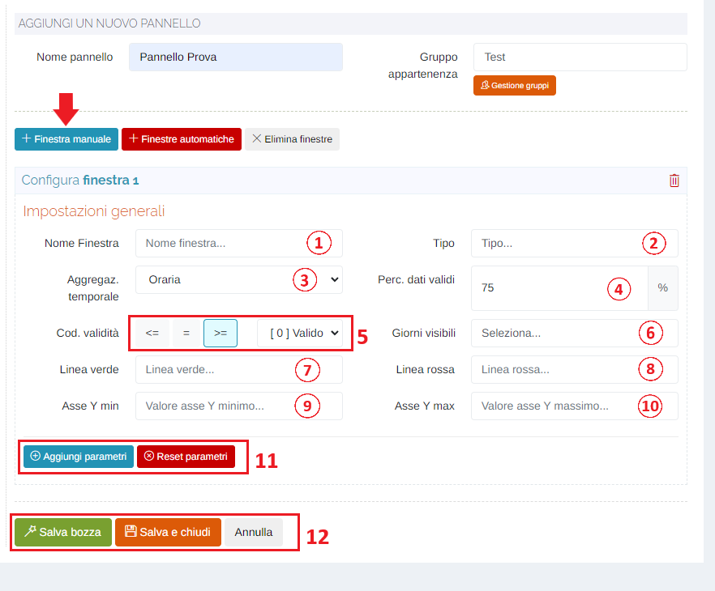

1. Nome finestra;
2. Tipo: tipologia della finestra

    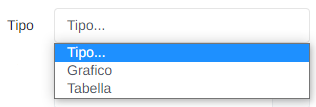

3. Aggregazione temporale: selezionare il tipo raggruppamento dei dati tra quelli presenti

    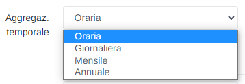

4. Percentuale di dati validi: i dati visualizzati dovranno avere ALMENO questa percentuale di validità;
5. Codice di validità: a sinistra è presente il filtro per stabilire il valore dei dati visualizzati rispetto al codice di validità scelto (la scelta è tra minore-uguale (<=), uguale (=) e maggiore-uguale (>=)); a destra l'elenco dei codici di validità disponibili;

    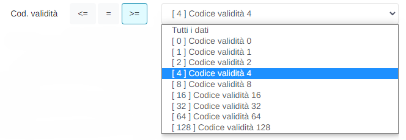

6. Giorni visibili (opzionale): selezionare l'intervallo di tempo che verrà visualizzato nella finestra;

    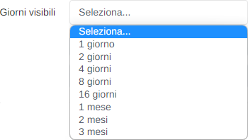

7. Linea verde (opzionale): aggiungere un valore per inserire una linea orizzontale di colore verde relativa al valore minimo da visualizzare sul grafico;
8. Linea rossa (opzionale): aggiungere un valore per inserire una linea orizzontale di colore rosso relativa al valore massimo da visualizzare sul grafico;
9. Asse Y min (opzionale): aggiungere il valore minimo del range di visualizzazione dell'asse Y del grafico;
10. Asse Y max (opzionale): aggiungere il valore massimo del range di visualizzazione dell'asse Y del grafico;
11. Pulsanti <u>Aggiungi parametri</u> e <u>Reset parametri</u>: è possibile aggiungere o eliminare (Reset) i parametri dalla finestra:

    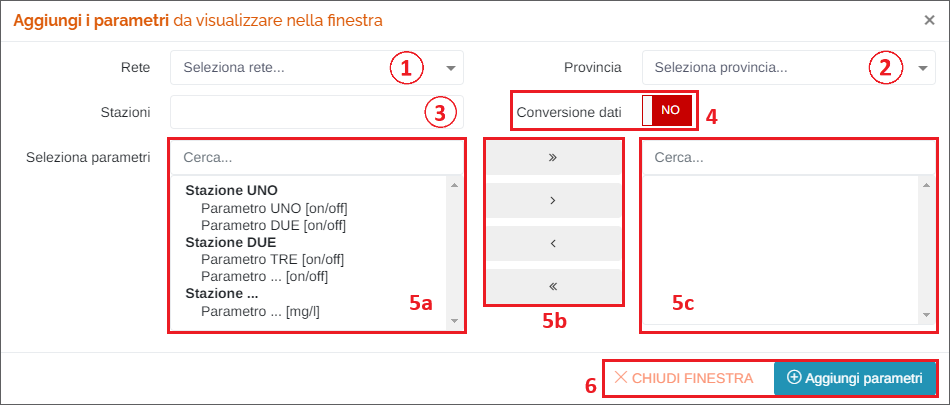

    1. Filtro <u>Rete</u>: selezionare la rete su cui filtrare le stazioni;
    2. Filtro <u>Provincia</u>: selezionare la provincia su cui filtrare le stazioni;
    3. <u>Stazioni</u>: una volta impostati i filtri precedenti, selezionare la stazione desiderata;
    4. Pulsante <u>Conversione dati SI/NO</u>: cliccando il pulsante si cambia il suo stato:

    &nbsp;&nbsp;&nbsp;&nbsp;&nbsp;&nbsp;&nbsp;&nbsp;&nbsp;&nbsp;&nbsp;&nbsp;</img> -> dati grezzi non convertiti;

    &nbsp;&nbsp;&nbsp;&nbsp;&nbsp;&nbsp;&nbsp;&nbsp;&nbsp;&nbsp;&nbsp;&nbsp;</img> -> dati convertiti ad un'altra unità di misura secondo una formula predefinita per parametro;

    5. Seleziona parametri: per selezionare un parametro, fare doppio click su un elemento dall'elenco di sinistra (5a) ed esso verrà "spostato" nella tabella a destra (5c); per selezionare i parametri è anche possibile utilizzare i pulsanti posti al centro (5b):

        - ">>" : aggiungi <u>tutti</u> i parametri filtrati nella colonna di sinistra;
        - ">" : aggiungi <u>solo</u> il parametro evidenziato con singolo click;
        - "<" : rimuovi <u>solo</u> il parametro evidenziato con singolo click;
        - "<<" : rimuovi <u>tutti</u> i parametri dalla colonna di destra;

    6. Pulsanti <u>Chiudi finestra</u> (per chiudere la finestra di selezione dei parametri) e <u>Aggiungi parametri</u> (per rendere effettivo l'inserimento dei parametri nella finestra);  

    &nbsp;&nbsp;&nbsp;&nbsp;&nbsp;&nbsp;Una volta selezionati i parametri, sarà possibile configurarne la visualizzazione singolarmente:

    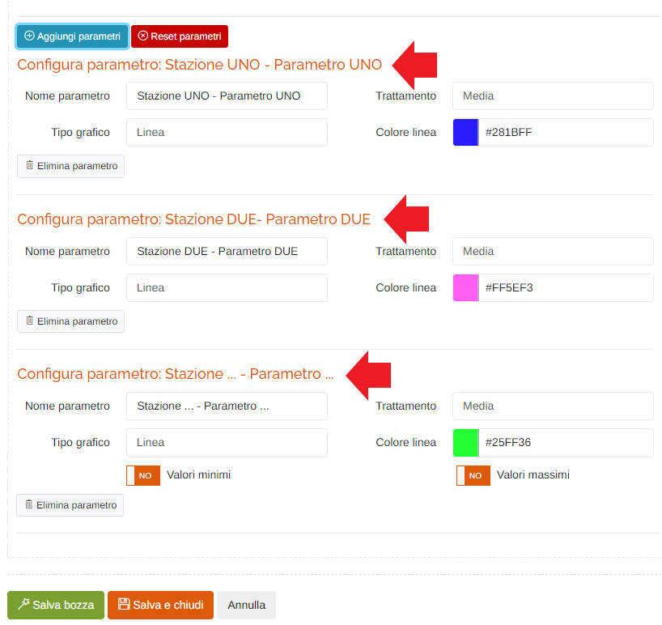

    * Nome del parametro (visualizzato su "Visualizer");
    * Trattamento: funzione applicata ai dati in base all'aggregazione temporale con cui si effettua l'estrazione;

        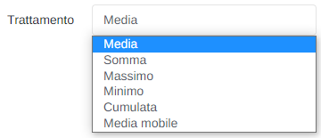

    * Tipo grafico (valido solo per la tipologia “Grafico”);

        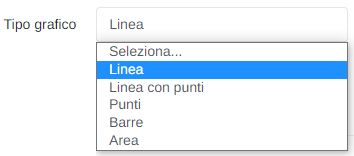

    * Colore linea (valido solo per la tipologia “Grafico”): inserire il valore esadecimale del colore scrivendolo direttamente, oppure selezionandolo tramite la palette dei colori;

        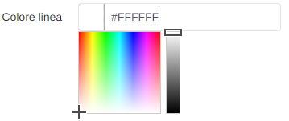

    * Checkbox "<u>Valori minimi</u>" e "<u>Valori massimi</u>": vengono indicati i valori massimi e minimi, in base a quali checkbox si attivano, nel grafico, sotto forma di linea, o nella tabella. È possibile che questi checkbox NON siano presenti se i valori di minimo e massimo sono identificati da parametri singoli distinti tra di loro.

    * Pulsante "<u>Elimina parametro</u>": rimuove il parametro dalla configurazione;

12. Pulsanti:

    * <u>Salva bozza</u>: il pannello non viene salvato, ma viene salvata una sua bozza che rende possibile visualizzare l'anteprima sull'applicativo "Visualizer"; se tutto è andato a buon fine verrà visualizzato il seguente popup in alto a destra sulla pagina:

        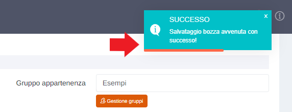

    * <u>Salva e chiudi</u>: cliccare per rendere effettive le modifiche e salvare il pannello; se tutto è andato a buon fine, verrà visualizzato il seguente messaggio:

        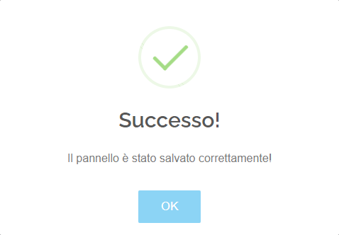

    * <u>Annulla</u>: chiude la modifica del pannello: cliccare su "Si, sono sicuro" per confermare.

        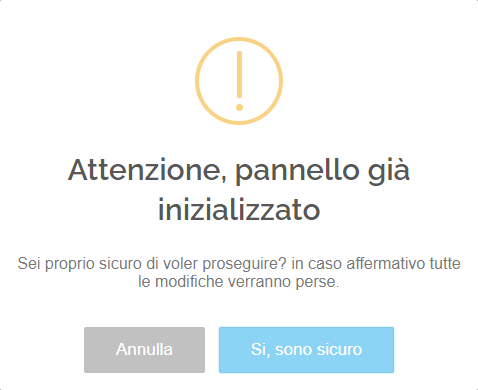

### Pulsante **Finestre automatiche**

Cliccando il pulsante "Finestre automatiche" il sistema genererà automaticamente, impostando valori di default, le finestre in base alle seguenti informazioni:

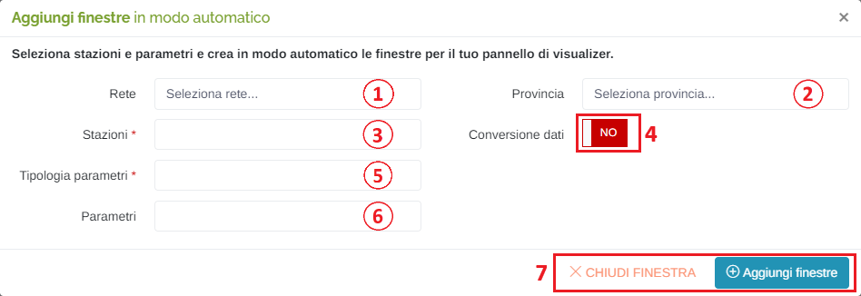

1. Rete: selezionare la rete di appartenenza per filtrare le stazioni;
2. Provincia: selezionare la provincia per filtrare le stazioni;
3. Stazioni (obbligatorio): selezionare la stazione da cui estrarre i parametri;
4. Tipologia parametri (obbligatorio): selezionare la tipologia di parametri;
5. Parametri: selezionare i parametri che si vogliono aggiungere;

   N.B. Se lasciato vuoto, verranno create le finestre per ogni parametro appartenente alla/e tipologia/e scelta/e in precedenza.

   Inoltre, qualora alla stazione selezionata siano associati sia il parametro "Temperatura" sia "Temperatura - Fidas", alla selezione della tipologia "Meteo", nella lista dei parametri (punto 5) verrà visualizzata solamente la voce "Temperatura", ma confermando la scelta saranno generate due finestre: una per il parametro "semplice" e una per il "Fidas".

    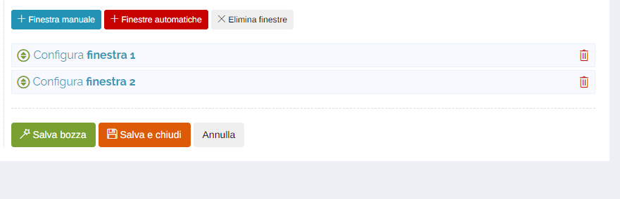

6. Pulsante <u>Conversione dati SI/NO</u>: cliccando il pulsante si cambia il suo stato:

    &nbsp;&nbsp;&nbsp;&nbsp;&nbsp;&nbsp;</img> = dati grezzi non convertiti;

    &nbsp;&nbsp;&nbsp;&nbsp;&nbsp;&nbsp;</img> = dati convertiti ad un'altra unità di misura secondo una formula predefinita per parametro;

7. Pulsanti <u>Chiudi finestra</u> (per chiudere la finestra di generazione delle finestre) e <u>Aggiungi finestre</u> (per rendere effettiva la generazione delle finestre);

Una volta cliccato il pulsante "Aggiungi finestre", verranno generate le finestre:

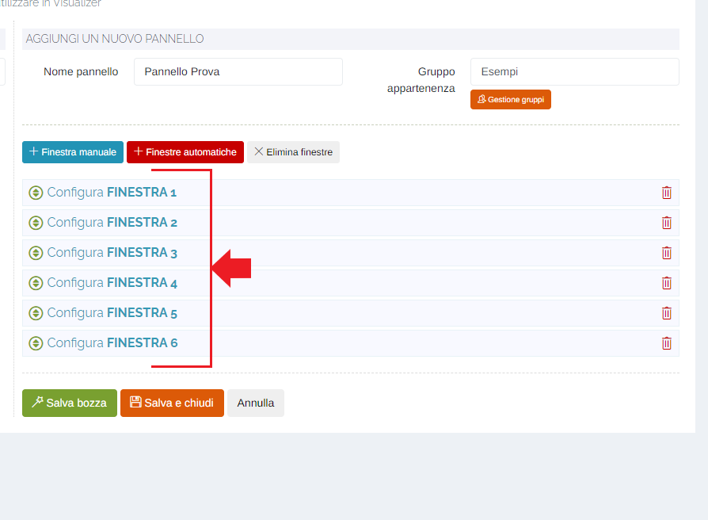

### Pulsante **Elimina finestre**

Cliccare il pulsante "Elimina finestre" per annullare tutte le modifiche effettuate ed eliminare anche le finestre già presenti nel pannello (qualora lo si stia modificando):

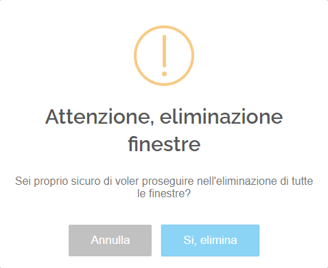

Per confermare l'eliminazione cliccare "Si, elimina".

