# STRUMENTI - DATAVIEW

Per poter accedere a questa sezione è necessario cliccare sulla voce "Strumenti" posta nel menu principale di sinistra ed in seguito cliccare sull'elemento "Dataview".

<h3>
    > Strumenti 
    &nbsp;&nbsp;&nbsp;&nbsp;&nbsp;&nbsp;&nbsp;&nbsp; <i>o</i> Dataview
</h3>

Verrà visualizzata la schermata principale dello strumento "Dataview".

I dati visualizzati saranno relativi alle stazioni che fanno parte delle reti associate all'utente che ha effettuato il login sul portale.

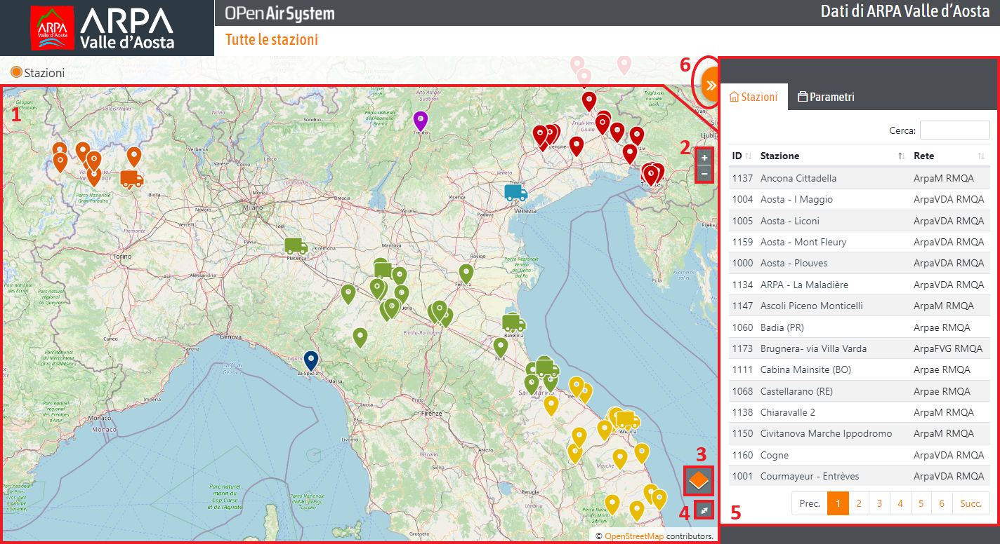

1. <u>Mappa</u>: sulla mappa vengono visualizzati i dati delle stazioni disponibili sul portale.

    Passando il cursore del mouse sopra uno dei dati verrà visualizzato un piccolo specchietto relativo alla stazione.
    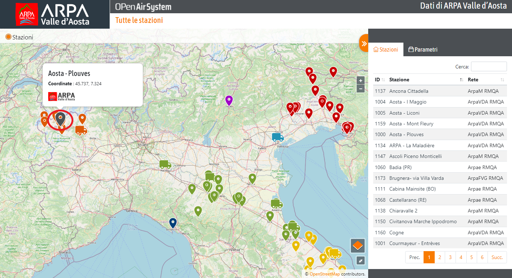
    In dettaglio:

    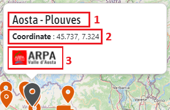

    1. Nome della stazione;
    2. Valore selezionato in quel momento;
    3. Rete di appartenenza;

    Al click del pin sulla mappa, verranno visualizzate ulteriori informazioni:

    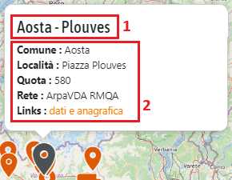

    1. Nome della stazione;
    2. Comune, Località, Quota, Rete e un link esterno alla pagina di anagrafica della stazione (vedi "Anagrafica stazione");

2. <u>Zoom +/- della mappa</u> (è possibile zoomare in avanti e indietro anche utilizzando la rotella del mouse);
3. <u>Filtro della mappa</u>:

    Attraverso questo filtro è possibile modificare la visualizzazione della mappa:

    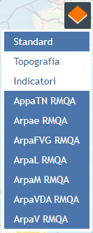

    Gli elementi <u>SELEZIONATI</u> e <u>ATTIVI</u> sono quelli in <u>GRIGIO</u>, mentre quelli in <u>BIANCO</u> sono <u>DISATTIVATI</u>.

    Seguono alcuni esempi di filtro:

    Formato mappa: STANDARD

    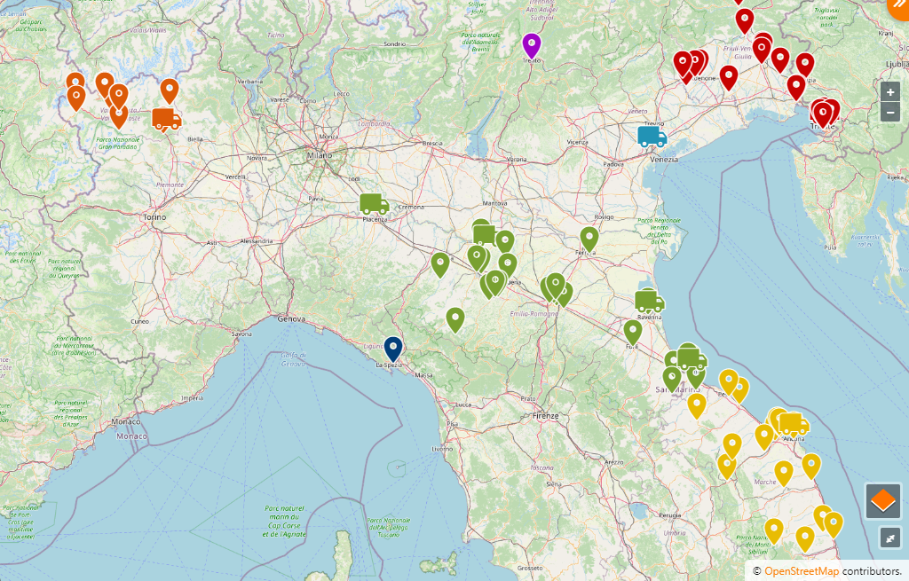

    Formato mappa: TOPOGRAFICA

    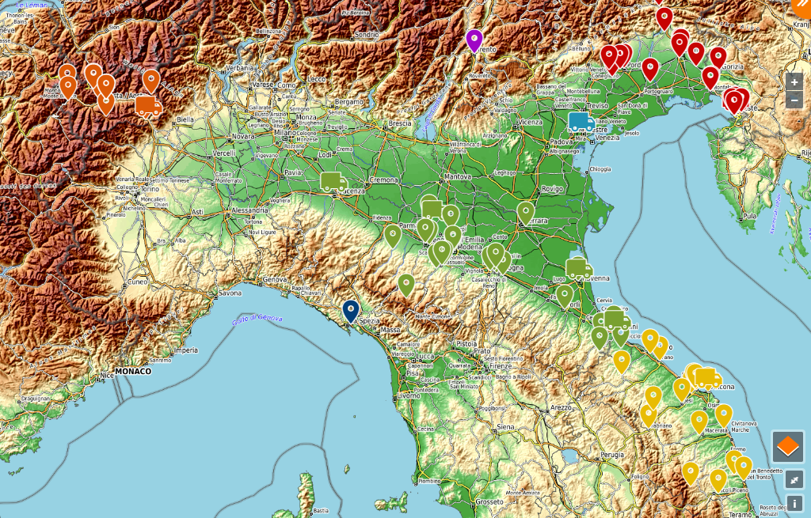

    Formato mappa: INDICATORI

    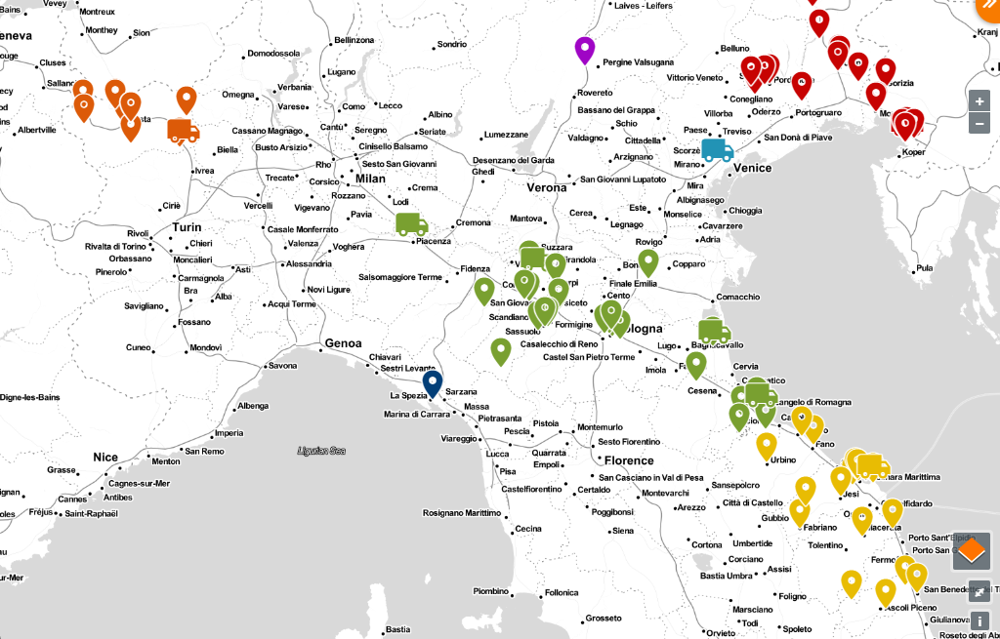

4. <u>Mappa a schermo intero</u>;
5. <u>Tendina Stazioni/Parametri</u>: (vedi "Tendina Stazioni/Parametri");
6. Pulsante <u>mostra/nascondi tendina Stazioni/Parametri</u>;

### Tendina Stazioni/Parametri

In questa sezione vengono elencate le stazioni e, cliccando sulla scheda "Parametri", i parametri relativi ai dati presenti sulla mappa.

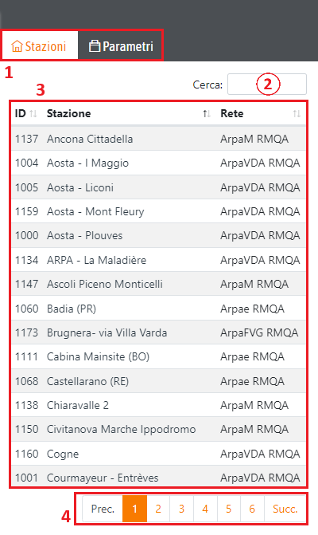

1. Modifica visualizzazione per la tabella: o per stazione o per parametro;
2. <u>Filtro di ricerca nella tabella</u>: la ricerca viene effettuata su tutte le colonne;

    Filtro per Rete:

    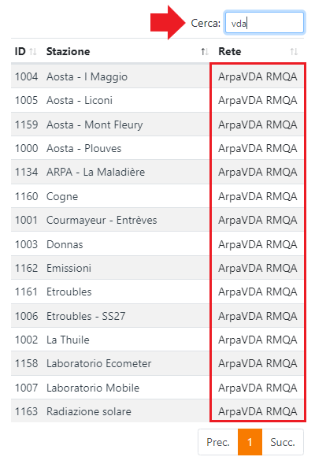

    Filtro per Stazione:

    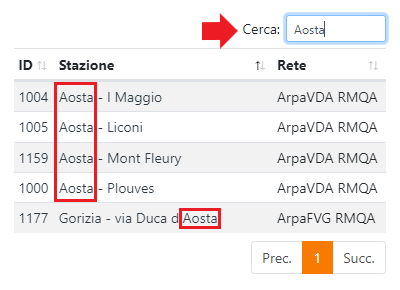

3. <u>Tabella Stazioni/Parametri</u>;

    Passando il cursore del mouse sopra all'id (1) oppure al nome di una delle stazioni elencate nella tabella (2), verrà visualizzato il relativo specchietto sulla mappa (3):
    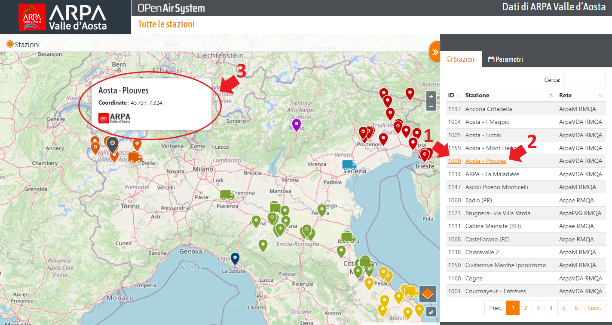
    Mentre al click, si verrà reindirizzati alla pagina del dettaglio della stazione (vedi "Dettaglio stazione").

4. <u>Esplorazione delle pagine</u>;

Visualizzando la tabella dei parametri, è possibile selezionare dei parametri e visualizzare sulla mappa le stazioni con i relativi dati.

* E' possibile selezionare un solo parametro:

    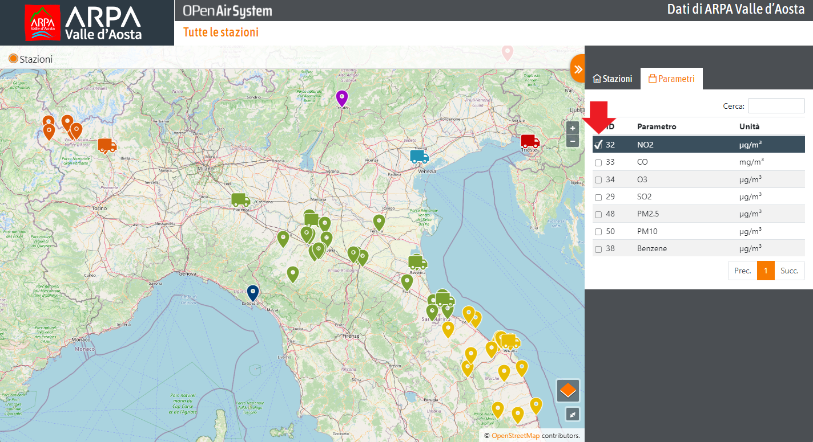

* Più parametri: verranno visualizzate tutte le stazioni che hanno in comune il gruppo di parametri scelti.

    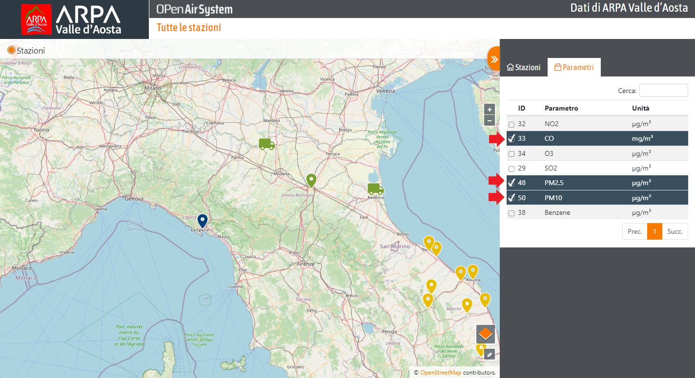

* Oppure nessun parametro: in questo caso verranno visualizzati tutti i dati di tutte le stazioni.

    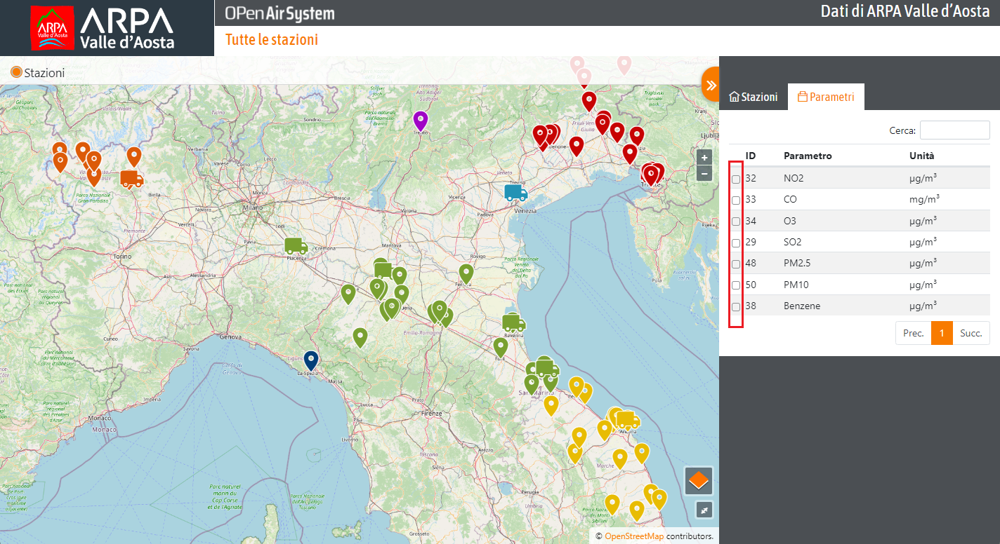

### Dettaglio stazione

In questa sezione verrà visualizzato il dettaglio della stazione selezionata.

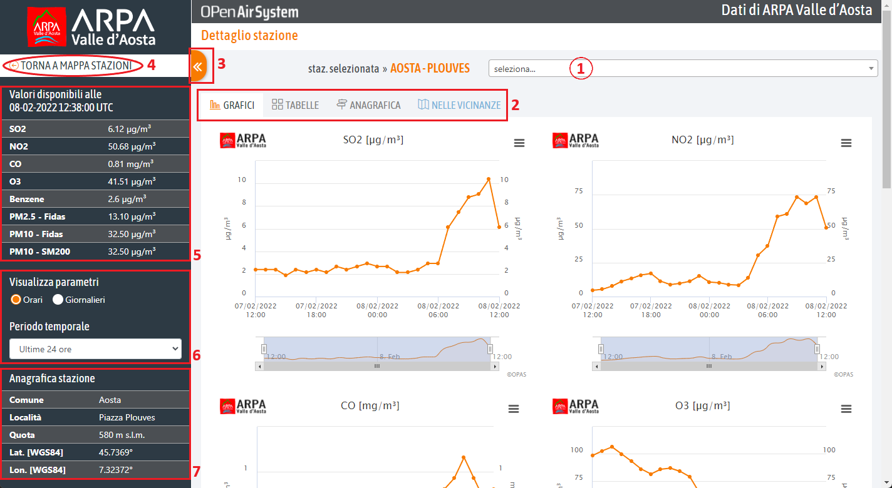

1. <u>Seleziona stazione</u>: menù a tendina per visualizzare direttamente il dettaglio di una stazione senza ritornare alla mappa delle stazioni e dei parametri vista in precedenza;
2. Schede del dettaglio:

    #### Grafici

    In questa sezione verranno visualizzati i dati della stazione con i relativi parametri sia in formato grafico sia in formato tabellare. Inoltre, è possibile scaricare ogni singolo grafico cliccando su quest'icona  e selezionando 'JPEG'

    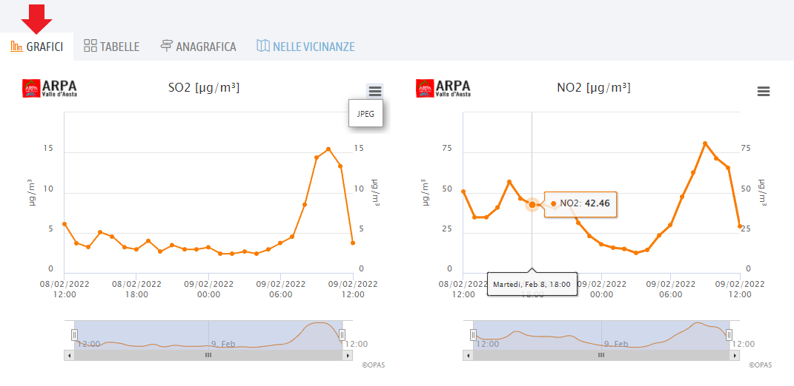

    #### Tabelle

    In questa sezione verranno visualizzati i dati della stazione con i relativi parametri sia in formato grafico sia in formato tabellare.

    Formato tabellare: (cliccando sulle intestazioni delle colonne è possibile ordinare i dati)

    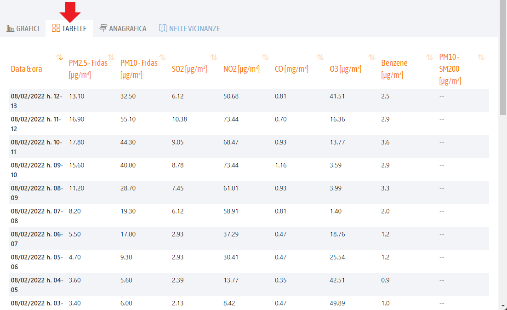

    #### Anagrafica

    Oltre ai dati, è possibile visualizzare una panoramica dell'anagrafica della stazione.

    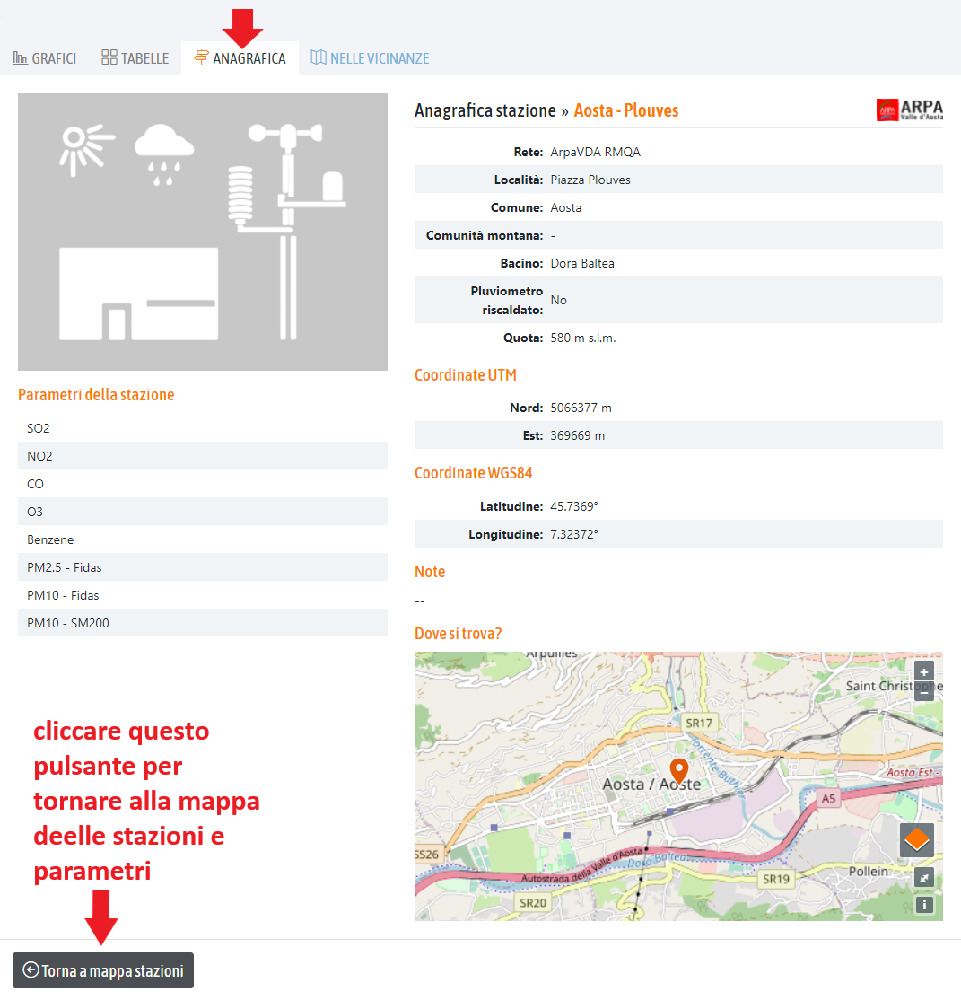

    #### Nelle vicinanze

    Infine, nella scheda "Nella vicinanze" verranno visualizzati un elenco delle stazioni nelle vicinanze geografiche della stazione selezionata e la relativa mappa di riferimento.

    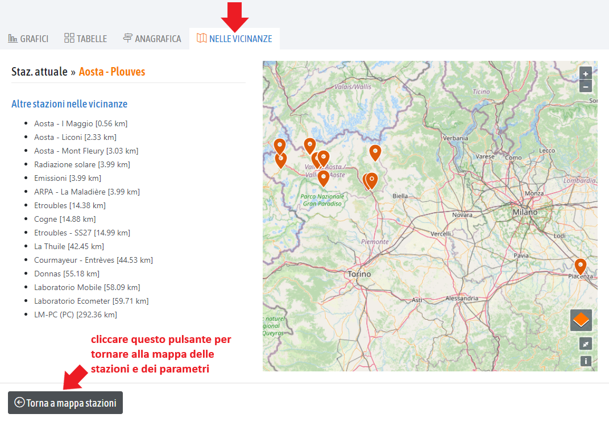

3. Pulsante <u>mostra/nascondi tendina Stazioni/Parametri</u>;
4. Pulsante <u>Torna a mappa stazioni</u>: si verrà reindirizzati alla pagina principale del Dataview;
5. <u>Valori disponibili</u>: mostra i dati della stazione aggiornati all'ora indicata (sempre orario UTC);
6. <u>Visualizza parametri</u>: è possibile personalizzare la visualizzazione dei dati dei grafici/tabelle poste a destra; si possono visualizzare i dati orari o giornalieri e impostare il periodo temporale selezionandone uno dal menù a tendina;

   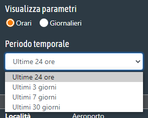

7. <u>Anagrafica stazione</u>: qui vengono visualizzati i dati relativi all'anagrafica della stazione;

