# STRUMENTI - MAPPER

Per poter accedere a questa sezione è necessario cliccare sulla voce "Strumenti" posta nel menu principale di sinistra ed in seguito cliccare sull'elemento "Mapper".

<h3>
    > Strumenti 
    &nbsp;&nbsp;&nbsp;&nbsp;&nbsp;&nbsp;&nbsp;&nbsp; <i>o</i> Mapper
</h3>

Verrà visualizzata la schermata principale dello strumento Mapper.

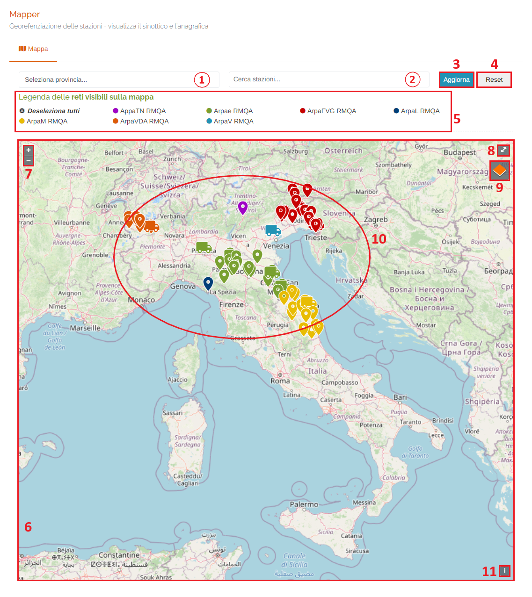

1. Elenco province disponibili sul portale;

    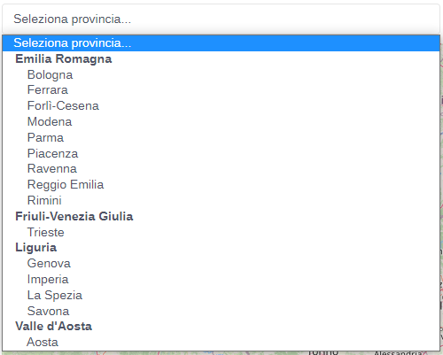

2. Elenco/ricerca stazioni disponibili sul portale;

    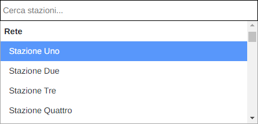

3. Pulsante <u>Aggiorna</u>: una volta selezionato la provincia e/o la stazione, premere il pulsante per aggiornare la mappa;
4. Pulsante <u>Reset</u>: resetta la mappa ricaricando quella iniziale (visualizzazione di tutte le stazioni disponibili sul portale);
5. Filtro di selezione delle reti disponibili sul portale: cliccare su una delle reti per nasconderne i marcatori sulla mappa. Cliccando nuovamente si riattiverà la visualizzazione dei marcatori;

    * Tutte le reti selezionate (Default):

        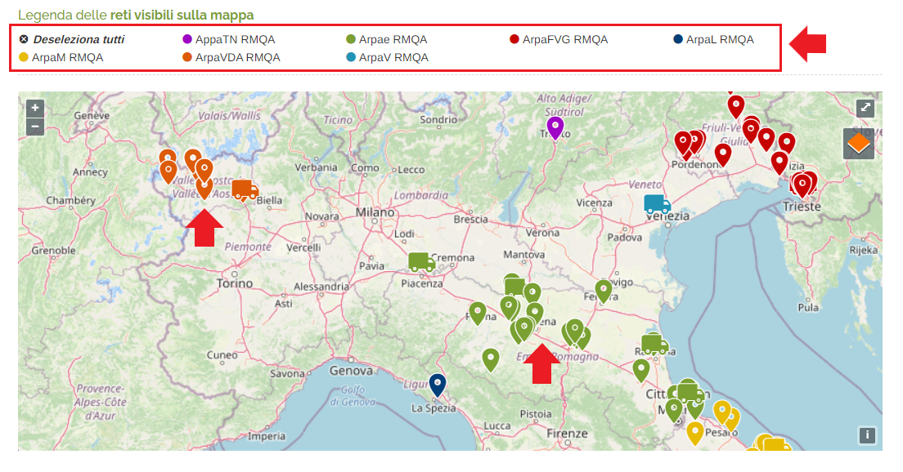

    * Nessuna rete selezionata (dopo aver cliccato "Deseleziona tutti"):

        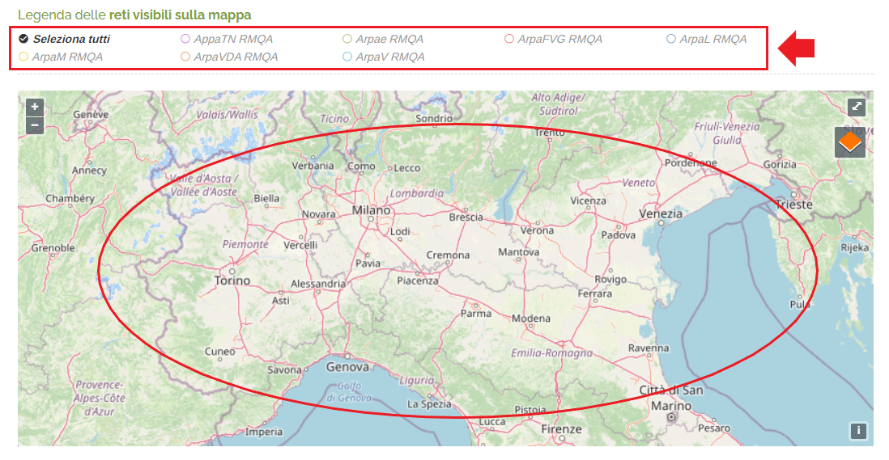

        Cliccando su "Seleziona tutti" si tornerà allo stato precedente.

6. Mappa;
7. Zoom +/- della mappa (è possibile zoomare in avanti e indietro anche utilizzando la rotella del mouse);
8. Mappa a schermo intero;
9. Filtro della mappa

    Attraverso questo filtro è possibile modificare la visualizzazione della mappa:

    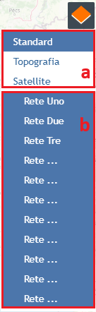

    &nbsp;&nbsp;&nbsp;&nbsp;&nbsp;&nbsp;a. Tipologia della mappa

    &nbsp;&nbsp;&nbsp;&nbsp;&nbsp;&nbsp;b. Reti disponibili sul portale

    Gli elementi <u>SELEZIONATI</u> e <u>ATTIVI</u> sono quelli in <u>BLU</u>, mentre quelli in <u>BIANCO</u> sono <u>DISATTIVATI</u>.

    Seguono alcuni esempi di filtro:

    Formato mappa: STANDARD

    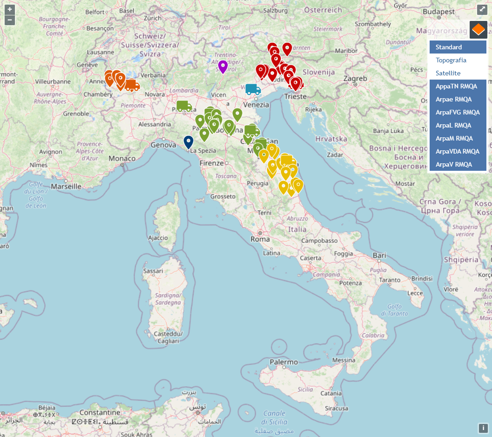

    Formato mappa: SATELLITE

    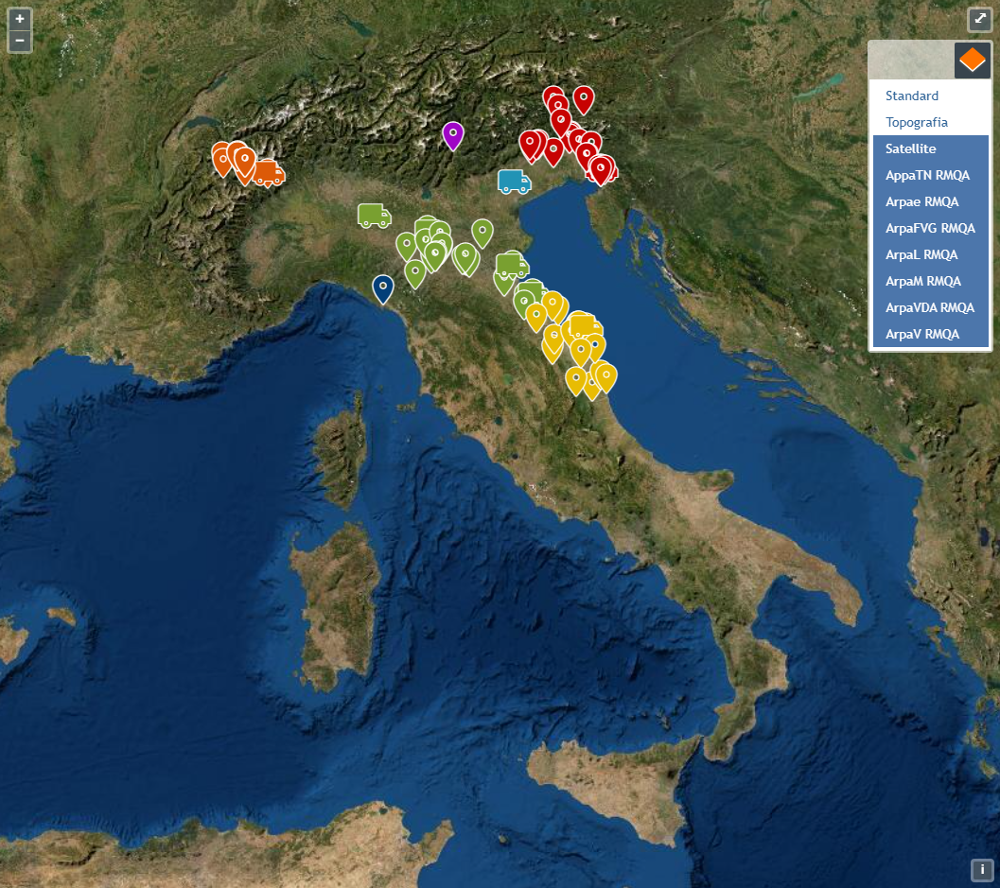

    Formato mappa: TOPOGRAFIA

    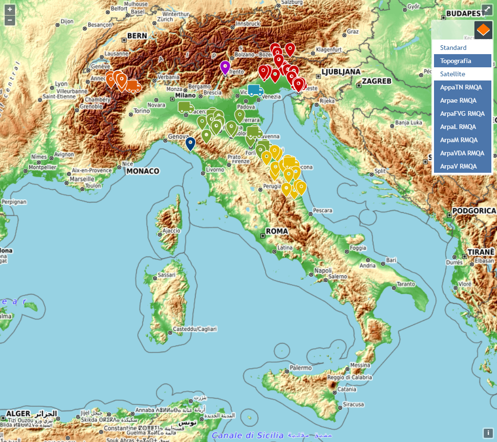

10. Marcatori stazioni disponibili sul portale;

    L'indicatore </img> identifica le stazione attive, ma SOSPESE sul portale.

11. Informazioni sul proprietario del portale;

## Marcatori stazioni disponibili sul portale

Una volta individuata la stazione interessata, cliccando sul marcatore corrispondente, verrà visualizzata la finestra relativa contenente le informazioni e i links alle pagine di anagrafica, sinottico e dati in real time.

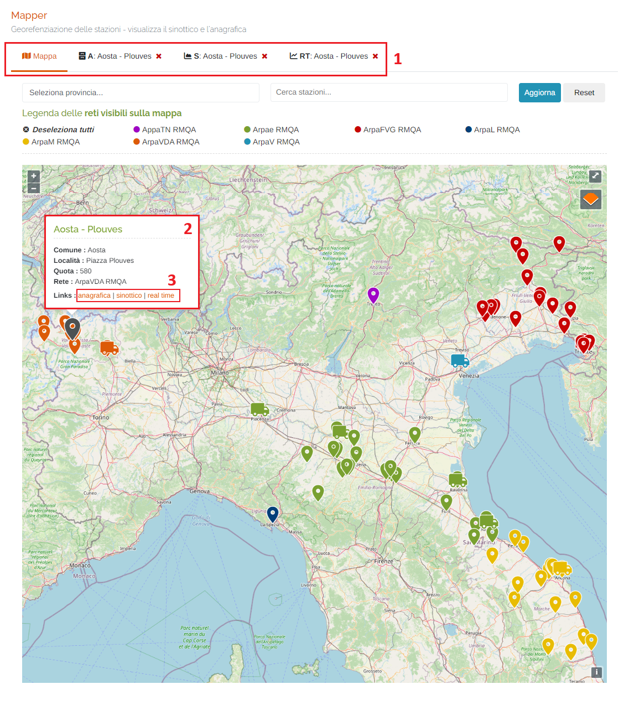

1. Schede della pagina:

    * Mappa: schermata visualizzata in questo momento;
    * Eventuali schede <u>Anagrafica</u> </img>, <u>Sinottico</u> </img> e <u>Real Time</u> </img> delle stazioni selezionate;

2. Finestra informativa della stazione selezionata;
3. Links:

    ### Scheda "Anagrafica"

    In questa sezione è possibile visualizzare i dati anagrafici della stazione selezionata in precedenza:

    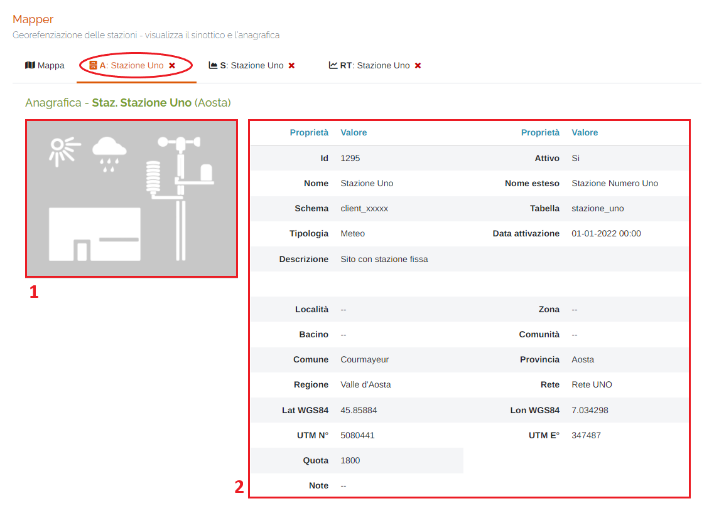

    1. Immagine della stazione;
    2. Dati anagrafici della stazione.

    ### Scheda "Sinottico"

    In questa sezione è possibile visualizzare i grafici degli strumenti presenti sulla stazione di un certo periodo temporale impostato dall'utente.

    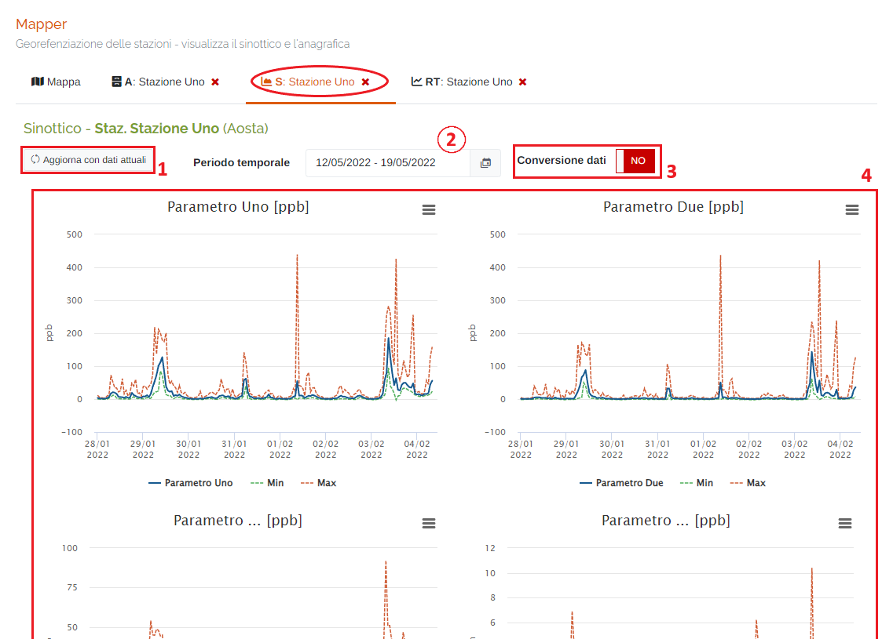

    1. Pulsante <u>Aggiorna con i dati attuali</u>: aggiorna i grafici sottostanti con gli ultimi dati aggiornati;
    2. Periodo temporale;

        Attraverso questo strumento è possibile impostare il periodo temporale.

        È importante ricordare che, per impostare il periodo, è SEMPRE NECESSARIO CLICCARE DUE VOLTE, una per il giorno d'inizio e una per il giorno di fine.

        Una volta selezionato il periodo, premere il pulsante Applica per completare l'operazione.

        

        &nbsp;&nbsp;&nbsp;&nbsp;&nbsp;&nbsp;a. Data d'inizio; 
        &nbsp;&nbsp;&nbsp;&nbsp;&nbsp;&nbsp;b. Data di fine; 
        &nbsp;&nbsp;&nbsp;&nbsp;&nbsp;&nbsp;c. Pulsante <u>Applica</u>; 
        &nbsp;&nbsp;&nbsp;&nbsp;&nbsp;&nbsp;d. Pulsante <u>Annulla</u>: chiude la finestra del periodo temporale; 
        &nbsp;&nbsp;&nbsp;&nbsp;&nbsp;&nbsp;e. Calendario mese precedente; 
        &nbsp;&nbsp;&nbsp;&nbsp;&nbsp;&nbsp;f. Calendario mese corrente. 

    3. Pulsante <u>Conversione dati</u>: attivando la conversione dei dati, il sistema applicherà il fattore di conversione impostato per i parametri presenti sulla stazione selezionata:

        * </img> --> Parametri non convertiti

        * </img> --> Parametri convertiti

    4. Grafici dei parametri presenti sulla stazione;

        Cliccando sul pulsante </img> dei grafici è possibile visualizzare a schermo intero il grafico, stamparlo, estrarne i dati e salvarli in formato CSV, oppure salvarlo in formato JPEG o PDF.

        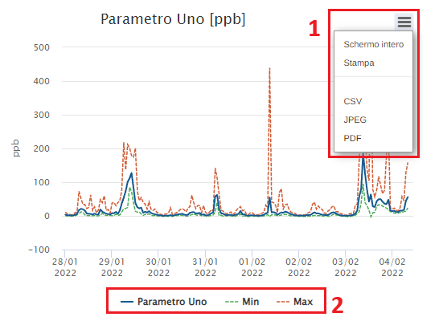

        1. <u>Menu del grafico</u>;
        2. <u>Filtro dei valori del grafico</u>;

            Inoltre, è possibile modificare il grafico impostando quali valori visualizzare e quali no cliccando sulle scritte presenti:

            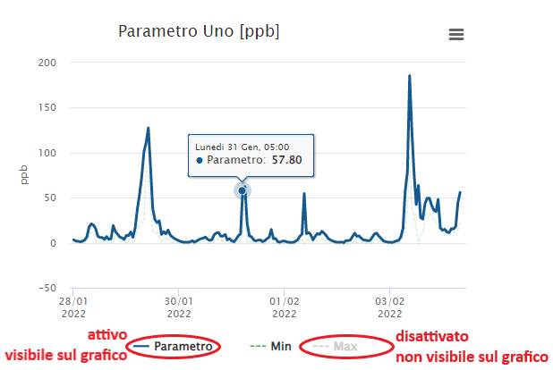

    ### Scheda "Realtime"

    In questa sezione è possibile osservare, in tempo reale, i dati che arrivano dagli strumenti presenti nella stazione selezionata:

    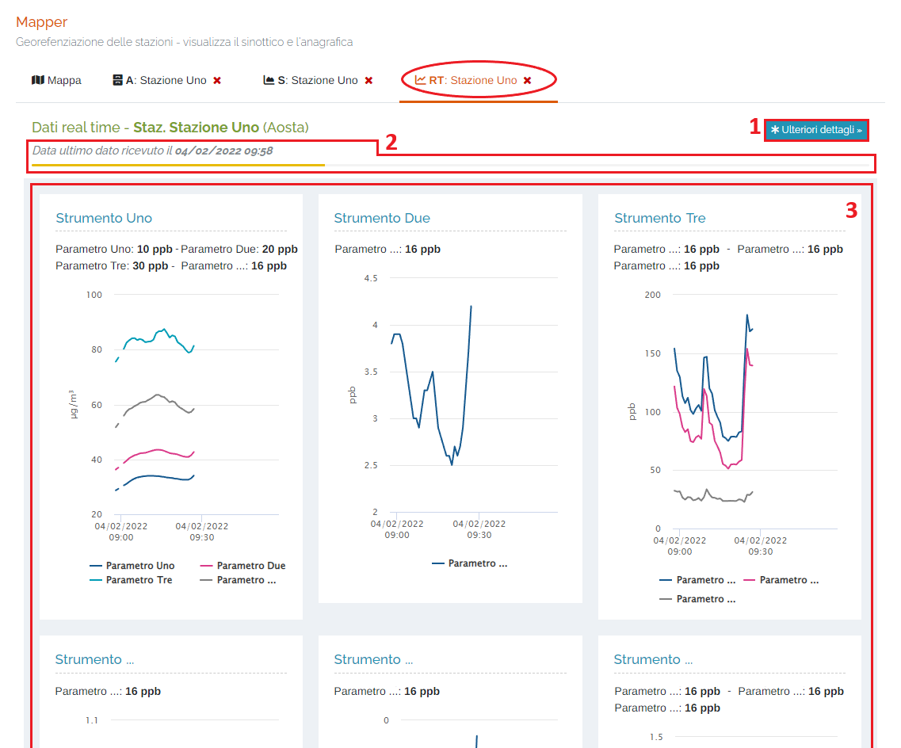

    1. Pulsante </img>: cliccando qui si verrà reindirizzati alla pagina "Dati" > "Dati istantanei" dove saranno visualizzati i dati istantanei dei parametri, con i relativi strumenti a cui sono associati,0 in formato tabellare e suddivisi per tipologia di parametro (Chimici, Polveri, Diagnostici, ...);
    2. Barra di progressione dei dati istantanei e data/ora dell'ultimo dato ricevuto;
    3. Grafici dei dati;

        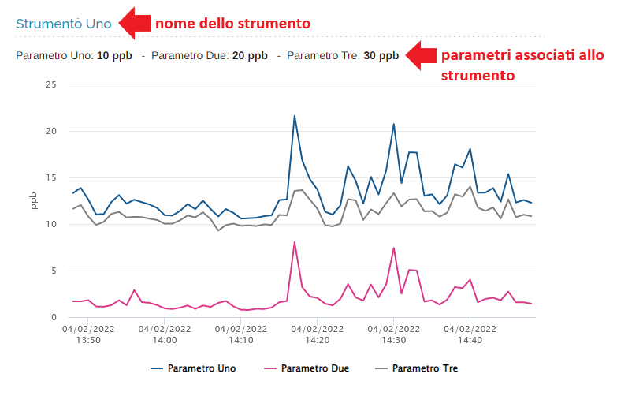

