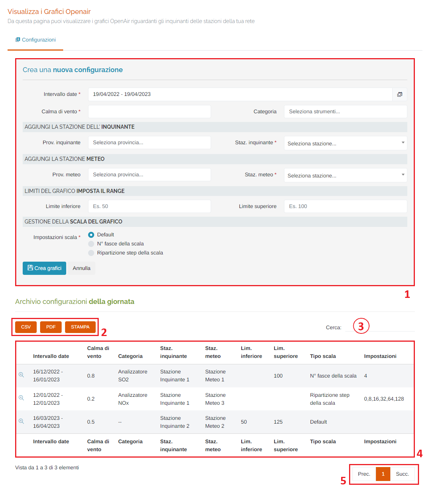
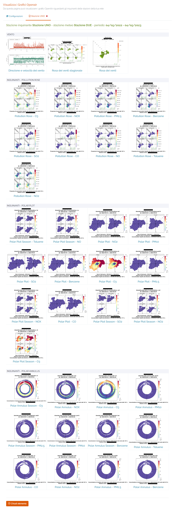
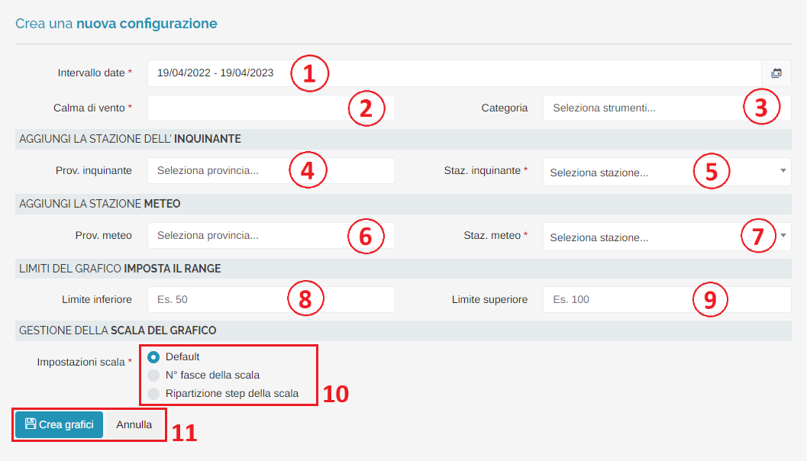
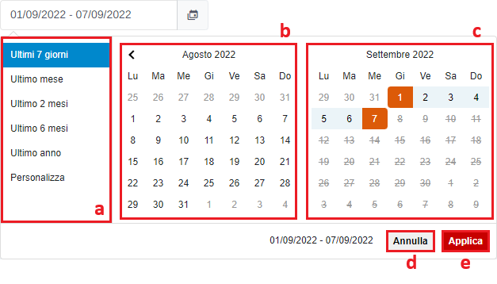

# STRUMENTI - GRAFICI OPENAIR

Per poter accedere a questa sezione occorre cliccare sulla voce "Strumenti" posta nel menu principale di sinistra e cliccare sull'elemento "Grafici OpenAir".

<h3>
    > Strumenti 
    &nbsp;&nbsp;&nbsp;&nbsp;&nbsp;&nbsp;&nbsp;&nbsp; <i>o</i> Grafici OpenAir
</h3>

Attraverso questo strumento è possibile generare e visualizzare i grafici OpenAir riguardanti gli inquinanti delle stazioni della propria rete di appartenenza.

1. Creazione di una nuova configurazione;
2. Pulsanti <u>CSV</u> - <u>PDF</u> - <u>STAMPA</u> : è possibile scaricare l'elenco delle configurazioni sottostanti in due formati, CSV e PDF, oppure stamparlo direttamente;
3. <u>Filtro di ricerca nella tabella</u>: la ricerca viene effettuata su tutte le colonne della tabella;
4. Tabella delle configurazioni: cliccando il pulsante </img> è possibile visualizzare le immagini dei grafici, organizzate per tipologia:

    

5. Esplorazione delle pagine;

## Crea una nuoca configurazione

Per generare i grafici compilare i seguenti campi:

1. Intervallo date (*obbligatorio);

    Attraverso questo strumento è possibile impostare il periodo temporale per la visualizzazione dei dati.

    L'utente ha due possibilità: selezionare il periodo dall'elenco di default presente sulla sinistra (punto "a."), oppure impostarlo manualmente (nell'elenco di default verrà selezionato automaticamente "Personalizza"). In quest'ultimo caso, è importante ricordare che, per impostare il periodo, è SEMPRE NECESSARIO CLICCARE DUE VOLTE, una per il giorno d'inizio e una per il giorno di fine.

    Una volta selezionato il periodo, premere il pulsante Applica per completare l'operazione.

    

    &nbsp;&nbsp;&nbsp;&nbsp;&nbsp;&nbsp;a. Periodi di default; 
    &nbsp;&nbsp;&nbsp;&nbsp;&nbsp;&nbsp;b. Calendario mese precedente; 
    &nbsp;&nbsp;&nbsp;&nbsp;&nbsp;&nbsp;c. Calendario mese corrente; 
    &nbsp;&nbsp;&nbsp;&nbsp;&nbsp;&nbsp;d. Pulsante <u>Annulla</u>: chiude la finestra del periodo temporale; 
    &nbsp;&nbsp;&nbsp;&nbsp;&nbsp;&nbsp;e. Pulsante <u>Applica</u>; 

2. Calma di vento (*obbligatorio);
3. Categoria di strumenti: è possibile selezionare una categoria per generare i grafici SOLO per quella tipologia d'inquinante. Qualora non si selezioni niente, verranno generate le immagini per TUTTI gli inquinanti;
4. Provincia della stazione inquinante (filtro per il campo 5.);
5. Stazione inquinante (*obbligatorio);
6. Provincia della stazione meteo (filtro per il campo 7.);
7. Stazione meteo (*obbligatorio);
8. Limite inferiore dei grafici;
9. Limite superiore dei grafici;
10. Impostazione della scala dei grafici (*obbligatorio): è possibile scegliere tra 3 possibilità:

    * <u>Default</u>: la scala viene gestita automaticamente dallo script di generazione delle immagini;
    * <u>N° fasce della scala</u>: inserire il numero di fasce in cui verrà ripartita la scala;
    * <u>Ripartizione step della scala</u>: inserire una serie di numeri, in ordine crescente, per definire ogni step della scala;

11. Pulsanti </img> per effettuare la richiesta di generazione dei grafici, oppure il pulsante "Annulla" per ripulire il form.

