# STRUMENTI - VISUALIZER

Per poter accedere a questa sezione occorre cliccare sulla voce "Strumenti" posta nel menu principale di sinistra e cliccare sull'elemento "Visualizer".

<h3>
    > Strumenti 
    &nbsp;&nbsp;&nbsp;&nbsp;&nbsp;&nbsp;&nbsp;&nbsp; <i>o</i> Visualizer
</h3>

Verrà visualizzata la schermata principale dello strumento Visualizer.

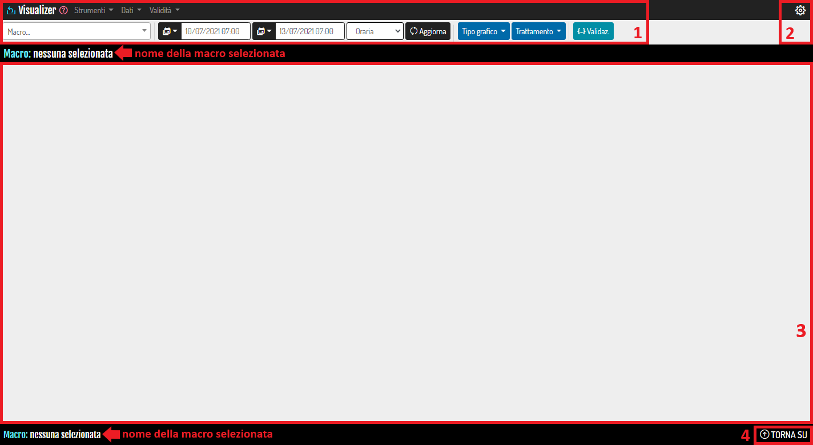

1. <u>Menu di Visualizer</u>: vedi "I Menu di Visualizer";
2. Pulsante "<u>Apri impostazioni Visualizer</u>": si viene reindirizzati alla pagina di "Avanzate - Visualizer";
3. <u>Schermata di visualizzazione grafici e tabelle</u>: in questa sezione vengono visualizzati grafici e tabelle della macro selezionata tra quelle disponibili:

    

4. Pulsante "<u>TORNA SU</u>": cliccando questo pulsante, quando la pagina è abbastanza lunga, sarà possibile ritornare all'inizio della stessa;

## I Menu di Visualizer

### Menu Principale - Visualizer

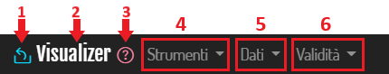

1. Torna al portale;
2. Torna alla pagina iniziale di Visualizer;
3. Accedi alla documentazione (questa pagina);
4. **Strumenti**

    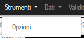

    Tutte le impostazioni che si andranno a modificare in questa voce ("Opzioni") possono essere applicate in maniera temporanea (pulsante "Applica in locale") o salvate nel database (pulsante "Salva nel DB") in modo tale da ritrovarle ad un successivo accesso alla sezione. Le impostazioni sono per utente e quindi le modifiche di uno non andranno ad influenzare gli altri utenti.

    * <u>Generali</u>: tramite il seguente pulsante, disattivo di default, è possibile modificare la visualizzazione delle finestre, Se attivo, i vari tab verranno visualizzati tutti sotto forma di box singoli;

        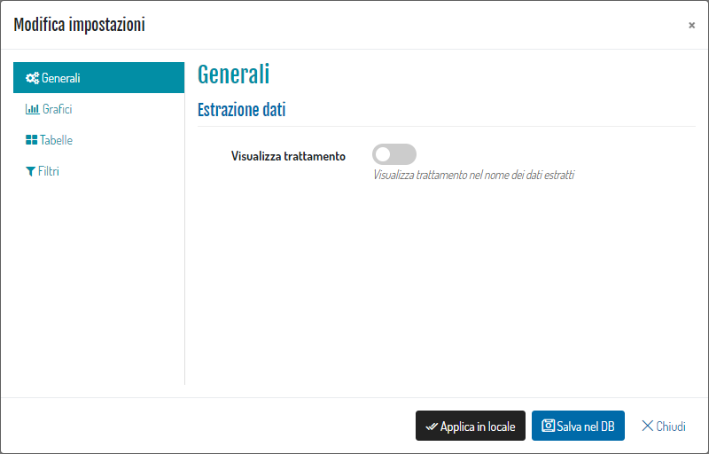

    * <u>Grafici</u>: in questa sezione è possibile personalizzare il layout dei grafici che verranno generati su Visualizer;

        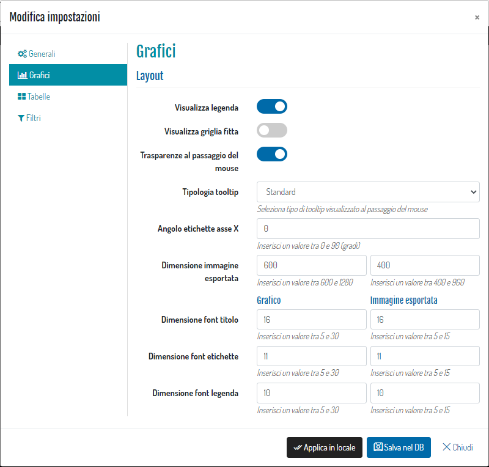

    * <u>Tabelle</u>: tramite il seguente pulsante, attivo di default, è possibile disabilitare i codici se nella macro sono caricati più di 5 parametri;

        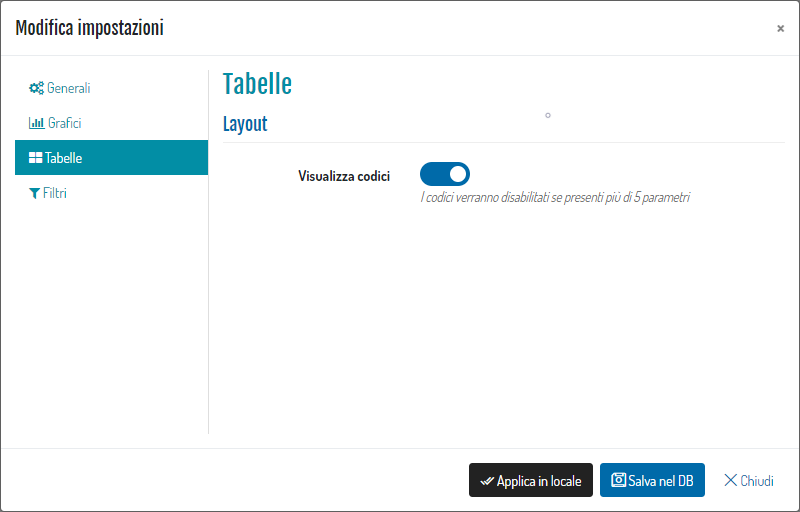

5. **Dati**: consente di apportare modifiche sul tipo di dati da visualizzare;

    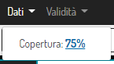

    * <u>Copertura</u>: è possibile filtrare i dati in base alla percentuale di copertura minima nell'unità temporale scelta (oraria, giornaliera, ecc.…). Questo filtro può essere applicato indicando una percentuale specifica e cliccando sul pulsante "Conferma", oppure si può cliccare direttamente uno dei due pulsanti rossi se si desidera applicare la percentuale dello 0% o del 75%. Premere il pulsante "Chiudi" per tornare alla schermata principale.

        

6. **Validità**: questa voce del menu principale permette di filtrare i dati visualizzati per codice di validità. È possibile filtrare i dati tramite la selezione di uno dei 3 pulsanti di minore-uguale (<=), uguale (=) e maggiore-uguale (>=) in combinazione con il codice di validità.

    Ad esempio, nell'immagine seguente, saranno visualizzati i dati con codice di validità maggiore o uguale a 0. Inoltre, è possibile visualizzare tutti i dati indipendentemente dal codice di validità cliccando su "Tutti i dati". Per rendere effettive le modifiche su grafici e tabelle è necessario cliccare il pulsante "Aggiorna" nel menu in alto.

    

### Menu Secondario - Visualizer

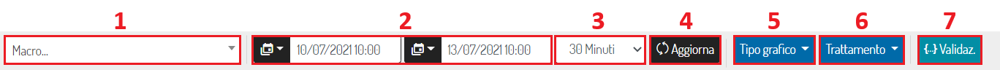

1. Seleziona macro: seleziona una delle macro presenti nel menu a tendina;

    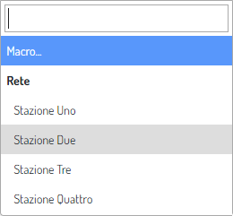

    Una volta selezionata la macro, verranno generati i grafici e le tabelle corrispondenti, come visto sopra.

    Nel dettaglio:

    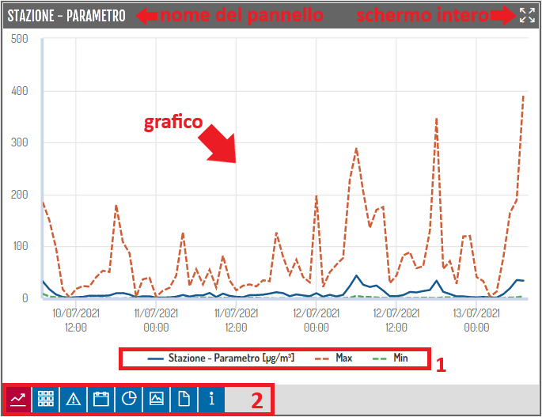

    1. Legenda/Filtro: è possibile mostrare/nascondere le varie funzioni cliccando sui singoli elementi della legenda/filtro: si noterà che, se deselezionato, l'elemento non sarà visibile e il relativo filtro sarà opaco;

    2. Pulsanti del pannello:

       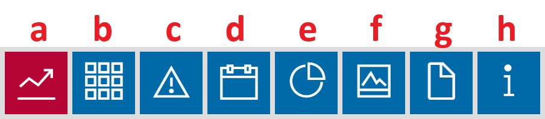</img>

       &nbsp;&nbsp;&nbsp;&nbsp;&nbsp;&nbsp;&nbsp;&nbsp;&nbsp;&nbsp;a. <u>Formato grafico</u>: visualizza il grafico dei dati;

       &nbsp;&nbsp;&nbsp;&nbsp;&nbsp;&nbsp;&nbsp;&nbsp;&nbsp;&nbsp;b. <u>Formato tabella</u>: visualizza la tabella dei dati;

       &nbsp;&nbsp;&nbsp;&nbsp;&nbsp;&nbsp;&nbsp;&nbsp;&nbsp;&nbsp;c. <u>Tutti i dati (anche NON validi)</u>: vengono visualizzati TUTTI i dati nel grafico/tabella, indipendentemente dal fatto che siano validi oppure no;

       &nbsp;&nbsp;&nbsp;&nbsp;&nbsp;&nbsp;&nbsp;&nbsp;&nbsp;&nbsp;d. <u>Modifica periodo temporale</u>: selezionare un arco temporale dal menu a tendina e premere "VAI";

       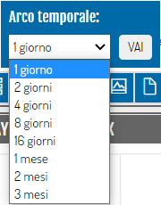

       &nbsp;&nbsp;&nbsp;&nbsp;&nbsp;&nbsp;&nbsp;&nbsp;&nbsp;&nbsp;e. <u>Opzioni grafico</u>: selezionare una tipologia di grafico dal menu a tendina e premere "VAI";

       &nbsp;&nbsp;&nbsp;&nbsp;&nbsp;&nbsp;&nbsp;&nbsp;&nbsp;&nbsp;&nbsp;&nbsp;&nbsp;&nbsp;&nbsp;&nbsp;&nbsp;&nbsp;&nbsp;&nbsp;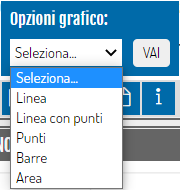

       &nbsp;&nbsp;&nbsp;&nbsp;&nbsp;&nbsp;&nbsp;&nbsp;&nbsp;&nbsp;f. <u>Scarica grafico</u>:  verrà effettuato il download del grafico in formato ".png";

       &nbsp;&nbsp;&nbsp;&nbsp;&nbsp;&nbsp;&nbsp;&nbsp;&nbsp;&nbsp;g. <u>Scarica CSV</u>:  verrà effettuato il download dei dati in formato ".csv";

       &nbsp;&nbsp;&nbsp;&nbsp;&nbsp;&nbsp;&nbsp;&nbsp;&nbsp;&nbsp;h. <u>Informazioni</u>: vengono visualizzate le informazioni principali del pannello:

       &nbsp;&nbsp;&nbsp;&nbsp;&nbsp;&nbsp;&nbsp;&nbsp;&nbsp;&nbsp;&nbsp;&nbsp;&nbsp;&nbsp;&nbsp;&nbsp;&nbsp;&nbsp;&nbsp;&nbsp;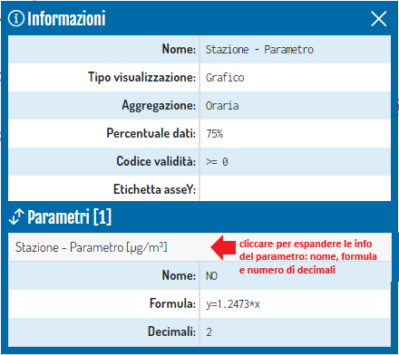

