# MENU UTENTE - ADMIN

Per poter accedere a questa pagina, occorre cliccare sul proprio nome visualizzato nel menu principale di sinistra e cliccare sull'elemento "Admin" del menu a tendina.

<h3>
    v 'Utente' 
    &nbsp;&nbsp;&nbsp;&nbsp;&nbsp;&nbsp;&nbsp;&nbsp; <i>o</i> Admin
</h3>

In questa sezione, è possibile, qualora si sia in possesso del ruolo di admin, modificare le impostazioni di amministrazione del proprio portale di appartenenza.

La pagina è suddivisa in due macro sezioni:

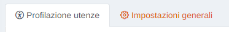

## Profilazione utenze

In questa sezione è possibile creare/modificare/gestire i gruppi, creare/modificare/gestire gli utenti e gestire i permessi (INSERT - UPDATE - DELETE) dei contenuti (pagine, stazioni, altro) sul portale, cliccando la relativa scheda.

### Gruppi

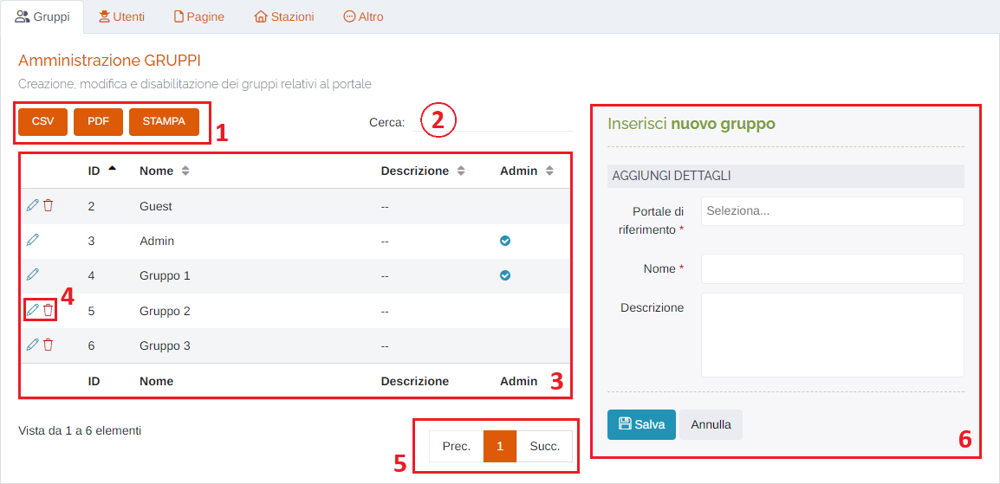

1. Pulsanti <u>CSV</u> - <u>PDF</u> - <u>STAMPA</u> : è possibile scaricare l'elenco dei gruppi sottostanti in due formati, CSV e PDF, oppure stamparlo direttamente;
2. <u>Filtro di ricerca nella tabella</u>: la ricerca viene effettuata su tutte le colonne della tabella;
3. Tabella dei gruppi;
4. Pulsanti:

    * <u>Modifica gruppo</u> </img> :

        Cliccando questo pulsante è possibile modificare i dettagli del gruppo che verranno caricati al punto 6;

    * <u>Elimina gruppo</u> </img> :

        Cliccando questo pulsante è possibile eliminare il gruppo selezionato; verrà visualizzato il seguente messaggio di conferma:

        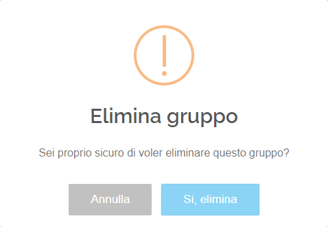

        Premere "Si, elimina" per confermare.

5. Esplorazione delle pagine;
6. Form d'inserimento/modifica del gruppo: utilizzare questa scheda per inserire/modificare un gruppo inserendo il portale di riferimento (\*obbligatorio), il nome (\*obbligatorio) e un'eventuale descrizione; cliccare "Salva" per effettuare l'inserimento/la modifica, oppure "Annulla" per ripulire il form.

### Utenti

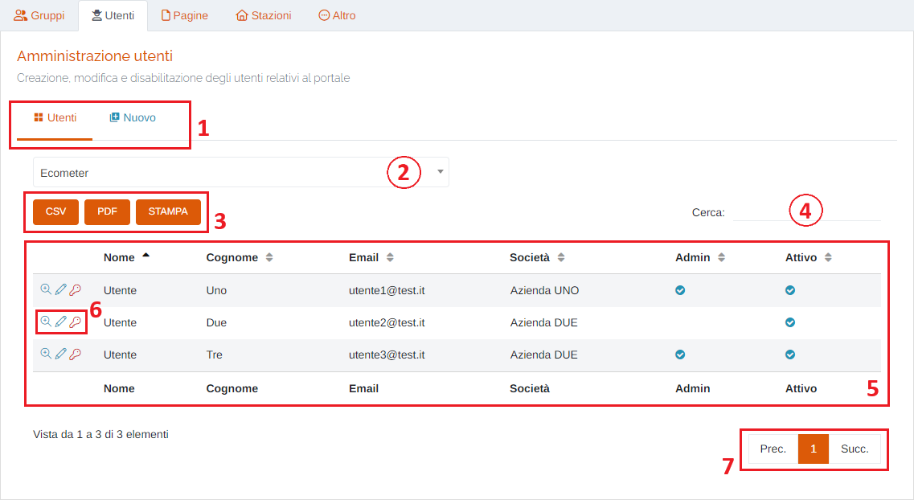

1. Schede della pagina:

    * Utenti: schermata visualizzata in questo momento;
    * Nuovo: inserimento nuovo utente;

2. Selezionare uno dei gruppi per visualizzare gli utenti ad esso associati;
3. Pulsanti <u>CSV</u> - <u>PDF</u> - <u>STAMPA</u> : è possibile scaricare l'elenco degli utenti sottostanti in due formati, CSV e PDF, oppure stamparlo direttamente;
4. <u>Filtro di ricerca nella tabella</u>: la ricerca viene effettuata su tutte le colonne della tabella;
5. Tabella degli utenti;
6. Pulsanti:

    * <u>Visualizza</u> </img> :

        Cliccando questo pulsante è possibile visualizzare i dati relativi all'utente selezionato;

        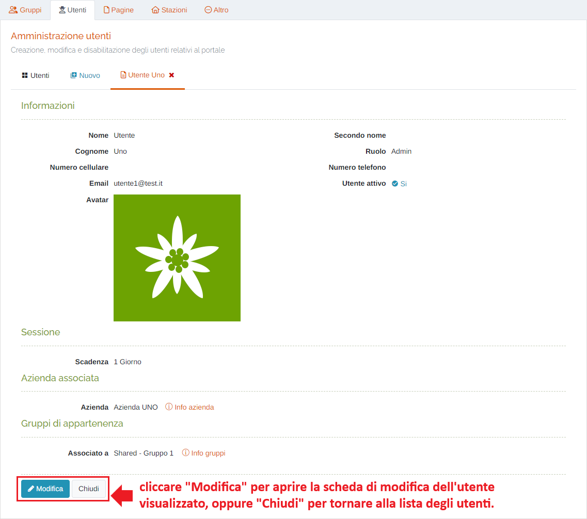

    * <u>Modifica</u> </img> : verrà aperta la scheda per modificare i dati dell'utente selezionato (stessi campi presenti in "Inserisci nuovo utente");

    * <u>Reset password</u> </img> :

        Cliccando questo pulsante è possibile resettare la password dell'utente selezionato reimpostando quella di default del sistema;

        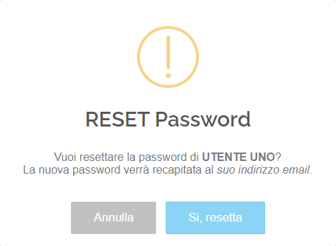

        Premere "Si, resetta" per confermare.

7. Esplorazione delle pagine;

#### Inserisci nuovo utente

Attraverso questo modulo è possibile creare un nuovo utente associandolo ad un'azienda e ad un determinato gruppo, e di conseguenza, assegnandogli i permessi relativi a quest'ultimo (INSERT, UPDATE, DELETE).

I permessi vengono attribuiti in base al gruppo di appartenenza dell'utente, effettuando il "merge" (somma/unione) dei relativi permessi di ogni gruppo a cui l'utente è associato.

Ad esempio, un utente appartenente ai gruppi "Shared" e "Guest" otterrà tutti i permessi del primo gruppo <u>PIÙ</u> tutti quelli del secondo gruppo.

Il gruppo "Shared" (assegnato di default), attribuisce agli utenti il permesso di accesso al portale, di visualizzazione della Homepage (sola lettura), dello strumento Mapper (sola lettura) e del Profilo del menù utente.

Il gruppo "Guest" (utenti esterni non facenti parte di alcun'organizzazione), attribuisce agli utenti associati tutti i permessi di sola lettura alle pagine del portale.

Inoltre, è importante ricordare che l'utente, che sia esso admin o semplice, <u>NON PUO' CANCELLARE GLI ALTRI UTENTI</u>, soprattutto se essi hanno effettuato operazioni sul portale, poiché ciò andrebbe a <u>CREARE PROBLEMI ALLO STORICO DEL PORTALE</u>.

Qualora un utente non faccia più parte di una determinata azienda esso <u>NON VA MODIFICATO INSERENDO I DATI DEL NUOVO UTENTE</u>, ma <u>VA NECESSARIAMENTE DISATTIVATO</u>. Successivamente, è possibile creare un nuovo utente.

Fare MOLTA ATTENZIONE a questo passaggio al fine di <u>EVITARE DI FALSIFICARE LO STORICO</u>.

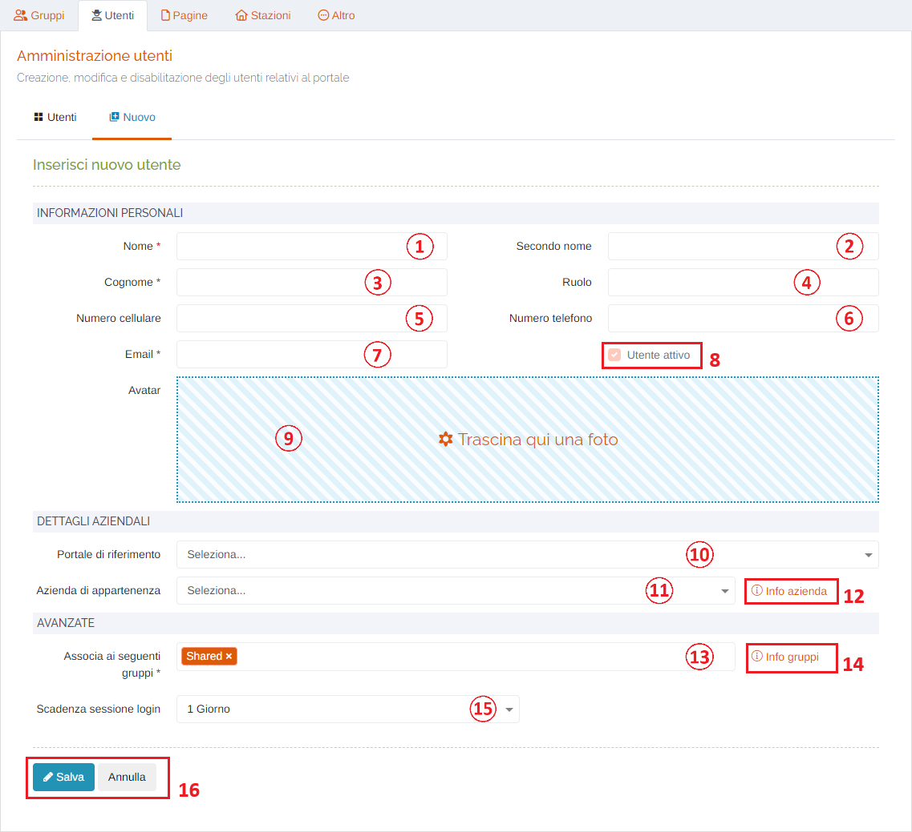

1. <u>Nome</u> (*obbligatorio);
2. <u>Secondo Nome</u>;
3. <u>Cognome</u> (*obbligatorio);
4. <u>Ruolo</u>;
5. <u>Numero cellulare</u>;
6. <u>Numero telefono</u>;
7. <u>Email</u> (*obbligatorio);
8. Checkbox <u>Utente attivo</u>: in fase di creazione di un utente NON È POSSIBILE disattivare l'utente prima che esso sia stato creato. Sarà possibile disattivarlo solo in fase di modifica.
9. <u>Avatar</u>: è possibile inserire la propria immagine del profilo; al click verrà visualizzata la finestra di sistema per scegliere i file;
10. Selezionare il <u>Portale di riferimento</u>: elenco dei portali a cui può essere associato l'utente;
11. Selezionare l'<u>Azienda di appartenenza</u>: elenco di tutte le aziende del proprio portale che si possono associare ad un utente;
12. <u>Info azienda</u>: cliccando sul link si aprirà un popup relativo alle informazioni dell'azienda selezionata;

    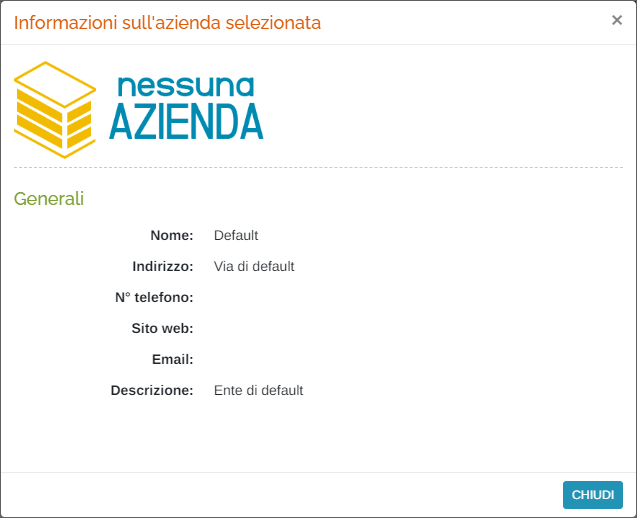

13. <u>Associa ai seguenti gruppi</u> (*è obbligatorio selezionare almeno <u>1 gruppo</u>) : elenco di tutti i gruppi del proprio portale che si possono associare ad un utente; associando l'utente a più di un gruppo, verrà effettuata la somma dei permessi di ogni gruppo selezionato.

    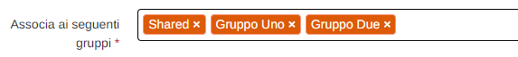

14. <u>Info gruppi</u>: cliccando sul link si aprirà un popup relativo alle informazioni sui gruppi di appartenenza selezionati;

    I permessi visualizzati in questa sezione sono indicati dalle seguenti icone:

    

    * <u>Menù e permessi</u>

        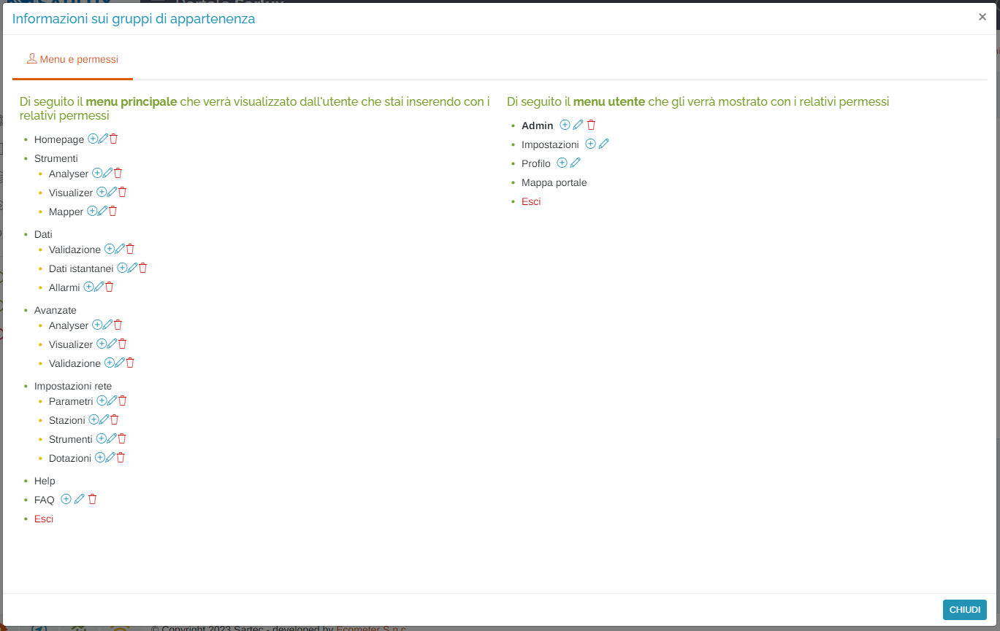

        In base ai gruppi scelti, viene visualizzato l'elenco delle voci di menu disponibili per l'utente sul portale con i relativi permessi.

    * <u>Stazioni</u>

        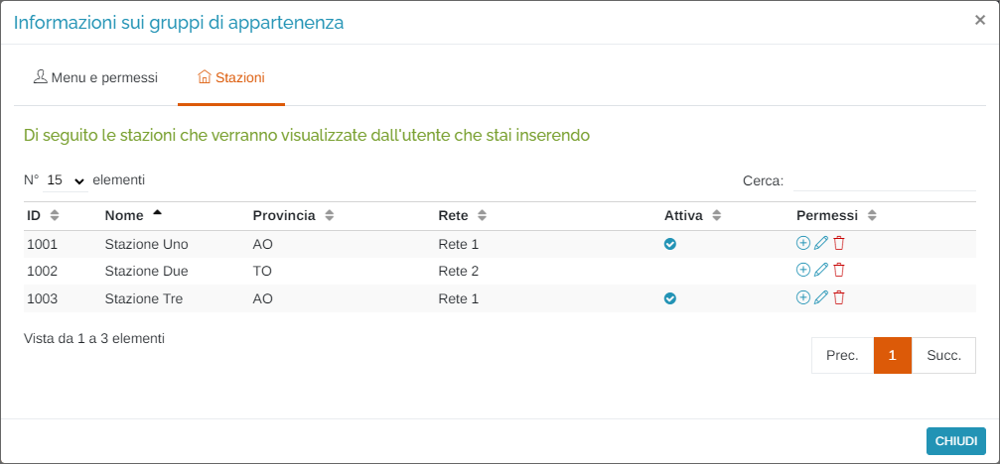

        In base ai gruppi scelti, vengono visualizzate tutte le stazioni appartenenti a quel gruppo con i relativi permessi.

15. <u>Scadenza sessione login</u>: selezionare un periodo durante il quale l'utente rimarrà loggato, anche alla chiusura del browser, e quindi, ad un successivo accesso al portale, non verranno richieste le credenziali all'utente;
16. Pulsanti <u>Salva</u> e <u>Annulla</u> : cliccare il pulsante Salva per effettuare l'inserimento del nuovo utente', oppure il pulsante Annulla per ritornare alla scheda 'Utenti';

### Pagine

In questa scheda è possibile selezionare, per ogni gruppo di utenti, quali pagine potranno essere visualizzate.

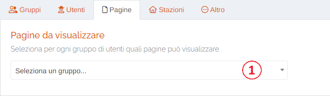

1. Selezione del gruppo;

Una volta selezionato il gruppo, verrà visualizzata la seguente schermata:

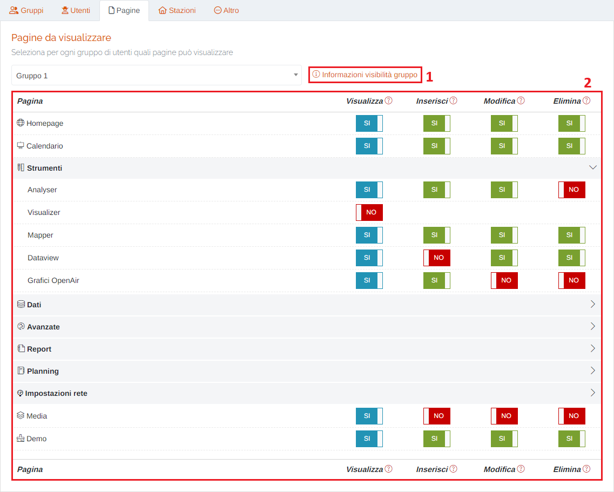

1. Informazioni sulla visibilità del gruppo scelto ("Info gruppi", come sopra);
2. Tabella delle pagine:

    In questa tabella vengono elencate le pagine visualizzabili dagli utenti del gruppo scelto. Ad ogni pagina è possibile attribuire o togliere i permessi di visualizzazione, inserimento, modifica e eliminazione. Il "Visualizza" è il permesso principale: qualora sia impostato su "NO", automaticamente, il gruppo non potra effettuare inserimenti, modifiche o eliminazioni.

    * </img> --> Pulsante NO
    * </img> --> Pulsante SI (Di colore BLU solo per il permesso "Visualizza")
    * </img> --> Pulsante SI (Di colore VERDE per i permessi "Inserisci", "Modifica" e "Elimina")

### Stazioni

In questa scheda è possibile selezionare, per ogni gruppo di utenti, quali stazioni potranno essere visualizzate.

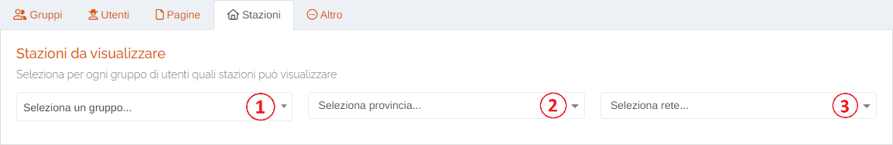

1. Selezione del gruppo;
2. Selezione della provincia;
3. Selezione della rete di appartenenza delle stazioni;

Una volta compilati i campi, verrà visualizzata la seguente schemata:

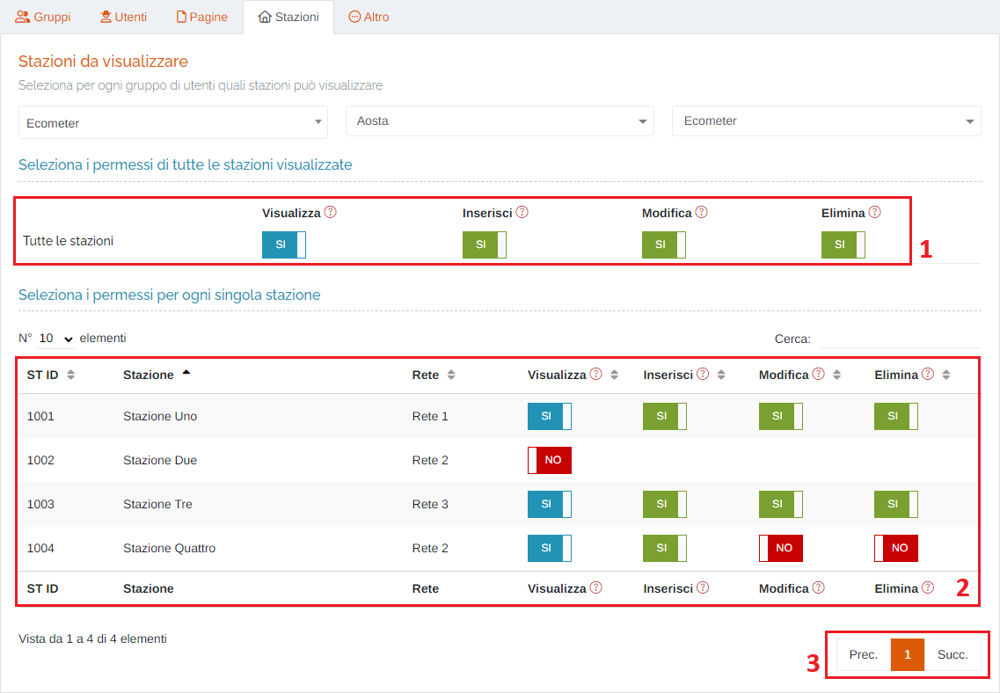

Una volta che verranno visualizzate le stazioni filtrate, sarà possibile impostare i permessi ad ognuna di esse contemporaneamente (1), oppure gestirli per ogni stazione singolarmente (2).

### Altro

In questa scheda è possibile impostare, per ogni gruppo di utenti, altri permessi che verranno mostrati nella schermata successiva.

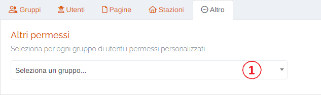

1. Selezione del gruppo;

E' possibile impostare i permessi per la visualizzazione delle reti, i widget della homepage e dei canali Telegram.

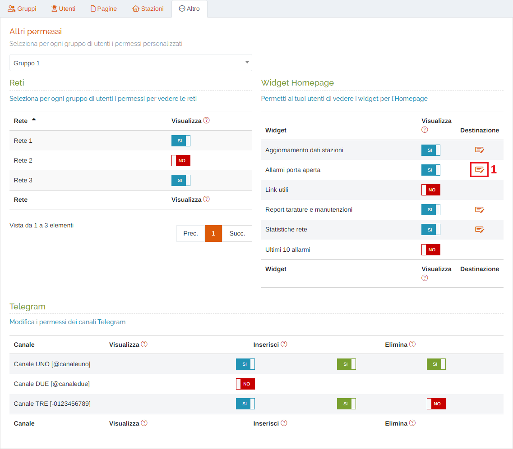

Per i widget della homepage, cliccando sul pulsante </img> , è possibile modificare la destinazione finale del link di approfondimento per i widget attivi (1):

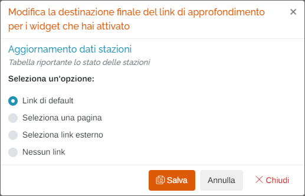

Le opzioni sono:

* Mantenere il link di default;
* Selezionare una delle pagine disponibili sul portale e abbinarle un titolo;

    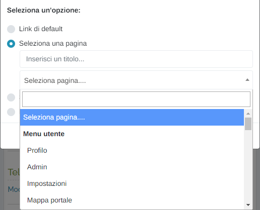

* Selezionare un link esterno al portale e abbinargli un titolo;

    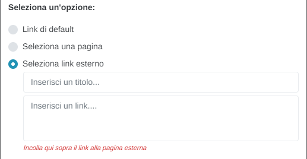

* Non associare alcun link;

Per effettuare la modifica, cliccare il pulsante "Salva", oppure cliccare "Annulla" o "Chiudi" per tornare alla schermata successiva.

## Impostazioni generali

In questa sezione è possibile modificare le impostazioni generali dei vari applicativi del portale, cliccando la relativa scheda.

### Validazione

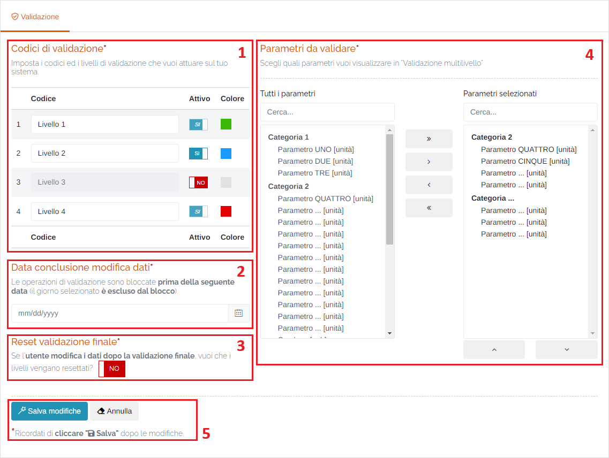

1. <u>Codici di validazione</u>: in questa sezione è possibile impostare i 4 livelli di validazione modificandone il nominativo e l'attivazione/disattivazione.

    NON è possibile disattivare il 1° e il 4° livello.

2. <u>Data conclusione modifica dati</u>: in questa sezione è possibile impostare un blocco delle operazioni di validazione inserendo la data di fine del periodo desiderato (il giorno selezionato è escluso dal blocco);

    Verrà visualizzato il seguente form per la selezione della data:

    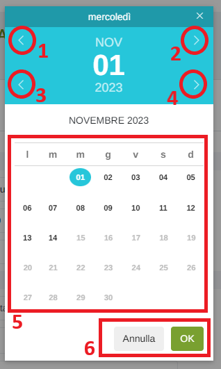

    1. Mese precedente;
    2. Mese successivo;
    3. Anno precedente;
    4. Anno successivo;
    5. Scelta del giorno;
    6. Pulsanti 'Annulla' (ritorna alla schermata precedente) e 'OK' (imposta la data selezionata);  

    Un riscontro di questa modifica sarà visibile, tramite un messaggio sia in 'Dati > Validazione' sia in 'Dati > Validazione multilivello':

    * Dati > Validazione

        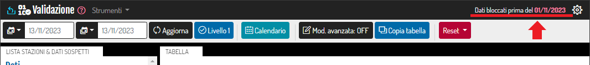

        Inoltre, non sarà possibile effettuare alcuna modifica/validazione ai dati precedenti alla data inserita (giorno selezionato escluso).

    * Dati > Validazione multilivello

        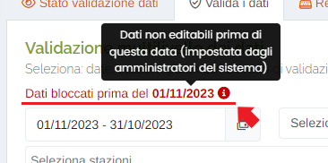

3. <u>Reset validazione finale</u>: tramite l'interruttore </img> / </img> è possibile impostare il reset dei livelli di validazione applicati ai dati qualora un utente della propria rete di appartenenza effettui delle modifiche dopo la validazione finale.

4. <u>Parametri da validare</u> in questa sezione è possibile scegliere quali parametri si visualizzeranno nell'applicativo "Validazione multilivello", presente nella pagina 'Dati > Validazione multilivello':

    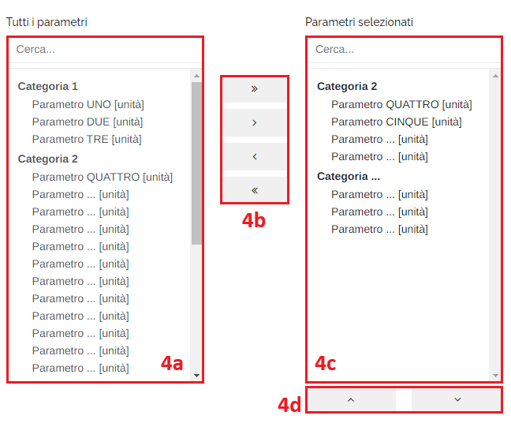

    Per selezionare un parametro, fare doppio click su un elemento dall'elenco di sinistra (4a) ed esso verrà "spostato" nella tabella a destra (4c); per selezionare tutti i parametri di una categoria, cliccare una volta sul nome della categoria desiderata; per selezionare i parametri è anche possibile utilizzare i pulsanti posti al centro (4b):

    - ">>" : aggiungi <u>tutti</u> i parametri filtrati nella colonna di sinistra;
    - ">" : aggiungi <u>solo</u> il parametro evidenziato con singolo click;
    - "<" : rimuovi <u>solo</u> il parametro evidenziato con singolo click;
    - "<<" : rimuovi <u>tutti</u> i parametri dalla colonna di destra;

    E' possibile effettuare una ricerca dei parametri desiderati attraverso la casella posta in cima agli elenchi.

    Infine, tramite i pulsanti "&#8743;" e "&#8744;" (4d) è possibile modificare l'ordine di visualizzazione dei parametri della tabella di destra.

5. Pulsanti <u>Salva modifiche</u> e <u>Annulla</u> : cliccare il pulsante Salva modifiche per rendere effettive le modifiche impostate, oppure il pulsante Annulla;

