# MENU UTENTE - IMPOSTAZIONI

Per poter accedere a questa sezione occorre cliccare sul proprio username posto sopra il menu principale di sinistra ed in seguito cliccare sull'elemento "Impostazioni".

<h3>
    v 'Utente' 
    &nbsp;&nbsp;&nbsp;&nbsp;&nbsp;&nbsp;&nbsp;&nbsp; <i>o</i> Impostazioni
</h3>

## Scheda 'Homepage'

In questa scheda è possibile selezionare quanti e quali widget visualizzare nella propria homepage.

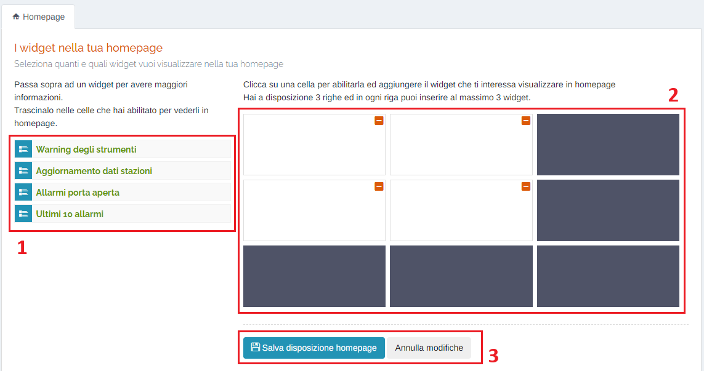

1. Elenco dei widget disponibili;

   Passando sopra ad uno con il mouse è possibile visualizzare una piccola anteprima e qualche informazione aggiuntiva:

   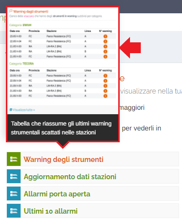

   Trascinando un widget dall'elenco ad una delle celle abilitate è possibile visualizzarlo nella propria homepage;

   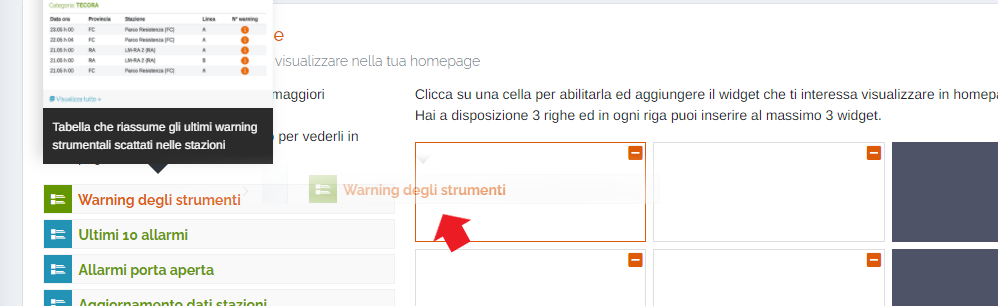

2. Celle dei widget:

    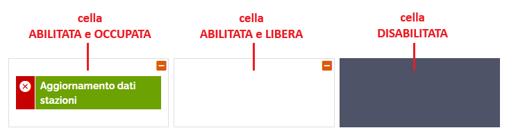

    Si hanno a disposizione 3 righe ed in ogni riga si possono inserire al massimo 3 widget.

    Per abilitare una cella ed aggiungere il widget che si interessa visualizzare nella propria homepage, cliccare su una delle celle disabilitate; verrà visualizzato il seguente messaggio:

    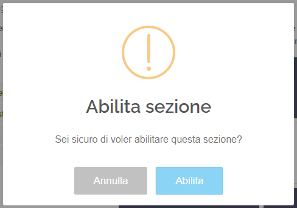

    Cliccare il pulsante 'Abilita' per confermare;

    Per disabilitare una cella e rimuovere il widget dalla propria homepage, cliccare sul pulsante </img> presente su una delle celle abilitate; verrà visualizzato il seguente messaggio:

    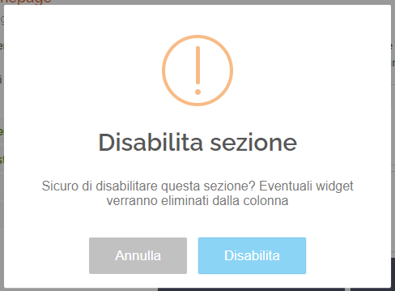

    Cliccare il pulsante 'Disabilita' per confermare;

    Per rimuovere un widget da una cella, lasciando quest'ultima abilitata, cliccare sul pulsante </img> presente sul widget associato ad una cella; verrà visualizzato il seguente messaggio:

    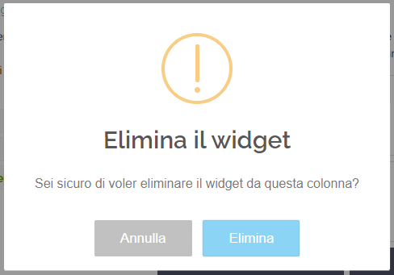

    Cliccare il pulsante 'Elimina' per confermare;

    ### <u>ATTENZIONE!</u>

    Prestare attenzione all'ordine con cui si abilitano, disabilitano e occupano le celle dei widget: occorre seguire sempre un ordine logico, ovvero dall'alto verso il basso e da sinistra a destra; ad esempio non sarà consentito aggiungere o rimuovere un widget ad una cella se quella precedente sulla stessa riga (a sinistra) rimane vuota; qualora non si seguisse l'ordine logico sopra descritto, verranno visualizzati i seguenti messaggi:

    Aggiunta:

    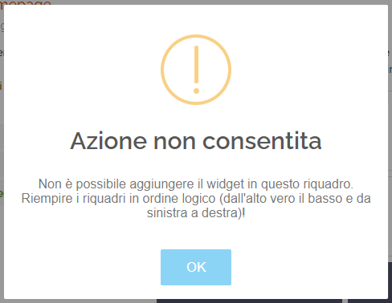

    Eliminazione:

    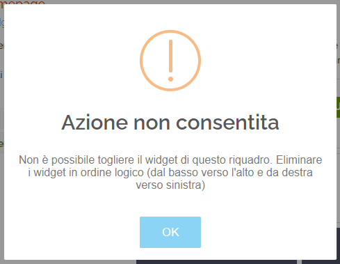

3.  Pulsanti <u>Salva disposizione homepage</u> e <u>Annulla modifiche</u>: cliccare il pulsante 'Salva disposizione homepage' per rendere effettive le modifiche sulla propria homepage, oppure il pulsante 'Annulla modifiche' per resettare la visualizzazione della griglia dei widget e non salvare le modifiche.

    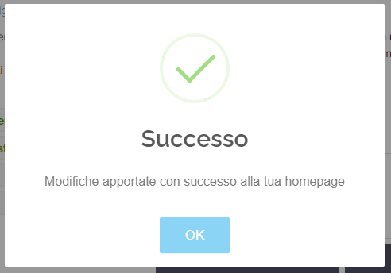

## Scheda 'Icone rapide'

In questa scheda è possibile personalizzare il menu di icone ad accesso rapido, presente in basso a sinistra nel menù principale, inserendo i link alle pagine che si usano di più.

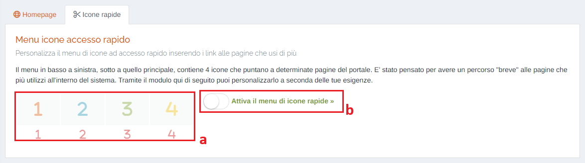

&nbsp;&nbsp;&nbsp;&nbsp;&nbsp;&nbsp;&nbsp;a. Anteprima delle icone rapide scelte; 
&nbsp;&nbsp;&nbsp;&nbsp;&nbsp;&nbsp;&nbsp;b. Pulsante di attivazione del menù;

Una volta attivato il menù, sarà possibile selezionare 4 pagine dal proprio portale a cui assegnare un pulsante di link rapido:

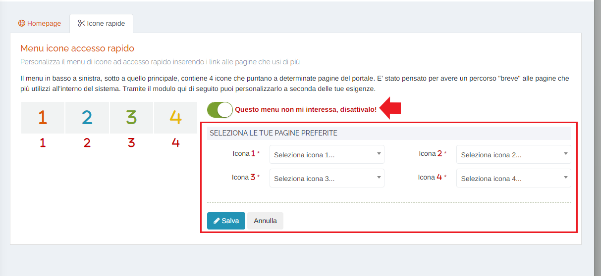

Una volta selezionata una pagina, verrà visualizzata l'icona nella zona dell'anteprima:

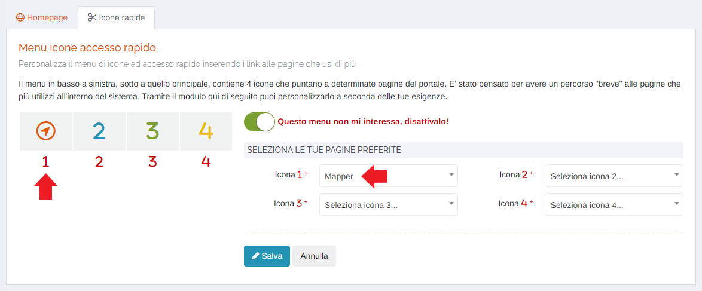

Vanno selezionate TUTTE E QUATTRO LE ICONE DISPONIBILI.

Una volta selezionate le 4 icone, cliccare sul pulsante 'Salva' per confermare le scelte; verrà visualizzato il seguente messaggio:

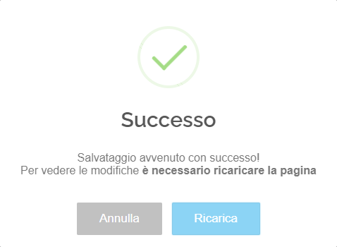

Cliccare 'Ricarica' per rendere effettive le modifiche, ricaricare la pagina e visualizzare i pulsanti:

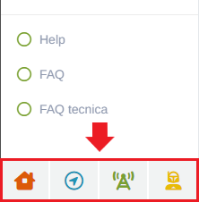

