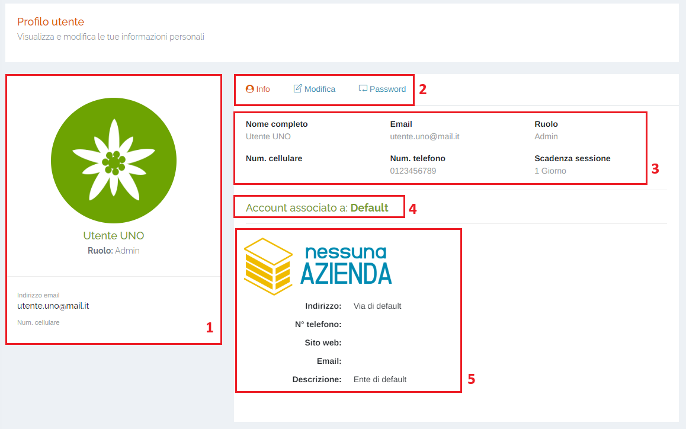
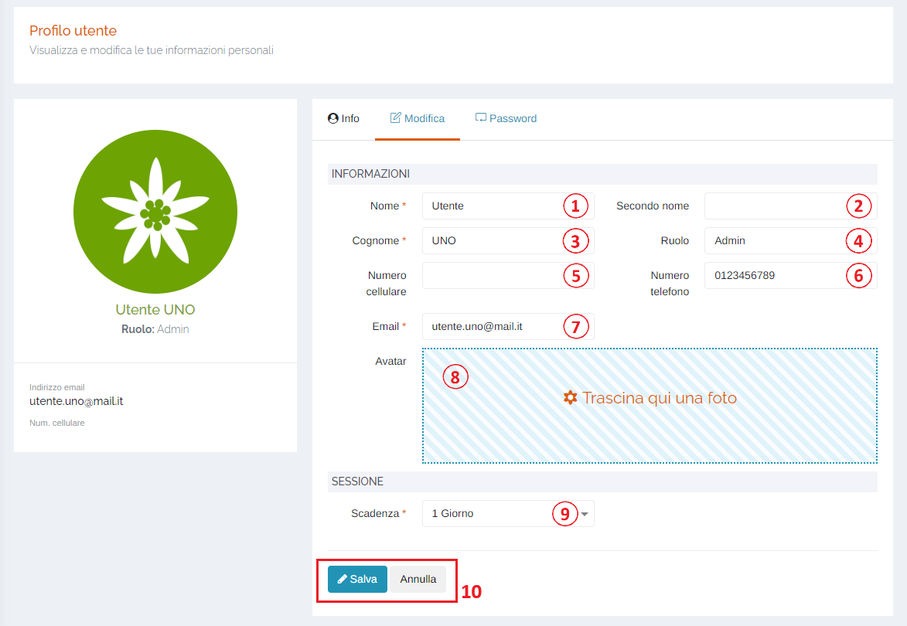
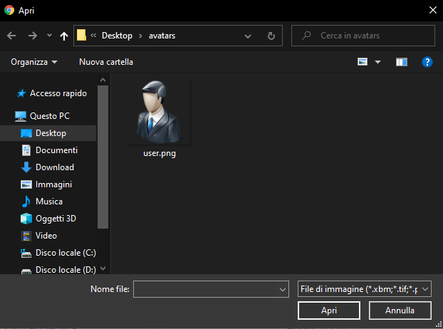
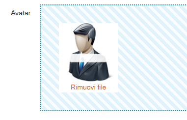
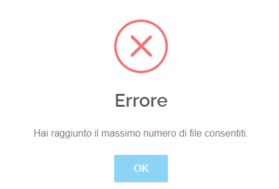
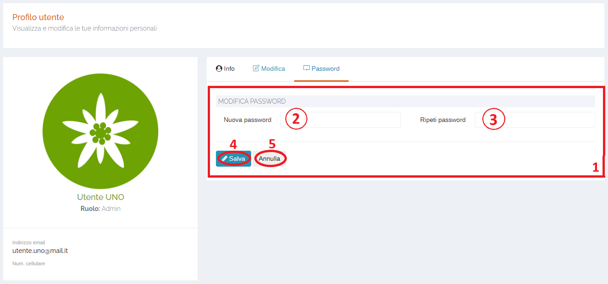

# MENU UTENTE - PROFILO

Per poter accedere a questa sezione occorre cliccare sul proprio username posto sopra il menu principale di sinistra ed in seguito cliccare sull'elemento "Profilo".

<h3>
    v 'Utente' 
    &nbsp;&nbsp;&nbsp;&nbsp;&nbsp;&nbsp;&nbsp;&nbsp; <i>o</i> Profilo
</h3>

In questa sezione l'utente può visualizzare le proprie informazioni personali e modificarne alcune di esse, come ad esempio numero di telefono, email oppure la password.

## Scheda "Info"

1. Visualizzazione avatar, ruolo, indirizzo email e numero di telefono dell'utente;

    L'avatar di default dell'utente è definito in base al ruolo di quest'ultimo:

    </img> --> Utente semplice
    </img> --> Admin

2. Schede della pagina:

    * <u>Info</u>: schermata visualizzata in questo momento;
    * <u>Modifica</u>: modifica dei dati dell'utente;
    * <u>Password</u>: modifica password;

3. Informazioni principali:

    * <u>Nome completo</u>;
    * <u>Email</u>;
    * <u>Ruolo</u>;
    * <u>Num. cellulare</u>;
    * <u>Num. telefono</u>;
    * <u>Scadenza sessione</u>;

4. A quale azienda è associato l'account dell'utente;
5. Informazioni dell'azienda a cui l'utente è associato:

    * <u>Logo</u>;
    * <u>Indirizzo</u>;
    * <u>N° telefono</u>;
    * <u>Sito web</u>;
    * <u>Email</u>;
    * <u>Descrizione</u>;

## Scheda "Modifica"

Attraverso questa scheda è possibile apportare modifiche ai dati relativi al proprio profilo utente.
SI ricorda di prestare attenzione ai campi obbligatori (*) e di salvare per rendere effettive le modifiche.

1. Campo <u>Nome</u> (*obbligatorio);
2. Campo <u>Secondo nome</u>;
3. Campo <u>Cognome</u> (*obbligatorio);
4. Campo <u>Ruolo</u>;
5. Campo <u>Numero cellulare</u>;
6. Campo <u>Numero telefono</u>;
7. Campo <u>Email</u> (*obbligatorio);
8. <u>Avatar</u> (vedi "Avatar");
9. Campo <u>Scadenza</u> (*obbligatorio): selezionare il periodo di tempo durante il quale rimarrà attiva la sessione del portale (ovvero, per quanto tempo non sarà necessario mettere la password qualora si chiuda il browser);
10. Pulsanti <u>Salva</u> e <u>Annulla</u> : cliccare il pulsante Salva per effettuare le modifiche, oppure il pulsante Annulla per ritornare alla scheda 'Info';

### Avatar

È possibile trascinare in questo punto il proprio avatar, un'immagine/foto dal proprio PC.
Si aprirà la finestra del sistema operativo che permetterà all'utente di selezionare il file che si vuole caricare (L'immagine <u>DEVE NECESSARIAMENTE AVERE</u> una delle seguenti estensioni: .jpg, .jpeg, .png, .gif);

Una volta scelta l'immagine verrà visualizzata nel campo Avatar:

Infine premere il pulsante  per confermare la modifica:

Inoltre, <u>NON È POSSIBILE CARICARE PIÙ DI UN FILE</u> o verrà visualizzato il seguente errore:

## Scheda "Password"

Attraverso questa scheda è possibile la propria password di accesso al portale.

1. <u>Modifica password</u>;
2. Campo <u>Nuova password</u>;
3. Campo <u>Ripeti password</u>; 

    I due campi DEVONO COINCIDERE!

4. Cliccare il <u>pulsante Salva</u> per salvare le modifiche;
5. Cliccare il <u>pulsante Annulla</u> per ritornare alla scheda Info;

